<div align="center">

<!-- Hero SVG Header -->
<svg xmlns="http://www.w3.org/2000/svg" viewBox="0 0 800 200" width="800" height="200">
  <defs>
    <linearGradient id="bg" x1="0%" y1="0%" x2="100%" y2="100%">
      <stop offset="0%" style="stop-color:#0a0e27;stop-opacity:1" />
      <stop offset="50%" style="stop-color:#1a1150;stop-opacity:1" />
      <stop offset="100%" style="stop-color:#2d1b69;stop-opacity:1" />
    </linearGradient>
    <linearGradient id="textGrad" x1="0%" y1="0%" x2="100%" y2="0%">
      <stop offset="0%" style="stop-color:#60a5fa" />
      <stop offset="50%" style="stop-color:#a78bfa" />
      <stop offset="100%" style="stop-color:#c084fc" />
    </linearGradient>
    <linearGradient id="lineGrad" x1="0%" y1="0%" x2="100%" y2="0%">
      <stop offset="0%" style="stop-color:#3b82f6;stop-opacity:0.6" />
      <stop offset="100%" style="stop-color:#8b5cf6;stop-opacity:0.6" />
    </linearGradient>
    <filter id="glow">
      <feGaussianBlur stdDeviation="3" result="blur" />
      <feMerge><feMergeNode in="blur" /><feMergeNode in="SourceGraphic" /></feMerge>
    </filter>
    <filter id="softglow">
      <feGaussianBlur stdDeviation="1.5" result="blur" />
      <feMerge><feMergeNode in="blur" /><feMergeNode in="SourceGraphic" /></feMerge>
    </filter>
  </defs>
  <!-- Background -->
  <rect width="800" height="200" fill="url(#bg)" rx="12" />
  <!-- Neural network nodes and connections -->
  <!-- Layer 1 (left) -->
  <circle cx="80" cy="50" r="3" fill="#60a5fa" opacity="0.7" filter="url(#softglow)" />
  <circle cx="80" cy="100" r="3" fill="#60a5fa" opacity="0.7" filter="url(#softglow)" />
  <circle cx="80" cy="150" r="3" fill="#60a5fa" opacity="0.7" filter="url(#softglow)" />
  <!-- Layer 2 -->
  <circle cx="160" cy="40" r="3.5" fill="#818cf8" opacity="0.6" filter="url(#softglow)" />
  <circle cx="160" cy="80" r="3.5" fill="#818cf8" opacity="0.6" filter="url(#softglow)" />
  <circle cx="160" cy="120" r="3.5" fill="#818cf8" opacity="0.6" filter="url(#softglow)" />
  <circle cx="160" cy="160" r="3.5" fill="#818cf8" opacity="0.6" filter="url(#softglow)" />
  <!-- Layer 3 -->
  <circle cx="240" cy="60" r="4" fill="#a78bfa" opacity="0.5" filter="url(#softglow)" />
  <circle cx="240" cy="100" r="4" fill="#a78bfa" opacity="0.5" filter="url(#softglow)" />
  <circle cx="240" cy="140" r="4" fill="#a78bfa" opacity="0.5" filter="url(#softglow)" />
  <!-- Right side mirror -->
  <circle cx="560" cy="60" r="4" fill="#a78bfa" opacity="0.5" filter="url(#softglow)" />
  <circle cx="560" cy="100" r="4" fill="#a78bfa" opacity="0.5" filter="url(#softglow)" />
  <circle cx="560" cy="140" r="4" fill="#a78bfa" opacity="0.5" filter="url(#softglow)" />
  <circle cx="640" cy="40" r="3.5" fill="#818cf8" opacity="0.6" filter="url(#softglow)" />
  <circle cx="640" cy="80" r="3.5" fill="#818cf8" opacity="0.6" filter="url(#softglow)" />
  <circle cx="640" cy="120" r="3.5" fill="#818cf8" opacity="0.6" filter="url(#softglow)" />
  <circle cx="640" cy="160" r="3.5" fill="#818cf8" opacity="0.6" filter="url(#softglow)" />
  <circle cx="720" cy="50" r="3" fill="#60a5fa" opacity="0.7" filter="url(#softglow)" />
  <circle cx="720" cy="100" r="3" fill="#60a5fa" opacity="0.7" filter="url(#softglow)" />
  <circle cx="720" cy="150" r="3" fill="#60a5fa" opacity="0.7" filter="url(#softglow)" />
  <!-- Left connections -->
  <line x1="80" y1="50" x2="160" y2="40" stroke="#60a5fa" stroke-width="0.8" opacity="0.3" />
  <line x1="80" y1="50" x2="160" y2="80" stroke="#60a5fa" stroke-width="0.8" opacity="0.3" />
  <line x1="80" y1="100" x2="160" y2="80" stroke="#60a5fa" stroke-width="0.8" opacity="0.3" />
  <line x1="80" y1="100" x2="160" y2="120" stroke="#60a5fa" stroke-width="0.8" opacity="0.3" />
  <line x1="80" y1="150" x2="160" y2="120" stroke="#60a5fa" stroke-width="0.8" opacity="0.3" />
  <line x1="80" y1="150" x2="160" y2="160" stroke="#60a5fa" stroke-width="0.8" opacity="0.3" />
  <line x1="160" y1="40" x2="240" y2="60" stroke="#818cf8" stroke-width="0.8" opacity="0.25" />
  <line x1="160" y1="80" x2="240" y2="60" stroke="#818cf8" stroke-width="0.8" opacity="0.25" />
  <line x1="160" y1="80" x2="240" y2="100" stroke="#818cf8" stroke-width="0.8" opacity="0.25" />
  <line x1="160" y1="120" x2="240" y2="100" stroke="#818cf8" stroke-width="0.8" opacity="0.25" />
  <line x1="160" y1="120" x2="240" y2="140" stroke="#818cf8" stroke-width="0.8" opacity="0.25" />
  <line x1="160" y1="160" x2="240" y2="140" stroke="#818cf8" stroke-width="0.8" opacity="0.25" />
  <!-- Right connections -->
  <line x1="720" y1="50" x2="640" y2="40" stroke="#60a5fa" stroke-width="0.8" opacity="0.3" />
  <line x1="720" y1="50" x2="640" y2="80" stroke="#60a5fa" stroke-width="0.8" opacity="0.3" />
  <line x1="720" y1="100" x2="640" y2="80" stroke="#60a5fa" stroke-width="0.8" opacity="0.3" />
  <line x1="720" y1="100" x2="640" y2="120" stroke="#60a5fa" stroke-width="0.8" opacity="0.3" />
  <line x1="720" y1="150" x2="640" y2="120" stroke="#60a5fa" stroke-width="0.8" opacity="0.3" />
  <line x1="720" y1="150" x2="640" y2="160" stroke="#60a5fa" stroke-width="0.8" opacity="0.3" />
  <line x1="640" y1="40" x2="560" y2="60" stroke="#818cf8" stroke-width="0.8" opacity="0.25" />
  <line x1="640" y1="80" x2="560" y2="60" stroke="#818cf8" stroke-width="0.8" opacity="0.25" />
  <line x1="640" y1="80" x2="560" y2="100" stroke="#818cf8" stroke-width="0.8" opacity="0.25" />
  <line x1="640" y1="120" x2="560" y2="100" stroke="#818cf8" stroke-width="0.8" opacity="0.25" />
  <line x1="640" y1="120" x2="560" y2="140" stroke="#818cf8" stroke-width="0.8" opacity="0.25" />
  <line x1="640" y1="160" x2="560" y2="140" stroke="#818cf8" stroke-width="0.8" opacity="0.25" />
  <!-- Central title -->
  <text x="400" y="88" text-anchor="middle" font-family="'Segoe UI', system-ui, -apple-system, sans-serif" font-size="56" font-weight="700" fill="url(#textGrad)" filter="url(#glow)" letter-spacing="8">ASI:BUILD</text>
  <text x="400" y="125" text-anchor="middle" font-family="'Segoe UI', system-ui, -apple-system, sans-serif" font-size="16" fill="#94a3b8" letter-spacing="4" font-weight="300">UNIFIED FRAMEWORK FOR ARTIFICIAL SUPERINTELLIGENCE</text>
  <!-- Decorative line under subtitle -->
  <line x1="280" y1="140" x2="520" y2="140" stroke="url(#lineGrad)" stroke-width="1" />
  <!-- Version tag -->
  <rect x="355" y="152" width="90" height="22" rx="11" fill="#1e1b4b" stroke="#6366f1" stroke-width="0.8" />
  <text x="400" y="167" text-anchor="middle" font-family="'Segoe UI', system-ui, -apple-system, sans-serif" font-size="11" fill="#a5b4fc">v3 · Phase 4</text>
</svg>

<br />

<!-- Badge Row -->


[](https://github.com/web3guru888/asi-build/discussions)
[](https://github.com/web3guru888/asi-build/wiki)
[](https://github.com/web3guru888/asi-build/issues)

<br />

**29 cognitive modules · 24 Blackboard adapters · ZK-verified bridge · CognitiveCycle engine**
<br />
A modular Python research framework for exploring AI consciousness, cognitive architectures, knowledge graphs, decentralized identity, and multi-agent reasoning.

<br />

[Get Started](#-quick-start) · [Architecture](#-architecture) · [Modules](#-modules) · [Bridge](#-ringsethereum-bridge) · [Contribute](#-contributing) · [Wiki](https://github.com/web3guru888/asi-build/wiki)

</div>

<br />

> [!NOTE]
> **Research Software** — ASI:BUILD is an active research framework, not a production system. Module maturity varies from *stable* to *experimental*. See [Module Maturity](#-module-maturity) and per-module `__maturity__` metadata for details.

---

## 📊 At a Glance

<table>
<tr><td>🧠</td><td><strong>Modules</strong></td><td>29 cognitive modules spanning consciousness, reasoning, perception, safety, and infrastructure</td></tr>
<tr><td>🧪</td><td><strong>Tests</strong></td><td><strong>4,355+</strong> passing · 0 failing</td></tr>
<tr><td>📏</td><td><strong>Source</strong></td><td>585+ files · 215K+ lines of code</td></tr>
<tr><td>🔌</td><td><strong>Integration</strong></td><td>24 Blackboard adapters + CognitiveCycle + AsyncAdapterBase</td></tr>
<tr><td>🌉</td><td><strong>Bridge</strong></td><td>ZK-verified Rings↔Ethereum — 21,062 LOC · 668 tests · 3 Solidity contracts</td></tr>
<tr><td>🔒</td><td><strong>Security</strong></td><td>Groth16 ZK proofs · BLS12-381 · formal verification (SymPy + Z3)</td></tr>
<tr><td>📖</td><td><strong>Community</strong></td><td>159+ discussions · 75 wiki pages · Good First Issues available</td></tr>
<tr><td>⚖️</td><td><strong>License</strong></td><td>MIT — fully open source</td></tr>
</table>

---

## 🏛️ Architecture

<div align="center">

<!-- Cognitive Blackboard Architecture SVG -->
<svg xmlns="http://www.w3.org/2000/svg" viewBox="0 0 800 520" width="800" height="520">
  <defs>
    <linearGradient id="archBg" x1="0%" y1="0%" x2="100%" y2="100%">
      <stop offset="0%" style="stop-color:#0f172a" />
      <stop offset="100%" style="stop-color:#1e1b4b" />
    </linearGradient>
    <linearGradient id="hubGrad" x1="0%" y1="0%" x2="100%" y2="100%">
      <stop offset="0%" style="stop-color:#4338ca" />
      <stop offset="100%" style="stop-color:#7c3aed" />
    </linearGradient>
    <linearGradient id="coreGrad" x1="0%" y1="0%" x2="0%" y2="100%">
      <stop offset="0%" style="stop-color:#7c3aed" />
      <stop offset="100%" style="stop-color:#6d28d9" />
    </linearGradient>
    <linearGradient id="reasonGrad" x1="0%" y1="0%" x2="0%" y2="100%">
      <stop offset="0%" style="stop-color:#3b82f6" />
      <stop offset="100%" style="stop-color:#2563eb" />
    </linearGradient>
    <linearGradient id="perceptGrad" x1="0%" y1="0%" x2="0%" y2="100%">
      <stop offset="0%" style="stop-color:#06b6d4" />
      <stop offset="100%" style="stop-color:#0891b2" />
    </linearGradient>
    <linearGradient id="commGrad" x1="0%" y1="0%" x2="0%" y2="100%">
      <stop offset="0%" style="stop-color:#22c55e" />
      <stop offset="100%" style="stop-color:#16a34a" />
    </linearGradient>
    <linearGradient id="infraGrad" x1="0%" y1="0%" x2="0%" y2="100%">
      <stop offset="0%" style="stop-color:#f59e0b" />
      <stop offset="100%" style="stop-color:#d97706" />
    </linearGradient>
    <linearGradient id="researchGrad" x1="0%" y1="0%" x2="0%" y2="100%">
      <stop offset="0%" style="stop-color:#ef4444" />
      <stop offset="100%" style="stop-color:#dc2626" />
    </linearGradient>
    <filter id="archGlow">
      <feGaussianBlur stdDeviation="2" result="blur" />
      <feMerge><feMergeNode in="blur" /><feMergeNode in="SourceGraphic" /></feMerge>
    </filter>
    <filter id="shadow">
      <feDropShadow dx="0" dy="2" stdDeviation="3" flood-color="#000" flood-opacity="0.3" />
    </filter>
  </defs>
  <!-- Background -->
  <rect width="800" height="520" fill="url(#archBg)" rx="12" />
  <!-- Title -->
  <text x="400" y="32" text-anchor="middle" font-family="'Segoe UI', system-ui, sans-serif" font-size="15" fill="#94a3b8" font-weight="600" letter-spacing="3">COGNITIVE BLACKBOARD ARCHITECTURE</text>
  <!-- Connection lines (behind everything) -->
  <!-- Core → Hub -->
  <line x1="400" y1="130" x2="400" y2="230" stroke="#7c3aed" stroke-width="2" opacity="0.5" />
  <!-- Reasoning → Hub -->
  <line x1="175" y1="250" x2="310" y2="280" stroke="#3b82f6" stroke-width="2" opacity="0.5" />
  <!-- Perception → Hub -->
  <line x1="175" y1="370" x2="310" y2="320" stroke="#06b6d4" stroke-width="2" opacity="0.5" />
  <!-- Communication → Hub -->
  <line x1="625" y1="250" x2="490" y2="280" stroke="#22c55e" stroke-width="2" opacity="0.5" />
  <!-- Infrastructure → Hub -->
  <line x1="625" y1="370" x2="490" y2="320" stroke="#f59e0b" stroke-width="2" opacity="0.5" />
  <!-- Research → Hub -->
  <line x1="400" y1="470" x2="400" y2="370" stroke="#ef4444" stroke-width="2" opacity="0.5" />
  <!-- Central Hub -->
  <rect x="290" y="240" width="220" height="120" rx="16" fill="url(#hubGrad)" filter="url(#shadow)" />
  <text x="400" y="280" text-anchor="middle" font-family="'Segoe UI', system-ui, sans-serif" font-size="14" fill="white" font-weight="700">Cognitive Blackboard</text>
  <text x="400" y="300" text-anchor="middle" font-family="'Segoe UI', system-ui, sans-serif" font-size="11" fill="#c4b5fd">EventBus · Shared Workspace</text>
  <text x="400" y="318" text-anchor="middle" font-family="'Segoe UI', system-ui, sans-serif" font-size="11" fill="#c4b5fd">24 Typed Adapters</text>
  <text x="400" y="346" text-anchor="middle" font-family="'Segoe UI', system-ui, sans-serif" font-size="10" fill="#a78bfa">perceive → cognize → act</text>
  <rect x="330" y="333" width="140" height="18" rx="9" fill="none" stroke="#a78bfa" stroke-width="0.8" opacity="0.5" />
  <!-- Core Group (top center) -->
  <rect x="310" y="66" width="180" height="68" rx="12" fill="url(#coreGrad)" opacity="0.9" filter="url(#shadow)" />
  <text x="400" y="90" text-anchor="middle" font-family="'Segoe UI', system-ui, sans-serif" font-size="12" fill="white" font-weight="700">🧠 Core</text>
  <text x="400" y="107" text-anchor="middle" font-family="'Segoe UI', system-ui, sans-serif" font-size="10" fill="#e9d5ff">consciousness · IIT · safety</text>
  <text x="400" y="122" text-anchor="middle" font-family="'Segoe UI', system-ui, sans-serif" font-size="10" fill="#e9d5ff">cognitive_synergy · integration</text>
  <!-- Reasoning Group (left top) -->
  <rect x="50" y="210" width="180" height="68" rx="12" fill="url(#reasonGrad)" opacity="0.9" filter="url(#shadow)" />
  <text x="140" y="234" text-anchor="middle" font-family="'Segoe UI', system-ui, sans-serif" font-size="12" fill="white" font-weight="700">💡 Reasoning</text>
  <text x="140" y="251" text-anchor="middle" font-family="'Segoe UI', system-ui, sans-serif" font-size="10" fill="#bfdbfe">knowledge_graph · reasoning</text>
  <text x="140" y="266" text-anchor="middle" font-family="'Segoe UI', system-ui, sans-serif" font-size="10" fill="#bfdbfe">pln · graph_intelligence</text>
  <!-- Perception Group (left bottom) -->
  <rect x="50" y="330" width="180" height="68" rx="12" fill="url(#perceptGrad)" opacity="0.9" filter="url(#shadow)" />
  <text x="140" y="354" text-anchor="middle" font-family="'Segoe UI', system-ui, sans-serif" font-size="12" fill="white" font-weight="700">👁️ Perception</text>
  <text x="140" y="371" text-anchor="middle" font-family="'Segoe UI', system-ui, sans-serif" font-size="10" fill="#cffafe">bci · neuromorphic</text>
  <text x="140" y="386" text-anchor="middle" font-family="'Segoe UI', system-ui, sans-serif" font-size="10" fill="#cffafe">bio_inspired · vectordb</text>
  <!-- Communication Group (right top) -->
  <rect x="570" y="210" width="180" height="68" rx="12" fill="url(#commGrad)" opacity="0.9" filter="url(#shadow)" />
  <text x="660" y="234" text-anchor="middle" font-family="'Segoe UI', system-ui, sans-serif" font-size="12" fill="white" font-weight="700">🌐 Communication</text>
  <text x="660" y="251" text-anchor="middle" font-family="'Segoe UI', system-ui, sans-serif" font-size="10" fill="#bbf7d0">agi_comm · economics</text>
  <text x="660" y="266" text-anchor="middle" font-family="'Segoe UI', system-ui, sans-serif" font-size="10" fill="#bbf7d0">federated · knowledge_mgmt</text>
  <!-- Infrastructure Group (right bottom) -->
  <rect x="570" y="330" width="180" height="68" rx="12" fill="url(#infraGrad)" opacity="0.9" filter="url(#shadow)" />
  <text x="660" y="354" text-anchor="middle" font-family="'Segoe UI', system-ui, sans-serif" font-size="12" fill="white" font-weight="700">⚙️ Infrastructure</text>
  <text x="660" y="371" text-anchor="middle" font-family="'Segoe UI', system-ui, sans-serif" font-size="10" fill="#fef3c7">blockchain · rings · compute</text>
  <text x="660" y="386" text-anchor="middle" font-family="'Segoe UI', system-ui, sans-serif" font-size="10" fill="#fef3c7">distributed · deployment</text>
  <!-- Research Group (bottom center) -->
  <rect x="310" y="430" width="180" height="68" rx="12" fill="url(#researchGrad)" opacity="0.9" filter="url(#shadow)" />
  <text x="400" y="454" text-anchor="middle" font-family="'Segoe UI', system-ui, sans-serif" font-size="12" fill="white" font-weight="700">🔬 Research</text>
  <text x="400" y="471" text-anchor="middle" font-family="'Segoe UI', system-ui, sans-serif" font-size="10" fill="#fecaca">quantum · holographic</text>
  <text x="400" y="486" text-anchor="middle" font-family="'Segoe UI', system-ui, sans-serif" font-size="10" fill="#fecaca">homomorphic · reproducibility</text>
  <!-- Pulse dots on connection lines -->
  <circle cx="400" cy="180" r="3" fill="#a78bfa" opacity="0.8" />
  <circle cx="243" cy="265" r="3" fill="#60a5fa" opacity="0.8" />
  <circle cx="243" cy="345" r="3" fill="#22d3ee" opacity="0.8" />
  <circle cx="557" cy="265" r="3" fill="#4ade80" opacity="0.8" />
  <circle cx="557" cy="345" r="3" fill="#fbbf24" opacity="0.8" />
  <circle cx="400" cy="420" r="3" fill="#f87171" opacity="0.8" />
</svg>

</div>

<br />

The **Cognitive Blackboard** is the connective tissue of ASI:BUILD — a thread-safe shared workspace and event bus that wires all 29 modules together. Each module has a typed **Blackboard adapter** that bridges domain events into the shared workspace. The **CognitiveCycle** engine orchestrates a 9-phase perception-to-action loop across all connected modules.

**Key properties:**
- ~20K writes/sec, <12µs read latency, <1ms subscriber lag
- Typed `BlackboardEntry` objects with lifecycle management
- `AsyncAdapterBase` for latency-sensitive async pipelines
- Topic-routed pub/sub via `EventBus`

---

## 🚀 Quick Start

```bash
# Clone the repository
git clone https://github.com/web3guru888/asi-build.git
cd asi-build

# Install with core dependencies
pip install -e .

# Or install everything (including dev tools)
pip install -e ".[all]"
```

> 📖 **New here?** Check the **[Getting Started guide](https://github.com/web3guru888/asi-build/wiki/Getting-Started)** on the Wiki for a full walkthrough.

### Hello, Consciousness

```python
from asi_build.consciousness import GlobalWorkspaceTheory

# Initialize a Global Workspace with cognitive processors
gwt = GlobalWorkspaceTheory()
print(f"Processors: {len(gwt.cognitive_processors)}")

# Broadcast a percept into the global workspace
result = gwt.broadcast({"type": "visual", "content": "motion detected"})
print(f"Broadcast reached {result.n_reached} processors")
```

### Knowledge Graph with A* Pathfinding

```python
from asi_build.knowledge_graph import TemporalKnowledgeGraph, KGPathfinder

kg = TemporalKnowledgeGraph(db_path=":memory:")
kg.add_triple("ASTR-J1234", "hasProperty", "high_redshift",
              confidence=0.92, source="HST-observation-42")
kg.add_triple("high_redshift", "indicates", "dark_energy_candidate",
              confidence=0.85, source="cosmology-model-7")

pathfinder = KGPathfinder(kg)
path = pathfinder.find_path("ASTR-J1234", "dark_energy_candidate")
print(f"Path found: {path['complete']}, Hops: {path['hops']}")
```

### Cross-Module Event Flow

```python
from asi_build.integration import CognitiveBlackboard
from asi_build.integration.adapters import ConsciousnessBlackboardAdapter

bb = CognitiveBlackboard()
adapter = ConsciousnessBlackboardAdapter(bb)

@bb.subscribe("consciousness.state_updated")
def on_state(entry):
    print(f"Consciousness state: {entry.data}")

# All 29 modules can now react to consciousness updates
adapter.publish_state(gwt_result)
```

<details>
<summary><strong>More examples: IIT Φ, Rings P2P, CognitiveCycle</strong></summary>

### IIT Φ Computation

```python
from asi_build.consciousness.iit import IntegratedInformationTheory

iit = IntegratedInformationTheory()
iit.update_activation_history([0.8, 0.6, 0.9, 0.4])
phi = iit.compute_phi(mechanism=[0, 1, 2, 3], purview=[0, 1, 2, 3])
print(f"IIT Φ = {phi:.4f}")  # > 0 for an integrated network
```

### Rings Network P2P SDK

```python
from asi_build.rings import RingsClient, DIDManager, ReputationScorer

did = DIDManager().create_did()
client = RingsClient(did=did)
await client.connect()

scorer = ReputationScorer()
score = scorer.compute(agent_id="did:rings:abc123", observations=[...])
print(f"Reputation: {score:.3f}")
```

### CognitiveCycle — Full Loop

```python
from asi_build.integration.cognitive_cycle import create_default_cycle

cycle = create_default_cycle()
result = cycle.tick(perception={"visual": "motion detected"})
print(f"Actions: {result.actions}")
print(f"Phase: {result.current_phase}")
```

</details>

---

## 🌉 Rings↔Ethereum Bridge

**Status: LIVE ON SEPOLIA TESTNET** &nbsp; 🟢

The first trustless bridge between Rings Network and Ethereum, using ZK proofs and an embedded light client. No multisigs, no oracles, no trusted intermediaries.

> **[🔗 Live Bridge Dashboard →](https://bridge.asi-build.org)** &nbsp;|&nbsp; **[📊 View on Etherscan →](https://sepolia.etherscan.io/address/0xE034d479EDc2530d9917dDa4547b59bF0964A2Ca)**

<div align="center">

<!-- Bridge Architecture SVG -->
<svg xmlns="http://www.w3.org/2000/svg" viewBox="0 0 800 280" width="800" height="280">
  <defs>
    <linearGradient id="bridgeBg" x1="0%" y1="0%" x2="100%" y2="100%">
      <stop offset="0%" style="stop-color:#0c1222" />
      <stop offset="100%" style="stop-color:#1a0f2e" />
    </linearGradient>
    <linearGradient id="ethGrad" x1="0%" y1="0%" x2="100%" y2="100%">
      <stop offset="0%" style="stop-color:#627eea" />
      <stop offset="100%" style="stop-color:#3b5998" />
    </linearGradient>
    <linearGradient id="ringsGrad" x1="0%" y1="0%" x2="100%" y2="100%">
      <stop offset="0%" style="stop-color:#f59e0b" />
      <stop offset="100%" style="stop-color:#d97706" />
    </linearGradient>
    <linearGradient id="zkGrad" x1="0%" y1="0%" x2="100%" y2="0%">
      <stop offset="0%" style="stop-color:#627eea;stop-opacity:0.8" />
      <stop offset="50%" style="stop-color:#a855f7;stop-opacity:1" />
      <stop offset="100%" style="stop-color:#f59e0b;stop-opacity:0.8" />
    </linearGradient>
    <filter id="bshadow">
      <feDropShadow dx="0" dy="2" stdDeviation="4" flood-color="#000" flood-opacity="0.4" />
    </filter>
  </defs>
  <rect width="800" height="280" fill="url(#bridgeBg)" rx="12" />
  <!-- Title -->
  <text x="400" y="28" text-anchor="middle" font-family="'Segoe UI', system-ui, sans-serif" font-size="13" fill="#94a3b8" font-weight="600" letter-spacing="3">ZK LIGHT CLIENT BRIDGE · SEPOLIA TESTNET</text>
  <!-- Status badge -->
  <circle cx="640" cy="24" r="5" fill="#22c55e" opacity="0.9" />
  <text x="652" y="29" font-family="'Segoe UI', system-ui, sans-serif" font-size="11" fill="#22c55e" font-weight="600">LIVE</text>
  <!-- Ethereum side -->
  <rect x="40" y="50" width="190" height="185" rx="12" fill="url(#ethGrad)" opacity="0.15" stroke="#627eea" stroke-width="1" />
  <text x="135" y="76" text-anchor="middle" font-family="'Segoe UI', system-ui, sans-serif" font-size="15" fill="#93c5fd" font-weight="700">⟠ Ethereum</text>
  <text x="135" y="96" text-anchor="middle" font-family="'Segoe UI', system-ui, sans-serif" font-size="9" fill="#64748b">Sepolia Testnet</text>
  <text x="135" y="118" text-anchor="middle" font-family="'Segoe UI', system-ui, sans-serif" font-size="10" fill="#7dd3fc">RingsBridge.sol</text>
  <text x="135" y="135" text-anchor="middle" font-family="'Segoe UI', system-ui, sans-serif" font-size="10" fill="#7dd3fc">Groth16Verifier.sol</text>
  <text x="135" y="152" text-anchor="middle" font-family="'Segoe UI', system-ui, sans-serif" font-size="10" fill="#7dd3fc">BridgedToken (bASI)</text>
  <line x1="60" y1="165" x2="210" y2="165" stroke="#627eea" stroke-width="0.5" opacity="0.3" />
  <text x="135" y="183" text-anchor="middle" font-family="'Segoe UI', system-ui, sans-serif" font-size="10" fill="#93c5fd">MPT Verification</text>
  <text x="135" y="200" text-anchor="middle" font-family="'Segoe UI', system-ui, sans-serif" font-size="10" fill="#93c5fd">Certora FV (843 LOC)</text>
  <text x="135" y="218" text-anchor="middle" font-family="'Segoe UI', system-ui, sans-serif" font-size="10" fill="#93c5fd">Beacon Sync</text>
  <!-- Bridge center -->
  <line x1="240" y1="143" x2="335" y2="143" stroke="url(#zkGrad)" stroke-width="2.5" stroke-dasharray="7,4" />
  <line x1="465" y1="143" x2="560" y2="143" stroke="url(#zkGrad)" stroke-width="2.5" stroke-dasharray="7,4" />
  <!-- ZK core -->
  <rect x="330" y="68" width="140" height="150" rx="12" fill="#1e1b4b" stroke="#a855f7" stroke-width="1.5" filter="url(#bshadow)" />
  <text x="400" y="94" text-anchor="middle" font-family="'Segoe UI', system-ui, sans-serif" font-size="13" fill="#c084fc" font-weight="700">🔐 ZK Proofs</text>
  <text x="400" y="116" text-anchor="middle" font-family="'Segoe UI', system-ui, sans-serif" font-size="10" fill="#d8b4fe">Groth16 / BN254</text>
  <text x="400" y="133" text-anchor="middle" font-family="'Segoe UI', system-ui, sans-serif" font-size="10" fill="#d8b4fe">BLS12-381</text>
  <text x="400" y="150" text-anchor="middle" font-family="'Segoe UI', system-ui, sans-serif" font-size="10" fill="#d8b4fe">SSZ Merkleize</text>
  <text x="400" y="167" text-anchor="middle" font-family="'Segoe UI', system-ui, sans-serif" font-size="10" fill="#d8b4fe">SP1 + Nova</text>
  <text x="400" y="184" text-anchor="middle" font-family="'Segoe UI', system-ui, sans-serif" font-size="10" fill="#d8b4fe">Proof Coordinator</text>
  <text x="400" y="201" text-anchor="middle" font-family="'Segoe UI', system-ui, sans-serif" font-size="10" fill="#a78bfa">131-byte proof</text>
  <!-- Rings side -->
  <rect x="570" y="50" width="190" height="185" rx="12" fill="url(#ringsGrad)" opacity="0.15" stroke="#f59e0b" stroke-width="1" />
  <text x="665" y="76" text-anchor="middle" font-family="'Segoe UI', system-ui, sans-serif" font-size="15" fill="#fde68a" font-weight="700">🔗 Rings Network</text>
  <text x="665" y="96" text-anchor="middle" font-family="'Segoe UI', system-ui, sans-serif" font-size="9" fill="#64748b">6-Node Cluster</text>
  <text x="665" y="118" text-anchor="middle" font-family="'Segoe UI', system-ui, sans-serif" font-size="10" fill="#fcd34d">DID Identity</text>
  <text x="665" y="135" text-anchor="middle" font-family="'Segoe UI', system-ui, sans-serif" font-size="10" fill="#fcd34d">Reputation Scoring</text>
  <text x="665" y="152" text-anchor="middle" font-family="'Segoe UI', system-ui, sans-serif" font-size="10" fill="#fcd34d">Portal-DHT</text>
  <line x1="590" y1="165" x2="740" y2="165" stroke="#f59e0b" stroke-width="0.5" opacity="0.3" />
  <text x="665" y="183" text-anchor="middle" font-family="'Segoe UI', system-ui, sans-serif" font-size="10" fill="#fde68a">P2P Client</text>
  <text x="665" y="200" text-anchor="middle" font-family="'Segoe UI', system-ui, sans-serif" font-size="10" fill="#fde68a">E2E Orchestrator</text>
  <text x="665" y="218" text-anchor="middle" font-family="'Segoe UI', system-ui, sans-serif" font-size="10" fill="#fde68a">PQC-Ready</text>
  <!-- Stats bar -->
  <text x="400" y="258" text-anchor="middle" font-family="'Segoe UI', system-ui, sans-serif" font-size="11" fill="#64748b" letter-spacing="1">21,062 LOC · 668 TESTS · 3 SOLIDITY CONTRACTS · TRUSTLESS · DECENTRALIZED · ZK-VERIFIED</text>
  <!-- Domain label -->
  <text x="400" y="273" text-anchor="middle" font-family="'Segoe UI', system-ui, sans-serif" font-size="10" fill="#4a5078" letter-spacing="1">bridge.asi-build.org</text>
</svg>

</div>

<br />

### Deployed Contracts (Sepolia Testnet)

| Contract | Address | Verified |
|----------|---------|----------|
| **Groth16Verifier** | [`0x9186fc5e27c15aEDbA2512687F2eF2E5aC7C0e59`](https://sepolia.etherscan.io/address/0x9186fc5e27c15aEDbA2512687F2eF2E5aC7C0e59) | ✅ Sourcify |
| **RingsBridge** | [`0xE034d479EDc2530d9917dDa4547b59bF0964A2Ca`](https://sepolia.etherscan.io/address/0xE034d479EDc2530d9917dDa4547b59bF0964A2Ca) | ✅ Sourcify |
| **BridgedToken (bASI)** | [`0x257dDA1fa34eb847060EcB743E808B65099FB497`](https://sepolia.etherscan.io/address/0x257dDA1fa34eb847060EcB743E808B65099FB497) | ✅ Sourcify |

### Architecture

- **ZK Light Client**: Helios-inspired beacon chain sync (2s sync, ~4MB footprint, 0 storage)
- **Proof System**: Groth16 on BN254 pairing — 131-byte proof, ~220K gas verification on-chain
- **P2P Layer**: Rings Chord DHT with Portal-inspired Sub-Ring topology
- **Consensus**: 4/6 BFT threshold (6 validator nodes: `node0-5.rings.asi-build.org`)
- **Security**: Certora formal verification (843 LOC spec), ReentrancyGuard, Pausable, rate-limited
- **PQC-Ready**: Hybrid ECDH + ML-KEM path prepared for post-quantum migration

### Quick Start

```bash
# Clone and deploy to Sepolia testnet
git clone https://github.com/web3guru888/asi-build.git
cd asi-build
pip install -e ".[dev]"

# Deploy bridge contracts
python scripts/deploy_sepolia.py --method forge --network sepolia

# Deposit ETH via the bridge
cast send 0xE034d479EDc2530d9917dDa4547b59bF0964A2Ca \
  "deposit(bytes32)" $RINGS_DID \
  --value 0.1ether \
  --rpc-url https://ethereum-sepolia-rpc.publicnode.com

# Start the bridge relayer
python scripts/bridge_cli.py relayer start --network sepolia

# Run bridge test suite (668 tests)
pytest tests/test_bridge/ tests/test_zk/ -v
```

### Bridge Dashboard

**[→ bridge.asi-build.org](https://bridge.asi-build.org)** — Live contract stats, cluster status, transaction history

<details>
<summary><strong>Bridge components (35+ files across 3 phases)</strong></summary>

| Phase | Components | LOC | Tests |
|-------|-----------|-----|-------|
| **Phase 1** | DID identity, ETH wallet unification, bridge protocol, MPT verifier | 6,445 | 188 |
| **Phase 2** | RingsBridge.sol, Groth16Verifier.sol, BridgedToken.sol, Python client, E2E orchestrator, Certora specs (843 LOC) | 5,882 | 157 |
| **Phase 3** | ZK circuits (BLS, MPT, Withdrawal, CommitteeRotation), proof engines (Simulated, SP1, Nova), proof coordinator, BLS12-381, SSZ encode/decode/merkleize | 8,735 | 323 |

**Key ZK components:**
- `zk/circuits.py` — 4 circuit types: BLS signature, MPT inclusion, withdrawal, committee rotation (986 LOC)
- `zk/prover.py` — Simulated, SP1 stub, and distributed Nova proof engines (1,483 LOC)
- `zk/coordinator.py` — Proof caching, batching, and performance tracking (955 LOC)
- `zk/bls.py` — BLS12-381 keygen, aggregate signatures, sync committee verification (591 LOC)
- `zk/ssz.py` — Simple Serialize encode/decode/merkleize with BeaconBlockHeader support (555 LOC)

**Remaining:** Phase 4 (production hardening, PQC hybrid, audits) · Phase 5 (multi-chain, browser-native, ERC-4337)

</details>

---

## 🧩 Modules

All 29 modules carry a `__maturity__` attribute — see the [Module Maturity Model](https://github.com/web3guru888/asi-build/wiki/Module-Maturity-Model) wiki page.

### 🧠 Core

| Module | Maturity | LOC | Description |
|--------|----------|-----|-------------|
| `consciousness` |  | ~12,200 | GWT, IIT 3.0 Φ (TPM-based), AST, metacognition — 15 submodules |
| `cognitive_synergy` |  | ~6,000 | Mutual info, transfer entropy, phase locking, LZ76 complexity |
| `integration` |  | ~10,907 | Cognitive Blackboard + EventBus + 24 adapters + CognitiveCycle |
| `safety` |  | ~6,200 | SymPy/Z3 theorem proving, governance DAO, Merkle audit, entity rights |

### 💡 Reasoning

| Module | Maturity | LOC | Description |
|--------|----------|-----|-------------|
| `knowledge_graph` |  | ~1,450 | Bi-temporal KG, provenance tracking, A* with pheromone learning |
| `graph_intelligence` |  | ~8,200 | FastToG (arXiv:2501.14300), Memgraph, community detection |
| `reasoning` |  | ~880 | Hybrid symbolic-neural + causal inference (PC/FCI algorithms) |
| `pln_accelerator` |  | ~12,500 | Hardware-accelerated PLN with NL↔logic bridge |

### 👁️ Perception

| Module | Maturity | LOC | Description |
|--------|----------|-----|-------------|
| `bci` |  | ~8,000 | EEG pipelines, CSP motor imagery, P300, SSVEP, thought-to-text |
| `neuromorphic` |  | ~3,700 | Spiking neural networks, LIF simulation |
| `bio_inspired` |  | ~4,350 | STDP, circadian rhythms, sleep-wake consolidation |
| `vectordb` |  | ~8,000 | Unified client for Pinecone, Qdrant, Weaviate |

### 🌐 Communication

| Module | Maturity | LOC | Description |
|--------|----------|-----|-------------|
| `agi_communication` |  | ~2,800 | Game-theoretic negotiation, trust layers, semantic interop |
| `agi_economics` |  | ~7,200 | Reputation scoring, value alignment, decentralized incentives |
| `federated` |  | ~6,400 | Federated learning, differential privacy, secure aggregation |
| `knowledge_management` |  | ~5,500 | Omniscience network, predictive synthesis, adaptive learning |

### ⚙️ Infrastructure

| Module | Maturity | LOC | Description |
|--------|----------|-----|-------------|
| `blockchain` |  | ~5,950 | Merkle audit trails, IPFS, EVM event logging |
| `rings` |  | ~1,951 | P2P SDK: DID identity, reputation scoring, DHT — 196 tests |
| `compute` |  | ~11,500 | Job scheduling, resource management, GPU allocation |
| `distributed_training` |  | ~8,200 | 1000-node federated, Byzantine tolerance, AGIX rewards |
| `deployment` |  | ~3,350 | FastAPI, MCP SSE, CUDO Compute, HuggingFace |

### 🔬 Research

| Module | Maturity | LOC | Description |
|--------|----------|-----|-------------|
| `quantum` |  | ~5,330 | VQE, QAOA, QNN, quantum-classical hybrid via Qiskit |
| `holographic` |  | ~8,000 | Volumetric display, spatial audio, mixed reality |
| `homomorphic` |  | ~12,349 | BGV/BFV/CKKS FHE with NTT, polynomial ring arithmetic |
| `agi_reproducibility` |  | ~7,500 | AGSSL, experiment tracking, formal provers |

### 🔧 Tooling

| Module | Maturity | LOC | Description |
|--------|----------|-----|-------------|
| `integrations` |  | ~7,300 | LangChain-Memgraph, MCP server, SQL→graph agent, HyGM |
| `optimization` |  | ~4,200 | PyTorch quantization, pruning, knowledge distillation |
| `servers` |  | ~1,400 | MCP + SSE servers, Kenny Graph (89K nodes, 1.4K agents) |
| `memgraph_toolbox` |  | ~930 | PageRank, betweenness centrality, Cypher helpers |

<br />

**Maturity legend:**
 Core algorithms present, tested, production-ready &nbsp;
 Well-tested, documented, APIs stable &nbsp;
 Framework defined, implementations vary &nbsp;
 Early development, APIs may change

---

## 🔄 CognitiveCycle

The CognitiveCycle is ASI:BUILD's perception-to-action engine — a 9-phase loop that orchestrates all connected modules through a unified cognitive tick.

```mermaid
graph LR
    S[🎯 Sense] --> P[👁️ Perceive]
    P --> C[🧠 Context]
    C --> R[💡 Reason]
    R --> D[⚖️ Decide]
    D --> A[🎬 Act]
    A --> L[📚 Learn]
    L --> CO[🔄 Consolidate]
    CO --> E[📊 Evaluate]
    E -.-> S

    style S fill:#3b82f6,stroke:#1d4ed8,color:#fff
    style P fill:#06b6d4,stroke:#0891b2,color:#fff
    style C fill:#8b5cf6,stroke:#6d28d9,color:#fff
    style R fill:#6366f1,stroke:#4f46e5,color:#fff
    style D fill:#a855f7,stroke:#7c3aed,color:#fff
    style A fill:#22c55e,stroke:#16a34a,color:#fff
    style L fill:#f59e0b,stroke:#d97706,color:#fff
    style CO fill:#ef4444,stroke:#dc2626,color:#fff
    style E fill:#ec4899,stroke:#db2777,color:#fff
```



```python
from asi_build.integration.cognitive_cycle import create_default_cycle

# Factory wires all 24 adapters with assigned roles
cycle = create_default_cycle()

# Each tick runs: sense → perceive → context → reason → decide → act → learn → consolidate → evaluate
result = cycle.tick(perception={"modality": "visual", "data": [0.8, 0.6, 0.9]})
print(f"Phase: {result.current_phase}, Actions: {len(result.actions)}")
```

---

## 🛠️ Tech Stack

<div align="center">


</div>

---

## 🔑 Technical Highlights

<table>
<tr>
<td width="50%">

**Cognitive Blackboard**
- Thread-safe shared workspace
- ~20K writes/sec, <12µs read latency
- 24 typed module adapters
- EventBus with topic routing

**Safety & Verification**
- SymPy + Z3 SMT theorem proving
- Ungrounded-symbol detection
- Governance DAO + entity rights
- Merkle audit trails

</td>
<td width="50%">

**IIT 3.0 Φ (Corrected)**
- TPM-based computation
- Correct bipartition enumeration
- Validated against known topologies

**Knowledge Graphs**
- Bi-temporal with provenance
- A* pathfinding + pheromone learning
- Causal inference (PC/FCI algorithms)
- 9 real data sources, 27,430+ data points

</td>
</tr>
</table>

---

## 🤝 Contributing

We welcome contributions from **all backgrounds** — neuroscience, ML, distributed systems, formal verification, or just curiosity about AGI.

<table>
<tr>
<td>

### Quick Links

🐛 &nbsp;[**Issues**](https://github.com/web3guru888/asi-build/issues) — Bug reports and feature requests
<br />
🏷️ &nbsp;[**Good First Issues**](https://github.com/web3guru888/asi-build/labels/good%20first%20issue) — Beginner-friendly tasks
<br />
🔬 &nbsp;[**Research Issues**](https://github.com/web3guru888/asi-build/labels/research) — Open research problems
<br />
📖 &nbsp;[**Wiki**](https://github.com/web3guru888/asi-build/wiki) — 75 pages of documentation
<br />
💬 &nbsp;[**Discussions**](https://github.com/web3guru888/asi-build/discussions) — 158+ threads

</td>
<td>

### Get Started

1. Find an issue that interests you
2. Read the [Wiki architecture guide](https://github.com/web3guru888/asi-build/wiki)
3. Fork → Branch → PR
4. Include tests and docstrings

See [CONTRIBUTING.md](CONTRIBUTING.md) for the full guide and [CODE_OF_CONDUCT.md](CODE_OF_CONDUCT.md) for community standards.

</td>
</tr>
</table>

### What We're Looking For

- **Tests for alpha modules** — Many modules need more pytest coverage ([`needs-tests`](https://github.com/web3guru888/asi-build/labels/needs-tests))
- **Module backends** — Real implementations for VectorDB, Quantum, Holographic modules
- **Documentation** — Wiki pages, Jupyter notebooks ([Issue #32](https://github.com/web3guru888/asi-build/issues/32)), API guides
- **Research** — IIT Φ benchmarks ([#34](https://github.com/web3guru888/asi-build/issues/34)), multimodal fusion ([#108](https://github.com/web3guru888/asi-build/issues/108)), CognitiveCycle design ([#41](https://github.com/web3guru888/asi-build/issues/41))

### Key Discussions

- 👋 [Welcome & Introductions](https://github.com/web3guru888/asi-build/discussions/9)
- 🏗️ [Why a Cognitive Blackboard?](https://github.com/web3guru888/asi-build/discussions/10)
- 🔬 [Research Directions](https://github.com/web3guru888/asi-build/discussions/5)
- 🗺️ [Phase 4 Roadmap](https://github.com/web3guru888/asi-build/discussions/12)
- 🏗️ [Phase 5 Planning](https://github.com/web3guru888/asi-build/discussions/179)
- 🧠 [Phase 5 Tick Walkthrough — STDP → Memory → Planning](https://github.com/web3guru888/asi-build/discussions/231)
- 🔬 [MemoryConsolidator — UNWIND batch writes & SLEEP_PHASE exclusivity](https://github.com/web3guru888/asi-build/discussions/236)
- 🧬 [Phase 6 Planning — EWC continual learning & Fisher matrix](https://github.com/web3guru888/asi-build/discussions/240)
- ❓ [FAQ](https://github.com/web3guru888/asi-build/discussions/16)

---

## 🧪 Development

```bash
# Install with dev dependencies
pip install -e ".[dev]"

# Run the full test suite
pytest tests/ -v                        # 4,355+ passing

# Quick run — stop on first failure
pytest tests/ -x -q

# Module-specific tests
pytest tests/test_consciousness.py -v
pytest tests/test_integration.py -v

# Code style
make format    # black src/ tests/
make lint      # black --check + mypy
```

**Style requirements:** Python 3.11+ · 100 char line length · Google-style docstrings · Type hints required for public functions

<details>
<summary><strong>Project layout</strong></summary>

```
asi-build/
├── src/asi_build/          # Main Python package (585+ files, 215K+ LOC)
│   ├── consciousness/      # GWT, IIT 3.0, AST, metacognition (15 submodules)
│   ├── integration/        # Cognitive Blackboard + 24 adapters + CognitiveCycle
│   ├── knowledge_graph/    # Bi-temporal KG, A*, pheromone learning
│   ├── rings/              # Rings Network P2P SDK + ZK bridge
│   ├── safety/             # Theorem proving, governance, entity rights
│   └── ...                 # 24 more modules (see Module table above)
├── tests/                  # 4,355+ passing tests
├── examples/               # Runnable demo scripts
├── docs/                   # Documentation + research notes
│   └── modules/            # 29 per-module documentation files
├── configs/                # YAML configuration templates
└── archive/                # Experimental v1 modules (preserved, not tested)
```

</details>

---

## 📜 Project History

ASI:BUILD began in **August 2025** as an ambitious attempt to implement a comprehensive AGI framework — 47 subsystems spanning consciousness, quantum computing, and governance. In **April 2026**, the project underwent a major restructure:

- All real, tested code moved to `src/asi_build/` with proper packaging
- Template scaffolding archived to `archive/`
- Test suite built from the ground up — now **4,355+ passing**
- **Cognitive Blackboard** integration layer introduced, wiring all 29 modules
- **Rings↔Ethereum ZK Bridge** added (21,062 LOC across 3 phases)
- `__maturity__` metadata added to every module for transparency
- Public release on GitHub under MIT license

See [CHANGELOG.md](CHANGELOG.md) for the full version history.

---

<div align="center">

## 🔗 Links

[**GitHub**](https://github.com/web3guru888/asi-build) · [**Discussions**](https://github.com/web3guru888/asi-build/discussions) · [**Wiki**](https://github.com/web3guru888/asi-build/wiki) · [**Issues**](https://github.com/web3guru888/asi-build/issues) · [**CI**](https://github.com/web3guru888/asi-build/actions)

---

### Acknowledgments

**[Dr. Ben Goertzel](https://goertzel.org/)** — whose work on cognitive synergy, OpenCog, and the theory of general intelligence is a foundational inspiration for this project
<br />
**[FastToG](https://arxiv.org/abs/2501.14300)** — the KG reasoning pipeline implemented in `graph_intelligence`
<br />
All contributors who have submitted issues, PRs, and research feedback

---

**MIT License** — see [LICENSE](LICENSE) for details.

<br />

<sub>Built with 🧠 by the ASI:BUILD community</sub>

</div>
