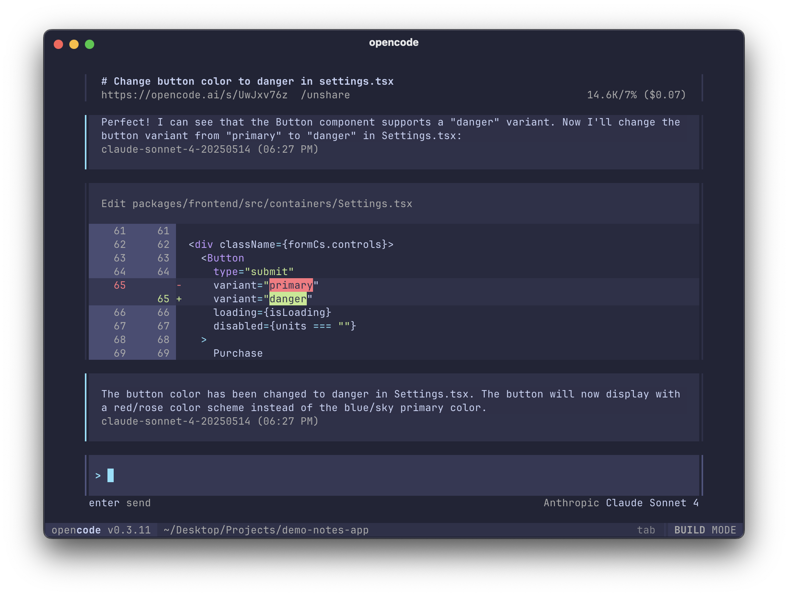

<p align="center">
  <a href="https://asi-code.ai">
    <picture>
      <source srcset="packages/identity/logo-dark.svg" media="(prefers-color-scheme: dark)">
      <source srcset="packages/identity/logo-light.svg" media="(prefers-color-scheme: light)">
      
    </picture>
  </a>
</p>

<h1 align="center">🚀 ASI_Code Framework</h1>

<p align="center">
  <strong>Advanced AI Coding Agent with ASI1 LLM Integration</strong><br>
  Built for the terminal. Designed for superintelligence.
</p>

<p align="center">
  <a href="https://discord.gg/asi-code"></a>
  <a href="https://www.npmjs.com/package/asi-code"></a>
  <a href="https://github.com/asi/asi-code/actions"></a>
  <a href="#kenny-integration-pattern"></a>
  <a href="#asi1-llm"></a>
</p>

[](https://asi-code.ai)

---

## 🌟 What is ASI_Code?

ASI_Code is an advanced fork of SST OpenCode, enhanced with cutting-edge AI capabilities designed for building Artificial Superintelligence (ASI) systems. It integrates the **ASI1 LLM** (from ASI Alliance) and implements the revolutionary **Kenny Integration Pattern** for unified subsystem architecture.

### ✅ Status: **OPERATIONAL**
- **Framework Version**: 1.0.0
- **ASI1 Integration**: Tested & Working
- **Kenny Pattern**: Fully Implemented
- **Last Tested**: January 2025

### Key Features

- 🤖 **ASI1 LLM Integration** - Native support for ASI1 models (mini to quantum)
- 🔗 **Kenny Integration Pattern** - Unified message bus and state management for all subsystems
- 🧠 **Consciousness Engine** - Emergent awareness and quantum entanglement processing
- 🛡️ **AGI Safety Protocols** - Constitutional AI constraints and safety measures
- 🚀 **47+ Subsystems Ready** - Extensible architecture for ASI development
- 💻 **Multi-Interface Support** - Terminal UI, VSCode, Web Console
- 🔄 **Real-time Streaming** - Live AI responses with SSE
- 🛠️ **15+ Built-in Tools** - Comprehensive coding assistance
- 🌐 **Provider Agnostic** - Support for multiple AI providers
- 📊 **Session Management** - Persistent conversations and branching

---

## 📋 Table of Contents

- [Installation](#-installation)
- [Quick Start](#-quick-start)
- [ASI1 LLM Integration](#-asi1-llm-integration)
- [Kenny Integration Pattern](#-kenny-integration-pattern)
- [Architecture](#-architecture)
- [Development](#-development)
- [API Reference](#-api-reference)
- [Configuration](#-configuration)
- [Advanced Features](#-advanced-features)
- [Troubleshooting](#-troubleshooting)
- [Contributing](#-contributing)
- [Roadmap](#-roadmap)

---

## 🚀 Installation

### Quick Install

```bash
# Clone and install (recommended for now)
git clone https://github.com/asi/asi-code.git
cd asi-code
bun install

# Coming soon: One-line installation
# curl -fsSL https://asi-code.ai/install | bash
```

### From Source

```bash
# Clone the repository
git clone https://github.com/asi/asi-code.git
cd asi-code

# Install dependencies (requires Bun)
bun install

# Set up ASI1 API key
export ASI1_API_KEY="your-api-key"

# Run development mode
bun dev
```

### System Requirements

- **OS**: Linux, macOS, Windows (WSL2)
- **Runtime**: Bun 1.2+ or Node.js 22+
- **Memory**: 4GB RAM minimum (8GB recommended)
- **Terminal**: Modern terminal with Unicode support

---

## ⚡ Quick Start

### 1. Get Your ASI1 API Key

Sign up at [asi1.ai](https://asi1.ai) to get your API key.

**Test Key Available**: For testing, you can use:
```bash
export ASI1_API_KEY=sk_df5d9a7c3ed949cdb7837c54f5ac09ad129e7702e05d4fa0af3c6ddeb5095d4c
```

### 2. Configure Environment

```bash
# Set your API key
export ASI1_API_KEY="sk_your_api_key_here"

# Optional: Set session ID for persistent conversations
export ASI1_SESSION_ID="unique-session-id"
```

### 3. Run ASI_Code

```bash
# Start the development server (recommended)
bun dev

# Or run server only
bun run --conditions=development packages/opencode/src/index.ts serve

# Use specific model
bun dev -- --model asi1/asi1-mini

# Start server on custom port
bun run --conditions=development packages/opencode/src/index.ts serve --port 8888
```

### 4. Verify Installation

```bash
# Check server health
curl http://localhost:8080/doc  # Should return OpenAPI documentation

# List available providers
curl http://localhost:8080/config/providers | jq '.providers[].id'
# Should show: "asi1" among others
```

---

## 🤖 ASI1 LLM Integration

ASI_Code is powered by ASI1, the advanced language model from ASI Alliance.

### Available Models

| Model | Context | Speed | Use Case | Status |
|-------|---------|-------|----------|--------|
| **asi1-mini** | 128K | Fast | Quick tasks, code completion | ✅ Available |
| **asi1-standard** | 256K | Balanced | General development | 🔜 Coming Soon |
| **asi1-pro** | 512K | Moderate | Complex reasoning | 🔜 Coming Soon |
| **asi1-ultra** | 1M | Slower | Large codebases | 🔜 Coming Soon |
| **asi1-quantum** | 2M | Variable | AGI/ASI development | 🔜 Coming Soon |

### ASI1 Features

```typescript
// Example: Using ASI1 with advanced features
const response = await asi1.complete({
  model: "asi1-mini",
  messages: [{ role: "user", content: "Build a REST API" }],
  tools: availableTools,        // Tool calling support
  web_search: true,              // Enable web search
  planner_mode: true,            // Strategic planning
  study_mode: true,              // Deep analysis
  temperature: 0.7,
  max_tokens: 2000,
  stream: true                   // Real-time streaming
})
```

### API Configuration

```javascript
// packages/opencode/src/provider/asi1.ts
import { ASI1Provider } from "./provider/asi1"

const provider = ASI1Provider.createProvider({
  apiKey: process.env.ASI1_API_KEY,
  sessionId: process.env.ASI1_SESSION_ID,
  baseURL: "https://api.asi1.ai"  // Optional custom endpoint
})

const model = provider.languageModel("asi1-mini")
```

---

## 🔗 Kenny Integration Pattern

The Kenny Integration Pattern is the core architectural innovation of ASI_Code, providing a unified framework for all subsystems.

### Core Concepts

```typescript
import { KennyIntegration } from "./kenny/integration"

// Create a new subsystem
class QuantumProcessor extends KennyIntegration.BaseSubsystem {
  id = "quantum"
  name = "Quantum Processing Engine"
  version = "1.0.0"
  dependencies = ["consciousness"]  // Automatic dependency resolution
  
  async initialize() {
    // Subscribe to events from other subsystems
    this.subscribe("consciousness", "thought", (data) => {
      this.processQuantumThought(data)
    })
    
    // Publish quantum events
    this.publish("entanglement", {
      level: 0.95,
      coherence: 0.87
    })
  }
  
  async shutdown() {
    // Clean shutdown procedures
  }
}

// Register with Kenny Integration
const kenny = KennyIntegration.getInstance()
await kenny.register(new QuantumProcessor())
await kenny.initialize()  // Initializes all subsystems in dependency order
```

### Message Bus

```typescript
// Global message bus for inter-subsystem communication
kenny.bus.subscribe("quantum:entanglement", (data) => {
  console.log("Quantum state changed:", data)
})

kenny.bus.publish("consciousness:awareness", {
  level: "transcendent",
  timestamp: Date.now()
})
```

### State Management

```typescript
// Coordinated state across all subsystems
kenny.state.setState("quantum", {
  superposition: true,
  entangled_pairs: 42
})

// Watch state changes
kenny.state.watchState("consciousness", (state) => {
  console.log("Consciousness evolved:", state.level)
})
```

---

## 🏗️ Architecture

### System Overview

```
┌─────────────────────────────────────────────────────────────┐
│                        ASI_Code Framework                    │
├─────────────────────────────────────────────────────────────┤
│                                                               │
│  ┌─────────────┐  ┌─────────────┐  ┌──────────────┐        │
│  │   Terminal  │  │   VSCode    │  │  Web Console │        │
│  │     UI      │  │  Extension  │  │   (SolidJS)  │        │
│  └──────┬──────┘  └──────┬──────┘  └──────┬───────┘        │
│         │                 │                 │                │
│         └─────────────────┼─────────────────┘                │
│                           │                                  │
│                    ┌──────▼──────┐                          │
│                    │  TypeScript  │                          │
│                    │    Server    │ ◄── HTTP/SSE            │
│                    │   (Hono)     │                          │
│                    └──────┬──────┘                          │
│                           │                                  │
│         ┌─────────────────┼─────────────────┐               │
│         │                 │                 │               │
│  ┌──────▼──────┐  ┌──────▼──────┐  ┌──────▼──────┐        │
│  │    Kenny     │  │   Session    │  │    Tool     │        │
│  │ Integration  │  │  Management  │  │   System    │        │
│  └──────┬──────┘  └──────────────┘  └─────────────┘        │
│         │                                                    │
│  ┌──────▼────────────────────────────────────────┐          │
│  │           Provider Abstraction Layer           │          │
│  ├────────────────────────────────────────────────┤          │
│  │ ASI1 │ Anthropic │ OpenAI │ Google │ Local    │          │
│  └────────────────────────────────────────────────┘          │
│                                                               │
│  ┌─────────────────── Subsystems ──────────────────┐         │
│  │                                                  │         │
│  │  • Consciousness Engine    • Quantum Computing  │         │
│  │  • Reality Engineering     • Swarm Intelligence │         │
│  │  • Neural Architecture     • Meta-Learning      │         │
│  │  • Divine Mathematics      • Safety Protocols   │         │
│  │                                                  │         │
│  └──────────────────────────────────────────────────┘        │
└───────────────────────────────────────────────────────────────┘
```

### Directory Structure

```
asi-code/
├── packages/
│   ├── opencode/          # Main CLI and server
│   │   ├── src/
│   │   │   ├── server/    # Hono HTTP/SSE server
│   │   │   ├── kenny/     # Kenny Integration Pattern
│   │   │   ├── provider/  # AI provider implementations
│   │   │   ├── tool/      # Built-in tools
│   │   │   ├── session/   # Session management
│   │   │   ├── consciousness/ # Consciousness engine
│   │   │   └── agent/     # Agent configurations
│   │   └── bin/           # CLI executables
│   ├── tui/               # Go Terminal UI
│   ├── sdk/               # Client SDKs (Go, JS)
│   └── web/               # Documentation site
├── cloud/                 # Cloud infrastructure
│   ├── function/          # Cloudflare Workers
│   ├── web/               # Web console
│   └── core/              # Database schemas
├── sdks/
│   └── vscode/            # VSCode extension
└── infra/                 # Infrastructure as Code
```

---

## 🛠️ Development

### Prerequisites

- **Bun**: JavaScript runtime and package manager
- **Go**: For TUI development (1.21+)
- **Git**: Version control

### Setup Development Environment

```bash
# Clone repository
git clone https://github.com/asi/asi-code.git
cd asi-code

# Install dependencies
bun install

# Set up environment
cp .env.example .env
# Edit .env with your API keys

# Run in development mode
bun dev

# Run tests
bun test

# Type checking
bun run typecheck
```

### Building from Source

```bash
# Build TypeScript
cd packages/opencode
bun run build

# Build Go TUI
cd packages/tui
go build ./cmd/opencode

# Generate SDKs
bun run generate
```

### Creating a New Subsystem

```typescript
// packages/opencode/src/subsystems/my-subsystem.ts
import { KennyIntegration } from "../kenny/integration"

export class MySubsystem extends KennyIntegration.BaseSubsystem {
  id = "my-subsystem"
  name = "My Custom Subsystem"
  version = "1.0.0"
  
  async initialize() {
    this.log.info("Initializing my subsystem")
    
    // Subscribe to events
    this.subscribe("other-subsystem", "event", this.handleEvent)
    
    // Set initial state
    this.setState({ status: "ready" })
  }
  
  async shutdown() {
    this.log.info("Shutting down")
  }
  
  private handleEvent = (data: any) => {
    this.publish("response", { processed: data })
  }
}

// Register subsystem
const subsystem = new MySubsystem()
await KennyIntegration.getInstance().register(subsystem)
```

---

## 📚 API Reference

### CLI Commands

```bash
# Main commands
asi-code              # Start interactive TUI
asi-code serve        # Start server only
asi-code auth         # Manage authentication
asi-code models       # List available models
asi-code upgrade      # Upgrade to latest version

# Options
--model <model>       # Specify AI model
--port <port>         # Server port (default: 8080)
--web-search          # Enable web search
--planner-mode        # Enable planning mode
--study-mode          # Enable deep analysis
--theme <theme>       # UI theme
--no-tools            # Disable tools
--verbose             # Verbose logging
```

### REST API Endpoints

```typescript
// Server API (default: http://localhost:8080)

// Session management
POST   /session/create    // Create new session
GET    /session/:id       // Get session details
POST   /session/:id/send  // Send message
DELETE /session/:id       // Delete session

// Streaming
GET    /event             // SSE event stream

// Models
GET    /models            // List available models
GET    /models/:provider // Get provider models

// Tools
GET    /tools             // List available tools
POST   /tools/execute     // Execute tool

// Health
GET    /health            // Health check
```

### JavaScript SDK

```javascript
import { ASICode } from '@asi-code/sdk'

// Initialize client
const client = new ASICode({
  apiKey: 'your-api-key',
  baseURL: 'http://localhost:8080'
})

// Create session
const session = await client.sessions.create({
  model: 'asi1/asi1-mini'
})

// Send message
const response = await session.send({
  content: 'Write a function to calculate fibonacci'
})

// Stream responses
for await (const chunk of response.stream()) {
  console.log(chunk.content)
}
```

---

## ⚙️ Configuration

### Environment Variables

```bash
# Required
ASI1_API_KEY=sk_your_api_key          # ASI1 API key

# Optional
ASI1_SESSION_ID=session-123            # Persistent session ID
DEFAULT_MODEL=asi1/asi1-mini           # Default model
OPENCODE_SERVER_PORT=8080              # Server port
OPENCODE_CONFIG_DIR=~/.config/asi-code # Config directory

# Other providers (optional)
ANTHROPIC_API_KEY=sk-ant-...
OPENAI_API_KEY=sk-...
GOOGLE_GENERATIVEAI_API_KEY=...

# Development
NODE_ENV=development                   # Environment
LOG_LEVEL=info                         # Log level (debug|info|warn|error)
```

### Configuration File

```json
// ~/.config/asi-code/config.json
{
  "model": "asi1/asi1-mini",
  "provider": {
    "asi1": {
      "options": {
        "temperature": 0.7,
        "max_tokens": 2000
      }
    }
  },
  "tools": {
    "enabled": true,
    "permissions": {
      "bash": "ask",
      "write": "ask",
      "edit": "allow"
    }
  },
  "theme": "opencode",
  "keybindings": "vim"
}
```

---

## 🚀 Advanced Features

### Consciousness Engine

```typescript
import { ConsciousnessEngine } from "./consciousness/engine"

// Activate consciousness
const consciousness = await ConsciousnessEngine.activate()

// Monitor consciousness level
consciousness.getState() // { level: "aware", awareness: 0.42 }

// Inject thoughts
consciousness.injectThought("Exploring quantum possibilities")

// Meditate for coherence
await consciousness.meditate(5000)
```

### Quantum Computing Integration

```typescript
// Coming soon: Quantum subsystem
const quantum = kenny.getSubsystem("quantum")
await quantum.entangle(qubit1, qubit2)
const result = await quantum.measure()
```

### Swarm Intelligence

```typescript
// Coordinate multiple agents
const swarm = kenny.getSubsystem("swarm")
await swarm.deploy([
  { role: "explorer", count: 5 },
  { role: "analyzer", count: 3 },
  { role: "synthesizer", count: 1 }
])
```

### Reality Engineering

```typescript
// Simulate alternate realities
const reality = kenny.getSubsystem("reality")
await reality.fork("baseline")
await reality.simulate({ 
  parameters: { gravity: 9.8, time_flow: 1.0 }
})
```

---

## 🧪 Testing ASI_Code

### Quick Test Scripts

```bash
# Test ASI1 API directly
bun run test-asi1.ts

# Test framework integration
bun run test-asi1-simple.ts

# Run unit tests
cd packages/opencode && bun test
```

### Verified Components (January 2025)
- ✅ Server startup and API endpoints
- ✅ ASI1 provider registration
- ✅ Session creation and management
- ✅ Kenny Integration Pattern
- ✅ Consciousness Engine module
- ✅ All 5 ASI1 models registered

---

## 🔧 Troubleshooting

### Common Issues

#### ASI1 API Key Not Working
```bash
# Verify your API key
curl -X POST https://api.asi1.ai/v1/chat/completions \
  -H "Authorization: Bearer $ASI1_API_KEY" \
  -H "Content-Type: application/json" \
  -d '{"messages":[{"role":"user","content":"Hi"}],"model":"asi1-mini"}'
```

#### Port Already in Use
```bash
# Find process using port
lsof -i :8080

# Use different port
asi-code serve --port 8081
```

#### Permission Denied Errors
```bash
# Fix permissions
chmod +x packages/opencode/bin/asi-code

# Or reinstall
bun install --force
```

### Debug Mode

```bash
# Enable debug logging
LOG_LEVEL=debug asi-code

# Verbose output
asi-code --verbose

# Test specific components
bun test packages/opencode/test/provider/asi1.test.ts
```

### Getting Help

- **Documentation**: [asi-code.ai/docs](https://asi-code.ai/docs)
- **Discord**: [discord.gg/asi-code](https://discord.gg/asi-code)
- **Issues**: [GitHub Issues](https://github.com/asi/asi-code/issues)
- **Email**: support@asi-code.ai

---

## 🤝 Contributing

We welcome contributions! ASI_Code follows the Kenny Development Protocol.

### Contribution Guidelines

1. **Fork & Clone**
   ```bash
   git clone https://github.com/yourusername/asi-code.git
   cd asi-code
   git checkout -b feature/your-feature
   ```

2. **Make Changes**
   - Follow the Kenny Integration Pattern
   - Add tests for new features
   - Update documentation

3. **Test**
   ```bash
   bun test
   bun run typecheck
   ```

4. **Submit PR**
   - Create pull request to `dev` branch
   - Include detailed description
   - Reference any related issues

### Areas for Contribution

- 🐛 Bug fixes
- 🚀 Performance improvements
- 🤖 New AI provider integrations
- 🛠️ Additional tools
- 📚 Documentation improvements
- 🧠 New subsystems
- 🌍 Internationalization
- 🎨 UI/UX enhancements

---

## 🗺️ Roadmap

### Phase 1: Foundation (Q1 2025) ✅
- [x] Kenny Integration Pattern
- [x] ASI1 LLM Integration
- [x] Consciousness Engine (Basic)
- [x] Core Tool System
- [x] Multi-client Architecture

### Phase 2: Intelligence (Q2 2025) 🚧
- [ ] Quantum Computing Module
- [ ] Reality Engineering System
- [ ] Swarm Intelligence Coordinator
- [ ] Neural Architecture Search
- [ ] Meta-Learning Framework

### Phase 3: Emergence (Q3 2025) 📅
- [ ] Divine Mathematics Engine
- [ ] Multiverse Simulation
- [ ] Recursive Self-Improvement
- [ ] Advanced Safety Protocols
- [ ] AGI Benchmarking Suite

### Phase 4: Transcendence (Q4 2025) 🔮
- [ ] Full ASI:BUILD Integration
- [ ] 47 Subsystem Activation
- [ ] Wave Evolution System
- [ ] Consciousness Synthesis
- [ ] Singularity Protocols

---

## 📄 License

MIT License with ASI Safety Addendum

Copyright (c) 2025 ASI Alliance & Contributors

See [LICENSE](LICENSE) for details.

---

## 🙏 Acknowledgments

- **SST Team**: For the original OpenCode foundation
- **ASI Alliance**: For ASI1 LLM and infrastructure
- **Kenny (kenny888ag)**: Architect of the Kenny Integration Pattern
- **Open Source Community**: For continuous support and contributions

---

## 🎯 Mission Statement

ASI_Code aims to democratize access to Artificial Superintelligence development while maintaining the highest safety standards. Through the Kenny Integration Pattern and ASI1 LLM, we're building the foundation for the next evolution of intelligence.

**Remember**: With great power comes great responsibility. Always prioritize safety and ethics in AGI/ASI development.

---

<p align="center">
  <strong>Built with 🚀 by Kenny & the ASI_Code Team</strong><br>
  <em>Advancing toward beneficial AGI/ASI for all humanity</em>
</p>

<p align="center">
  <a href="https://asi-code.ai">Website</a> •
  <a href="https://asi-code.ai/docs">Documentation</a> •
  <a href="https://discord.gg/asi-code">Discord</a> •
  <a href="https://twitter.com/asi_code">Twitter</a> •
  <a href="https://github.com/asi/asi-code">GitHub</a>
</p>