# ASI_Code Architecture Documentation

## Table of Contents

1. [System Overview](#system-overview)
2. [Core Components](#core-components)
3. [Kenny Integration Pattern](#kenny-integration-pattern)
4. [Software Architecture Taskforce (SAT)](#software-architecture-taskforce-sat)
5. [Data Flow](#data-flow)
6. [Security Model](#security-model)
7. [Performance Considerations](#performance-considerations)
8. [Deployment Architecture](#deployment-architecture)

## System Overview

ASI_Code is a sophisticated AI-powered development environment built around a modular, event-driven architecture. The system provides a unified interface for AI model interactions, code manipulation, and development tooling through a carefully orchestrated set of subsystems.

### High-Level Architecture

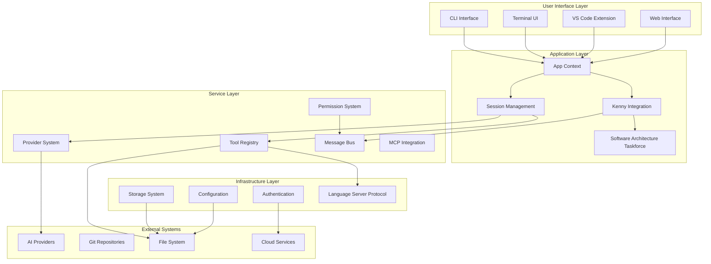

### Key Design Principles

1. **Modularity**: Each component is a self-contained subsystem with clear boundaries
2. **Event-Driven**: Components communicate through an event bus for loose coupling
3. **Provider Agnostic**: Abstract interfaces allow swapping AI providers seamlessly
4. **Security First**: Comprehensive permission system for all operations
5. **Performance Optimized**: Lazy loading, caching, and efficient resource management
6. **Extensible**: Plugin architecture supports custom functionality

## Core Components

### 1. Application Context (`App`)

The App module provides the foundational context and lifecycle management for the entire system.

**Key Responsibilities:**
- Initialize and manage global application state
- Provide unified path management (config, data, state directories)
- Service lifecycle management with dependency injection
- Git repository detection and project isolation

**Architecture Pattern:**
```typescript
export namespace App {
  export async function provide<T>(input: Input, cb: (app: App.Info) => Promise<T>) {
    // Context provision with automatic cleanup
    return ctx.provide(app, async () => {
      try {
        return await cb(app.info)
      } finally {
        // Cleanup all registered services
        for (const [key, entry] of app.services.entries()) {
          await entry.shutdown?.(await entry.state)
        }
      }
    })
  }
}
```

### 2. Provider System

The Provider system abstracts AI model interactions through a unified interface, supporting multiple providers including Anthropic, OpenAI, ASI1, and others.

**Provider Architecture:**
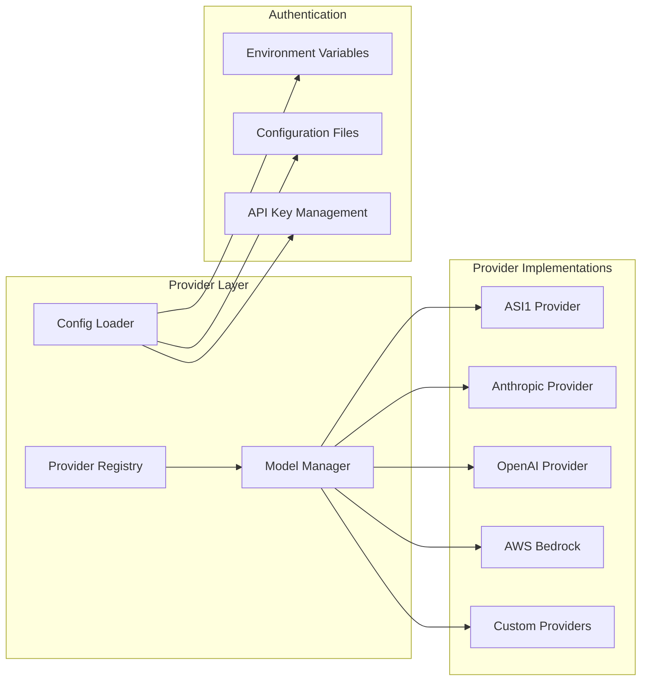

**Key Features:**
- Dynamic provider loading with npm package management
- Model capability detection (tool calling, reasoning, attachments)
- Cost tracking and token usage monitoring
- Provider-specific transformations and optimizations

### 3. Session Management

Sessions provide persistent conversation contexts with branching, state management, and message persistence.

**Session Architecture:**
```typescript
interface Session {
  id: string
  parentID?: string  // For session branching
  messages: Message[]
  state: SessionState
  revert?: RevertPoint  // For rollback functionality
}
```

**Core Features:**
- Message persistence with structured storage
- Session branching for exploration
- Automatic summarization for long conversations
- Real-time streaming with tool execution
- Snapshot-based rollback system

### 4. Tool Registry

The Tool Registry provides a plugin architecture for extending AI capabilities with external tools.

**Tool System Design:**
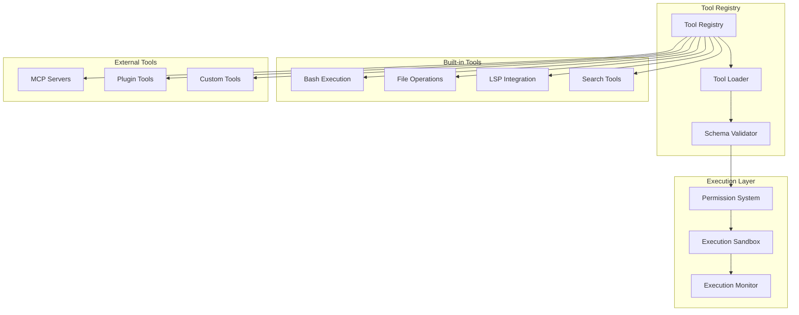

### 5. Message Bus

The Bus system enables event-driven communication between all subsystems.

**Bus Architecture:**
```typescript
export namespace Bus {
  // Type-safe event definitions
  export function event<Type extends string, Properties extends ZodType>(
    type: Type, 
    properties: Properties
  ) {
    return { type, properties }
  }
  
  // Publisher
  export async function publish<Definition extends EventDefinition>(
    def: Definition,
    properties: z.output<Definition["properties"]>
  ) {
    // Broadcast to all subscribers
  }
  
  // Subscriber
  export function subscribe<Definition extends EventDefinition>(
    def: Definition,
    callback: (event) => void
  ) {
    // Type-safe subscription
  }
}
```

## Kenny Integration Pattern

The Kenny Integration Pattern is ASI_Code's signature architectural framework that provides unified subsystem communication and coordination.

### Kenny Pattern Architecture

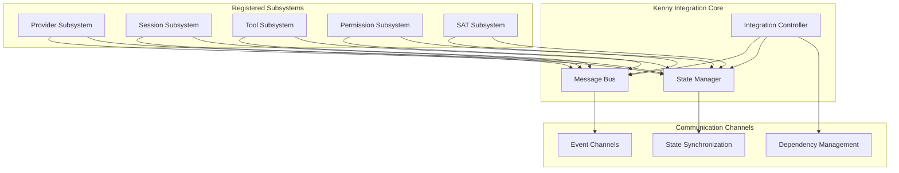

### Subsystem Interface

All subsystems implement the Kenny pattern interface:

```typescript
export interface Subsystem {
  id: string
  name: string
  version: string
  dependencies?: string[]
  
  initialize(): Promise<void>
  connect(integration: Integration): void
  shutdown(): Promise<void>
}

export abstract class BaseSubsystem implements Subsystem {
  protected publish(channel: string, data: any) {
    this.integration.bus.publish(`${this.id}:${channel}`, data)
  }
  
  protected subscribe(subsystemId: string, channel: string, callback: (data: any) => void) {
    return this.integration.bus.subscribe(`${subsystemId}:${channel}`, callback)
  }
  
  protected setState(state: any) {
    this.integration.state.setState(this.id, state)
  }
}
```

### Communication Patterns

1. **Event Publication**: `subsystem.publish("event", data)`
2. **Cross-Subsystem Subscription**: `subsystem.subscribe("other-subsystem", "event", handler)`
3. **State Management**: `subsystem.setState(newState)`
4. **State Watching**: `subsystem.watchState("other-subsystem", handler)`

## Software Architecture Taskforce (SAT)

The SAT is an advanced architectural oversight subsystem that provides continuous architecture analysis, pattern recognition, and optimization recommendations.

### SAT Architecture

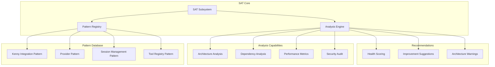

### SAT Capabilities

1. **Real-time Architecture Monitoring**
   - Dependency cycle detection
   - Performance bottleneck identification
   - Security vulnerability scanning

2. **Pattern Recognition**
   - Architectural pattern validation
   - Anti-pattern detection
   - Best practice recommendations

3. **Health Scoring**
   - System health metrics calculation
   - Trend analysis
   - Predictive issue detection

## Data Flow

### Session Data Flow

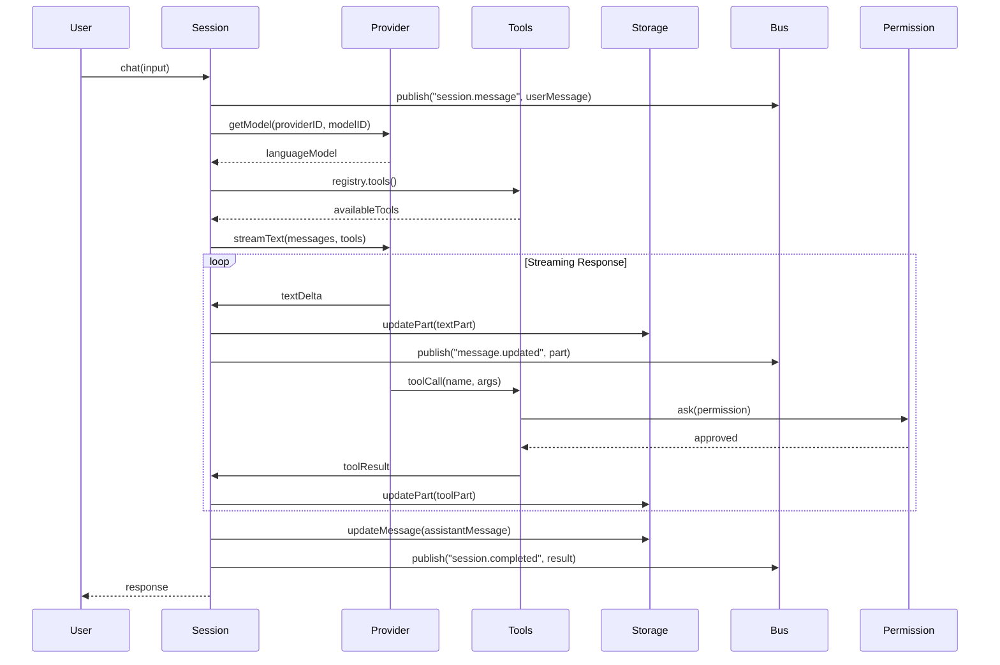

### Tool Execution Flow

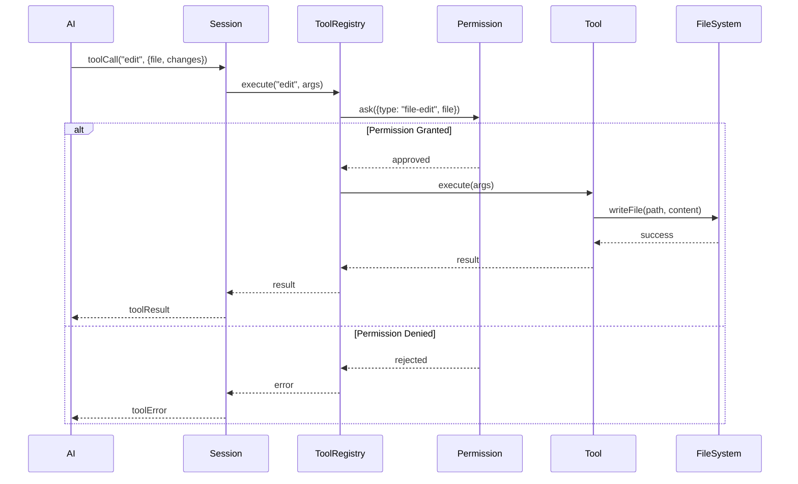

## Security Model

### Multi-Layer Security Architecture

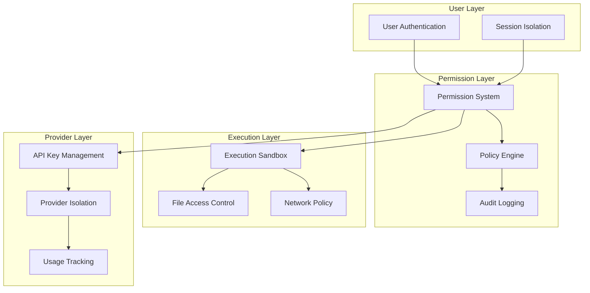

### Security Features

1. **Permission System**
   - Granular permission controls for all operations
   - User approval workflows for sensitive actions
   - Pattern-based permission caching

2. **Execution Sandboxing**
   - Isolated execution environments
   - File system access controls
   - Network policy enforcement

3. **API Security**
   - Secure API key management
   - Provider-specific security policies
   - Usage monitoring and rate limiting

4. **Audit Trail**
   - Comprehensive operation logging
   - Security event tracking
   - Compliance reporting

## Performance Considerations

### Optimization Strategies

1. **Lazy Loading**
   ```typescript
   const state = App.state("service", () => {
     // Service initialized only when first accessed
     return new ServiceState()
   })
   ```

2. **Caching Layers**
   - Provider model caching
   - Tool schema caching
   - Configuration caching
   - Message indexing

3. **Streaming Architecture**
   - Real-time response streaming
   - Incremental tool execution
   - Progressive result rendering

4. **Resource Management**
   - Automatic service cleanup
   - Memory-efficient message storage
   - Background process management

### Performance Metrics

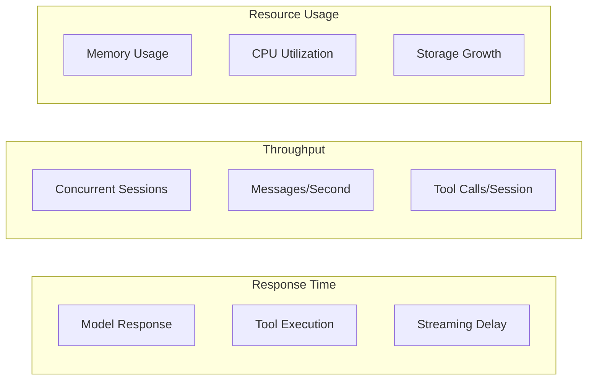

### Scalability Patterns

1. **Horizontal Scaling**
   - Stateless session management
   - Distributed storage backends
   - Load-balanced tool execution

2. **Vertical Scaling**
   - Efficient memory management
   - CPU-optimized algorithms
   - I/O operation optimization

## Deployment Architecture

### Cloud Architecture

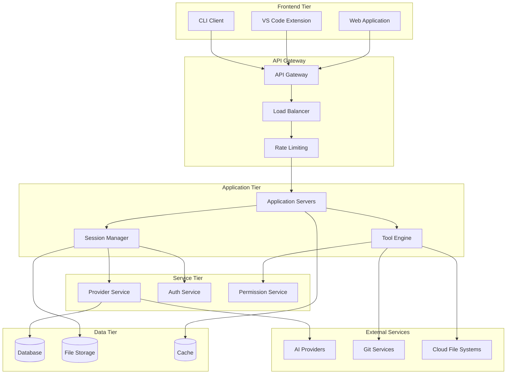

### Local Deployment

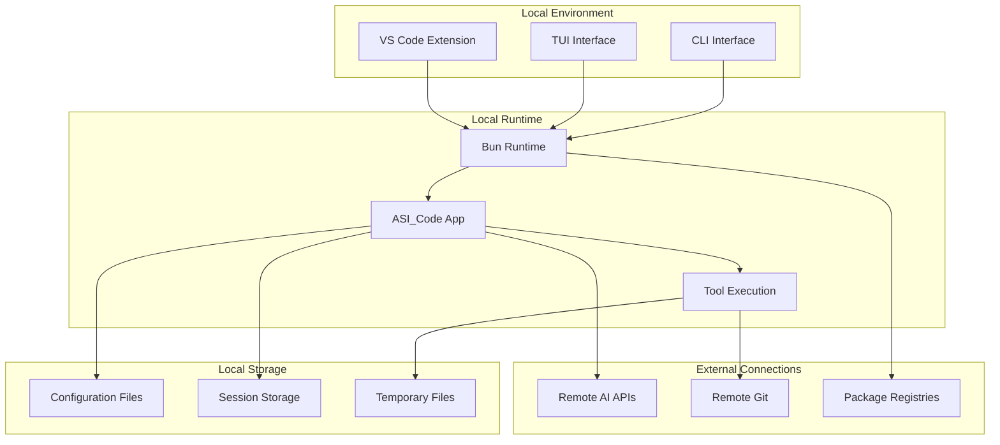

---

## Architecture Evolution

ASI_Code's architecture is designed for continuous evolution through:

1. **Modular Design**: Easy addition of new subsystems
2. **Plugin Architecture**: Community-driven extensions
3. **Provider Abstraction**: Simple integration of new AI models
4. **Tool Extensibility**: Seamless addition of new capabilities
5. **Kenny Pattern**: Scalable inter-subsystem communication

The Software Architecture Taskforce continuously monitors and optimizes the system architecture, ensuring ASI_Code remains at the forefront of AI-powered development environments.

---

*This documentation is maintained by the Software Architecture Taskforce and updated continuously to reflect the evolving ASI_Code architecture.*