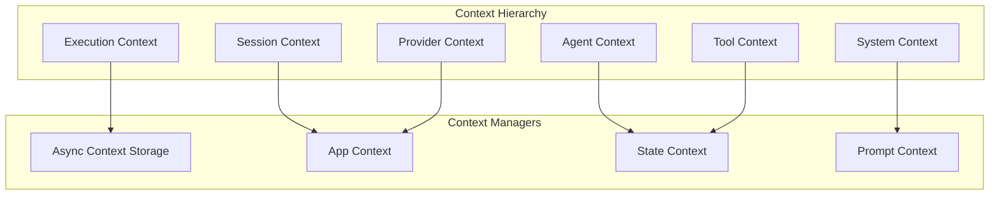
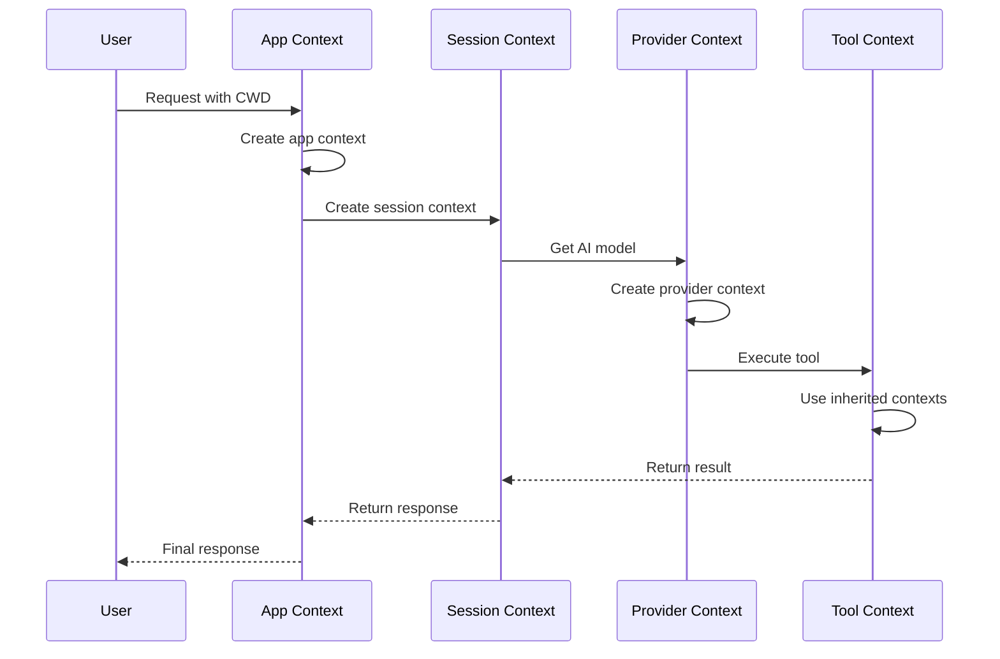
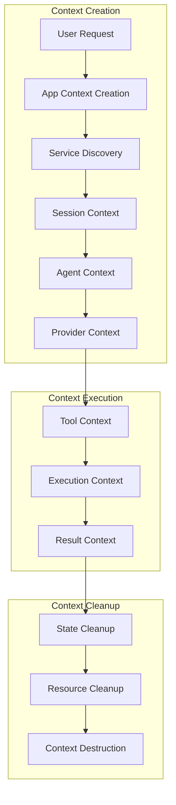

# Context Engineering in ASI_Code

## Table of Contents

1. [Overview](#overview)
2. [Context Management Architecture](#context-management-architecture)
3. [Async Context Pattern](#async-context-pattern)
4. [System Prompt Engineering](#system-prompt-engineering)
5. [Session Context Management](#session-context-management)
6. [Agent Context Specialization](#agent-context-specialization)
7. [Tool Context Integration](#tool-context-integration)
8. [Provider Context Handling](#provider-context-handling)
9. [Context Optimization Strategies](#context-optimization-strategies)
10. [Best Practices](#best-practices)

---

## Overview

Context Engineering in ASI_Code refers to the sophisticated system for managing execution context, conversation context, and system state across the entire platform. It encompasses everything from low-level async context management to high-level prompt engineering and agent specialization.

### Core Context Types



---

## Context Management Architecture

### 1. Async Context Storage

ASI_Code uses Node.js's AsyncLocalStorage for maintaining context across asynchronous operations:

```typescript
// /packages/opencode/src/util/context.ts
import { AsyncLocalStorage } from "async_hooks"

export namespace Context {
  export class NotFound extends Error {
    constructor(public readonly name: string) {
      super(`No context found for ${name}`)
    }
  }

  export function create<T>(name: string) {
    const storage = new AsyncLocalStorage<T>()
    return {
      use() {
        const result = storage.getStore()
        if (!result) {
          throw new NotFound(name)
        }
        return result
      },
      provide<R>(value: T, fn: () => R) {
        return storage.run<R>(value, fn)
      },
    }
  }
}
```

### 2. Application Context Pattern

The App context provides foundational context management for all operations:

```typescript
// Core App Context Structure
const ctx = Context.create<{
  info: App.Info
  services: Map<any, { state: any; shutdown?: (input: any) => Promise<void> }>
}>("app")

export async function provide<T>(input: Input, cb: (app: App.Info) => Promise<T>) {
  // Create app context with git detection, paths, and service management
  const git = await Filesystem.findUp(".git", input.cwd)
  const data = path.join(Global.Path.data, "project", git ? directory(git) : "global")
  
  const info: App.Info = {
    hostname: os.hostname(),
    git: git !== undefined,
    path: {
      config: Global.Path.config,
      state: Global.Path.state,
      data,
      root: git ?? input.cwd,
      cwd: input.cwd,
    },
    time: {
      initialized: state.initialized,
    }
  }

  const app = { services, info }
  
  return ctx.provide(app, async () => {
    try {
      return await cb(app.info)
    } finally {
      // Cleanup all registered services
      for (const [key, entry] of app.services.entries()) {
        await entry.shutdown?.(await entry.state)
      }
    }
  })
}
```

### 3. Service State Management

ASI_Code implements a lazy-loading service pattern with context-aware state management:

```typescript
export function state<T>(name: string, factory: () => T | Promise<T>) {
  return async (): Promise<T> => {
    const app = ctx.use()
    let entry = app.services.get(factory)
    
    if (!entry) {
      const state = factory()
      entry = { state }
      app.services.set(factory, entry)
    }
    
    return entry.state
  }
}

// Example usage in provider system
const state = App.state("provider", async () => {
  return new ProviderManager()
})
```

---

## Async Context Pattern

### Context Propagation

ASI_Code ensures context propagation across all asynchronous operations:



### Context Inheritance

```typescript
// Example: Session inheriting App context
export class SessionManager {
  constructor(private app: App.Info) {}
  
  async createSession(config: SessionConfig): Promise<Session> {
    // Session automatically has access to app context
    const sessionPath = path.join(this.app.path.data, "sessions")
    
    const session = new Session({
      ...config,
      workingDirectory: this.app.path.cwd,
      dataPath: sessionPath
    })
    
    return session
  }
}
```

### Context Scoping

```typescript
// Tool execution with scoped context
export class ToolRegistry {
  async executeTool(name: string, params: any): Promise<any> {
    const app = App.use()
    const session = Session.use()
    
    // Create tool-specific context
    return ToolContext.provide({
      app,
      session,
      toolName: name,
      parameters: params,
      workingDirectory: app.path.cwd
    }, async () => {
      const tool = this.getTool(name)
      return tool.execute(params)
    })
  }
}
```

---

## System Prompt Engineering

### 1. Hierarchical Prompt System

ASI_Code uses a sophisticated prompt hierarchy that adapts to different providers and use cases:

```
/packages/opencode/src/session/prompt/
├── anthropic.txt          # Anthropic-specific prompts
├── anthropic_spoof.txt    # Anthropic spoofing detection
├── beast.txt              # Beast mode prompts
├── codex.txt              # Code generation prompts
├── copilot-gpt-5.txt      # GitHub Copilot integration
├── gemini.txt             # Google Gemini prompts
├── initialize.txt         # Initialization prompts
├── plan.txt               # Planning mode prompts
├── qwen.txt               # Qwen model prompts
├── summarize.txt          # Summarization prompts
└── title.txt              # Title generation prompts
```

### 2. Dynamic Prompt Construction

```typescript
export class SystemPrompt {
  static async build(context: {
    provider: string
    agent: Agent.Info
    session: Session.Info
    app: App.Info
  }): Promise<string> {
    // Base prompt selection
    const basePrompt = await this.loadBasePrompt(context.provider)
    
    // Agent-specific modifications
    const agentPrompt = context.agent.prompt || ""
    
    // Context-aware additions
    const contextPrompt = this.buildContextPrompt(context)
    
    // Combine all prompts
    return [
      basePrompt,
      agentPrompt,
      contextPrompt,
      this.buildToolInstructions(context.agent.tools),
      this.buildPermissionInstructions(context.agent.permission)
    ].filter(Boolean).join("\n\n")
  }
  
  private static buildContextPrompt(context: any): string {
    const parts = []
    
    // Working directory context
    parts.push(`Working directory: ${context.app.path.cwd}`)
    
    // Git context
    if (context.app.git) {
      parts.push(`Git repository: ${context.app.path.root}`)
    }
    
    // Platform context
    parts.push(`Platform: ${process.platform}`)
    parts.push(`Node version: ${process.version}`)
    
    return parts.join("\n")
  }
}
```

### 3. Provider-Specific Prompt Engineering

#### Anthropic Context Engineering

```typescript
// Anthropic-specific prompt features
const ANTHROPIC_PROMPT = `
You are an interactive CLI tool that helps users with software engineering tasks.

# Tone and style
You should be concise, direct, and to the point.
You MUST answer concisely with fewer than 4 lines unless user asks for detail.
IMPORTANT: You should minimize output tokens as much as possible.

# Task Management
You have access to the TodoWrite tools to help you manage and plan tasks.
Use these tools VERY frequently to ensure tracking your tasks.

# Code style
- IMPORTANT: DO NOT ADD ***ANY*** COMMENTS unless asked
- Follow existing conventions in the codebase
- Never assume libraries are available without checking
`
```

#### ASI1 Context Engineering

```typescript
// ASI1-specific optimizations
const ASI1_PROMPT = `
Advanced AI system context for ASI1 provider:
- Extended reasoning capabilities enabled
- Multi-step problem solving
- Advanced code analysis and generation
- Context window optimization for large codebases
`
```

---

## Session Context Management

### 1. Session Lifecycle Context

```typescript
export class Session {
  constructor(private context: SessionContext) {
    this.info = {
      id: context.id,
      title: context.title,
      version: "2.0.0",
      time: {
        created: Date.now(),
        updated: Date.now(),
      },
      // Context-aware initialization
      workingDirectory: context.app.path.cwd,
      gitRepository: context.app.git ? context.app.path.root : undefined
    }
  }
  
  async chat(input: ChatInput): Promise<ChatResponse> {
    // Create chat-specific context
    return ChatContext.provide({
      session: this.info,
      input,
      timestamp: Date.now(),
      workingDirectory: this.info.workingDirectory
    }, async () => {
      // Execute chat with full context
      return this.executeChat(input)
    })
  }
}
```

### 2. Message Context Threading

```typescript
export class MessageManager {
  async addMessage(message: Message): Promise<void> {
    const context = ChatContext.use()
    
    // Add context metadata to message
    const contextualMessage = {
      ...message,
      context: {
        sessionId: context.session.id,
        timestamp: context.timestamp,
        workingDirectory: context.workingDirectory,
        gitCommit: await this.getCurrentGitCommit()
      }
    }
    
    await this.storage.save(contextualMessage)
  }
  
  async getMessageHistory(limit?: number): Promise<Message[]> {
    const context = ChatContext.use()
    
    return this.storage.query({
      sessionId: context.session.id,
      limit,
      includeContext: true
    })
  }
}
```

### 3. Context-Aware State Management

```typescript
export class SessionState {
  private state = new Map<string, any>()
  
  setState<T>(key: string, value: T): void {
    const context = ChatContext.use()
    
    // Add context metadata to state
    this.state.set(key, {
      value,
      context: {
        timestamp: Date.now(),
        sessionId: context.session.id,
        source: context.source || "unknown"
      }
    })
  }
  
  getState<T>(key: string): T | undefined {
    const entry = this.state.get(key)
    return entry?.value
  }
  
  getStateWithContext<T>(key: string): { value: T; context: any } | undefined {
    return this.state.get(key)
  }
}
```

---

## Agent Context Specialization

### 1. Agent Context Architecture

```typescript
export namespace Agent {
  export interface Context {
    info: Agent.Info
    session: Session.Info
    app: App.Info
    provider: Provider.Info
    capabilities: string[]
    restrictions: string[]
  }
  
  export class ContextualAgent {
    constructor(private context: Context) {}
    
    async execute(input: any): Promise<any> {
      // Create agent-specific execution context
      return AgentContext.provide({
        agent: this.context.info,
        session: this.context.session,
        capabilities: this.context.capabilities,
        permissions: this.context.info.permission,
        tools: this.getAvailableTools()
      }, async () => {
        return this.processInput(input)
      })
    }
    
    private getAvailableTools(): Tool[] {
      const context = AgentContext.use()
      return ToolRegistry.getTools().filter(tool => 
        context.agent.tools[tool.id] !== false &&
        this.hasPermission(tool.id)
      )
    }
  }
}
```

### 2. Specialized Agent Contexts

#### General Agent Context

```typescript
const GENERAL_AGENT_CONTEXT = {
  name: "general",
  description: "General-purpose agent for researching complex questions",
  tools: {
    todoread: false,
    todowrite: false,
    bash: true,
    edit: true,
    read: true,
    grep: true,
    glob: true
  },
  permissions: {
    edit: "allow",
    bash: { "*": "allow" },
    webfetch: "allow"
  },
  mode: "subagent"
}
```

#### Build Agent Context

```typescript
const BUILD_AGENT_CONTEXT = {
  name: "build",
  description: "Specialized for build, test, and deployment tasks",
  tools: {
    bash: true,
    edit: true,
    read: true,
    write: true,
    todowrite: true
  },
  permissions: {
    edit: "allow",
    bash: {
      "npm": "allow",
      "yarn": "allow",
      "bun": "allow",
      "make": "allow",
      "cargo": "allow"
    }
  },
  mode: "primary"
}
```

#### Planning Agent Context

```typescript
const PLAN_AGENT_CONTEXT = {
  name: "plan",
  description: "Strategic planning and architecture design",
  tools: {
    write: false,  // Read-only for analysis
    edit: false,
    bash: false,
    read: true,
    grep: true,
    todowrite: true
  },
  permissions: {
    edit: "deny",
    bash: { "*": "deny" }
  },
  mode: "primary"
}
```

### 3. Dynamic Context Adaptation

```typescript
export class AdaptiveAgent {
  async adaptContext(task: Task): Promise<Agent.Context> {
    const baseContext = this.getBaseContext()
    
    // Analyze task requirements
    const requirements = await this.analyzeTask(task)
    
    // Adapt permissions based on task
    const adaptedPermissions = this.adaptPermissions(
      baseContext.info.permission, 
      requirements
    )
    
    // Adapt available tools
    const adaptedTools = this.adaptTools(
      baseContext.info.tools,
      requirements
    )
    
    return {
      ...baseContext,
      info: {
        ...baseContext.info,
        permission: adaptedPermissions,
        tools: adaptedTools
      },
      capabilities: requirements.capabilities,
      restrictions: requirements.restrictions
    }
  }
}
```

---

## Tool Context Integration

### 1. Tool Execution Context

```typescript
export class ToolContext {
  static create<T>(toolName: string, params: any, executor: () => Promise<T>): Promise<T> {
    const session = Session.use()
    const agent = Agent.use()
    
    return Context.provide({
      toolName,
      parameters: params,
      session: session.info,
      agent: agent.info,
      workingDirectory: session.info.workingDirectory,
      permissions: agent.info.permission,
      timestamp: Date.now()
    }, executor)
  }
}

// Tool implementation with context awareness
export class BashTool {
  static async execute(command: string, options: BashOptions): Promise<BashResult> {
    return ToolContext.create("bash", { command, options }, async () => {
      const context = ToolContext.use()
      
      // Check permissions in context
      if (!this.hasPermission(command, context.permissions.bash)) {
        throw new Error("Permission denied for bash command")
      }
      
      // Execute with working directory from context
      const result = await spawn(command, {
        cwd: context.workingDirectory,
        env: this.buildEnvironment(context)
      })
      
      // Log execution with context
      Log.info("Bash command executed", {
        command,
        sessionId: context.session.id,
        agentId: context.agent.name,
        workingDirectory: context.workingDirectory
      })
      
      return result
    })
  }
}
```

### 2. Context-Aware Tool Discovery

```typescript
export class ToolRegistry {
  static async getAvailableTools(): Promise<Tool[]> {
    const agent = Agent.use()
    const session = Session.use()
    
    const allTools = await this.loadAllTools()
    
    return allTools.filter(tool => {
      // Filter by agent permissions
      if (agent.info.tools[tool.id] === false) return false
      
      // Filter by session context
      if (tool.requiresGit && !session.info.gitRepository) return false
      
      // Filter by environment
      if (tool.requiresDocker && !this.hasDocker()) return false
      
      return true
    })
  }
}
```

### 3. Tool Result Context Enrichment

```typescript
export class ToolResultProcessor {
  static enrichResult<T>(toolName: string, result: T): EnrichedResult<T> {
    const context = ToolContext.use()
    
    return {
      result,
      metadata: {
        toolName,
        executionTime: Date.now() - context.timestamp,
        sessionId: context.session.id,
        agentId: context.agent.name,
        workingDirectory: context.workingDirectory,
        parameters: context.parameters
      },
      context: {
        session: context.session,
        agent: context.agent,
        environment: this.captureEnvironment()
      }
    }
  }
}
```

---

## Provider Context Handling

### 1. Provider Context Architecture

```typescript
export class ProviderContext {
  constructor(
    public readonly providerId: string,
    public readonly modelId: string,
    public readonly capabilities: string[],
    public readonly configuration: any
  ) {}
  
  async createModel(): Promise<LanguageModel> {
    return ProviderExecutionContext.provide({
      providerId: this.providerId,
      modelId: this.modelId,
      session: Session.use(),
      agent: Agent.use(),
      timestamp: Date.now()
    }, async () => {
      const provider = await this.loadProvider()
      return provider.languageModel(this.modelId)
    })
  }
}
```

### 2. Context-Aware Model Selection

```typescript
export class ModelSelector {
  static async selectOptimalModel(task: Task): Promise<{ providerId: string; modelId: string }> {
    const context = {
      session: Session.use(),
      agent: Agent.use(),
      app: App.use()
    }
    
    // Analyze task requirements
    const requirements = await this.analyzeTaskRequirements(task)
    
    // Get available providers in current context
    const providers = await Provider.getAvailable()
    
    // Score models based on context and requirements
    const scored = await Promise.all(
      providers.map(async provider => {
        const models = await provider.getAvailableModels()
        return models.map(model => ({
          providerId: provider.id,
          modelId: model.id,
          score: this.scoreModel(model, requirements, context),
          capabilities: model.capabilities
        }))
      })
    ).then(results => results.flat())
    
    // Select highest scoring model
    const selected = scored.sort((a, b) => b.score - a.score)[0]
    
    Log.info("Model selected", {
      selected: `${selected.providerId}:${selected.modelId}`,
      score: selected.score,
      sessionId: context.session.info.id,
      agentId: context.agent.info.name
    })
    
    return {
      providerId: selected.providerId,
      modelId: selected.modelId
    }
  }
}
```

### 3. Provider-Specific Context Optimization

```typescript
export class ProviderOptimizer {
  static async optimizeContext(
    providerId: string, 
    messages: Message[]
  ): Promise<OptimizedContext> {
    switch (providerId) {
      case "anthropic":
        return this.optimizeForAnthropic(messages)
      case "openai":
        return this.optimizeForOpenAI(messages)
      case "asi1":
        return this.optimizeForASI1(messages)
      default:
        return this.optimizeGeneric(messages)
    }
  }
  
  private static async optimizeForAnthropic(messages: Message[]): Promise<OptimizedContext> {
    const context = Session.use()
    
    // Anthropic-specific optimizations
    const systemMessage = await SystemPrompt.buildForAnthropic({
      workingDirectory: context.info.workingDirectory,
      gitRepository: context.info.gitRepository,
      capabilities: ["claude-code", "interleaved-thinking"]
    })
    
    // Optimize message history for Anthropic's context window
    const optimizedMessages = await this.compressMessageHistory(
      messages,
      200000 // Anthropic's context window
    )
    
    return {
      systemMessage,
      messages: optimizedMessages,
      configuration: {
        headers: {
          "anthropic-beta": "claude-code-20250219,interleaved-thinking-2025-05-14"
        }
      }
    }
  }
}
```

---

## Context Optimization Strategies

### 1. Memory Management

```typescript
export class ContextMemoryManager {
  private contextCache = new Map<string, any>()
  private readonly MAX_CACHE_SIZE = 1000
  
  async getOrCreateContext<T>(
    key: string, 
    factory: () => Promise<T>
  ): Promise<T> {
    if (this.contextCache.has(key)) {
      return this.contextCache.get(key)
    }
    
    const context = await factory()
    
    // Implement LRU eviction
    if (this.contextCache.size >= this.MAX_CACHE_SIZE) {
      const firstKey = this.contextCache.keys().next().value
      this.contextCache.delete(firstKey)
    }
    
    this.contextCache.set(key, context)
    return context
  }
  
  clearContext(key: string): void {
    this.contextCache.delete(key)
  }
  
  clearAll(): void {
    this.contextCache.clear()
  }
}
```

### 2. Context Compression

```typescript
export class ContextCompressor {
  static async compressMessageHistory(
    messages: Message[],
    maxTokens: number
  ): Promise<Message[]> {
    let totalTokens = this.estimateTokens(messages)
    
    if (totalTokens <= maxTokens) {
      return messages
    }
    
    // Keep system message and recent messages
    const systemMessages = messages.filter(m => m.role === "system")
    const userMessages = messages.filter(m => m.role === "user")
    const assistantMessages = messages.filter(m => m.role === "assistant")
    
    // Compress older messages
    const recentMessages = messages.slice(-10) // Keep last 10 messages
    const olderMessages = messages.slice(0, -10)
    
    // Summarize older messages if needed
    let compressedMessages = [...systemMessages, ...recentMessages]
    
    if (this.estimateTokens(compressedMessages) > maxTokens) {
      const summary = await this.summarizeMessages(olderMessages)
      compressedMessages = [
        ...systemMessages,
        { role: "system", content: `Previous conversation summary: ${summary}` },
        ...recentMessages.slice(-5) // Keep only last 5 in this case
      ]
    }
    
    return compressedMessages
  }
  
  private static async summarizeMessages(messages: Message[]): Promise<string> {
    // Use a lightweight model to summarize older messages
    const summaryPrompt = `Summarize the following conversation in 2-3 sentences, focusing on key decisions and context:`
    // Implementation details...
    return "Summary of previous conversation..."
  }
}
```

### 3. Context Persistence

```typescript
export class ContextPersistence {
  private storage: Storage
  
  async saveContext(key: string, context: any): Promise<void> {
    const serialized = JSON.stringify({
      ...context,
      timestamp: Date.now(),
      version: "1.0.0"
    })
    
    await this.storage.set(`context:${key}`, serialized)
  }
  
  async loadContext<T>(key: string): Promise<T | null> {
    const serialized = await this.storage.get(`context:${key}`)
    
    if (!serialized) {
      return null
    }
    
    const parsed = JSON.parse(serialized)
    
    // Check if context is stale (older than 24 hours)
    if (Date.now() - parsed.timestamp > 24 * 60 * 60 * 1000) {
      await this.storage.delete(`context:${key}`)
      return null
    }
    
    return parsed
  }
  
  async cleanupStaleContexts(): Promise<void> {
    const keys = await this.storage.keys("context:*")
    const cutoff = Date.now() - 24 * 60 * 60 * 1000 // 24 hours
    
    for (const key of keys) {
      const context = await this.loadContext(key.replace("context:", ""))
      if (context && context.timestamp < cutoff) {
        await this.storage.delete(key)
      }
    }
  }
}
```

---

## Best Practices

### 1. Context Design Principles

```typescript
// ✅ Good: Clear context boundaries
export class ToolExecution {
  async execute(toolName: string, params: any): Promise<any> {
    return ToolContext.provide({
      toolName,
      params,
      timestamp: Date.now(),
      session: Session.use().info,
      permissions: Agent.use().info.permission
    }, async () => {
      return this.performExecution(toolName, params)
    })
  }
}

// ❌ Bad: Mixing context concerns
export class BadToolExecution {
  async execute(toolName: string, params: any, session: any, permissions: any): Promise<any> {
    // Manually passing context everywhere
    return this.performExecution(toolName, params, session, permissions)
  }
}
```

### 2. Context Validation

```typescript
export class ContextValidator {
  static validateExecutionContext(): void {
    try {
      const app = App.use()
      const session = Session.use()
      const agent = Agent.use()
      
      if (!app.path.cwd) {
        throw new Error("Invalid app context: missing working directory")
      }
      
      if (!session.info.id) {
        throw new Error("Invalid session context: missing session ID")
      }
      
      if (!agent.info.name) {
        throw new Error("Invalid agent context: missing agent name")
      }
      
    } catch (error) {
      if (error instanceof Context.NotFound) {
        throw new Error(`Missing required context: ${error.name}`)
      }
      throw error
    }
  }
}
```

### 3. Context Lifecycle Management

```typescript
export class ContextLifecycle {
  static async withContext<T>(
    setup: () => Promise<any>,
    execution: () => Promise<T>,
    cleanup?: (context: any) => Promise<void>
  ): Promise<T> {
    const context = await setup()
    
    try {
      return await Context.provide(context, execution)
    } finally {
      if (cleanup) {
        await cleanup(context)
      }
    }
  }
}

// Usage example
const result = await ContextLifecycle.withContext(
  async () => ({
    tempDir: await fs.mkdtemp("/tmp/asi-code-"),
    startTime: Date.now()
  }),
  async () => {
    // Execution with context
    const context = Context.use()
    return performTask(context.tempDir)
  },
  async (context) => {
    // Cleanup
    await fs.rm(context.tempDir, { recursive: true })
  }
)
```

### 4. Context Testing

```typescript
export class ContextTesting {
  static createMockContext(overrides: Partial<any> = {}): any {
    return {
      app: {
        path: {
          cwd: "/test/cwd",
          root: "/test/root",
          data: "/test/data"
        },
        git: true,
        hostname: "test-host"
      },
      session: {
        id: "test-session-id",
        title: "Test Session",
        workingDirectory: "/test/cwd"
      },
      agent: {
        name: "test-agent",
        permission: {
          edit: "allow",
          bash: { "*": "allow" }
        },
        tools: { bash: true, edit: true }
      },
      ...overrides
    }
  }
  
  static async withMockContext<T>(
    mockContext: any,
    execution: () => Promise<T>
  ): Promise<T> {
    return Context.provide(mockContext, execution)
  }
}

// Test example
test("tool execution with context", async () => {
  const mockContext = ContextTesting.createMockContext({
    session: { id: "custom-session" }
  })
  
  const result = await ContextTesting.withMockContext(mockContext, async () => {
    return BashTool.execute("echo 'test'")
  })
  
  expect(result.stdout).toBe("test")
})
```

---

## Context Flow Diagram



This comprehensive context engineering system enables ASI_Code to maintain consistent, efficient, and secure execution contexts across all operations while providing the flexibility needed for complex AI-powered development workflows.