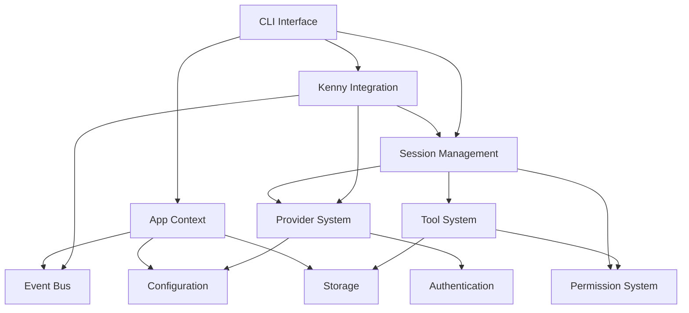

# ASI_Code Development Guide

## Table of Contents

1. [Getting Started](#getting-started)
2. [Development Environment Setup](#development-environment-setup)
3. [Project Structure](#project-structure)
4. [Core Development Concepts](#core-development-concepts)
5. [Building New Features](#building-new-features)
6. [Testing Guidelines](#testing-guidelines)
7. [Debugging and Troubleshooting](#debugging-and-troubleshooting)
8. [Contributing Guidelines](#contributing-guidelines)
9. [Performance Best Practices](#performance-best-practices)
10. [Security Considerations](#security-considerations)

---

## Getting Started

### Prerequisites

- **Bun**: ASI_Code is built with Bun as the primary runtime
- **Node.js**: Version 18+ for compatibility
- **TypeScript**: Version 5.0+
- **Git**: For version control
- **Development Environment**: VS Code recommended with TypeScript extensions

### Quick Start

```bash
# Clone the repository
git clone https://github.com/sst/opencode.git
cd opencode

# Install dependencies
bun install

# Build the project
bun run build

# Run in development mode
bun run dev

# Run tests
bun test
```

### Environment Configuration

Create a `.env` file in the project root:

```bash
# AI Provider API Keys
ASI1_API_KEY=your_asi1_key_here
ANTHROPIC_API_KEY=your_anthropic_key_here
OPENAI_API_KEY=your_openai_key_here

# Development Settings
LOG_LEVEL=debug
NODE_ENV=development

# Optional: Custom configuration paths
OPENCODE_CONFIG_DIR=/custom/config/path
OPENCODE_DATA_DIR=/custom/data/path
```

---

## Development Environment Setup

### 1. IDE Configuration

#### VS Code Setup

Install recommended extensions:

```json
{
  "recommendations": [
    "ms-vscode.vscode-typescript-next",
    "bradlc.vscode-tailwindcss",
    "esbenp.prettier-vscode",
    "dbaeumer.vscode-eslint",
    "ms-vscode.vscode-json"
  ]
}
```

#### Workspace Settings

```json
{
  "typescript.preferences.quoteStyle": "double",
  "typescript.format.semicolons": "remove",
  "editor.formatOnSave": true,
  "editor.codeActionsOnSave": {
    "source.fixAll.eslint": true
  },
  "files.exclude": {
    "node_modules": true,
    "dist": true,
    ".next": true
  }
}
```

### 2. Development Scripts

```json
{
  "scripts": {
    "dev": "bun run packages/opencode/src/cli/bootstrap.ts",
    "build": "bun run build:packages && bun run build:sdks",
    "build:packages": "bun run --cwd packages/opencode build",
    "test": "bun test",
    "test:watch": "bun test --watch",
    "lint": "eslint packages/opencode/src --ext .ts",
    "typecheck": "tsc --noEmit",
    "clean": "rm -rf node_modules dist .next"
  }
}
```

### 3. Debug Configuration

#### VS Code Debug Setup

Create `.vscode/launch.json`:

```json
{
  "version": "0.2.0",
  "configurations": [
    {
      "name": "Debug ASI_Code CLI",
      "type": "node",
      "request": "launch",
      "program": "${workspaceFolder}/packages/opencode/src/cli/bootstrap.ts",
      "args": ["--debug"],
      "console": "integratedTerminal",
      "env": {
        "NODE_ENV": "development",
        "LOG_LEVEL": "debug"
      },
      "skipFiles": ["<node_internals>/**"]
    },
    {
      "name": "Debug Tests",
      "type": "node", 
      "request": "launch",
      "program": "${workspaceFolder}/node_modules/.bin/bun",
      "args": ["test", "${file}"],
      "console": "integratedTerminal"
    }
  ]
}
```

---

## Project Structure

### 1. Repository Layout

```
asi-code/
├── packages/
│   └── opencode/          # Main package
│       ├── src/           # Source code
│       ├── test/          # Test files
│       └── package.json   # Package config
├── sdks/
│   └── vscode/            # VS Code extension
├── cloud/                 # Cloud deployment
│   ├── app/               # Web application
│   ├── core/              # Core services
│   └── function/          # Serverless functions
├── docs/                  # Documentation
├── scripts/               # Build and utility scripts
└── infra/                 # Infrastructure as code
```

### 2. Core Source Structure

```
packages/opencode/src/
├── app/                   # Application context and lifecycle
├── agent/                 # Agent system and configurations
├── auth/                  # Authentication providers
├── bus/                   # Event bus system
├── cli/                   # Command-line interface
├── config/                # Configuration management
├── consciousness/         # Advanced AI consciousness features
├── file/                  # File system operations
├── format/                # Code formatting and linting
├── id/                    # Identifier generation
├── kenny/                 # Kenny Integration Pattern
├── lsp/                   # Language Server Protocol
├── mcp/                   # Model Context Protocol
├── permission/            # Permission and security system
├── provider/              # AI provider abstractions
├── session/               # Session management
├── storage/               # Data persistence
├── tool/                  # Tool system and built-in tools
└── util/                  # Utilities and helpers
```

### 3. Module Dependencies



---

## Core Development Concepts

### 1. Kenny Integration Pattern

All major subsystems in ASI_Code implement the Kenny Integration Pattern:

```typescript
// Example subsystem implementation
export class MySubsystem extends KennyIntegration.BaseSubsystem {
  id = "my-subsystem"
  name = "My Subsystem"
  version = "1.0.0"
  dependencies = ["provider", "session"]  // Optional dependencies
  
  async initialize(): Promise<void> {
    // Subscribe to events from other subsystems
    this.subscribe("session", "created", this.onSessionCreated.bind(this))
    this.subscribe("provider", "model-loaded", this.onModelLoaded.bind(this))
    
    // Initialize subsystem state
    this.setState({
      status: "ready",
      initialized: Date.now()
    })
    
    // Publish initialization complete
    this.publish("initialized", {
      subsystem: this.id,
      timestamp: Date.now()
    })
  }
  
  async shutdown(): Promise<void> {
    // Cleanup resources
    this.setState({ status: "shutdown" })
    this.publish("shutdown", { timestamp: Date.now() })
  }
  
  // Event handlers
  private onSessionCreated(data: any): void {
    this.log.info("New session created", data)
    // Handle session creation
  }
  
  private onModelLoaded(data: any): void {
    this.log.info("Model loaded", data)
    // Handle model loading
  }
  
  // Public API methods
  public async doSomething(params: any): Promise<any> {
    // Implement subsystem functionality
    return { success: true, data: params }
  }
}
```

### 2. Context Management

ASI_Code uses sophisticated context management for async operations:

```typescript
// Using App context
export async function myFunction(): Promise<void> {
  App.provide({ cwd: process.cwd() }, async (app) => {
    // App context is now available
    console.log("Working in:", app.path.cwd)
    
    // Context is automatically propagated to child operations
    await someAsyncOperation()
  })
}

// Accessing context in child operations
export async function someAsyncOperation(): Promise<void> {
  const app = App.use()  // Gets context from async storage
  console.log("Still have access to:", app.path.cwd)
}
```

### 3. Provider Integration

Adding support for new AI providers:

```typescript
export class MyProvider extends AbstractProvider {
  readonly id = "my-provider"
  readonly name = "My AI Provider"
  readonly version = "1.0.0"
  
  async authenticate(credentials: { apiKey: string }): Promise<void> {
    // Implement authentication logic
    this.authenticated = true
  }
  
  languageModel(modelId: string): LanguageModel {
    this.validateModelId(modelId)
    
    return wrapLanguageModel({
      model: modelId,
      provider: this.id,
      
      async doGenerate(params) {
        // Implement generation logic
        return await myProviderGenerate(params)
      },
      
      async doStream(params) {
        // Implement streaming logic
        return await myProviderStream(params)
      }
    })
  }
  
  getCapabilities(): string[] {
    return ["text-generation", "function-calling"]
  }
  
  getModels(): ModelInfo[] {
    return [
      {
        id: "my-model-v1",
        provider: this.id,
        capabilities: ["text-generation"],
        contextWindow: 32000,
        maxOutputTokens: 4096,
        costPer1kTokens: { input: 0.001, output: 0.003 }
      }
    ]
  }
  
  protected getCredentials(): { apiKey: string } | null {
    const apiKey = process.env.MY_PROVIDER_API_KEY
    return apiKey ? { apiKey } : null
  }
  
  protected createModelInstance(modelInfo: ModelInfo): any {
    return {
      id: modelInfo.id,
      contextWindow: modelInfo.contextWindow,
      capabilities: modelInfo.capabilities
    }
  }
}
```

### 4. Tool Development

Creating custom tools for ASI_Code:

```typescript
export class MyCustomTool extends AbstractTool {
  readonly id = "my-tool"
  readonly name = "My Custom Tool"
  readonly description = "A custom tool that does something useful"
  
  readonly parameters = {
    type: "object",
    properties: {
      input: {
        type: "string",
        description: "Input parameter"
      },
      options: {
        type: "object",
        properties: {
          flag: { type: "boolean", default: false }
        }
      }
    },
    required: ["input"],
    additionalProperties: false
  }
  
  protected async executeImpl(params: any, context: ToolContext): Promise<any> {
    const { input, options = {} } = params
    
    // Validate permissions
    if (!this.hasPermission(context, "my-tool")) {
      throw new Error("Permission denied")
    }
    
    // Log execution
    this.log.info("Executing my tool", {
      input,
      options,
      sessionId: context.sessionId
    })
    
    // Implement tool logic
    const result = await this.performOperation(input, options)
    
    // Return result
    return {
      success: true,
      result,
      metadata: {
        processedAt: Date.now(),
        inputLength: input.length
      }
    }
  }
  
  private async performOperation(input: string, options: any): Promise<any> {
    // Implement your tool's core functionality
    return { processed: input, options }
  }
  
  private hasPermission(context: ToolContext, tool: string): boolean {
    // Implement permission checking logic
    return context.permissions?.tools?.[tool] !== false
  }
  
  // Optional: Custom caching
  getCacheKey(params: any): string {
    return `my-tool:${JSON.stringify(params)}`
  }
}

// Register the tool
ToolRegistry.register(MyCustomTool)
```

---

## Building New Features

### 1. Feature Development Workflow

1. **Planning Phase**
   - Define requirements and scope
   - Design architecture and integration points
   - Create technical specification
   - Plan testing approach

2. **Implementation Phase**
   - Create feature branch: `git checkout -b feature/my-feature`
   - Implement core functionality
   - Add comprehensive tests
   - Update documentation

3. **Integration Phase**
   - Test integration with existing systems
   - Ensure Kenny Pattern compliance
   - Validate performance impact
   - Review security implications

4. **Review and Merge**
   - Create pull request
   - Code review by maintainers
   - Address feedback and iterate
   - Merge to main branch

### 2. Feature Structure Template

```typescript
// Feature directory structure
features/
└── my-feature/
    ├── index.ts           # Main feature export
    ├── types.ts           # TypeScript types
    ├── implementation.ts  # Core implementation
    ├── integration.ts     # Kenny Integration
    ├── tests/
    │   ├── unit.test.ts   # Unit tests
    │   └── integration.test.ts  # Integration tests
    └── docs/
        └── README.md      # Feature documentation

// Example feature implementation
export namespace MyFeature {
  export interface Config {
    enabled: boolean
    options: Record<string, any>
  }
  
  export class FeatureSubsystem extends KennyIntegration.BaseSubsystem {
    id = "my-feature"
    name = "My Feature"
    version = "1.0.0"
    
    constructor(private config: Config) {
      super()
    }
    
    async initialize(): Promise<void> {
      if (!this.config.enabled) {
        return
      }
      
      // Initialize feature
      await this.setupFeature()
      
      // Register with other subsystems
      this.subscribe("session", "created", this.onSessionCreated.bind(this))
      
      this.setState({ status: "ready" })
      this.publish("initialized", { feature: this.id })
    }
    
    async shutdown(): Promise<void> {
      await this.cleanupFeature()
      this.setState({ status: "shutdown" })
    }
    
    private async setupFeature(): Promise<void> {
      // Feature-specific initialization
    }
    
    private async cleanupFeature(): Promise<void> {
      // Feature-specific cleanup
    }
    
    private onSessionCreated(data: any): void {
      // Handle session creation for this feature
    }
  }
  
  export async function create(config: Config): Promise<FeatureSubsystem> {
    const feature = new FeatureSubsystem(config)
    
    // Register with Kenny Integration
    const kenny = KennyIntegration.getInstance()
    await kenny.register(feature)
    
    return feature
  }
}
```

### 3. Configuration Integration

Add feature configuration to the main config schema:

```typescript
// In config/config.ts
export namespace Config {
  export const Schema = z.object({
    // ... existing config
    myFeature: z.object({
      enabled: z.boolean().default(false),
      options: z.record(z.any()).default({})
    }).optional()
  })
}

// Load and use configuration
const config = await Config.get()
if (config.myFeature?.enabled) {
  const feature = await MyFeature.create(config.myFeature)
}
```

---

## Testing Guidelines

### 1. Testing Strategy

ASI_Code uses a comprehensive testing approach:

- **Unit Tests**: Test individual functions and classes
- **Integration Tests**: Test subsystem interactions
- **E2E Tests**: Test complete workflows
- **Performance Tests**: Test system performance
- **Security Tests**: Test security controls

### 2. Unit Testing

```typescript
// tests/unit/my-feature.test.ts
import { describe, test, expect, beforeEach, afterEach } from 'bun:test'
import { MyFeature } from '../../../src/features/my-feature'

describe('MyFeature', () => {
  let feature: MyFeature.FeatureSubsystem
  
  beforeEach(async () => {
    feature = new MyFeature.FeatureSubsystem({
      enabled: true,
      options: {}
    })
  })
  
  afterEach(async () => {
    await feature.shutdown()
  })
  
  test('should initialize correctly', async () => {
    await feature.initialize()
    
    const state = feature.getState(feature.id)
    expect(state.status).toBe('ready')
  })
  
  test('should handle session events', async () => {
    await feature.initialize()
    
    const mockSessionData = { sessionId: 'test-session' }
    
    // Trigger event
    feature.publish('session:created', mockSessionData)
    
    // Assert behavior
    // Add your assertions here
  })
})
```

### 3. Integration Testing

```typescript
// tests/integration/kenny-integration.test.ts
import { describe, test, expect, beforeAll, afterAll } from 'bun:test'
import { KennyIntegration } from '../../src/kenny/integration'
import { MyFeature } from '../../src/features/my-feature'

describe('Kenny Integration', () => {
  let kenny: KennyIntegration.Integration
  
  beforeAll(async () => {
    kenny = new KennyIntegration.Integration()
  })
  
  afterAll(async () => {
    await kenny.shutdown()
  })
  
  test('should register and initialize subsystems', async () => {
    const feature = new MyFeature.FeatureSubsystem({
      enabled: true,
      options: {}
    })
    
    await kenny.register(feature)
    await kenny.initialize()
    
    const registeredSubsystem = kenny.getSubsystem('my-feature')
    expect(registeredSubsystem).toBeDefined()
    expect(registeredSubsystem?.id).toBe('my-feature')
  })
  
  test('should handle cross-subsystem communication', async () => {
    // Test message bus communication
    let receivedMessage: any = null
    
    const subscriber = kenny.bus.subscribe('test:message', (data) => {
      receivedMessage = data
    })
    
    kenny.bus.publish('test:message', { test: 'data' })
    
    // Wait for async processing
    await new Promise(resolve => setTimeout(resolve, 10))
    
    expect(receivedMessage).toEqual({ test: 'data' })
    
    // Cleanup
    subscriber()
  })
})
```

### 4. E2E Testing

```typescript
// tests/e2e/session-workflow.test.ts
import { describe, test, expect } from 'bun:test'
import { App } from '../../src/app/app'
import { SessionManager } from '../../src/session'
import { TestHelper } from '../helpers/test-helper'

describe('Session Workflow E2E', () => {
  test('complete chat session workflow', async () => {
    await App.provide({ cwd: process.cwd() }, async () => {
      // Create session
      const sessionManager = new SessionManager()
      const session = await sessionManager.create({
        providerID: 'test-provider',
        modelID: 'test-model',
        agent: TestHelper.createTestAgent()
      })
      
      expect(session.info.id).toBeDefined()
      
      // Send chat message
      const response = await session.chat({
        content: 'Hello, test!'
      })
      
      expect(response).toBeDefined()
      expect(response.success).toBe(true)
      
      // Verify message was stored
      const history = await session.getHistory()
      expect(history.length).toBeGreaterThan(0)
      
      // Clean up
      await sessionManager.delete(session.info.id)
    })
  })
})
```

### 5. Performance Testing

```typescript
// tests/performance/provider-benchmark.test.ts
import { describe, test, expect } from 'bun:test'
import { performance } from 'perf_hooks'

describe('Provider Performance', () => {
  test('model loading performance', async () => {
    const startTime = performance.now()
    
    // Load multiple models
    const providers = ['asi1', 'anthropic', 'openai']
    const loadPromises = providers.map(async (providerId) => {
      const provider = await ProviderManager.getProvider(providerId)
      return provider.languageModel('default-model')
    })
    
    await Promise.all(loadPromises)
    
    const endTime = performance.now()
    const duration = endTime - startTime
    
    // Assert reasonable performance (adjust threshold as needed)
    expect(duration).toBeLessThan(1000) // 1 second max
  })
})
```

---

## Debugging and Troubleshooting

### 1. Logging and Debugging

ASI_Code includes comprehensive logging:

```typescript
import { Log } from '../util/log'

export class MyClass {
  private log = Log.create({ service: 'my-service' })
  
  async doSomething(): Promise<void> {
    this.log.info('Starting operation', { param: 'value' })
    
    try {
      // Operation logic
      this.log.debug('Debug information', { details: 'here' })
      
    } catch (error) {
      this.log.error('Operation failed', error)
      throw error
    }
    
    this.log.info('Operation completed successfully')
  }
}
```

### 2. Debug Configuration

Set environment variables for debugging:

```bash
# Enable debug logging
export LOG_LEVEL=debug

# Enable specific service debugging
export DEBUG=kenny-integration,session-manager,provider

# Enable Node.js debugging
export NODE_OPTIONS="--inspect-brk=9229"
```

### 3. Common Issues and Solutions

#### Kenny Integration Issues

```typescript
// Problem: Subsystem not initializing
// Solution: Check dependencies and initialization order

export class MySubsystem extends KennyIntegration.BaseSubsystem {
  dependencies = ["provider", "session"] // Ensure deps are correct
  
  async initialize(): Promise<void> {
    // Verify dependencies are available
    const provider = this.integration.getSubsystem("provider")
    if (!provider) {
      throw new Error("Provider subsystem not available")
    }
    
    // Continue initialization...
  }
}
```

#### Context Issues

```typescript
// Problem: Context not found errors
// Solution: Ensure proper context propagation

// ❌ Bad: Context not propagated
async function badExample(): Promise<void> {
  // This will fail because no context is available
  const app = App.use()
}

// ✅ Good: Proper context usage
async function goodExample(): Promise<void> {
  await App.provide({ cwd: process.cwd() }, async () => {
    const app = App.use() // Context is available here
    // Do work with context
  })
}
```

#### Provider Issues

```typescript
// Problem: Provider authentication failures
// Solution: Check API keys and provider configuration

// Debug provider issues
const provider = await ProviderManager.getProvider('asi1')
if (!provider.isAuthenticated()) {
  console.error('Provider not authenticated. Check API keys.')
}

// Check model availability
try {
  const model = provider.languageModel('asi1-mini')
} catch (error) {
  console.error('Model not available:', error.message)
}
```

### 4. Development Tools

#### Log Analysis

```bash
# Filter logs by service
bun run dev 2>&1 | grep "service=kenny-integration"

# Watch log files
tail -f ~/.local/share/opencode/log/dev.log

# Search for errors
grep "ERROR" ~/.local/share/opencode/log/dev.log
```

#### Performance Profiling

```typescript
import { performance, PerformanceObserver } from 'perf_hooks'

// Create performance observer
const obs = new PerformanceObserver((list) => {
  list.getEntries().forEach((entry) => {
    console.log(`${entry.name}: ${entry.duration}ms`)
  })
})
obs.observe({ entryTypes: ['measure'] })

// Measure performance
performance.mark('operation-start')
await performOperation()
performance.mark('operation-end')
performance.measure('operation', 'operation-start', 'operation-end')
```

---

## Contributing Guidelines

### 1. Code Style

ASI_Code follows strict code style guidelines:

```typescript
// ✅ Good: Clear, descriptive names
export class SessionManager {
  async createSession(config: SessionConfig): Promise<Session> {
    // Implementation
  }
}

// ❌ Bad: Unclear, abbreviated names
export class SessMgr {
  async create(cfg: any): Promise<any> {
    // Implementation
  }
}

// ✅ Good: Proper error handling
try {
  const result = await riskyOperation()
  return result
} catch (error) {
  this.log.error('Operation failed', error)
  throw new SpecificError('Operation failed', { cause: error })
}

// ❌ Bad: Silent failures
try {
  const result = await riskyOperation()
  return result
} catch {
  return null // Silent failure
}
```

### 2. Documentation Requirements

All public APIs must be documented:

```typescript
/**
 * Creates a new session with the specified configuration.
 * 
 * @param config - Session configuration including provider, model, and agent settings
 * @returns Promise that resolves to the created session
 * @throws {ConfigurationError} When required configuration is missing
 * @throws {ProviderError} When the specified provider is not available
 * 
 * @example
 * ```typescript
 * const session = await sessionManager.create({
 *   providerID: 'asi1',
 *   modelID: 'asi1-mini',
 *   agent: defaultAgent
 * })
 * ```
 */
export async function createSession(config: SessionConfig): Promise<Session> {
  // Implementation
}
```

### 3. Pull Request Process

1. **Create Feature Branch**
   ```bash
   git checkout -b feature/my-feature
   git checkout -b fix/issue-123
   git checkout -b docs/update-readme
   ```

2. **Development**
   - Write code following style guidelines
   - Add comprehensive tests
   - Update documentation
   - Run lint and typecheck

3. **Pre-submission Checks**
   ```bash
   # Run tests
   bun test
   
   # Check linting
   bun run lint
   
   # Check types
   bun run typecheck
   
   # Build project
   bun run build
   ```

4. **Create Pull Request**
   - Use descriptive title and description
   - Reference related issues
   - Include testing instructions
   - Add screenshots for UI changes

### 4. Commit Message Format

```bash
# Format: type(scope): description
feat(kenny): add new subsystem registration API
fix(session): resolve memory leak in message storage
docs(readme): update installation instructions
test(provider): add integration tests for ASI1
refactor(tools): simplify tool execution pipeline
```

---

## Performance Best Practices

### 1. Memory Management

```typescript
// ✅ Good: Proper cleanup
export class ResourceManager {
  private resources = new Map<string, Resource>()
  
  async cleanup(): Promise<void> {
    for (const [id, resource] of this.resources.entries()) {
      await resource.dispose()
      this.resources.delete(id)
    }
  }
}

// ✅ Good: Weak references for caches
export class Cache {
  private cache = new WeakMap<object, any>()
  
  get(key: object): any {
    return this.cache.get(key)
  }
  
  set(key: object, value: any): void {
    this.cache.set(key, value)
  }
}
```

### 2. Async Operations

```typescript
// ✅ Good: Parallel execution when possible
const results = await Promise.all([
  operation1(),
  operation2(),
  operation3()
])

// ✅ Good: Use async iterators for large datasets
async function* processLargeDataset(data: any[]): AsyncIterableIterator<any> {
  for (const item of data) {
    yield await processItem(item)
  }
}

// ❌ Bad: Sequential execution when parallel is possible
const result1 = await operation1()
const result2 = await operation2()
const result3 = await operation3()
```

### 3. Caching Strategies

```typescript
// ✅ Good: LRU cache with size limits
export class LRUCache<K, V> {
  private cache = new Map<K, V>()
  private maxSize: number
  
  constructor(maxSize: number) {
    this.maxSize = maxSize
  }
  
  get(key: K): V | undefined {
    const value = this.cache.get(key)
    if (value !== undefined) {
      // Move to end (most recently used)
      this.cache.delete(key)
      this.cache.set(key, value)
    }
    return value
  }
  
  set(key: K, value: V): void {
    if (this.cache.has(key)) {
      this.cache.delete(key)
    } else if (this.cache.size >= this.maxSize) {
      // Remove least recently used
      const firstKey = this.cache.keys().next().value
      this.cache.delete(firstKey)
    }
    this.cache.set(key, value)
  }
}
```

### 4. Database Optimization

```typescript
// ✅ Good: Batch operations
export class BatchWriter {
  private batch: any[] = []
  private readonly batchSize = 100
  
  async add(item: any): Promise<void> {
    this.batch.push(item)
    
    if (this.batch.length >= this.batchSize) {
      await this.flush()
    }
  }
  
  async flush(): Promise<void> {
    if (this.batch.length === 0) return
    
    await this.storage.writeBatch(this.batch)
    this.batch = []
  }
}
```

---

## Security Considerations

### 1. Input Validation

```typescript
// ✅ Good: Comprehensive input validation
export function validateUserInput(input: any): UserInput {
  const schema = z.object({
    content: z.string().min(1).max(10000),
    sessionId: z.string().uuid(),
    metadata: z.record(z.any()).optional()
  })
  
  return schema.parse(input)
}

// ✅ Good: Sanitize file paths
export function sanitizePath(userPath: string): string {
  const normalized = path.normalize(userPath)
  
  // Prevent directory traversal
  if (normalized.includes('..')) {
    throw new Error('Invalid path: directory traversal detected')
  }
  
  // Ensure absolute path
  if (!path.isAbsolute(normalized)) {
    throw new Error('Invalid path: must be absolute')
  }
  
  return normalized
}
```

### 2. Permission System

```typescript
// ✅ Good: Granular permissions
export class PermissionChecker {
  async checkPermission(
    user: User,
    action: string,
    resource: string
  ): Promise<boolean> {
    
    // Check user-level permissions
    if (!user.permissions.includes(action)) {
      return false
    }
    
    // Check resource-level permissions
    if (!this.hasResourceAccess(user, resource)) {
      return false
    }
    
    // Check contextual permissions
    return this.checkContextualPermissions(user, action, resource)
  }
  
  private hasResourceAccess(user: User, resource: string): boolean {
    // Implement resource-specific access control
    return true
  }
  
  private checkContextualPermissions(
    user: User, 
    action: string, 
    resource: string
  ): boolean {
    // Implement context-aware permissions
    return true
  }
}
```

### 3. Secure Configuration

```typescript
// ✅ Good: Secure credential handling
export class CredentialManager {
  private credentials = new Map<string, string>()
  
  setCredential(key: string, value: string): void {
    // Never log credentials
    Log.info('Setting credential', { key: key.substring(0, 3) + '***' })
    
    // Store securely (encrypt in production)
    this.credentials.set(key, value)
  }
  
  getCredential(key: string): string | null {
    return this.credentials.get(key) || null
  }
  
  // Clear credentials on shutdown
  clear(): void {
    this.credentials.clear()
  }
}

// ❌ Bad: Logging sensitive data
Log.info('API key:', apiKey) // Never do this!
```

This comprehensive development guide provides everything needed to contribute effectively to ASI_Code while maintaining the project's high standards for code quality, performance, and security.