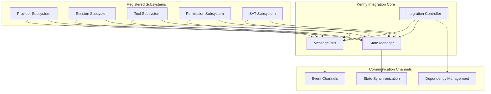
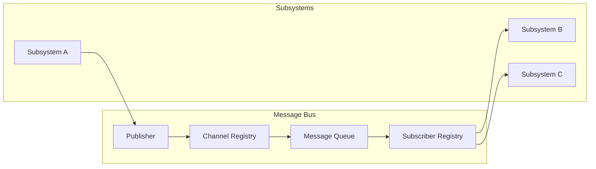
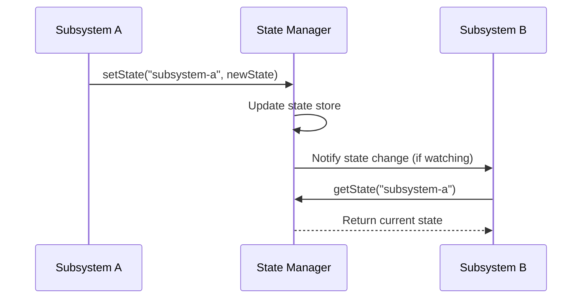
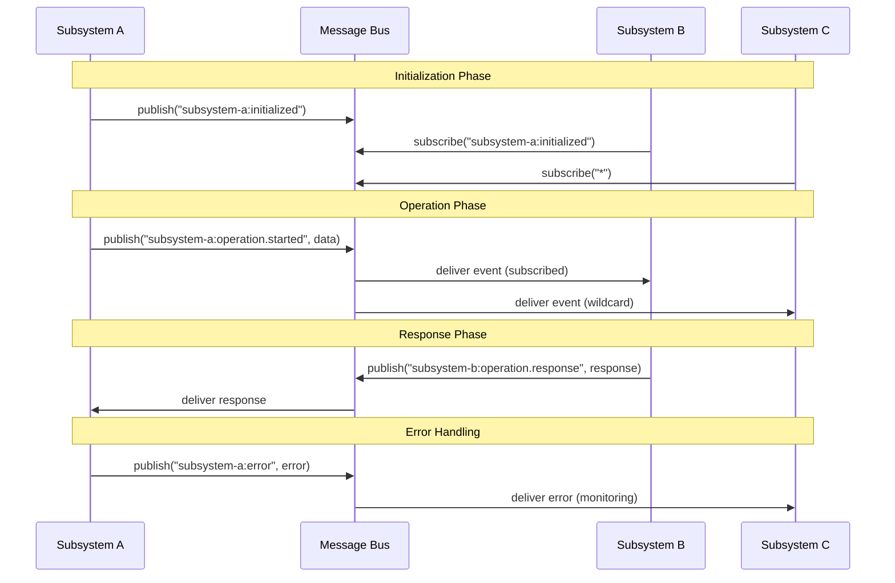
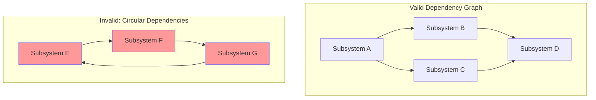

# Kenny Integration Pattern Documentation

## Table of Contents

1. [Pattern Overview and Philosophy](#pattern-overview-and-philosophy)
2. [Core Concepts](#core-concepts)
3. [Implementation Guide](#implementation-guide)
4. [Best Practices for Creating Subsystems](#best-practices-for-creating-subsystems)
5. [Event Patterns and Communication Protocols](#event-patterns-and-communication-protocols)
6. [Dependency Management](#dependency-management)
7. [Real-world Examples from ASI_Code](#real-world-examples-from-asi_code)
8. [Advanced Integration Patterns](#advanced-integration-patterns)

---

## Pattern Overview and Philosophy

The **Kenny Integration Pattern** is ASI_Code's signature architectural framework that provides unified subsystem communication and coordination. Named after its innovative approach to system integration, it serves as the backbone for all inter-component communication in the ASI_Code ecosystem.

### Core Philosophy

The Kenny Pattern embodies these fundamental principles:

1. **Unified Communication**: All subsystems communicate through a common message bus interface
2. **Decoupled Architecture**: Subsystems remain independent while participating in the larger ecosystem
3. **Event-Driven Design**: Communication flows through events rather than direct method calls
4. **State Coordination**: Centralized state management with distributed access
5. **Dependency Resolution**: Automatic handling of subsystem dependencies and initialization order

### Architecture Overview



### Why Kenny Pattern?

The Kenny Pattern solves several critical architectural challenges:

- **Scalability**: New subsystems can be added without modifying existing code
- **Maintainability**: Clear separation of concerns with well-defined interfaces
- **Testability**: Subsystems can be tested in isolation
- **Flexibility**: Runtime composition and configuration of system behavior
- **Resilience**: Graceful handling of subsystem failures and restarts

---

## Core Concepts

### 1. Message Bus

The Message Bus is the central nervous system of the Kenny Pattern, facilitating all inter-subsystem communication.

#### Key Features

- **Channel-based Communication**: Messages are published to named channels
- **Late Subscriber Support**: Messages are queued for late-arriving subscribers
- **Wildcard Subscriptions**: Subscribe to multiple channels with pattern matching
- **Type Safety**: Full TypeScript support for message types

#### Architecture



#### Implementation Details

```typescript
export class MessageBus extends EventEmitter {
  private subscribers = new Map<string, Set<(data: any) => void>>()
  private messageQueue = new Map<string, any[]>()

  /**
   * Publish a message to a channel
   */
  publish(channel: string, data: any) {
    // Queue message for late subscribers
    if (!this.messageQueue.has(channel)) {
      this.messageQueue.set(channel, [])
    }
    this.messageQueue.get(channel)!.push(data)
    
    // Emit to current subscribers
    this.emit(channel, data)
    
    // Call direct subscribers
    const subs = this.subscribers.get(channel)
    if (subs) {
      for (const callback of subs) {
        callback(data)
      }
    }
  }

  /**
   * Subscribe to a channel
   */
  subscribe(channel: string, callback: (data: any) => void) {
    if (!this.subscribers.has(channel)) {
      this.subscribers.set(channel, new Set())
    }
    this.subscribers.get(channel)!.add(callback)
    
    // Replay queued messages
    const queued = this.messageQueue.get(channel)
    if (queued) {
      for (const data of queued) {
        callback(data)
      }
    }
    
    return () => {
      this.subscribers.get(channel)?.delete(callback)
    }
  }
}
```

### 2. State Manager

The State Manager provides centralized state coordination while maintaining subsystem autonomy.

#### Key Features

- **Subsystem State Isolation**: Each subsystem manages its own state
- **Cross-Subsystem Access**: Read access to other subsystem states
- **State Change Notifications**: Watch for changes in any subsystem's state
- **Immutable State Updates**: State changes are atomic and traceable

#### State Flow



#### Implementation Details

```typescript
export class StateManager {
  private states = new Map<string, any>()
  private stateListeners = new Map<string, Set<(state: any) => void>>()

  /**
   * Set state for a subsystem
   */
  setState(subsystem: string, state: any) {
    this.states.set(subsystem, state)
    
    const listeners = this.stateListeners.get(subsystem)
    if (listeners) {
      for (const listener of listeners) {
        listener(state)
      }
    }
  }

  /**
   * Watch state changes for a subsystem
   */
  watchState(subsystem: string, callback: (state: any) => void) {
    if (!this.stateListeners.has(subsystem)) {
      this.stateListeners.set(subsystem, new Set())
    }
    this.stateListeners.get(subsystem)!.add(callback)
    
    // Send current state if exists
    const currentState = this.states.get(subsystem)
    if (currentState !== undefined) {
      callback(currentState)
    }
    
    return () => {
      this.stateListeners.get(subsystem)?.delete(callback)
    }
  }
}
```

### 3. Subsystem Interface

All Kenny Pattern subsystems implement a standardized interface ensuring consistent behavior and lifecycle management.

#### Core Interface

```typescript
export interface Subsystem {
  id: string                        // Unique identifier
  name: string                      // Human-readable name
  version: string                   // Semantic version
  dependencies?: string[]           // Required subsystem dependencies
  
  initialize(): Promise<void>       // Startup logic
  connect(integration: Integration): void  // Connect to Kenny Integration
  shutdown(): Promise<void>         // Cleanup logic
}
```

#### Base Subsystem Implementation

```typescript
export abstract class BaseSubsystem implements Subsystem {
  abstract id: string
  abstract name: string
  abstract version: string
  dependencies?: string[]
  
  protected integration!: Integration
  protected log: ReturnType<typeof Log.create>

  constructor() {
    this.log = Log.create({ service: this.id })
  }

  connect(integration: Integration): void {
    this.integration = integration
    this.log.info("connected to Kenny Integration")
  }

  abstract initialize(): Promise<void>
  abstract shutdown(): Promise<void>

  // Helper methods for subsystem communication
  protected publish(channel: string, data: any) {
    this.integration.bus.publish(`${this.id}:${channel}`, data)
  }

  protected subscribe(subsystemId: string, channel: string, callback: (data: any) => void) {
    return this.integration.bus.subscribe(`${subsystemId}:${channel}`, callback)
  }

  protected setState(state: any) {
    this.integration.state.setState(this.id, state)
  }

  protected getState(subsystemId: string) {
    return this.integration.state.getState(subsystemId)
  }

  protected watchState(subsystemId: string, callback: (state: any) => void) {
    return this.integration.state.watchState(subsystemId, callback)
  }
}
```

---

## Implementation Guide

### Step 1: Create Your Subsystem

Start by extending the `BaseSubsystem` class and implementing the required abstract methods.

```typescript
import { KennyIntegration } from "../kenny/integration"

export class MyCustomSubsystem extends KennyIntegration.BaseSubsystem {
  id = "my-custom-subsystem"
  name = "My Custom Subsystem"
  version = "1.0.0"
  dependencies = ["provider", "session"] // Optional dependencies

  async initialize() {
    this.log.info("Initializing My Custom Subsystem")
    
    // Subscribe to events from other subsystems
    this.subscribe("session", "created", this.onSessionCreated.bind(this))
    this.subscribe("provider", "model-loaded", this.onModelLoaded.bind(this))
    
    // Initialize your subsystem's state
    this.setState({
      status: "ready",
      processedRequests: 0
    })
    
    // Publish initialization complete
    this.publish("initialized", { 
      timestamp: Date.now(),
      capabilities: ["feature-a", "feature-b"]
    })
  }

  async shutdown() {
    this.log.info("Shutting down My Custom Subsystem")
    
    // Cleanup resources
    this.setState({ status: "shutdown" })
    this.publish("shutdown", { timestamp: Date.now() })
  }

  // Event handlers
  private onSessionCreated(data: any) {
    this.log.info("New session created", data)
    // Handle session creation
  }

  private onModelLoaded(data: any) {
    this.log.info("Model loaded", data)
    // Handle model loading
  }

  // Public API methods
  public async processRequest(request: any) {
    const currentState = this.getState(this.id) as any
    
    // Update state
    this.setState({
      ...currentState,
      processedRequests: currentState.processedRequests + 1
    })
    
    // Publish processing event
    this.publish("request-processed", { request, timestamp: Date.now() })
    
    return { success: true, processed: true }
  }
}
```

### Step 2: Register Your Subsystem

Register your subsystem with the Kenny Integration system.

```typescript
// Get the global Kenny Integration instance
const kenny = KennyIntegration.getInstance()

// Create and register your subsystem
const mySubsystem = new MyCustomSubsystem()
await kenny.register(mySubsystem)

// Initialize all subsystems (if not already done)
await kenny.initialize()
```

### Step 3: Inter-Subsystem Communication

Use the message bus for communication between subsystems.

```typescript
// In your subsystem
export class ExampleSubsystem extends KennyIntegration.BaseSubsystem {
  async initialize() {
    // Subscribe to events from other subsystems
    this.subscribe("my-custom-subsystem", "request-processed", (data) => {
      console.log("Request processed:", data)
    })
    
    // Watch state changes in other subsystems
    this.watchState("session", (sessionState) => {
      console.log("Session state changed:", sessionState)
    })
  }
  
  async doSomething() {
    // Publish events to other subsystems
    this.publish("action-performed", {
      action: "something",
      timestamp: Date.now()
    })
    
    // Get state from other subsystems
    const customSubsystemState = this.getState("my-custom-subsystem")
    console.log("Custom subsystem state:", customSubsystemState)
  }
}
```

### Step 4: Advanced Integration with App Context

Integrate your subsystem with ASI_Code's App context for proper lifecycle management.

```typescript
import { App } from "../app/app"

// Register your subsystem as an App service
const subsystemState = App.state("my-custom-subsystem", async () => {
  const kenny = KennyIntegration.getInstance()
  const subsystem = new MyCustomSubsystem()
  
  await kenny.register(subsystem)
  await kenny.initialize()
  
  return subsystem
})

// Use within App context
App.provide({ cwd: process.cwd() }, async (app) => {
  const mySubsystem = await subsystemState()
  
  // Your application logic here
  await mySubsystem.processRequest({ data: "example" })
})
```

---

## Best Practices for Creating Subsystems

### 1. Naming Conventions

- **Subsystem IDs**: Use kebab-case (e.g., `software-architecture-taskforce`)
- **Channel Names**: Use descriptive names (e.g., `session-created`, `model-loaded`)
- **State Keys**: Use consistent naming across subsystems

### 2. Error Handling

```typescript
export class RobustSubsystem extends KennyIntegration.BaseSubsystem {
  async initialize() {
    try {
      // Initialization logic
      await this.setupResources()
      
      this.publish("initialized", { status: "success" })
    } catch (error) {
      this.log.error("Initialization failed", error)
      this.publish("initialization-failed", { error: error.message })
      throw error
    }
  }
  
  private async setupResources() {
    // Resource setup with error handling
    this.subscribe("external-service", "data", (data) => {
      try {
        this.processData(data)
      } catch (error) {
        this.log.error("Data processing failed", error)
        this.publish("processing-error", { error: error.message, data })
      }
    })
  }
}
```

### 3. State Management Best Practices

```typescript
export class StatefulSubsystem extends KennyIntegration.BaseSubsystem {
  private initializeState() {
    // Initialize with a clear state structure
    this.setState({
      status: "initializing",
      metrics: {
        requestCount: 0,
        errorCount: 0,
        lastActivity: Date.now()
      },
      configuration: {
        enabled: true,
        debug: false
      }
    })
  }
  
  private updateMetrics(update: Partial<any>) {
    const currentState = this.getState(this.id) as any
    
    this.setState({
      ...currentState,
      metrics: {
        ...currentState.metrics,
        ...update,
        lastActivity: Date.now()
      }
    })
  }
}
```

### 4. Dependency Management

```typescript
export class DependentSubsystem extends KennyIntegration.BaseSubsystem {
  id = "dependent-subsystem"
  name = "Dependent Subsystem"
  version = "1.0.0"
  dependencies = ["provider", "session", "tool-registry"] // Declare dependencies
  
  async initialize() {
    // Wait for dependencies to be ready
    await this.waitForDependencies()
    
    // Initialize dependent functionality
    await this.setupDependentFeatures()
  }
  
  private async waitForDependencies() {
    for (const dep of this.dependencies || []) {
      const depSubsystem = this.integration.getSubsystem(dep)
      if (!depSubsystem) {
        throw new Error(`Dependency ${dep} not found`)
      }
      
      // Wait for dependency to be ready
      this.watchState(dep, (state) => {
        if (state?.status === "ready") {
          this.log.info(`Dependency ${dep} is ready`)
        }
      })
    }
  }
}
```

### 5. Testing Subsystems

```typescript
// Test helper for Kenny Pattern subsystems
export class TestKennyIntegration {
  static async createTestEnvironment() {
    const kenny = new KennyIntegration.Integration()
    
    // Mock dependencies
    const mockProvider = new MockProviderSubsystem()
    const mockSession = new MockSessionSubsystem()
    
    await kenny.register(mockProvider)
    await kenny.register(mockSession)
    await kenny.initialize()
    
    return kenny
  }
}

// Example test
describe("MyCustomSubsystem", () => {
  let kenny: KennyIntegration.Integration
  let subsystem: MyCustomSubsystem
  
  beforeEach(async () => {
    kenny = await TestKennyIntegration.createTestEnvironment()
    subsystem = new MyCustomSubsystem()
    
    await kenny.register(subsystem)
  })
  
  test("should initialize correctly", async () => {
    const state = subsystem.getState(subsystem.id)
    expect(state.status).toBe("ready")
  })
  
  test("should handle events correctly", async () => {
    const eventHandler = jest.fn()
    kenny.bus.subscribe("my-custom-subsystem:request-processed", eventHandler)
    
    await subsystem.processRequest({ test: "data" })
    
    expect(eventHandler).toHaveBeenCalledWith(
      expect.objectContaining({ request: { test: "data" } })
    )
  })
})
```

---

## Event Patterns and Communication Protocols

### Standard Event Naming Convention

The Kenny Pattern uses a hierarchical event naming scheme:

```
{subsystem-id}:{event-category}[.{event-type}]
```

Examples:
- `session:created` - Session subsystem created a new session
- `provider:model.loaded` - Provider subsystem loaded a new model
- `tool:execution.started` - Tool subsystem started executing a tool
- `sat:analysis.completed` - SAT subsystem completed architecture analysis

### Core Event Categories

#### 1. Lifecycle Events

```typescript
// Subsystem lifecycle
this.publish("initialized", { timestamp: Date.now(), version: this.version })
this.publish("shutdown", { timestamp: Date.now(), reason: "normal" })
this.publish("error", { error: error.message, severity: "high" })

// Resource lifecycle  
this.publish("resource.created", { resourceId, type, metadata })
this.publish("resource.updated", { resourceId, changes })
this.publish("resource.destroyed", { resourceId, timestamp })
```

#### 2. Operation Events

```typescript
// Operation tracking
this.publish("operation.started", { operationId, type, parameters })
this.publish("operation.progress", { operationId, progress: 0.5, status })
this.publish("operation.completed", { operationId, result, duration })
this.publish("operation.failed", { operationId, error, context })
```

#### 3. State Change Events

```typescript
// State synchronization
this.publish("state.changed", { 
  subsystem: this.id, 
  changes: { field: "newValue" },
  timestamp: Date.now()
})

this.publish("configuration.updated", {
  changes: { setting: "newValue" },
  source: "user",
  timestamp: Date.now()
})
```

### Communication Patterns

#### 1. Request-Response Pattern

```typescript
// Requestor subsystem
export class RequesterSubsystem extends KennyIntegration.BaseSubsystem {
  async makeRequest(data: any): Promise<any> {
    const requestId = crypto.randomUUID()
    
    return new Promise((resolve, reject) => {
      // Set up response handler
      const unsubscribe = this.subscribe("responder", "response", (response) => {
        if (response.requestId === requestId) {
          unsubscribe()
          if (response.success) {
            resolve(response.data)
          } else {
            reject(new Error(response.error))
          }
        }
      })
      
      // Send request
      this.publish("request", { requestId, data, timestamp: Date.now() })
      
      // Timeout handling
      setTimeout(() => {
        unsubscribe()
        reject(new Error("Request timeout"))
      }, 10000)
    })
  }
}

// Responder subsystem
export class ResponderSubsystem extends KennyIntegration.BaseSubsystem {
  async initialize() {
    this.subscribe("requester", "request", this.handleRequest.bind(this))
  }
  
  private async handleRequest(request: any) {
    try {
      const result = await this.processRequest(request.data)
      
      this.publish("response", {
        requestId: request.requestId,
        success: true,
        data: result,
        timestamp: Date.now()
      })
    } catch (error) {
      this.publish("response", {
        requestId: request.requestId,
        success: false,
        error: error.message,
        timestamp: Date.now()
      })
    }
  }
}
```

#### 2. Publisher-Subscriber Pattern

```typescript
// Data stream publisher
export class DataPublisher extends KennyIntegration.BaseSubsystem {
  private publishDataStream(data: any) {
    // Publish to specific data type channel
    this.publish(`data.${data.type}`, {
      payload: data.payload,
      timestamp: Date.now(),
      source: this.id
    })
    
    // Also publish to general data channel
    this.publish("data", {
      type: data.type,
      payload: data.payload,
      timestamp: Date.now(),
      source: this.id
    })
  }
}

// Data stream subscriber
export class DataSubscriber extends KennyIntegration.BaseSubsystem {
  async initialize() {
    // Subscribe to specific data types
    this.subscribe("data-publisher", "data.metrics", this.handleMetrics.bind(this))
    this.subscribe("data-publisher", "data.logs", this.handleLogs.bind(this))
    
    // Subscribe to all data
    this.subscribe("data-publisher", "data", this.handleAllData.bind(this))
  }
}
```

#### 3. Event Sourcing Pattern

```typescript
export class EventSourcingSubsystem extends KennyIntegration.BaseSubsystem {
  private eventStore: Array<{ event: string, data: any, timestamp: number }> = []
  
  private storeEvent(eventType: string, data: any) {
    const event = {
      event: eventType,
      data,
      timestamp: Date.now()
    }
    
    this.eventStore.push(event)
    this.publish(`event.${eventType}`, data)
    this.publish("event.stored", event)
  }
  
  public replayEvents(fromTimestamp?: number) {
    const events = fromTimestamp 
      ? this.eventStore.filter(e => e.timestamp >= fromTimestamp)
      : this.eventStore
      
    for (const event of events) {
      this.publish(`replay.${event.event}`, {
        ...event.data,
        isReplay: true,
        originalTimestamp: event.timestamp
      })
    }
  }
}
```

### Message Flow Visualization



---

## Dependency Management

The Kenny Pattern includes sophisticated dependency management to ensure proper initialization order and runtime dependencies.

### Dependency Declaration

```typescript
export class AdvancedSubsystem extends KennyIntegration.BaseSubsystem {
  id = "advanced-subsystem"
  name = "Advanced Subsystem"
  version = "1.0.0"
  
  // Declare dependencies that must be initialized first
  dependencies = [
    "provider",          // Required for AI operations
    "session",           // Required for session management
    "tool-registry",     // Required for tool execution
    "permission"         // Required for authorization
  ]
  
  async initialize() {
    // Dependencies are guaranteed to be initialized by this point
    this.log.info("All dependencies are ready")
    
    // Access dependency subsystems
    const provider = this.integration.getSubsystem("provider")
    const session = this.integration.getSubsystem("session")
    
    // Initialize features that depend on other subsystems
    await this.initializeAdvancedFeatures()
  }
}
```

### Dependency Resolution Algorithm

The Kenny Integration system uses a topological sort to resolve dependencies:

```typescript
export class Integration {
  async initialize() {
    if (this.initialized) return
    
    const initialized = new Set<string>()
    const toInitialize = Array.from(this.subsystems.values())
    
    while (toInitialize.length > 0) {
      // Find subsystems whose dependencies are satisfied
      const ready = toInitialize.filter(s => 
        !s.dependencies || s.dependencies.every(d => initialized.has(d))
      )
      
      if (ready.length === 0) {
        throw new Error("Circular dependency detected in subsystems")
      }
      
      // Initialize ready subsystems in parallel
      await Promise.all(ready.map(async subsystem => {
        await subsystem.initialize()
        initialized.add(subsystem.id)
        toInitialize.splice(toInitialize.indexOf(subsystem), 1)
      }))
    }
    
    this.initialized = true
  }
}
```

### Runtime Dependency Checking

```typescript
export class DependencyAwareSubsystem extends KennyIntegration.BaseSubsystem {
  async initialize() {
    // Verify all dependencies are available
    await this.verifyDependencies()
    
    // Set up dependency monitoring
    this.monitorDependencyHealth()
  }
  
  private async verifyDependencies() {
    for (const depId of this.dependencies || []) {
      const dependency = this.integration.getSubsystem(depId)
      
      if (!dependency) {
        throw new Error(`Required dependency '${depId}' not found`)
      }
      
      // Check if dependency is healthy
      const depState = this.getState(depId)
      if (depState?.status !== "ready") {
        this.log.warn(`Dependency '${depId}' is not ready`, depState)
      }
    }
  }
  
  private monitorDependencyHealth() {
    for (const depId of this.dependencies || []) {
      this.watchState(depId, (state) => {
        if (state?.status === "error") {
          this.handleDependencyError(depId, state)
        }
      })
      
      this.subscribe(depId, "error", (error) => {
        this.handleDependencyError(depId, error)
      })
    }
  }
  
  private handleDependencyError(dependencyId: string, error: any) {
    this.log.error(`Dependency ${dependencyId} encountered an error`, error)
    
    // Implement recovery strategy
    this.setState({ 
      status: "degraded", 
      failedDependency: dependencyId,
      timestamp: Date.now()
    })
    
    this.publish("dependency-failed", { dependencyId, error })
  }
}
```

### Circular Dependency Detection



### Optional Dependencies

```typescript
export class FlexibleSubsystem extends KennyIntegration.BaseSubsystem {
  // Core dependencies (required)
  dependencies = ["provider", "session"]
  
  // Optional dependencies (enhance functionality if available)
  private optionalDependencies = ["tool-registry", "permission", "mcp"]
  
  async initialize() {
    // Initialize core functionality
    await this.initializeCore()
    
    // Initialize optional features based on available dependencies
    await this.initializeOptionalFeatures()
  }
  
  private async initializeOptionalFeatures() {
    for (const optDep of this.optionalDependencies) {
      const subsystem = this.integration.getSubsystem(optDep)
      
      if (subsystem) {
        this.log.info(`Enabling features for ${optDep}`)
        await this.enableFeature(optDep)
      } else {
        this.log.info(`Optional dependency ${optDep} not available`)
      }
    }
  }
  
  private async enableFeature(dependencyId: string) {
    switch (dependencyId) {
      case "tool-registry":
        this.enableToolIntegration()
        break
      case "permission":
        this.enablePermissionChecks()
        break
      case "mcp":
        this.enableMCPProtocol()
        break
    }
  }
}
```

---

## Real-world Examples from ASI_Code

### 1. Software Architecture Taskforce (SAT)

The SAT is an excellent example of a complex subsystem built with the Kenny Pattern.

```typescript
export class SATSubsystem extends KennyIntegration.BaseSubsystem {
  id = "software-architecture-taskforce"
  name = "Software Architecture Taskforce"
  version = "1.0.0"
  dependencies = ["provider", "session"]
  
  private patternRegistry: PatternRegistry
  private analysisEngine: AnalysisEngine
  
  constructor(config?: Partial<SATConfig>) {
    super()
    this.patternRegistry = new PatternRegistry()
    this.analysisEngine = new AnalysisEngine(
      this.patternRegistry,
      this.getIntegration()
    )
  }
  
  async initialize() {
    // Subscribe to architecture-related events
    this.subscribe("session", "created", this.onSessionCreated.bind(this))
    this.subscribe("subsystem", "registered", this.onSubsystemRegistered.bind(this))
    this.subscribe("error", "critical", this.onCriticalError.bind(this))
    
    // Register architectural patterns
    this.registerDefaultPatterns()
    
    // Publish initialization
    this.publish("initialized", {
      subsystem: this.id,
      patterns: this.patternRegistry.list().length
    })
    
    // Run initial analysis
    const report = await this.analysisEngine.analyzeArchitecture()
    this.log.info("Architecture analysis complete", {
      healthScore: report.healthScore
    })
  }
  
  private async onSubsystemRegistered(data: any) {
    if (data.subsystem !== this.id) {
      // Re-analyze architecture when new subsystems are added
      const report = await this.analysisEngine.analyzeArchitecture()
      if (report.recommendations.length > 0) {
        this.publish("recommendations", report.recommendations)
      }
    }
  }
}
```

### 2. Provider Subsystem Integration

The Provider system demonstrates how to create a subsystem that manages external resources:

```typescript
export class ProviderSubsystem extends KennyIntegration.BaseSubsystem {
  id = "provider"
  name = "AI Provider Management"
  version = "1.0.0"
  
  private providers = new Map<string, Provider>()
  private models = new Map<string, LanguageModel>()
  
  async initialize() {
    // Load configured providers
    await this.loadProviders()
    
    // Subscribe to configuration changes
    this.subscribe("config", "updated", this.onConfigUpdated.bind(this))
    
    // Publish available models
    this.publishAvailableModels()
    
    this.setState({
      status: "ready",
      providerCount: this.providers.size,
      modelCount: this.models.size
    })
  }
  
  private async loadProviders() {
    // Load ASI1 provider
    if (process.env.ASI1_API_KEY) {
      const asi1 = ASI1Provider.createProvider({
        apiKey: process.env.ASI1_API_KEY
      })
      
      this.providers.set("asi1", asi1)
      this.publish("provider-loaded", { 
        providerId: "asi1", 
        models: ["asi1-mini", "asi1-extended"] 
      })
    }
    
    // Load other providers...
  }
  
  public getModel(providerId: string, modelId: string): LanguageModel {
    const provider = this.providers.get(providerId)
    if (!provider) {
      throw new Error(`Provider ${providerId} not found`)
    }
    
    const model = provider.languageModel(modelId)
    this.publish("model-requested", { providerId, modelId })
    
    return model
  }
}
```

### 3. Session Management Integration

The Session subsystem shows how to handle persistent state with the Kenny Pattern:

```typescript
export class SessionSubsystem extends KennyIntegration.BaseSubsystem {
  id = "session"
  name = "Session Management"
  version = "1.0.0"
  dependencies = ["provider"]
  
  private sessions = new Map<string, Session>()
  
  async initialize() {
    // Load existing sessions
    await this.loadSessions()
    
    // Subscribe to provider events
    this.subscribe("provider", "model-requested", this.onModelRequested.bind(this))
    
    // Set up session cleanup
    this.setupSessionCleanup()
    
    this.setState({
      status: "ready",
      activeSessions: this.sessions.size
    })
  }
  
  public async createSession(config: SessionConfig): Promise<Session> {
    const sessionId = crypto.randomUUID()
    
    const session = new Session({
      id: sessionId,
      ...config
    })
    
    this.sessions.set(sessionId, session)
    
    // Publish session creation
    this.publish("created", {
      sessionId,
      timestamp: Date.now(),
      config
    })
    
    // Update state
    this.setState({
      status: "ready",
      activeSession: this.sessions.size
    })
    
    return session
  }
  
  private onModelRequested(data: any) {
    // Track model usage across sessions
    this.log.info("Model requested for session", data)
  }
}
```

### 4. Tool Registry Integration

The Tool Registry demonstrates dynamic plugin management:

```typescript
export class ToolRegistrySubsystem extends KennyIntegration.BaseSubsystem {
  id = "tool-registry"
  name = "Tool Registry"
  version = "1.0.0"
  dependencies = ["permission"]
  
  private tools = new Map<string, Tool>()
  
  async initialize() {
    // Load built-in tools
    await this.loadBuiltinTools()
    
    // Load MCP tools
    await this.loadMCPTools()
    
    // Subscribe to permission events
    this.subscribe("permission", "granted", this.onPermissionGranted.bind(this))
    
    this.setState({
      status: "ready",
      toolCount: this.tools.size,
      categories: this.getToolCategories()
    })
  }
  
  public async executeTool(name: string, params: any): Promise<any> {
    const tool = this.tools.get(name)
    if (!tool) {
      throw new Error(`Tool ${name} not found`)
    }
    
    // Publish execution start
    this.publish("execution.started", {
      toolName: name,
      parameters: params,
      timestamp: Date.now()
    })
    
    try {
      const result = await tool.execute(params)
      
      this.publish("execution.completed", {
        toolName: name,
        result,
        timestamp: Date.now()
      })
      
      return result
    } catch (error) {
      this.publish("execution.failed", {
        toolName: name,
        error: error.message,
        timestamp: Date.now()
      })
      
      throw error
    }
  }
}
```

---

## Advanced Integration Patterns

### 1. Hierarchical Subsystems

Create subsystems that manage other subsystems:

```typescript
export class CompositeSubsystem extends KennyIntegration.BaseSubsystem {
  id = "composite-subsystem"
  name = "Composite Subsystem Manager"
  version = "1.0.0"
  
  private childSubsystems: KennyIntegration.BaseSubsystem[] = []
  
  async initialize() {
    // Initialize child subsystems
    for (const child of this.childSubsystems) {
      await this.integration.register(child)
    }
    
    // Monitor child subsystem health
    this.monitorChildren()
  }
  
  public addChildSubsystem(subsystem: KennyIntegration.BaseSubsystem) {
    this.childSubsystems.push(subsystem)
    
    // Subscribe to child events
    this.subscribe(subsystem.id, "*", this.onChildEvent.bind(this))
  }
  
  private monitorChildren() {
    for (const child of this.childSubsystems) {
      this.watchState(child.id, (state) => {
        if (state?.status === "error") {
          this.handleChildError(child.id, state)
        }
      })
    }
  }
}
```

### 2. Plugin Architecture

Implement dynamic plugin loading:

```typescript
export class PluginManager extends KennyIntegration.BaseSubsystem {
  id = "plugin-manager"
  name = "Plugin Manager"
  version = "1.0.0"
  
  private plugins = new Map<string, Plugin>()
  
  async initialize() {
    // Scan for plugins
    await this.scanPlugins()
    
    // Load enabled plugins
    await this.loadEnabledPlugins()
    
    // Watch for new plugins
    this.watchPluginDirectory()
  }
  
  public async loadPlugin(pluginPath: string): Promise<void> {
    try {
      const plugin = await this.importPlugin(pluginPath)
      
      // Register plugin as subsystem if it implements the interface
      if (this.isKennySubsystem(plugin)) {
        await this.integration.register(plugin)
      }
      
      this.plugins.set(plugin.id, plugin)
      
      this.publish("plugin-loaded", {
        pluginId: plugin.id,
        version: plugin.version,
        capabilities: plugin.capabilities
      })
      
    } catch (error) {
      this.log.error(`Failed to load plugin ${pluginPath}`, error)
      this.publish("plugin-load-failed", {
        pluginPath,
        error: error.message
      })
    }
  }
  
  private isKennySubsystem(plugin: any): plugin is KennyIntegration.BaseSubsystem {
    return plugin && 
           typeof plugin.id === "string" &&
           typeof plugin.initialize === "function" &&
           typeof plugin.shutdown === "function"
  }
}
```

### 3. Event Sourcing with Kenny Pattern

Implement event sourcing for audit trails and replay:

```typescript
export class EventStore extends KennyIntegration.BaseSubsystem {
  id = "event-store"
  name = "Event Store"
  version = "1.0.0"
  
  private events: StoredEvent[] = []
  private snapshots = new Map<string, any>()
  
  async initialize() {
    // Subscribe to all events
    this.integration.bus.subscribeAll(this.storeEvent.bind(this))
    
    // Periodic snapshotting
    setInterval(this.createSnapshots.bind(this), 60000) // Every minute
  }
  
  private async storeEvent(event: any) {
    const storedEvent: StoredEvent = {
      id: crypto.randomUUID(),
      timestamp: Date.now(),
      subsystem: this.extractSubsystemId(event),
      type: event.type,
      data: event.properties,
      version: 1
    }
    
    this.events.push(storedEvent)
    
    // Persist to storage
    await this.persistEvent(storedEvent)
    
    // Publish storage confirmation
    this.publish("event-stored", {
      eventId: storedEvent.id,
      type: storedEvent.type
    })
  }
  
  public async replayEvents(subsystemId: string, fromTimestamp: number): Promise<void> {
    const events = this.events.filter(e => 
      e.subsystem === subsystemId && e.timestamp >= fromTimestamp
    )
    
    for (const event of events) {
      this.integration.bus.publish(`replay:${event.type}`, {
        ...event.data,
        isReplay: true,
        originalTimestamp: event.timestamp
      })
    }
    
    this.publish("replay-completed", {
      subsystemId,
      eventCount: events.length,
      fromTimestamp
    })
  }
}

interface StoredEvent {
  id: string
  timestamp: number
  subsystem: string
  type: string
  data: any
  version: number
}
```

### 4. Circuit Breaker Pattern

Implement resilience patterns with Kenny Integration:

```typescript
export class ResilientSubsystem extends KennyIntegration.BaseSubsystem {
  id = "resilient-subsystem"
  name = "Resilient Subsystem"
  version = "1.0.0"
  
  private circuitBreakers = new Map<string, CircuitBreaker>()
  
  async initialize() {
    // Set up circuit breakers for external dependencies
    this.setupCircuitBreakers()
    
    // Monitor system health
    this.monitorSystemHealth()
  }
  
  private setupCircuitBreakers() {
    const dependencies = ["external-api", "database", "cache"]
    
    for (const dep of dependencies) {
      const breaker = new CircuitBreaker({
        failureThreshold: 5,
        resetTimeout: 30000,
        monitoringPeriod: 10000
      })
      
      breaker.on("open", () => {
        this.publish("circuit-breaker-opened", { dependency: dep })
      })
      
      breaker.on("close", () => {
        this.publish("circuit-breaker-closed", { dependency: dep })
      })
      
      this.circuitBreakers.set(dep, breaker)
    }
  }
  
  public async callExternalService(serviceName: string, params: any): Promise<any> {
    const breaker = this.circuitBreakers.get(serviceName)
    
    if (!breaker) {
      throw new Error(`No circuit breaker configured for ${serviceName}`)
    }
    
    return breaker.execute(async () => {
      return await this.makeExternalCall(serviceName, params)
    })
  }
}

class CircuitBreaker extends EventEmitter {
  private failures = 0
  private state: "closed" | "open" | "half-open" = "closed"
  
  constructor(private config: {
    failureThreshold: number
    resetTimeout: number
    monitoringPeriod: number
  }) {
    super()
  }
  
  async execute<T>(fn: () => Promise<T>): Promise<T> {
    if (this.state === "open") {
      throw new Error("Circuit breaker is open")
    }
    
    try {
      const result = await fn()
      this.onSuccess()
      return result
    } catch (error) {
      this.onFailure()
      throw error
    }
  }
  
  private onSuccess() {
    this.failures = 0
    if (this.state === "half-open") {
      this.state = "closed"
      this.emit("close")
    }
  }
  
  private onFailure() {
    this.failures++
    if (this.failures >= this.config.failureThreshold) {
      this.state = "open"
      this.emit("open")
      
      setTimeout(() => {
        this.state = "half-open"
      }, this.config.resetTimeout)
    }
  }
}
```

---

## Conclusion

The Kenny Integration Pattern provides a robust, scalable foundation for building complex AI-powered applications. By following the patterns and practices outlined in this documentation, developers can:

- Build maintainable, loosely-coupled subsystems
- Implement sophisticated inter-component communication
- Create resilient, fault-tolerant architectures
- Scale applications seamlessly as requirements grow

The pattern's success in ASI_Code demonstrates its effectiveness in real-world applications, and its flexibility makes it suitable for a wide range of use cases beyond AI development platforms.

For additional examples and advanced patterns, explore the ASI_Code codebase at `/home/ubuntu/code/asi-code/packages/opencode/src/kenny/` and related subsystem implementations.

---

*This documentation is maintained as part of the ASI_Code project and reflects the current implementation of the Kenny Integration Pattern. For updates and contributions, please refer to the project repository.*