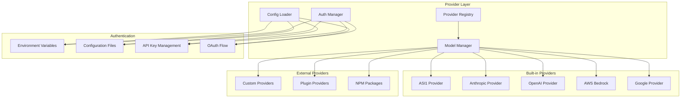

# Provider System Architecture

## Table of Contents

1. [Overview](#overview)
2. [Provider Architecture](#provider-architecture)
3. [Provider Interface](#provider-interface)
4. [Built-in Providers](#built-in-providers)
5. [Dynamic Provider Loading](#dynamic-provider-loading)
6. [Provider Configuration](#provider-configuration)
7. [Model Management](#model-management)
8. [Authentication Strategies](#authentication-strategies)
9. [Provider Transformations](#provider-transformations)
10. [Custom Providers](#custom-providers)
11. [Performance Optimization](#performance-optimization)

---

## Overview

The Provider System in ASI_Code is a sophisticated abstraction layer that enables seamless integration with multiple AI providers and models. It provides a unified interface for accessing different AI services while maintaining provider-specific optimizations and capabilities.

### Core Design Principles

1. **Provider Agnostic**: Unified interface across all AI providers
2. **Dynamic Loading**: Runtime provider discovery and loading
3. **Configuration Driven**: Flexible provider configuration system
4. **Authentication Abstraction**: Multiple authentication strategies
5. **Model Capabilities**: Automatic capability detection and matching
6. **Cost Tracking**: Built-in usage monitoring and cost tracking

### Provider Ecosystem



---

## Provider Architecture

### 1. Core Provider Structure

```typescript
// /packages/opencode/src/provider/provider.ts

export namespace Provider {
  export interface ModelInfo {
    id: string
    provider: string
    capabilities: string[]
    contextWindow: number
    maxOutputTokens: number
    costPer1kTokens: {
      input: number
      output: number
    }
  }
  
  export interface ProviderInfo {
    id: string
    name: string
    version: string
    capabilities: string[]
    models: ModelInfo[]
    authentication: AuthenticationType[]
    configuration: ConfigurationSchema
  }
  
  export interface Provider {
    info: ProviderInfo
    languageModel(modelId: string): LanguageModel
    textEmbeddingModel?(modelId: string): TextEmbeddingModel
    imageModel?(modelId: string): ImageModel
    initialize(): Promise<void>
    shutdown(): Promise<void>
  }
}
```

### 2. Provider Registry Implementation

```typescript
export class ProviderRegistry {
  private providers = new Map<string, Provider>()
  private modelCache = new Map<string, LanguageModel>()
  
  async register(providerId: string, provider: Provider): Promise<void> {
    log.info("Registering provider", { providerId })
    
    // Initialize provider
    await provider.initialize()
    
    // Register provider
    this.providers.set(providerId, provider)
    
    // Cache models for quick access
    for (const modelInfo of provider.info.models) {
      const cacheKey = `${providerId}:${modelInfo.id}`
      this.modelCache.set(cacheKey, provider.languageModel(modelInfo.id))
    }
    
    log.info("Provider registered successfully", {
      providerId,
      modelCount: provider.info.models.length
    })
  }
  
  async getProvider(providerId: string): Promise<Provider | undefined> {
    return this.providers.get(providerId)
  }
  
  async getModel(providerId: string, modelId: string): Promise<LanguageModel> {
    const cacheKey = `${providerId}:${modelId}`
    
    // Check cache first
    const cachedModel = this.modelCache.get(cacheKey)
    if (cachedModel) {
      return cachedModel
    }
    
    // Get provider and create model
    const provider = this.providers.get(providerId)
    if (!provider) {
      throw new Error(`Provider ${providerId} not found`)
    }
    
    const model = provider.languageModel(modelId)
    this.modelCache.set(cacheKey, model)
    
    return model
  }
  
  async listAvailableModels(): Promise<Array<{
    providerId: string
    modelId: string
    capabilities: string[]
  }>> {
    const models = []
    
    for (const [providerId, provider] of this.providers.entries()) {
      for (const modelInfo of provider.info.models) {
        models.push({
          providerId,
          modelId: modelInfo.id,
          capabilities: modelInfo.capabilities
        })
      }
    }
    
    return models.sort((a, b) => a.providerId.localeCompare(b.providerId))
  }
}
```

### 3. Model Selection Algorithm

```typescript
export class ModelSelector {
  constructor(private registry: ProviderRegistry) {}
  
  async selectBestModel(requirements: {
    task: string
    capabilities: string[]
    maxCost?: number
    preferredProviders?: string[]
  }): Promise<{ providerId: string; modelId: string }> {
    
    const availableModels = await this.registry.listAvailableModels()
    
    // Score each model based on requirements
    const scoredModels = availableModels.map(model => ({
      ...model,
      score: this.scoreModel(model, requirements)
    }))
    
    // Filter and sort by score
    const viableModels = scoredModels
      .filter(model => model.score > 0)
      .sort((a, b) => b.score - a.score)
    
    if (viableModels.length === 0) {
      throw new Error("No suitable model found for requirements")
    }
    
    const selected = viableModels[0]
    
    log.info("Model selected", {
      providerId: selected.providerId,
      modelId: selected.modelId,
      score: selected.score,
      requirements
    })
    
    return {
      providerId: selected.providerId,
      modelId: selected.modelId
    }
  }
  
  private scoreModel(
    model: { providerId: string; modelId: string; capabilities: string[] },
    requirements: any
  ): number {
    let score = 0
    
    // Capability matching
    const capabilityMatch = requirements.capabilities.filter(cap => 
      model.capabilities.includes(cap)
    ).length / requirements.capabilities.length
    
    score += capabilityMatch * 50
    
    // Provider preference
    if (requirements.preferredProviders?.includes(model.providerId)) {
      score += 20
    }
    
    // Task-specific scoring
    switch (requirements.task) {
      case "code-generation":
        if (model.capabilities.includes("code-completion")) score += 30
        if (model.capabilities.includes("function-calling")) score += 20
        break
      case "reasoning":
        if (model.capabilities.includes("reasoning")) score += 40
        if (model.capabilities.includes("chain-of-thought")) score += 20
        break
      case "analysis":
        if (model.capabilities.includes("text-analysis")) score += 30
        if (model.capabilities.includes("large-context")) score += 25
        break
    }
    
    return score
  }
}
```

---

## Provider Interface

### 1. Base Provider Interface

```typescript
export interface BaseProvider {
  readonly id: string
  readonly name: string
  readonly version: string
  
  // Core model methods
  languageModel(modelId: string): LanguageModel
  textEmbeddingModel?(modelId: string): TextEmbeddingModel
  imageModel?(modelId: string): ImageModel
  
  // Lifecycle methods
  initialize(): Promise<void>
  shutdown(): Promise<void>
  
  // Capability methods
  getCapabilities(): string[]
  getModels(): ModelInfo[]
  validateModel(modelId: string): boolean
  
  // Authentication methods
  authenticate(credentials: any): Promise<void>
  isAuthenticated(): boolean
}
```

### 2. Abstract Provider Implementation

```typescript
export abstract class AbstractProvider implements BaseProvider {
  abstract readonly id: string
  abstract readonly name: string
  abstract readonly version: string
  
  protected authenticated = false
  protected models = new Map<string, any>()
  protected config: any = {}
  
  constructor(protected options: ProviderOptions = {}) {}
  
  async initialize(): Promise<void> {
    log.info(`Initializing provider: ${this.name}`)
    
    // Load configuration
    await this.loadConfiguration()
    
    // Authenticate if credentials are available
    if (this.hasCredentials()) {
      await this.authenticate(this.getCredentials())
    }
    
    // Load available models
    await this.loadModels()
    
    log.info(`Provider ${this.name} initialized successfully`)
  }
  
  async shutdown(): Promise<void> {
    log.info(`Shutting down provider: ${this.name}`)
    
    // Clear model cache
    this.models.clear()
    
    // Reset authentication
    this.authenticated = false
    
    log.info(`Provider ${this.name} shutdown complete`)
  }
  
  // Abstract methods to be implemented by concrete providers
  abstract languageModel(modelId: string): LanguageModel
  abstract authenticate(credentials: any): Promise<void>
  abstract getCapabilities(): string[]
  abstract getModels(): ModelInfo[]
  
  // Common utility methods
  protected validateModelId(modelId: string): void {
    if (!this.models.has(modelId)) {
      throw new NoSuchModelError(`Model ${modelId} not available for provider ${this.id}`)
    }
  }
  
  protected async loadConfiguration(): Promise<void> {
    const config = await Config.get()
    this.config = config.providers?.[this.id] || {}
  }
  
  protected hasCredentials(): boolean {
    return this.getCredentials() !== null
  }
  
  protected abstract getCredentials(): any
  
  private async loadModels(): Promise<void> {
    const modelInfos = this.getModels()
    
    for (const modelInfo of modelInfos) {
      try {
        const model = this.createModelInstance(modelInfo)
        this.models.set(modelInfo.id, model)
      } catch (error) {
        log.warn(`Failed to load model ${modelInfo.id}`, error)
      }
    }
  }
  
  protected abstract createModelInstance(modelInfo: ModelInfo): any
}
```

---

## Built-in Providers

### 1. ASI1 Provider

```typescript
// /packages/opencode/src/provider/asi1.ts

export class ASI1Provider extends AbstractProvider {
  readonly id = "asi1"
  readonly name = "ASI1 Provider"
  readonly version = "1.0.0"
  
  private apiKey: string | null = null
  private baseURL = "https://api.asi1.ai/v1"
  private sessionId?: string
  
  constructor(options: ASI1Options = {}) {
    super(options)
    this.sessionId = options.sessionId
  }
  
  static createProvider(options: ASI1Options): Provider {
    return new ASI1Provider(options)
  }
  
  async authenticate(credentials: { apiKey: string }): Promise<void> {
    this.apiKey = credentials.apiKey
    
    // Validate API key with a test request
    try {
      await fetch(`${this.baseURL}/models`, {
        headers: {
          'Authorization': `Bearer ${this.apiKey}`,
          'Content-Type': 'application/json'
        }
      })
      
      this.authenticated = true
      log.info("ASI1 provider authenticated successfully")
    } catch (error) {
      throw new Error(`ASI1 authentication failed: ${error.message}`)
    }
  }
  
  languageModel(modelId: string): LanguageModel {
    this.validateModelId(modelId)
    
    return wrapLanguageModel({
      model: modelId,
      provider: this.id,
      
      async doGenerate(params) {
        return asi1Generate({
          apiKey: this.apiKey!,
          baseURL: this.baseURL,
          sessionId: this.sessionId,
          ...params
        })
      },
      
      async doStream(params) {
        return asi1Stream({
          apiKey: this.apiKey!,
          baseURL: this.baseURL,
          sessionId: this.sessionId,
          ...params
        })
      }
    })
  }
  
  getCapabilities(): string[] {
    return [
      "text-generation",
      "function-calling",
      "reasoning",
      "code-completion",
      "large-context",
      "streaming"
    ]
  }
  
  getModels(): ModelInfo[] {
    return [
      {
        id: "asi1-mini",
        provider: this.id,
        capabilities: ["text-generation", "function-calling"],
        contextWindow: 32000,
        maxOutputTokens: 4096,
        costPer1kTokens: { input: 0.001, output: 0.003 }
      },
      {
        id: "asi1-extended",
        provider: this.id,
        capabilities: ["text-generation", "function-calling", "reasoning", "large-context"],
        contextWindow: 200000,
        maxOutputTokens: 8192,
        costPer1kTokens: { input: 0.01, output: 0.03 }
      }
    ]
  }
  
  protected getCredentials(): { apiKey: string } | null {
    const apiKey = process.env.ASI1_API_KEY
    return apiKey ? { apiKey } : null
  }
  
  protected createModelInstance(modelInfo: ModelInfo): any {
    return {
      id: modelInfo.id,
      contextWindow: modelInfo.contextWindow,
      maxOutputTokens: modelInfo.maxOutputTokens,
      capabilities: modelInfo.capabilities
    }
  }
}

// ASI1-specific generation functions
async function asi1Generate(params: any): Promise<any> {
  const response = await fetch(`${params.baseURL}/chat/completions`, {
    method: 'POST',
    headers: {
      'Authorization': `Bearer ${params.apiKey}`,
      'Content-Type': 'application/json',
      ...(params.sessionId && { 'X-Session-ID': params.sessionId })
    },
    body: JSON.stringify({
      model: params.model,
      messages: params.messages,
      max_tokens: params.maxTokens,
      temperature: params.temperature,
      tools: params.tools,
      stream: false
    })
  })
  
  if (!response.ok) {
    throw new Error(`ASI1 API error: ${response.statusText}`)
  }
  
  const result = await response.json()
  
  return {
    text: result.choices[0].message.content,
    usage: {
      promptTokens: result.usage.prompt_tokens,
      completionTokens: result.usage.completion_tokens,
      totalTokens: result.usage.total_tokens
    },
    finishReason: result.choices[0].finish_reason,
    toolCalls: result.choices[0].message.tool_calls
  }
}

async function asi1Stream(params: any): Promise<ReadableStream> {
  const response = await fetch(`${params.baseURL}/chat/completions`, {
    method: 'POST',
    headers: {
      'Authorization': `Bearer ${params.apiKey}`,
      'Content-Type': 'application/json',
      ...(params.sessionId && { 'X-Session-ID': params.sessionId })
    },
    body: JSON.stringify({
      model: params.model,
      messages: params.messages,
      max_tokens: params.maxTokens,
      temperature: params.temperature,
      tools: params.tools,
      stream: true
    })
  })
  
  if (!response.ok) {
    throw new Error(`ASI1 API error: ${response.statusText}`)
  }
  
  return new ReadableStream({
    async start(controller) {
      const reader = response.body!.getReader()
      const decoder = new TextDecoder()
      
      try {
        while (true) {
          const { done, value } = await reader.read()
          if (done) break
          
          const chunk = decoder.decode(value)
          const lines = chunk.split('\n').filter(line => line.trim())
          
          for (const line of lines) {
            if (line.startsWith('data: ')) {
              const data = line.slice(6)
              if (data === '[DONE]') {
                controller.close()
                return
              }
              
              try {
                const parsed = JSON.parse(data)
                const delta = parsed.choices[0]?.delta
                
                if (delta?.content) {
                  controller.enqueue({
                    type: 'text-delta',
                    text: delta.content
                  })
                }
                
                if (delta?.tool_calls) {
                  controller.enqueue({
                    type: 'tool-call',
                    toolCall: delta.tool_calls[0]
                  })
                }
                
                if (parsed.usage) {
                  controller.enqueue({
                    type: 'finish',
                    usage: parsed.usage,
                    finishReason: parsed.choices[0]?.finish_reason
                  })
                }
              } catch (e) {
                // Skip malformed JSON
              }
            }
          }
        }
      } catch (error) {
        controller.error(error)
      } finally {
        reader.releaseLock()
      }
    }
  })
}
```

### 2. Anthropic Provider

```typescript
export class AnthropicProvider extends AbstractProvider {
  readonly id = "anthropic"
  readonly name = "Anthropic Claude"
  readonly version = "1.0.0"
  
  async authenticate(credentials: { apiKey: string }): Promise<void> {
    const anthropic = createAnthropic({
      apiKey: credentials.apiKey,
      headers: {
        "anthropic-beta": "claude-code-20250219,interleaved-thinking-2025-05-14"
      }
    })
    
    this.anthropic = anthropic
    this.authenticated = true
  }
  
  languageModel(modelId: string): LanguageModel {
    this.validateModelId(modelId)
    
    return this.anthropic(modelId, {
      cacheControl: true,
      reasoningEffort: modelId.includes("sonnet") ? "medium" : "low"
    })
  }
  
  getCapabilities(): string[] {
    return [
      "text-generation",
      "function-calling", 
      "reasoning",
      "code-completion",
      "interleaved-thinking",
      "cache-control",
      "large-context"
    ]
  }
  
  getModels(): ModelInfo[] {
    return [
      {
        id: "claude-3-5-sonnet-20241022",
        provider: this.id,
        capabilities: this.getCapabilities(),
        contextWindow: 200000,
        maxOutputTokens: 8192,
        costPer1kTokens: { input: 0.003, output: 0.015 }
      },
      {
        id: "claude-3-5-haiku-20241022",
        provider: this.id,
        capabilities: ["text-generation", "function-calling", "code-completion"],
        contextWindow: 200000,
        maxOutputTokens: 8192,
        costPer1kTokens: { input: 0.0008, output: 0.004 }
      }
    ]
  }
}
```

### 3. OpenAI Provider

```typescript
export class OpenAIProvider extends AbstractProvider {
  readonly id = "openai"
  readonly name = "OpenAI GPT"
  readonly version = "1.0.0"
  
  async authenticate(credentials: { apiKey: string; organization?: string }): Promise<void> {
    const openai = createOpenAI({
      apiKey: credentials.apiKey,
      organization: credentials.organization
    })
    
    this.openai = openai
    this.authenticated = true
  }
  
  languageModel(modelId: string): LanguageModel {
    this.validateModelId(modelId)
    
    return this.openai(modelId, {
      structuredOutputs: true,
      reasoningEffort: modelId.includes("o1") ? "high" : undefined
    })
  }
  
  getCapabilities(): string[] {
    return [
      "text-generation",
      "function-calling",
      "reasoning",
      "code-completion",
      "structured-outputs",
      "vision"
    ]
  }
  
  getModels(): ModelInfo[] {
    return [
      {
        id: "gpt-4o-2024-11-20",
        provider: this.id,
        capabilities: this.getCapabilities(),
        contextWindow: 128000,
        maxOutputTokens: 16384,
        costPer1kTokens: { input: 0.0025, output: 0.01 }
      },
      {
        id: "gpt-4o-mini-2024-07-18",
        provider: this.id,
        capabilities: ["text-generation", "function-calling", "vision"],
        contextWindow: 128000,
        maxOutputTokens: 16384,
        costPer1kTokens: { input: 0.00015, output: 0.0006 }
      },
      {
        id: "o1-2024-12-17",
        provider: this.id,
        capabilities: ["text-generation", "reasoning", "code-completion"],
        contextWindow: 200000,
        maxOutputTokens: 100000,
        costPer1kTokens: { input: 0.015, output: 0.06 }
      }
    ]
  }
}
```

---

## Dynamic Provider Loading

### 1. Provider Discovery System

```typescript
export class ProviderDiscovery {
  private static readonly PROVIDER_PATTERNS = [
    "@ai-sdk/*",
    "*-ai-provider",
    "opencode-provider-*"
  ]
  
  static async discoverProviders(): Promise<DiscoveredProvider[]> {
    const discovered: DiscoveredProvider[] = []
    
    // Discover npm packages
    const npmProviders = await this.discoverNpmProviders()
    discovered.push(...npmProviders)
    
    // Discover local providers
    const localProviders = await this.discoverLocalProviders()
    discovered.push(...localProviders)
    
    // Discover plugin providers
    const pluginProviders = await this.discoverPluginProviders()
    discovered.push(...pluginProviders)
    
    return discovered
  }
  
  private static async discoverNpmProviders(): Promise<DiscoveredProvider[]> {
    const providers: DiscoveredProvider[] = []
    
    try {
      // Check node_modules for provider packages
      const nodeModulesPath = path.join(process.cwd(), "node_modules")
      const packages = await fs.readdir(nodeModulesPath)
      
      for (const pkg of packages) {
        if (this.matchesProviderPattern(pkg)) {
          try {
            const provider = await this.loadNpmProvider(pkg)
            if (provider) {
              providers.push({
                id: provider.id,
                source: "npm",
                package: pkg,
                provider
              })
            }
          } catch (error) {
            log.warn(`Failed to load provider package ${pkg}`, error)
          }
        }
      }
    } catch (error) {
      log.warn("Failed to discover npm providers", error)
    }
    
    return providers
  }
  
  private static async loadNpmProvider(packageName: string): Promise<Provider | null> {
    try {
      const module = await import(packageName)
      
      // Look for provider exports
      if (module.default && typeof module.default.createProvider === "function") {
        return module.default.createProvider()
      }
      
      if (module.createProvider && typeof module.createProvider === "function") {
        return module.createProvider()
      }
      
      // Check for class-based providers
      if (module.default && module.default.prototype && 
          typeof module.default.prototype.languageModel === "function") {
        return new module.default()
      }
      
      return null
    } catch (error) {
      log.warn(`Failed to import provider package ${packageName}`, error)
      return null
    }
  }
  
  private static matchesProviderPattern(packageName: string): boolean {
    return this.PROVIDER_PATTERNS.some(pattern => {
      const regex = new RegExp(pattern.replace("*", ".*"))
      return regex.test(packageName)
    })
  }
}

interface DiscoveredProvider {
  id: string
  source: "npm" | "local" | "plugin"
  package?: string
  path?: string
  provider: Provider
}
```

### 2. Dynamic Loading System

```typescript
export class ProviderLoader {
  private static readonly customLoaders: Record<string, CustomLoader> = {
    async asi1(_provider: ModelsDev.Provider) {
      const apiKey = process.env["ASI1_API_KEY"]
      if (!apiKey) {
        return { autoload: false }
      }
      
      return {
        autoload: true,
        provider: new ASI1Provider({ apiKey })
      }
    },
    
    async anthropic() {
      const apiKey = process.env["ANTHROPIC_API_KEY"]
      if (!apiKey) {
        return { autoload: false }
      }
      
      return {
        autoload: true,
        provider: new AnthropicProvider({ apiKey })
      }
    },
    
    async openai() {
      const apiKey = process.env["OPENAI_API_KEY"]
      if (!apiKey) {
        return { autoload: false }
      }
      
      return {
        autoload: true,
        provider: new OpenAIProvider({ 
          apiKey,
          organization: process.env["OPENAI_ORG_ID"]
        })
      }
    }
  }
  
  static async loadProvider(
    providerId: string, 
    config?: any
  ): Promise<Provider | null> {
    
    // Try custom loaders first
    const customLoader = this.customLoaders[providerId]
    if (customLoader) {
      const result = await customLoader(config)
      if (result.autoload && result.provider) {
        return result.provider
      }
    }
    
    // Try dynamic loading from npm
    try {
      const npmProvider = await this.loadFromNpm(providerId, config)
      if (npmProvider) {
        return npmProvider
      }
    } catch (error) {
      log.debug(`Failed to load provider ${providerId} from npm`, error)
    }
    
    // Try plugin loading
    try {
      const pluginProvider = await this.loadFromPlugin(providerId, config)
      if (pluginProvider) {
        return pluginProvider
      }
    } catch (error) {
      log.debug(`Failed to load provider ${providerId} from plugin`, error)
    }
    
    return null
  }
  
  private static async loadFromNpm(
    providerId: string, 
    config: any
  ): Promise<Provider | null> {
    
    const possiblePackages = [
      `@ai-sdk/${providerId}`,
      `${providerId}-ai-provider`,
      `opencode-provider-${providerId}`,
      providerId
    ]
    
    for (const packageName of possiblePackages) {
      try {
        // Try to install if not present
        await BunProc.install(packageName)
        
        // Import and create provider
        const module = await import(packageName)
        
        if (module.createProvider) {
          return module.createProvider(config)
        }
        
        if (module.default?.createProvider) {
          return module.default.createProvider(config)
        }
        
        if (module.default && typeof module.default === "function") {
          return new module.default(config)
        }
        
      } catch (error) {
        log.debug(`Failed to load ${packageName}`, error)
        continue
      }
    }
    
    return null
  }
  
  private static async loadFromPlugin(
    providerId: string, 
    config: any
  ): Promise<Provider | null> {
    
    const pluginManager = await Plugin.getManager()
    const plugin = pluginManager.getPlugin(`provider-${providerId}`)
    
    if (!plugin) {
      return null
    }
    
    return plugin.createProvider(config)
  }
}

type CustomLoader = (config?: any) => Promise<{
  autoload: boolean
  provider?: Provider
}>
```

---

## Provider Configuration

### 1. Configuration Schema

```typescript
export namespace ProviderConfig {
  export const Schema = z.object({
    providers: z.record(z.object({
      enabled: z.boolean().default(true),
      apiKey: z.string().optional(),
      baseURL: z.string().optional(),
      organization: z.string().optional(),
      region: z.string().optional(),
      models: z.record(z.object({
        enabled: z.boolean().default(true),
        maxTokens: z.number().optional(),
        temperature: z.number().optional(),
        customSettings: z.record(z.any()).optional()
      })).optional(),
      customSettings: z.record(z.any()).optional()
    })).optional(),
    
    defaultProvider: z.string().optional(),
    defaultModel: z.string().optional(),
    
    authentication: z.object({
      preferEnvVars: z.boolean().default(true),
      allowConfigFiles: z.boolean().default(true),
      secretsPath: z.string().optional()
    }).optional(),
    
    optimization: z.object({
      cacheModels: z.boolean().default(true),
      preloadModels: z.array(z.string()).optional(),
      maxCachedModels: z.number().default(10)
    }).optional()
  })
  
  export type Config = z.infer<typeof Schema>
}

// Example configuration
const exampleConfig: ProviderConfig.Config = {
  providers: {
    "asi1": {
      enabled: true,
      apiKey: "${ASI1_API_KEY}",
      models: {
        "asi1-mini": {
          enabled: true,
          maxTokens: 4096,
          temperature: 0.7
        },
        "asi1-extended": {
          enabled: true,
          maxTokens: 8192,
          temperature: 0.5
        }
      }
    },
    "anthropic": {
      enabled: true,
      apiKey: "${ANTHROPIC_API_KEY}",
      customSettings: {
        headers: {
          "anthropic-beta": "claude-code-20250219"
        }
      }
    },
    "openai": {
      enabled: true,
      apiKey: "${OPENAI_API_KEY}",
      organization: "${OPENAI_ORG_ID}",
      models: {
        "gpt-4o": {
          enabled: true,
          maxTokens: 8192
        }
      }
    }
  },
  
  defaultProvider: "asi1",
  defaultModel: "asi1-extended",
  
  authentication: {
    preferEnvVars: true,
    allowConfigFiles: true
  },
  
  optimization: {
    cacheModels: true,
    preloadModels: ["asi1:asi1-extended", "anthropic:claude-3-5-sonnet-20241022"],
    maxCachedModels: 5
  }
}
```

### 2. Configuration Management

```typescript
export class ProviderConfigManager {
  private config: ProviderConfig.Config = {}
  private watchers: Array<(config: ProviderConfig.Config) => void> = []
  
  async load(): Promise<void> {
    // Load from multiple sources
    const sources = [
      await this.loadFromEnvironment(),
      await this.loadFromConfigFile(),
      await this.loadFromDefaults()
    ]
    
    // Merge configurations (environment takes precedence)
    this.config = sources.reduce((merged, source) => 
      mergeDeep(merged, source), {})
    
    // Validate configuration
    const result = ProviderConfig.Schema.safeParse(this.config)
    if (!result.success) {
      throw new Error(`Invalid provider configuration: ${result.error.message}`)
    }
    
    this.config = result.data
    
    // Notify watchers
    this.notifyWatchers()
  }
  
  async save(): Promise<void> {
    const configPath = path.join(Config.getConfigDir(), "providers.json")
    await fs.writeFile(configPath, JSON.stringify(this.config, null, 2))
  }
  
  get(providerId?: string): any {
    if (!providerId) {
      return this.config
    }
    
    return this.config.providers?.[providerId] || {}
  }
  
  set(providerId: string, config: any): void {
    if (!this.config.providers) {
      this.config.providers = {}
    }
    
    this.config.providers[providerId] = mergeDeep(
      this.config.providers[providerId] || {},
      config
    )
    
    this.notifyWatchers()
  }
  
  watch(callback: (config: ProviderConfig.Config) => void): () => void {
    this.watchers.push(callback)
    
    return () => {
      const index = this.watchers.indexOf(callback)
      if (index > -1) {
        this.watchers.splice(index, 1)
      }
    }
  }
  
  private async loadFromEnvironment(): Promise<Partial<ProviderConfig.Config>> {
    const config: any = { providers: {} }
    
    // Load provider-specific environment variables
    const envVars = process.env
    
    for (const [key, value] of Object.entries(envVars)) {
      if (key.endsWith('_API_KEY')) {
        const providerId = key.replace('_API_KEY', '').toLowerCase()
        config.providers[providerId] = {
          enabled: true,
          apiKey: value
        }
      }
    }
    
    return config
  }
  
  private async loadFromConfigFile(): Promise<Partial<ProviderConfig.Config>> {
    try {
      const configPath = path.join(Config.getConfigDir(), "providers.json")
      const content = await fs.readFile(configPath, 'utf-8')
      return JSON.parse(content)
    } catch (error) {
      return {}
    }
  }
  
  private async loadFromDefaults(): Promise<Partial<ProviderConfig.Config>> {
    return {
      authentication: {
        preferEnvVars: true,
        allowConfigFiles: true
      },
      optimization: {
        cacheModels: true,
        maxCachedModels: 10
      }
    }
  }
  
  private notifyWatchers(): void {
    for (const watcher of this.watchers) {
      try {
        watcher(this.config)
      } catch (error) {
        log.error("Error in config watcher", error)
      }
    }
  }
}
```

---

## Authentication Strategies

### 1. Multi-Strategy Authentication

```typescript
export class AuthenticationManager {
  private strategies = new Map<string, AuthenticationStrategy>()
  
  constructor() {
    this.registerDefaultStrategies()
  }
  
  private registerDefaultStrategies(): void {
    this.strategies.set("env", new EnvironmentAuthStrategy())
    this.strategies.set("config", new ConfigFileAuthStrategy())
    this.strategies.set("oauth", new OAuthAuthStrategy())
    this.strategies.set("apikey", new APIKeyAuthStrategy())
  }
  
  async authenticate(
    providerId: string, 
    strategy: string = "auto"
  ): Promise<AuthenticationResult> {
    
    if (strategy === "auto") {
      return this.autoAuthenticate(providerId)
    }
    
    const authStrategy = this.strategies.get(strategy)
    if (!authStrategy) {
      throw new Error(`Unknown authentication strategy: ${strategy}`)
    }
    
    return authStrategy.authenticate(providerId)
  }
  
  private async autoAuthenticate(providerId: string): Promise<AuthenticationResult> {
    // Try strategies in order of preference
    const strategies = ["env", "config", "oauth", "apikey"]
    
    for (const strategyName of strategies) {
      try {
        const strategy = this.strategies.get(strategyName)!
        const result = await strategy.authenticate(providerId)
        
        if (result.success) {
          log.info(`Authenticated ${providerId} using ${strategyName} strategy`)
          return result
        }
      } catch (error) {
        log.debug(`${strategyName} authentication failed for ${providerId}`, error)
        continue
      }
    }
    
    return {
      success: false,
      error: "No valid authentication method found"
    }
  }
}

interface AuthenticationStrategy {
  authenticate(providerId: string): Promise<AuthenticationResult>
  isAvailable(providerId: string): Promise<boolean>
}

interface AuthenticationResult {
  success: boolean
  credentials?: any
  error?: string
  metadata?: any
}

class EnvironmentAuthStrategy implements AuthenticationStrategy {
  async authenticate(providerId: string): Promise<AuthenticationResult> {
    const envVarName = `${providerId.toUpperCase()}_API_KEY`
    const apiKey = process.env[envVarName]
    
    if (!apiKey) {
      return {
        success: false,
        error: `Environment variable ${envVarName} not found`
      }
    }
    
    return {
      success: true,
      credentials: { apiKey },
      metadata: { source: "environment", envVar: envVarName }
    }
  }
  
  async isAvailable(providerId: string): Promise<boolean> {
    const envVarName = `${providerId.toUpperCase()}_API_KEY`
    return Boolean(process.env[envVarName])
  }
}

class ConfigFileAuthStrategy implements AuthenticationStrategy {
  async authenticate(providerId: string): Promise<AuthenticationResult> {
    try {
      const config = await ProviderConfigManager.getInstance()
      const providerConfig = config.get(providerId)
      
      if (!providerConfig.apiKey) {
        return {
          success: false,
          error: "No API key found in configuration"
        }
      }
      
      // Resolve variable references (e.g., ${ENV_VAR})
      const resolvedApiKey = this.resolveVariables(providerConfig.apiKey)
      
      return {
        success: true,
        credentials: { 
          apiKey: resolvedApiKey,
          ...providerConfig.credentials
        },
        metadata: { source: "config-file" }
      }
    } catch (error) {
      return {
        success: false,
        error: error.message
      }
    }
  }
  
  async isAvailable(providerId: string): Promise<boolean> {
    const config = await ProviderConfigManager.getInstance()
    const providerConfig = config.get(providerId)
    return Boolean(providerConfig.apiKey)
  }
  
  private resolveVariables(value: string): string {
    return value.replace(/\$\{([^}]+)\}/g, (match, varName) => {
      return process.env[varName] || match
    })
  }
}
```

---

## Provider Transformations

### 1. Request/Response Transformations

```typescript
export class ProviderTransform {
  static async transformRequest(
    providerId: string,
    request: any
  ): Promise<any> {
    
    const transformer = this.getTransformer(providerId)
    if (!transformer) {
      return request
    }
    
    return transformer.transformRequest(request)
  }
  
  static async transformResponse(
    providerId: string,
    response: any
  ): Promise<any> {
    
    const transformer = this.getTransformer(providerId)
    if (!transformer) {
      return response
    }
    
    return transformer.transformResponse(response)
  }
  
  private static getTransformer(providerId: string): ProviderTransformer | null {
    const transformers: Record<string, ProviderTransformer> = {
      "asi1": new ASI1Transformer(),
      "anthropic": new AnthropicTransformer(),
      "openai": new OpenAITransformer()
    }
    
    return transformers[providerId] || null
  }
}

interface ProviderTransformer {
  transformRequest(request: any): any
  transformResponse(response: any): any
}

class ASI1Transformer implements ProviderTransformer {
  transformRequest(request: any): any {
    // ASI1-specific request transformations
    return {
      ...request,
      // Add ASI1-specific parameters
      reasoning_mode: request.reasoning ? "enabled" : "disabled",
      session_continuity: true
    }
  }
  
  transformResponse(response: any): any {
    // ASI1-specific response transformations
    return {
      ...response,
      // Normalize ASI1 response format
      usage: {
        promptTokens: response.usage?.input_tokens || 0,
        completionTokens: response.usage?.output_tokens || 0,
        totalTokens: response.usage?.total_tokens || 0,
        reasoning_tokens: response.usage?.reasoning_tokens || 0
      }
    }
  }
}

class AnthropicTransformer implements ProviderTransformer {
  transformRequest(request: any): any {
    return {
      ...request,
      // Add Anthropic-specific headers
      headers: {
        ...request.headers,
        "anthropic-beta": "claude-code-20250219,interleaved-thinking-2025-05-14"
      }
    }
  }
  
  transformResponse(response: any): any {
    return {
      ...response,
      // Add Anthropic-specific metadata
      reasoning_content: response.content?.find(c => c.type === "thinking")?.text
    }
  }
}
```

---

## Performance Optimization

### 1. Model Caching

```typescript
export class ModelCache {
  private cache = new Map<string, {
    model: LanguageModel
    lastUsed: number
    usageCount: number
  }>()
  
  private readonly MAX_CACHE_SIZE = 10
  private readonly CACHE_TTL = 30 * 60 * 1000 // 30 minutes
  
  get(providerId: string, modelId: string): LanguageModel | null {
    const key = `${providerId}:${modelId}`
    const entry = this.cache.get(key)
    
    if (!entry) {
      return null
    }
    
    // Check if entry is still valid
    if (Date.now() - entry.lastUsed > this.CACHE_TTL) {
      this.cache.delete(key)
      return null
    }
    
    // Update usage stats
    entry.lastUsed = Date.now()
    entry.usageCount++
    
    return entry.model
  }
  
  set(providerId: string, modelId: string, model: LanguageModel): void {
    const key = `${providerId}:${modelId}`
    
    // Implement LRU eviction if cache is full
    if (this.cache.size >= this.MAX_CACHE_SIZE) {
      this.evictLeastRecent()
    }
    
    this.cache.set(key, {
      model,
      lastUsed: Date.now(),
      usageCount: 0
    })
  }
  
  private evictLeastRecent(): void {
    let oldestKey = ''
    let oldestTime = Date.now()
    
    for (const [key, entry] of this.cache.entries()) {
      if (entry.lastUsed < oldestTime) {
        oldestTime = entry.lastUsed
        oldestKey = key
      }
    }
    
    if (oldestKey) {
      this.cache.delete(oldestKey)
    }
  }
  
  clear(): void {
    this.cache.clear()
  }
  
  getStats(): {
    size: number
    entries: Array<{
      key: string
      lastUsed: number
      usageCount: number
    }>
  } {
    return {
      size: this.cache.size,
      entries: Array.from(this.cache.entries()).map(([key, entry]) => ({
        key,
        lastUsed: entry.lastUsed,
        usageCount: entry.usageCount
      }))
    }
  }
}
```

### 2. Connection Pooling

```typescript
export class ConnectionPool {
  private pools = new Map<string, Pool>()
  
  getPool(providerId: string): Pool {
    if (!this.pools.has(providerId)) {
      this.pools.set(providerId, new Pool({
        max: 10,
        min: 2,
        acquireTimeoutMillis: 30000,
        createRetryIntervalMillis: 100,
        
        create: async () => {
          const provider = await ProviderRegistry.getProvider(providerId)
          return provider.createConnection()
        },
        
        destroy: async (connection) => {
          await connection.close()
        },
        
        validate: async (connection) => {
          return connection.isHealthy()
        }
      }))
    }
    
    return this.pools.get(providerId)!
  }
  
  async execute<T>(
    providerId: string,
    operation: (connection: any) => Promise<T>
  ): Promise<T> {
    const pool = this.getPool(providerId)
    const connection = await pool.acquire()
    
    try {
      return await operation(connection)
    } finally {
      pool.release(connection)
    }
  }
  
  async shutdown(): Promise<void> {
    for (const [providerId, pool] of this.pools.entries()) {
      await pool.drain()
      await pool.clear()
    }
    
    this.pools.clear()
  }
}
```

This comprehensive Provider System architecture enables ASI_Code to seamlessly integrate with multiple AI providers while maintaining optimal performance, security, and flexibility. The system supports both built-in and custom providers, dynamic loading, sophisticated authentication, and advanced optimization strategies.