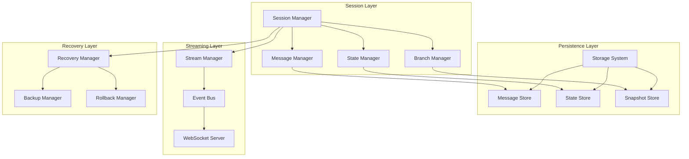
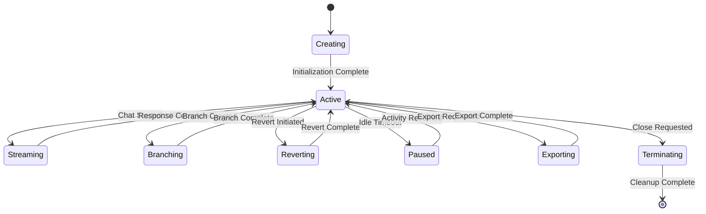

# Session Management System

## Table of Contents

1. [Overview](#overview)
2. [Session Architecture](#session-architecture)
3. [Message System](#message-system)
4. [State Management](#state-management)
5. [Persistence Layer](#persistence-layer)
6. [Session Lifecycle](#session-lifecycle)
7. [Branching and History](#branching-and-history)
8. [Streaming and Real-time Updates](#streaming-and-real-time-updates)
9. [Session Recovery](#session-recovery)
10. [Performance and Optimization](#performance-and-optimization)

---

## Overview

The Session Management System in ASI_Code provides persistent, stateful conversations with AI models. It handles message storage, conversation history, session branching, real-time streaming, and state synchronization across multiple interfaces (CLI, TUI, VS Code, Web).

### Core Features

1. **Persistent Conversations**: Long-running sessions that survive restarts
2. **Session Branching**: Create alternative conversation paths
3. **Real-time Streaming**: Live message updates and tool execution
4. **State Management**: Comprehensive session and conversation state
5. **Multi-Interface Support**: Works across all ASI_Code interfaces
6. **Recovery**: Automatic session recovery and rollback capabilities

### Session System Architecture



---

## Session Architecture

### 1. Core Session Structure

```typescript
// /packages/opencode/src/session/index.ts

export namespace Session {
  export interface Info {
    id: string                    // Unique session identifier
    parentID?: string            // Parent session for branches
    title: string                // Human-readable title
    version: string              // Session format version
    time: {
      created: number
      updated: number
    }
    revert?: {                   // Rollback information
      messageID: string
      partID?: string
      snapshot?: string
      diff?: string
    }
    share?: {                    // Sharing configuration
      url: string
    }
  }
  
  export interface Config {
    providerID: string           // AI provider
    modelID: string             // AI model
    agent: Agent.Info           // Agent configuration
    systemPrompt?: string       // Custom system prompt
    temperature?: number        // Model temperature
    maxTokens?: number         // Maximum output tokens
  }
  
  export class Session {
    constructor(
      public readonly info: Session.Info,
      public readonly config: Session.Config,
      private readonly storage: Storage,
      private readonly provider: Provider
    ) {}
    
    async chat(input: ChatInput): Promise<ChatResponse> {
      // Main chat interface
      return this.executeChat(input)
    }
    
    async branch(fromMessageID?: string): Promise<Session> {
      // Create a new session branch
      return this.createBranch(fromMessageID)
    }
    
    async revert(messageID: string, partID?: string): Promise<void> {
      // Revert to a previous state
      return this.performRevert(messageID, partID)
    }
    
    async getHistory(limit?: number): Promise<Message[]> {
      // Get conversation history
      return this.storage.getMessages(this.info.id, limit)
    }
    
    async export(): Promise<SessionExport> {
      // Export session data
      return this.generateExport()
    }
  }
}
```

### 2. Session Manager Implementation

```typescript
export class SessionManager {
  private sessions = new Map<string, Session>()
  private activeStreams = new Map<string, StreamingSession>()
  
  constructor(
    private readonly storage: Storage,
    private readonly providerManager: ProviderManager,
    private readonly eventBus: EventBus
  ) {}
  
  async create(config: SessionCreateConfig): Promise<Session> {
    const sessionId = Identifier.generate("session")
    
    const sessionInfo: Session.Info = {
      id: sessionId,
      parentID: config.parentID,
      title: config.title || this.generateDefaultTitle(config.parentID),
      version: "2.0.0",
      time: {
        created: Date.now(),
        updated: Date.now()
      }
    }
    
    const sessionConfig: Session.Config = {
      providerID: config.providerID,
      modelID: config.modelID,
      agent: config.agent,
      systemPrompt: config.systemPrompt,
      temperature: config.temperature,
      maxTokens: config.maxTokens
    }
    
    // Create session instance
    const session = new SessionImpl(
      sessionInfo,
      sessionConfig,
      this.storage,
      this.providerManager
    )
    
    // Store session
    await this.storage.saveSession(sessionInfo)
    this.sessions.set(sessionId, session)
    
    // Publish creation event
    this.eventBus.publish("session.created", {
      sessionId,
      parentID: config.parentID,
      timestamp: Date.now()
    })
    
    Log.info("Session created", {
      sessionId,
      parentID: config.parentID,
      title: sessionInfo.title
    })
    
    return session
  }
  
  async get(sessionId: string): Promise<Session | null> {
    // Check in-memory cache first
    if (this.sessions.has(sessionId)) {
      return this.sessions.get(sessionId)!
    }
    
    // Load from storage
    const sessionInfo = await this.storage.getSession(sessionId)
    if (!sessionInfo) {
      return null
    }
    
    const session = await this.loadSession(sessionInfo)
    this.sessions.set(sessionId, session)
    
    return session
  }
  
  async list(parentID?: string): Promise<Session.Info[]> {
    return this.storage.listSessions(parentID)
  }
  
  async delete(sessionId: string): Promise<void> {
    // Remove from memory
    this.sessions.delete(sessionId)
    
    // Close any active streams
    const stream = this.activeStreams.get(sessionId)
    if (stream) {
      stream.close()
      this.activeStreams.delete(sessionId)
    }
    
    // Delete from storage
    await this.storage.deleteSession(sessionId)
    
    // Publish deletion event
    this.eventBus.publish("session.deleted", {
      sessionId,
      timestamp: Date.now()
    })
    
    Log.info("Session deleted", { sessionId })
  }
  
  private async loadSession(sessionInfo: Session.Info): Promise<Session> {
    // Load session configuration
    const config = await this.storage.getSessionConfig(sessionInfo.id)
    
    // Create session instance
    return new SessionImpl(
      sessionInfo,
      config,
      this.storage,
      this.providerManager
    )
  }
  
  private generateDefaultTitle(isChild?: boolean): string {
    const prefix = isChild ? "Child session" : "New session"
    const timestamp = new Date().toISOString()
    return `${prefix} - ${timestamp}`
  }
}

interface SessionCreateConfig {
  parentID?: string
  title?: string
  providerID: string
  modelID: string
  agent: Agent.Info
  systemPrompt?: string
  temperature?: number
  maxTokens?: number
}
```

---

## Message System

### 1. Message Architecture

```typescript
// /packages/opencode/src/session/message-v2.ts

export namespace MessageV2 {
  export interface Message {
    id: string
    sessionID: string
    type: "user" | "assistant" | "system"
    role: "user" | "assistant" | "system"
    parts: MessagePart[]
    time: {
      created: number
      updated: number
    }
    metadata?: {
      model?: string
      provider?: string
      usage?: LanguageModelUsage
      tools?: string[]
      parentMessageID?: string
    }
  }
  
  export interface MessagePart {
    id: string
    messageID: string
    type: "text" | "tool-call" | "tool-result" | "image" | "attachment"
    content: any
    status: "pending" | "streaming" | "completed" | "error"
    time: {
      created: number
      updated: number
    }
    metadata?: Record<string, any>
  }
  
  export interface TextPart extends MessagePart {
    type: "text"
    content: {
      text: string
      thinking?: string  // For models with reasoning
    }
  }
  
  export interface ToolCallPart extends MessagePart {
    type: "tool-call"
    content: {
      toolName: string
      parameters: any
      toolCallId: string
    }
  }
  
  export interface ToolResultPart extends MessagePart {
    type: "tool-result"
    content: {
      toolCallId: string
      result: any
      success: boolean
      error?: string
      executionTime?: number
    }
  }
  
  export class MessageBuilder {
    private message: Partial<Message>
    private parts: MessagePart[] = []
    
    constructor(sessionID: string, type: Message["type"]) {
      this.message = {
        id: Identifier.generate("message"),
        sessionID,
        type,
        role: type === "system" ? "system" : type,
        time: {
          created: Date.now(),
          updated: Date.now()
        }
      }
    }
    
    addTextPart(text: string, thinking?: string): this {
      const part: TextPart = {
        id: Identifier.generate("part"),
        messageID: this.message.id!,
        type: "text",
        content: { text, thinking },
        status: "completed",
        time: {
          created: Date.now(),
          updated: Date.now()
        }
      }
      
      this.parts.push(part)
      return this
    }
    
    addToolCallPart(toolName: string, parameters: any): this {
      const part: ToolCallPart = {
        id: Identifier.generate("part"),
        messageID: this.message.id!,
        type: "tool-call",
        content: {
          toolName,
          parameters,
          toolCallId: Identifier.generate("tool-call")
        },
        status: "pending",
        time: {
          created: Date.now(),
          updated: Date.now()
        }
      }
      
      this.parts.push(part)
      return this
    }
    
    addToolResultPart(toolCallId: string, result: any, success: boolean): this {
      const part: ToolResultPart = {
        id: Identifier.generate("part"),
        messageID: this.message.id!,
        type: "tool-result",
        content: {
          toolCallId,
          result,
          success
        },
        status: "completed",
        time: {
          created: Date.now(),
          updated: Date.now()
        }
      }
      
      this.parts.push(part)
      return this
    }
    
    setMetadata(metadata: Message["metadata"]): this {
      this.message.metadata = metadata
      return this
    }
    
    build(): Message {
      return {
        ...this.message,
        parts: this.parts
      } as Message
    }
  }
}
```

### 2. Message Storage

```typescript
export class MessageStorage {
  constructor(private readonly storage: Storage) {}
  
  async saveMessage(message: MessageV2.Message): Promise<void> {
    // Save message metadata
    await this.storage.set(`message:${message.id}`, {
      id: message.id,
      sessionID: message.sessionID,
      type: message.type,
      role: message.role,
      time: message.time,
      metadata: message.metadata,
      partCount: message.parts.length
    })
    
    // Save message parts separately for efficiency
    for (const part of message.parts) {
      await this.storage.set(`part:${part.id}`, part)
    }
    
    // Update session message index
    await this.updateSessionIndex(message.sessionID, message.id)
  }
  
  async getMessage(messageId: string): Promise<MessageV2.Message | null> {
    // Load message metadata
    const messageData = await this.storage.get(`message:${messageId}`)
    if (!messageData) {
      return null
    }
    
    // Load message parts
    const parts = await this.getMessageParts(messageId)
    
    return {
      ...messageData,
      parts
    } as MessageV2.Message
  }
  
  async getMessageParts(messageId: string): Promise<MessageV2.MessagePart[]> {
    const keys = await this.storage.keys(`part:*`)
    const partKeys = keys.filter(key => {
      const partId = key.split(':')[1]
      return partId.startsWith(messageId)
    })
    
    const parts = await Promise.all(
      partKeys.map(key => this.storage.get(key))
    )
    
    return parts
      .filter(Boolean)
      .sort((a, b) => a.time.created - b.time.created)
  }
  
  async updateMessagePart(part: MessageV2.MessagePart): Promise<void> {
    part.time.updated = Date.now()
    await this.storage.set(`part:${part.id}`, part)
    
    // Publish part update event
    Bus.publish("message.part.updated", {
      sessionId: part.messageID.split(':')[0],
      messageId: part.messageID,
      partId: part.id,
      timestamp: part.time.updated
    })
  }
  
  async getSessionMessages(
    sessionId: string, 
    limit?: number,
    offset?: number
  ): Promise<MessageV2.Message[]> {
    
    // Get session message index
    const messageIds = await this.getSessionMessageIds(sessionId)
    
    // Apply pagination
    const paginatedIds = limit 
      ? messageIds.slice(offset || 0, (offset || 0) + limit)
      : messageIds
    
    // Load messages
    const messages = await Promise.all(
      paginatedIds.map(id => this.getMessage(id))
    )
    
    return messages.filter(Boolean) as MessageV2.Message[]
  }
  
  private async updateSessionIndex(sessionId: string, messageId: string): Promise<void> {
    const indexKey = `session:${sessionId}:messages`
    const existing = await this.storage.get(indexKey) || []
    
    const updated = [...existing, messageId]
    await this.storage.set(indexKey, updated)
  }
  
  private async getSessionMessageIds(sessionId: string): Promise<string[]> {
    const indexKey = `session:${sessionId}:messages`
    return await this.storage.get(indexKey) || []
  }
}
```

---

## State Management

### 1. Session State Architecture

```typescript
export class SessionState {
  private state = new Map<string, any>()
  private listeners = new Map<string, Set<StateListener>>()
  private history: StateSnapshot[] = []
  
  constructor(private readonly sessionId: string) {}
  
  set<T>(key: string, value: T): void {
    const previousValue = this.state.get(key)
    
    // Create state snapshot for history
    if (previousValue !== undefined) {
      this.history.push({
        key,
        value: previousValue,
        timestamp: Date.now(),
        operation: "set"
      })
    }
    
    // Update state
    this.state.set(key, value)
    
    // Notify listeners
    const keyListeners = this.listeners.get(key)
    if (keyListeners) {
      for (const listener of keyListeners) {
        try {
          listener(value, previousValue)
        } catch (error) {
          Log.error("State listener error", { key, error })
        }
      }
    }
    
    // Publish state change event
    Bus.publish("session.state.changed", {
      sessionId: this.sessionId,
      key,
      value,
      previousValue,
      timestamp: Date.now()
    })
  }
  
  get<T>(key: string): T | undefined {
    return this.state.get(key)
  }
  
  has(key: string): boolean {
    return this.state.has(key)
  }
  
  delete(key: string): boolean {
    const value = this.state.get(key)
    if (value !== undefined) {
      // Add to history
      this.history.push({
        key,
        value,
        timestamp: Date.now(),
        operation: "delete"
      })
      
      // Remove from state
      const deleted = this.state.delete(key)
      
      // Notify listeners
      const keyListeners = this.listeners.get(key)
      if (keyListeners) {
        for (const listener of keyListeners) {
          try {
            listener(undefined, value)
          } catch (error) {
            Log.error("State listener error", { key, error })
          }
        }
      }
      
      return deleted
    }
    
    return false
  }
  
  watch(key: string, listener: StateListener): () => void {
    if (!this.listeners.has(key)) {
      this.listeners.set(key, new Set())
    }
    
    this.listeners.get(key)!.add(listener)
    
    // Return unwatch function
    return () => {
      this.listeners.get(key)?.delete(listener)
    }
  }
  
  getSnapshot(): StateSnapshot[] {
    return [...this.history]
  }
  
  restore(snapshot: StateSnapshot[]): void {
    // Clear current state
    this.state.clear()
    
    // Replay state changes from snapshot
    for (const entry of snapshot) {
      if (entry.operation === "set") {
        this.state.set(entry.key, entry.value)
      } else if (entry.operation === "delete") {
        this.state.delete(entry.key)
      }
    }
    
    // Update history
    this.history = [...snapshot]
    
    // Notify all listeners of the restoration
    for (const [key, listeners] of this.listeners.entries()) {
      const value = this.state.get(key)
      for (const listener of listeners) {
        try {
          listener(value, undefined)
        } catch (error) {
          Log.error("State restore listener error", { key, error })
        }
      }
    }
  }
  
  serialize(): SerializedState {
    return {
      state: Object.fromEntries(this.state.entries()),
      history: this.history,
      timestamp: Date.now()
    }
  }
  
  deserialize(data: SerializedState): void {
    this.state = new Map(Object.entries(data.state))
    this.history = data.history
  }
}

type StateListener = (newValue: any, oldValue: any) => void

interface StateSnapshot {
  key: string
  value: any
  timestamp: number
  operation: "set" | "delete"
}

interface SerializedState {
  state: Record<string, any>
  history: StateSnapshot[]
  timestamp: number
}
```

### 2. Global Session Registry

```typescript
export class SessionRegistry {
  private sessions = new Map<string, SessionState>()
  private persistence: SessionPersistence
  
  constructor() {
    this.persistence = new SessionPersistence()
  }
  
  async getSessionState(sessionId: string): Promise<SessionState> {
    if (!this.sessions.has(sessionId)) {
      const sessionState = new SessionState(sessionId)
      
      // Try to load persisted state
      try {
        const persistedState = await this.persistence.load(sessionId)
        if (persistedState) {
          sessionState.deserialize(persistedState)
        }
      } catch (error) {
        Log.warn("Failed to load session state", { sessionId, error })
      }
      
      this.sessions.set(sessionId, sessionState)
      
      // Set up auto-save
      this.setupAutoSave(sessionId, sessionState)
    }
    
    return this.sessions.get(sessionId)!
  }
  
  async saveSessionState(sessionId: string): Promise<void> {
    const sessionState = this.sessions.get(sessionId)
    if (sessionState) {
      const serialized = sessionState.serialize()
      await this.persistence.save(sessionId, serialized)
    }
  }
  
  async deleteSessionState(sessionId: string): Promise<void> {
    this.sessions.delete(sessionId)
    await this.persistence.delete(sessionId)
  }
  
  private setupAutoSave(sessionId: string, sessionState: SessionState): void {
    // Auto-save every 30 seconds
    const autoSaveInterval = setInterval(async () => {
      try {
        await this.saveSessionState(sessionId)
      } catch (error) {
        Log.error("Auto-save failed", { sessionId, error })
      }
    }, 30000)
    
    // Clean up interval when session is removed
    const cleanup = () => {
      clearInterval(autoSaveInterval)
    }
    
    // Store cleanup function (in a real implementation, you'd want better lifecycle management)
    setTimeout(() => {
      if (!this.sessions.has(sessionId)) {
        cleanup()
      }
    }, 60000)
  }
}

class SessionPersistence {
  private storage: Storage
  
  constructor() {
    this.storage = Storage.getInstance()
  }
  
  async save(sessionId: string, state: SerializedState): Promise<void> {
    const key = `session_state:${sessionId}`
    await this.storage.set(key, state)
  }
  
  async load(sessionId: string): Promise<SerializedState | null> {
    const key = `session_state:${sessionId}`
    return await this.storage.get(key)
  }
  
  async delete(sessionId: string): Promise<void> {
    const key = `session_state:${sessionId}`
    await this.storage.delete(key)
  }
}
```

---

## Persistence Layer

### 1. Storage Implementation

```typescript
// /packages/opencode/src/storage/storage.ts

export class Storage {
  private static instance: Storage
  private readonly dataPath: string
  private cache = new Map<string, any>()
  
  constructor(dataPath: string) {
    this.dataPath = dataPath
  }
  
  static getInstance(): Storage {
    if (!Storage.instance) {
      const app = App.use()
      Storage.instance = new Storage(app.path.data)
    }
    return Storage.instance
  }
  
  async set(key: string, value: any): Promise<void> {
    // Update cache
    this.cache.set(key, value)
    
    // Persist to disk
    await this.persistToDisk(key, value)
    
    // Publish storage event
    Bus.publish("storage.write", {
      key,
      timestamp: Date.now()
    })
  }
  
  async get(key: string): Promise<any> {
    // Check cache first
    if (this.cache.has(key)) {
      return this.cache.get(key)
    }
    
    // Load from disk
    const value = await this.loadFromDisk(key)
    
    // Cache the result
    if (value !== null) {
      this.cache.set(key, value)
    }
    
    return value
  }
  
  async delete(key: string): Promise<void> {
    // Remove from cache
    this.cache.delete(key)
    
    // Delete from disk
    await this.deleteFromDisk(key)
  }
  
  async keys(pattern?: string): Promise<string[]> {
    // Get all keys from disk
    const allKeys = await this.getAllKeysFromDisk()
    
    if (!pattern) {
      return allKeys
    }
    
    // Filter by pattern (simple glob support)
    const regex = new RegExp(pattern.replace(/\*/g, ".*"))
    return allKeys.filter(key => regex.test(key))
  }
  
  private async persistToDisk(key: string, value: any): Promise<void> {
    const filePath = this.getFilePath(key)
    const dir = path.dirname(filePath)
    
    // Ensure directory exists
    await fs.mkdir(dir, { recursive: true })
    
    // Write data
    const serialized = JSON.stringify(value, null, 2)
    await fs.writeFile(filePath, serialized, 'utf-8')
  }
  
  private async loadFromDisk(key: string): Promise<any> {
    const filePath = this.getFilePath(key)
    
    try {
      const content = await fs.readFile(filePath, 'utf-8')
      return JSON.parse(content)
    } catch (error) {
      if (error.code === 'ENOENT') {
        return null
      }
      throw error
    }
  }
  
  private async deleteFromDisk(key: string): Promise<void> {
    const filePath = this.getFilePath(key)
    
    try {
      await fs.unlink(filePath)
    } catch (error) {
      if (error.code !== 'ENOENT') {
        throw error
      }
    }
  }
  
  private async getAllKeysFromDisk(): Promise<string[]> {
    const keys: string[] = []
    
    try {
      await this.walkDirectory(this.dataPath, (filePath) => {
        const relativePath = path.relative(this.dataPath, filePath)
        const key = relativePath.replace(/\.json$/, "").replace(/\//g, ":")
        keys.push(key)
      })
    } catch (error) {
      Log.error("Failed to scan storage directory", error)
    }
    
    return keys
  }
  
  private async walkDirectory(dir: string, callback: (filePath: string) => void): Promise<void> {
    try {
      const entries = await fs.readdir(dir, { withFileTypes: true })
      
      for (const entry of entries) {
        const fullPath = path.join(dir, entry.name)
        
        if (entry.isDirectory()) {
          await this.walkDirectory(fullPath, callback)
        } else if (entry.isFile() && entry.name.endsWith('.json')) {
          callback(fullPath)
        }
      }
    } catch (error) {
      // Directory might not exist, ignore
    }
  }
  
  private getFilePath(key: string): string {
    // Convert key to file path
    const keyParts = key.split(':')
    const fileName = keyParts.pop() + '.json'
    const dirPath = path.join(this.dataPath, ...keyParts)
    
    return path.join(dirPath, fileName)
  }
}
```

### 2. Session Storage Specialization

```typescript
export class SessionStorage {
  constructor(private readonly storage: Storage) {}
  
  async saveSession(session: Session.Info): Promise<void> {
    const key = `sessions:${session.id}:info`
    await this.storage.set(key, session)
  }
  
  async getSession(sessionId: string): Promise<Session.Info | null> {
    const key = `sessions:${sessionId}:info`
    return await this.storage.get(key)
  }
  
  async listSessions(parentID?: string): Promise<Session.Info[]> {
    const keys = await this.storage.keys("sessions:*:info")
    
    const sessions = await Promise.all(
      keys.map(key => this.storage.get(key))
    )
    
    const validSessions = sessions.filter(Boolean) as Session.Info[]
    
    // Filter by parent if specified
    if (parentID) {
      return validSessions.filter(s => s.parentID === parentID)
    }
    
    // Return root sessions if no parent specified
    return validSessions.filter(s => !s.parentID)
  }
  
  async deleteSession(sessionId: string): Promise<void> {
    // Delete session info
    await this.storage.delete(`sessions:${sessionId}:info`)
    
    // Delete session config
    await this.storage.delete(`sessions:${sessionId}:config`)
    
    // Delete all messages
    const messageKeys = await this.storage.keys(`sessions:${sessionId}:messages:*`)
    for (const key of messageKeys) {
      await this.storage.delete(key)
    }
    
    // Delete all message parts
    const partKeys = await this.storage.keys(`sessions:${sessionId}:parts:*`)
    for (const key of partKeys) {
      await this.storage.delete(key)
    }
  }
  
  async saveSessionConfig(sessionId: string, config: Session.Config): Promise<void> {
    const key = `sessions:${sessionId}:config`
    await this.storage.set(key, config)
  }
  
  async getSessionConfig(sessionId: string): Promise<Session.Config | null> {
    const key = `sessions:${sessionId}:config`
    return await this.storage.get(key)
  }
}
```

---

## Session Lifecycle

### 1. Session Lifecycle Management



### 2. Lifecycle Implementation

```typescript
export class SessionLifecycleManager {
  private sessionStates = new Map<string, SessionLifecycleState>()
  private timeouts = new Map<string, NodeJS.Timeout>()
  
  async createSession(config: SessionCreateConfig): Promise<string> {
    const sessionId = Identifier.generate("session")
    
    // Initialize lifecycle state
    this.sessionStates.set(sessionId, {
      id: sessionId,
      state: "creating",
      created: Date.now(),
      lastActivity: Date.now()
    })
    
    try {
      // Create session
      const session = await this.sessionManager.create({
        ...config,
        id: sessionId
      })
      
      // Update state to active
      this.updateSessionState(sessionId, "active")
      
      // Set up idle timeout
      this.setupIdleTimeout(sessionId)
      
      return sessionId
      
    } catch (error) {
      this.updateSessionState(sessionId, "error", error.message)
      throw error
    }
  }
  
  async startChat(sessionId: string, input: ChatInput): Promise<void> {
    this.updateSessionState(sessionId, "streaming")
    this.updateLastActivity(sessionId)
    
    try {
      const session = await this.sessionManager.get(sessionId)
      if (!session) {
        throw new Error("Session not found")
      }
      
      await session.chat(input)
      
      this.updateSessionState(sessionId, "active")
      
    } catch (error) {
      this.updateSessionState(sessionId, "error", error.message)
      throw error
    }
  }
  
  async branchSession(sessionId: string, fromMessageID?: string): Promise<string> {
    this.updateSessionState(sessionId, "branching")
    this.updateLastActivity(sessionId)
    
    try {
      const session = await this.sessionManager.get(sessionId)
      if (!session) {
        throw new Error("Session not found")
      }
      
      const branchedSession = await session.branch(fromMessageID)
      
      this.updateSessionState(sessionId, "active")
      
      // Initialize lifecycle for new branch
      this.sessionStates.set(branchedSession.info.id, {
        id: branchedSession.info.id,
        state: "active",
        created: Date.now(),
        lastActivity: Date.now(),
        parentId: sessionId
      })
      
      this.setupIdleTimeout(branchedSession.info.id)
      
      return branchedSession.info.id
      
    } catch (error) {
      this.updateSessionState(sessionId, "error", error.message)
      throw error
    }
  }
  
  async terminateSession(sessionId: string): Promise<void> {
    this.updateSessionState(sessionId, "terminating")
    
    try {
      // Clear timeouts
      const timeout = this.timeouts.get(sessionId)
      if (timeout) {
        clearTimeout(timeout)
        this.timeouts.delete(sessionId)
      }
      
      // Delete session
      await this.sessionManager.delete(sessionId)
      
      // Remove lifecycle state
      this.sessionStates.delete(sessionId)
      
      Log.info("Session terminated", { sessionId })
      
    } catch (error) {
      this.updateSessionState(sessionId, "error", error.message)
      throw error
    }
  }
  
  private updateSessionState(
    sessionId: string, 
    state: SessionLifecycleState["state"],
    error?: string
  ): void {
    const lifecycle = this.sessionStates.get(sessionId)
    if (lifecycle) {
      lifecycle.state = state
      lifecycle.lastStateChange = Date.now()
      if (error) {
        lifecycle.error = error
      }
      
      // Publish state change event
      Bus.publish("session.lifecycle.changed", {
        sessionId,
        state,
        timestamp: Date.now(),
        error
      })
    }
  }
  
  private updateLastActivity(sessionId: string): void {
    const lifecycle = this.sessionStates.get(sessionId)
    if (lifecycle) {
      lifecycle.lastActivity = Date.now()
      
      // Reset idle timeout
      this.setupIdleTimeout(sessionId)
    }
  }
  
  private setupIdleTimeout(sessionId: string): void {
    // Clear existing timeout
    const existingTimeout = this.timeouts.get(sessionId)
    if (existingTimeout) {
      clearTimeout(existingTimeout)
    }
    
    // Set new timeout (30 minutes)
    const timeout = setTimeout(() => {
      this.handleIdleTimeout(sessionId)
    }, 30 * 60 * 1000)
    
    this.timeouts.set(sessionId, timeout)
  }
  
  private async handleIdleTimeout(sessionId: string): Promise<void> {
    const lifecycle = this.sessionStates.get(sessionId)
    if (lifecycle && lifecycle.state === "active") {
      this.updateSessionState(sessionId, "paused")
      
      Log.info("Session paused due to inactivity", { sessionId })
      
      // Set up extended timeout for cleanup (24 hours)
      const cleanupTimeout = setTimeout(() => {
        this.terminateSession(sessionId)
      }, 24 * 60 * 60 * 1000)
      
      this.timeouts.set(sessionId, cleanupTimeout)
    }
  }
  
  getSessionState(sessionId: string): SessionLifecycleState | undefined {
    return this.sessionStates.get(sessionId)
  }
  
  getAllSessionStates(): SessionLifecycleState[] {
    return Array.from(this.sessionStates.values())
  }
}

interface SessionLifecycleState {
  id: string
  state: "creating" | "active" | "streaming" | "branching" | "reverting" | 
         "paused" | "exporting" | "terminating" | "error"
  created: number
  lastActivity: number
  lastStateChange?: number
  parentId?: string
  error?: string
}
```

---

## Branching and History

### 1. Session Branching

```typescript
export class SessionBranchManager {
  constructor(
    private readonly storage: SessionStorage,
    private readonly messageStorage: MessageStorage
  ) {}
  
  async createBranch(
    parentSessionId: string,
    fromMessageID?: string
  ): Promise<Session.Info> {
    
    // Get parent session
    const parentSession = await this.storage.getSession(parentSessionId)
    if (!parentSession) {
      throw new Error("Parent session not found")
    }
    
    // Create branch session info
    const branchId = Identifier.generate("session")
    const branchInfo: Session.Info = {
      id: branchId,
      parentID: parentSessionId,
      title: `Branch of ${parentSession.title}`,
      version: parentSession.version,
      time: {
        created: Date.now(),
        updated: Date.now()
      }
    }
    
    // Save branch session
    await this.storage.saveSession(branchInfo)
    
    // Copy parent session config
    const parentConfig = await this.storage.getSessionConfig(parentSessionId)
    if (parentConfig) {
      await this.storage.saveSessionConfig(branchId, parentConfig)
    }
    
    // Copy messages up to branch point
    if (fromMessageID) {
      await this.copyMessagesUpTo(parentSessionId, branchId, fromMessageID)
    } else {
      // Copy all messages if no branch point specified
      await this.copyAllMessages(parentSessionId, branchId)
    }
    
    Log.info("Session branch created", {
      branchId,
      parentSessionId,
      fromMessageID
    })
    
    return branchInfo
  }
  
  private async copyMessagesUpTo(
    sourceSessionId: string,
    targetSessionId: string,
    untilMessageId: string
  ): Promise<void> {
    
    const messages = await this.messageStorage.getSessionMessages(sourceSessionId)
    
    // Find the index of the target message
    const stopIndex = messages.findIndex(m => m.id === untilMessageId)
    if (stopIndex === -1) {
      throw new Error("Branch point message not found")
    }
    
    // Copy messages up to and including the branch point
    const messagesToCopy = messages.slice(0, stopIndex + 1)
    
    for (const message of messagesToCopy) {
      const copiedMessage = await this.copyMessage(message, targetSessionId)
      await this.messageStorage.saveMessage(copiedMessage)
    }
  }
  
  private async copyAllMessages(
    sourceSessionId: string,
    targetSessionId: string
  ): Promise<void> {
    
    const messages = await this.messageStorage.getSessionMessages(sourceSessionId)
    
    for (const message of messages) {
      const copiedMessage = await this.copyMessage(message, targetSessionId)
      await this.messageStorage.saveMessage(copiedMessage)
    }
  }
  
  private async copyMessage(
    originalMessage: MessageV2.Message,
    newSessionId: string
  ): Promise<MessageV2.Message> {
    
    const newMessageId = Identifier.generate("message")
    
    // Copy message parts with new IDs
    const copiedParts = originalMessage.parts.map(part => ({
      ...part,
      id: Identifier.generate("part"),
      messageID: newMessageId
    }))
    
    return {
      ...originalMessage,
      id: newMessageId,
      sessionID: newSessionId,
      parts: copiedParts,
      time: {
        ...originalMessage.time,
        created: Date.now() // Update creation time for the copy
      }
    }
  }
  
  async getBranchTree(sessionId: string): Promise<BranchTree> {
    const rootSession = await this.findRootSession(sessionId)
    return this.buildBranchTree(rootSession.id)
  }
  
  private async findRootSession(sessionId: string): Promise<Session.Info> {
    let current = await this.storage.getSession(sessionId)
    if (!current) {
      throw new Error("Session not found")
    }
    
    // Traverse up to find root
    while (current.parentID) {
      const parent = await this.storage.getSession(current.parentID)
      if (!parent) break
      current = parent
    }
    
    return current
  }
  
  private async buildBranchTree(rootSessionId: string): Promise<BranchTree> {
    const rootSession = await this.storage.getSession(rootSessionId)
    if (!rootSession) {
      throw new Error("Root session not found")
    }
    
    const branches = await this.findChildSessions(rootSessionId)
    
    const tree: BranchTree = {
      session: rootSession,
      branches: []
    }
    
    // Recursively build child branches
    for (const branch of branches) {
      const childTree = await this.buildBranchTree(branch.id)
      tree.branches.push(childTree)
    }
    
    return tree
  }
  
  private async findChildSessions(parentId: string): Promise<Session.Info[]> {
    const allSessions = await this.storage.listSessions()
    return allSessions.filter(s => s.parentID === parentId)
  }
}

interface BranchTree {
  session: Session.Info
  branches: BranchTree[]
}
```

---

## Streaming and Real-time Updates

### 1. Streaming Implementation

```typescript
export class SessionStreamManager {
  private activeStreams = new Map<string, StreamingSession>()
  private eventBus: EventBus
  
  constructor(eventBus: EventBus) {
    this.eventBus = eventBus
  }
  
  async startStreaming(
    sessionId: string,
    input: ChatInput,
    config: StreamConfig
  ): Promise<StreamHandle> {
    
    // Create streaming session
    const streamId = Identifier.generate("stream")
    const streamingSession = new StreamingSession(
      streamId,
      sessionId,
      config,
      this.eventBus
    )
    
    this.activeStreams.set(streamId, streamingSession)
    
    // Start the stream
    await streamingSession.start(input)
    
    // Return handle for controlling the stream
    return new StreamHandle(streamId, streamingSession, this)
  }
  
  getStream(streamId: string): StreamingSession | undefined {
    return this.activeStreams.get(streamId)
  }
  
  async stopStream(streamId: string): Promise<void> {
    const stream = this.activeStreams.get(streamId)
    if (stream) {
      await stream.stop()
      this.activeStreams.delete(streamId)
    }
  }
  
  getActiveStreams(): StreamingSession[] {
    return Array.from(this.activeStreams.values())
  }
}

class StreamingSession {
  private abortController: AbortController
  private currentMessage?: MessageV2.Message
  private currentPart?: MessageV2.MessagePart
  
  constructor(
    public readonly id: string,
    public readonly sessionId: string,
    private readonly config: StreamConfig,
    private readonly eventBus: EventBus
  ) {
    this.abortController = new AbortController()
  }
  
  async start(input: ChatInput): Promise<void> {
    try {
      // Get session and provider
      const session = await SessionManager.get(this.sessionId)
      if (!session) {
        throw new Error("Session not found")
      }
      
      const provider = await ProviderManager.getProvider(session.config.providerID)
      const model = provider.languageModel(session.config.modelID)
      
      // Create assistant message
      this.currentMessage = new MessageV2.MessageBuilder(this.sessionId, "assistant")
        .setMetadata({
          model: session.config.modelID,
          provider: session.config.providerID,
          streamId: this.id
        })
        .build()
      
      // Start streaming
      const stream = await model.doStream({
        messages: await this.buildMessageHistory(session),
        tools: await this.getAvailableTools(session),
        abortSignal: this.abortController.signal,
        onStart: () => {
          this.publishEvent("stream.started", {
            streamId: this.id,
            sessionId: this.sessionId,
            messageId: this.currentMessage!.id
          })
        }
      })
      
      // Process stream
      await this.processStream(stream)
      
    } catch (error) {
      this.publishEvent("stream.error", {
        streamId: this.id,
        error: error.message
      })
      throw error
    }
  }
  
  private async processStream(stream: ReadableStream): Promise<void> {
    const reader = stream.getReader()
    let currentTextPart: MessageV2.TextPart | null = null
    
    try {
      while (true) {
        const { done, value } = await reader.read()
        if (done) break
        
        switch (value.type) {
          case "text-delta":
            if (!currentTextPart) {
              // Create new text part
              currentTextPart = {
                id: Identifier.generate("part"),
                messageID: this.currentMessage!.id,
                type: "text",
                content: { text: "" },
                status: "streaming",
                time: {
                  created: Date.now(),
                  updated: Date.now()
                }
              }
              
              this.currentMessage!.parts.push(currentTextPart)
              this.currentPart = currentTextPart
            }
            
            // Append text delta
            currentTextPart.content.text += value.text
            currentTextPart.time.updated = Date.now()
            
            // Publish text update
            this.publishEvent("message.part.updated", {
              sessionId: this.sessionId,
              messageId: this.currentMessage!.id,
              partId: currentTextPart.id,
              text: currentTextPart.content.text,
              delta: value.text
            })
            
            break
            
          case "tool-call":
            // Handle tool call
            const toolCallPart = await this.handleToolCall(value)
            this.currentMessage!.parts.push(toolCallPart)
            
            break
            
          case "finish":
            // Stream completed
            if (currentTextPart) {
              currentTextPart.status = "completed"
            }
            
            // Update message metadata with usage
            if (this.currentMessage) {
              this.currentMessage.metadata = {
                ...this.currentMessage.metadata,
                usage: value.usage
              }
            }
            
            this.publishEvent("stream.completed", {
              streamId: this.id,
              sessionId: this.sessionId,
              messageId: this.currentMessage!.id,
              usage: value.usage
            })
            
            return
        }
      }
    } finally {
      reader.releaseLock()
    }
  }
  
  private async handleToolCall(toolCall: any): Promise<MessageV2.ToolCallPart> {
    const toolCallPart: MessageV2.ToolCallPart = {
      id: Identifier.generate("part"),
      messageID: this.currentMessage!.id,
      type: "tool-call",
      content: {
        toolName: toolCall.name,
        parameters: toolCall.arguments,
        toolCallId: toolCall.id
      },
      status: "pending",
      time: {
        created: Date.now(),
        updated: Date.now()
      }
    }
    
    // Publish tool call
    this.publishEvent("tool.call", {
      sessionId: this.sessionId,
      toolName: toolCall.name,
      parameters: toolCall.arguments,
      toolCallId: toolCall.id
    })
    
    try {
      // Execute tool
      const result = await ToolRegistry.execute(
        toolCall.name,
        toolCall.arguments,
        {
          sessionId: this.sessionId,
          agentId: this.config.agentId,
          workingDirectory: this.config.workingDirectory,
          permissions: this.config.permissions,
          timestamp: Date.now()
        }
      )
      
      // Create tool result part
      const toolResultPart: MessageV2.ToolResultPart = {
        id: Identifier.generate("part"),
        messageID: this.currentMessage!.id,
        type: "tool-result",
        content: {
          toolCallId: toolCall.id,
          result: result.data,
          success: result.success,
          error: result.error,
          executionTime: result.metadata?.executionTime
        },
        status: "completed",
        time: {
          created: Date.now(),
          updated: Date.now()
        }
      }
      
      this.currentMessage!.parts.push(toolResultPart)
      
      // Publish tool result
      this.publishEvent("tool.result", {
        sessionId: this.sessionId,
        toolCallId: toolCall.id,
        result: result.data,
        success: result.success
      })
      
      toolCallPart.status = "completed"
      
    } catch (error) {
      toolCallPart.status = "error"
      
      this.publishEvent("tool.error", {
        sessionId: this.sessionId,
        toolCallId: toolCall.id,
        error: error.message
      })
    }
    
    return toolCallPart
  }
  
  async stop(): Promise<void> {
    this.abortController.abort()
    
    this.publishEvent("stream.stopped", {
      streamId: this.id,
      sessionId: this.sessionId
    })
  }
  
  private publishEvent(type: string, data: any): void {
    this.eventBus.publish(`session.${type}`, {
      ...data,
      timestamp: Date.now()
    })
  }
  
  private async buildMessageHistory(session: Session): Promise<any[]> {
    const messages = await session.getHistory()
    
    return messages.map(msg => ({
      role: msg.role,
      content: this.convertMessageToContent(msg)
    }))
  }
  
  private convertMessageToContent(message: MessageV2.Message): any {
    const content = []
    
    for (const part of message.parts) {
      if (part.type === "text") {
        content.push({
          type: "text",
          text: (part as MessageV2.TextPart).content.text
        })
      } else if (part.type === "tool-call") {
        const toolCall = part as MessageV2.ToolCallPart
        content.push({
          type: "tool-call",
          id: toolCall.content.toolCallId,
          name: toolCall.content.toolName,
          arguments: toolCall.content.parameters
        })
      } else if (part.type === "tool-result") {
        const toolResult = part as MessageV2.ToolResultPart
        content.push({
          type: "tool-result",
          tool_call_id: toolResult.content.toolCallId,
          content: JSON.stringify(toolResult.content.result)
        })
      }
    }
    
    return content
  }
  
  private async getAvailableTools(session: Session): Promise<any[]> {
    return ToolRegistry.tools(
      session.config.providerID,
      session.config.modelID
    )
  }
}

class StreamHandle {
  constructor(
    public readonly id: string,
    private readonly session: StreamingSession,
    private readonly manager: SessionStreamManager
  ) {}
  
  async stop(): Promise<void> {
    await this.manager.stopStream(this.id)
  }
  
  getSession(): StreamingSession {
    return this.session
  }
}

interface StreamConfig {
  agentId: string
  workingDirectory: string
  permissions: any
}
```

This comprehensive Session Management System provides ASI_Code with robust, persistent, and real-time conversation capabilities that scale across all interfaces and use cases.