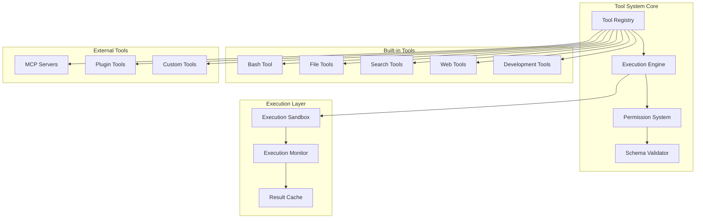

# Tool System Architecture

## Table of Contents

1. [Overview](#overview)
2. [Tool Architecture](#tool-architecture)  
3. [Tool Registry](#tool-registry)
4. [Built-in Tools](#built-in-tools)
5. [Tool Execution Engine](#tool-execution-engine)
6. [Permission System](#permission-system)
7. [MCP Integration](#mcp-integration)
8. [Custom Tools](#custom-tools)
9. [Tool Development Guide](#tool-development-guide)
10. [Performance and Security](#performance-and-security)

---

## Overview

The Tool System in ASI_Code is a sophisticated framework that provides AI models with controlled access to system operations, file management, web resources, and external services. It implements a secure, extensible architecture that supports both built-in tools and dynamic third-party integrations.

### Core Design Principles

1. **Security First**: Comprehensive permission system with user approval workflows
2. **Extensibility**: Plugin architecture for custom tools and MCP servers
3. **Type Safety**: Full TypeScript support with schema validation
4. **Performance**: Optimized execution with caching and connection pooling
5. **Reliability**: Error handling, retries, and graceful degradation
6. **Monitoring**: Comprehensive logging and execution tracking

### Tool System Architecture



---

## Tool Architecture

### 1. Base Tool Interface

```typescript
// /packages/opencode/src/tool/tool.ts

export interface Tool {
  id: string
  name: string
  description: string
  parameters: JSONSchema
  execute(params: any, context: ToolContext): Promise<any>
  
  // Optional lifecycle hooks
  initialize?(): Promise<void>
  shutdown?(): Promise<void>
  
  // Optional validation
  validate?(params: any): boolean
  
  // Optional caching
  getCacheKey?(params: any): string
}

export interface ToolContext {
  sessionId: string
  agentId: string
  workingDirectory: string
  permissions: AgentPermissions
  userId?: string
  timestamp: number
}

export interface ToolResult {
  success: boolean
  data?: any
  error?: string
  metadata?: {
    executionTime: number
    cacheHit?: boolean
    warnings?: string[]
  }
}
```

### 2. Abstract Tool Implementation

```typescript
export abstract class AbstractTool implements Tool {
  abstract readonly id: string
  abstract readonly name: string
  abstract readonly description: string
  abstract readonly parameters: JSONSchema
  
  protected cache = new Map<string, any>()
  protected log: ReturnType<typeof Log.create>
  
  constructor() {
    this.log = Log.create({ service: `tool:${this.id}` })
  }
  
  async execute(params: any, context: ToolContext): Promise<ToolResult> {
    const startTime = Date.now()
    
    try {
      // Validate parameters
      if (!this.validateParameters(params)) {
        return {
          success: false,
          error: "Invalid parameters",
          metadata: { executionTime: Date.now() - startTime }
        }
      }
      
      // Check cache
      const cacheKey = this.getCacheKey?.(params)
      if (cacheKey && this.cache.has(cacheKey)) {
        this.log.debug("Cache hit", { cacheKey })
        return {
          success: true,
          data: this.cache.get(cacheKey),
          metadata: { 
            executionTime: Date.now() - startTime,
            cacheHit: true
          }
        }
      }
      
      // Execute tool
      const result = await this.executeImpl(params, context)
      
      // Cache result if cacheable
      if (cacheKey && this.isCacheable(result)) {
        this.cache.set(cacheKey, result)
      }
      
      return {
        success: true,
        data: result,
        metadata: { executionTime: Date.now() - startTime }
      }
      
    } catch (error) {
      this.log.error("Tool execution failed", { params, error })
      return {
        success: false,
        error: error instanceof Error ? error.message : String(error),
        metadata: { executionTime: Date.now() - startTime }
      }
    }
  }
  
  protected abstract executeImpl(params: any, context: ToolContext): Promise<any>
  
  protected validateParameters(params: any): boolean {
    try {
      const validator = new Validator(this.parameters)
      return validator.validate(params).valid
    } catch {
      return false
    }
  }
  
  protected isCacheable(result: any): boolean {
    return result != null && typeof result === 'object'
  }
  
  async initialize(): Promise<void> {
    this.log.info(`Tool ${this.id} initialized`)
  }
  
  async shutdown(): Promise<void> {
    this.cache.clear()
    this.log.info(`Tool ${this.id} shutdown`)
  }
}
```

---

## Tool Registry

### 1. Registry Implementation

```typescript
// /packages/opencode/src/tool/registry.ts

export namespace ToolRegistry {
  const ALL_TOOLS = [
    BashTool,
    EditTool,
    ReadTool,
    WriteTool,
    GrepTool,
    GlobTool,
    ListTool,
    WebFetchTool,
    PatchTool,
    TodoWriteTool,
    TodoReadTool,
    TaskTool
  ]
  
  export function ids(): string[] {
    return ALL_TOOLS.map(tool => tool.id)
  }
  
  export async function tools(
    providerId: string, 
    modelId: string
  ): Promise<ToolDefinition[]> {
    const result = await Promise.all(
      ALL_TOOLS.map(async (ToolClass) => {
        try {
          const tool = new ToolClass()
          await tool.initialize()
          
          return {
            id: tool.id,
            name: tool.name,
            description: tool.description,
            parameters: tool.parameters
          }
        } catch (error) {
          log.error(`Failed to initialize tool ${ToolClass.name}`, error)
          return null
        }
      })
    ).then(results => results.filter(Boolean))
    
    // Apply provider-specific transformations
    return transformForProvider(result, providerId)
  }
  
  export async function enabled(
    providerId: string,
    modelId: string,
    agent: Agent.Info
  ): Promise<Record<string, boolean>> {
    const enabledTools: Record<string, boolean> = {}
    
    // Apply agent permissions
    if (agent.permission.edit === "deny") {
      enabledTools["edit"] = false
      enabledTools["write"] = false
      enabledTools["patch"] = false
    }
    
    if (agent.permission.bash["*"] === "deny") {
      enabledTools["bash"] = false
    }
    
    if (agent.permission.webfetch === "deny") {
      enabledTools["webfetch"] = false
    }
    
    // Apply agent tool overrides
    for (const [toolId, enabled] of Object.entries(agent.tools)) {
      enabledTools[toolId] = enabled
    }
    
    return enabledTools
  }
  
  export async function execute(
    toolId: string,
    params: any,
    context: ToolContext
  ): Promise<ToolResult> {
    const ToolClass = ALL_TOOLS.find(t => t.id === toolId)
    if (!ToolClass) {
      throw new Error(`Unknown tool: ${toolId}`)
    }
    
    const tool = new ToolClass()
    return tool.execute(params, context)
  }
  
  private function transformForProvider(
    tools: ToolDefinition[],
    providerId: string
  ): ToolDefinition[] {
    switch (providerId) {
      case "openai":
      case "azure":
        // Convert optional parameters to nullable for OpenAI compatibility
        return tools.map(tool => ({
          ...tool,
          parameters: optionalToNullable(tool.parameters)
        }))
        
      case "google":
        // Sanitize parameters for Gemini compatibility
        return tools.map(tool => ({
          ...tool,
          parameters: sanitizeGeminiParameters(tool.parameters)
        }))
        
      default:
        return tools
    }
  }
}

interface ToolDefinition {
  id: string
  name: string
  description: string
  parameters: JSONSchema
}
```

### 2. Dynamic Tool Discovery

```typescript
export class DynamicToolRegistry {
  private tools = new Map<string, Tool>()
  private mcpTools = new Map<string, MCPTool>()
  private pluginTools = new Map<string, PluginTool>()
  
  async discoverTools(): Promise<void> {
    // Discover MCP tools
    await this.discoverMCPTools()
    
    // Discover plugin tools
    await this.discoverPluginTools()
    
    // Discover custom tools
    await this.discoverCustomTools()
  }
  
  private async discoverMCPTools(): Promise<void> {
    const mcpServers = await MCP.getServers()
    
    for (const server of mcpServers) {
      try {
        const tools = await server.getTools()
        
        for (const toolDef of tools) {
          const mcpTool = new MCPToolAdapter(toolDef, server)
          this.mcpTools.set(toolDef.name, mcpTool)
          
          log.info("Discovered MCP tool", {
            name: toolDef.name,
            server: server.name
          })
        }
      } catch (error) {
        log.error(`Failed to discover tools from MCP server ${server.name}`, error)
      }
    }
  }
  
  private async discoverPluginTools(): Promise<void> {
    const plugins = await Plugin.getManager().getPlugins()
    
    for (const plugin of plugins) {
      if (plugin.hasTools()) {
        try {
          const tools = await plugin.getTools()
          
          for (const tool of tools) {
            this.pluginTools.set(tool.id, tool)
            
            log.info("Discovered plugin tool", {
              id: tool.id,
              plugin: plugin.id
            })
          }
        } catch (error) {
          log.error(`Failed to discover tools from plugin ${plugin.id}`, error)
        }
      }
    }
  }
  
  private async discoverCustomTools(): Promise<void> {
    const toolsDir = path.join(process.cwd(), "tools")
    
    try {
      const files = await fs.readdir(toolsDir)
      
      for (const file of files) {
        if (file.endsWith(".js") || file.endsWith(".ts")) {
          try {
            const toolPath = path.join(toolsDir, file)
            const toolModule = await import(toolPath)
            
            if (toolModule.default && typeof toolModule.default === "function") {
              const tool = new toolModule.default()
              if (this.isValidTool(tool)) {
                this.tools.set(tool.id, tool)
                
                log.info("Discovered custom tool", {
                  id: tool.id,
                  file: file
                })
              }
            }
          } catch (error) {
            log.error(`Failed to load custom tool ${file}`, error)
          }
        }
      }
    } catch (error) {
      // Tools directory doesn't exist or is not accessible
      log.debug("No custom tools directory found")
    }
  }
  
  private isValidTool(obj: any): obj is Tool {
    return obj &&
           typeof obj.id === 'string' &&
           typeof obj.name === 'string' &&
           typeof obj.description === 'string' &&
           typeof obj.execute === 'function' &&
           obj.parameters &&
           typeof obj.parameters === 'object'
  }
  
  getAllTools(): Map<string, Tool> {
    const allTools = new Map(this.tools)
    
    // Add MCP tools
    for (const [id, tool] of this.mcpTools) {
      allTools.set(`mcp:${id}`, tool)
    }
    
    // Add plugin tools
    for (const [id, tool] of this.pluginTools) {
      allTools.set(`plugin:${id}`, tool)
    }
    
    return allTools
  }
}
```

---

## Built-in Tools

### 1. Bash Tool

```typescript
// /packages/opencode/src/tool/bash.ts

export class BashTool extends AbstractTool {
  readonly id = "bash"
  readonly name = "Bash Tool"
  readonly description = "Executes bash commands in a persistent shell session"
  
  readonly parameters = {
    type: "object",
    properties: {
      command: {
        type: "string",
        description: "The command to execute"
      },
      timeout: {
        type: "number",
        description: "Optional timeout in milliseconds (max 600000)"
      },
      description: {
        type: "string", 
        description: "Clear, concise description of what this command does"
      }
    },
    required: ["command", "description"],
    additionalProperties: false
  }
  
  private shells = new Map<string, PersistentShell>()
  
  protected async executeImpl(params: any, context: ToolContext): Promise<any> {
    const { command, timeout = 120000, description } = params
    
    // Get or create persistent shell for session
    const shell = this.getShell(context.sessionId, context.workingDirectory)
    
    // Log command execution
    this.log.info("Executing bash command", {
      command,
      description,
      sessionId: context.sessionId,
      workingDirectory: context.workingDirectory
    })
    
    try {
      const result = await shell.execute(command, { timeout })
      
      return {
        stdout: result.stdout,
        stderr: result.stderr,
        exitCode: result.exitCode,
        success: result.exitCode === 0
      }
    } catch (error) {
      if (error instanceof TimeoutError) {
        throw new Error(`Command timed out after ${timeout}ms`)
      }
      throw error
    }
  }
  
  private getShell(sessionId: string, workingDirectory: string): PersistentShell {
    if (!this.shells.has(sessionId)) {
      const shell = new PersistentShell({
        cwd: workingDirectory,
        timeout: 120000,
        env: {
          ...process.env,
          // Add session-specific environment variables
          OPENCODE_SESSION_ID: sessionId,
          OPENCODE_WORKING_DIR: workingDirectory
        }
      })
      
      this.shells.set(sessionId, shell)
      
      // Clean up shell after session ends
      setTimeout(() => {
        this.shells.delete(sessionId)
        shell.destroy()
      }, 30 * 60 * 1000) // 30 minutes
    }
    
    return this.shells.get(sessionId)!
  }
  
  async shutdown(): Promise<void> {
    // Close all persistent shells
    for (const shell of this.shells.values()) {
      shell.destroy()
    }
    this.shells.clear()
    
    await super.shutdown()
  }
}

class PersistentShell {
  private process: ChildProcess
  private queue: Array<{
    command: string
    resolve: (result: any) => void
    reject: (error: Error) => void
    timeout: number
  }> = []
  
  private executing = false
  
  constructor(private options: {
    cwd: string
    timeout: number
    env: Record<string, string>
  }) {
    this.createProcess()
  }
  
  private createProcess(): void {
    this.process = spawn("/bin/bash", ["-i"], {
      cwd: this.options.cwd,
      env: this.options.env,
      stdio: ["pipe", "pipe", "pipe"]
    })
    
    this.process.on("error", (error) => {
      this.log.error("Shell process error", error)
      this.rejectCurrentCommand(error)
    })
    
    this.process.on("exit", (code) => {
      this.log.info("Shell process exited", { code })
      if (this.executing) {
        this.rejectCurrentCommand(new Error("Shell process exited"))
      }
    })
  }
  
  async execute(command: string, options: { timeout: number }): Promise<any> {
    return new Promise((resolve, reject) => {
      this.queue.push({
        command,
        resolve,
        reject,
        timeout: options.timeout
      })
      
      this.processQueue()
    })
  }
  
  private async processQueue(): Promise<void> {
    if (this.executing || this.queue.length === 0) {
      return
    }
    
    this.executing = true
    const task = this.queue.shift()!
    
    try {
      const result = await this.executeCommand(task.command, task.timeout)
      task.resolve(result)
    } catch (error) {
      task.reject(error)
    } finally {
      this.executing = false
      // Process next command
      this.processQueue()
    }
  }
  
  private async executeCommand(command: string, timeout: number): Promise<any> {
    const marker = `__OPENCODE_COMMAND_END_${Date.now()}__`
    const fullCommand = `${command}; echo "${marker}"; echo "EXIT_CODE:$?" >&2`
    
    let stdout = ""
    let stderr = ""
    let exitCode = 0
    
    const timeoutId = setTimeout(() => {
      throw new TimeoutError(`Command timeout after ${timeout}ms`)
    }, timeout)
    
    return new Promise((resolve, reject) => {
      const onStdout = (data: Buffer) => {
        const text = data.toString()
        stdout += text
        
        if (text.includes(marker)) {
          // Command completed
          stdout = stdout.replace(marker, "").trim()
          cleanup()
          resolve({ stdout, stderr, exitCode })
        }
      }
      
      const onStderr = (data: Buffer) => {
        const text = data.toString()
        stderr += text
        
        // Extract exit code
        const exitMatch = text.match(/EXIT_CODE:(\d+)/)
        if (exitMatch) {
          exitCode = parseInt(exitMatch[1])
          stderr = stderr.replace(/EXIT_CODE:\d+/, "").trim()
        }
      }
      
      const cleanup = () => {
        clearTimeout(timeoutId)
        this.process.stdout?.removeListener("data", onStdout)
        this.process.stderr?.removeListener("data", onStderr)
      }
      
      this.process.stdout?.on("data", onStdout)
      this.process.stderr?.on("data", onStderr)
      
      // Send command
      this.process.stdin?.write(fullCommand + "\n")
    })
  }
  
  destroy(): void {
    if (this.process && !this.process.killed) {
      this.process.kill("SIGTERM")
    }
  }
}

class TimeoutError extends Error {
  constructor(message: string) {
    super(message)
    this.name = "TimeoutError"
  }
}
```

### 2. File Tools

```typescript
// /packages/opencode/src/tool/edit.ts

export class EditTool extends AbstractTool {
  readonly id = "edit"
  readonly name = "Edit Tool"
  readonly description = "Performs exact string replacements in files"
  
  readonly parameters = {
    type: "object",
    properties: {
      filePath: {
        type: "string",
        description: "The absolute path to the file to modify"
      },
      oldString: {
        type: "string",
        description: "The text to replace"
      },
      newString: {
        type: "string", 
        description: "The text to replace it with"
      },
      replaceAll: {
        type: "boolean",
        default: false,
        description: "Replace all occurrences"
      }
    },
    required: ["filePath", "oldString", "newString"],
    additionalProperties: false
  }
  
  protected async executeImpl(params: any, context: ToolContext): Promise<any> {
    const { filePath, oldString, newString, replaceAll = false } = params
    
    // Validate file path is absolute
    if (!path.isAbsolute(filePath)) {
      throw new Error("File path must be absolute")
    }
    
    // Check if file exists
    if (!await fs.exists(filePath)) {
      throw new Error(`File not found: ${filePath}`)
    }
    
    // Read current content
    const content = await fs.readFile(filePath, 'utf-8')
    
    // Perform replacement
    let newContent: string
    if (replaceAll) {
      newContent = content.split(oldString).join(newString)
    } else {
      // Check if old string exists and is unique
      const occurrences = content.split(oldString).length - 1
      if (occurrences === 0) {
        throw new Error("Old string not found in file")
      }
      if (occurrences > 1) {
        throw new Error("Old string found multiple times. Use replaceAll: true or provide more context")
      }
      
      newContent = content.replace(oldString, newString)
    }
    
    // Check if content actually changed
    if (content === newContent) {
      return {
        changed: false,
        message: "No changes made - old string and new string are identical"
      }
    }
    
    // Write updated content
    await fs.writeFile(filePath, newContent, 'utf-8')
    
    // Log the edit
    this.log.info("File edited", {
      filePath,
      oldLength: content.length,
      newLength: newContent.length,
      replaceAll,
      sessionId: context.sessionId
    })
    
    // Publish file edit event
    Bus.publish(Bus.event("file.edited", z.object({
      path: z.string(),
      sessionId: z.string(),
      timestamp: z.number()
    })), {
      path: filePath,
      sessionId: context.sessionId,
      timestamp: Date.now()
    })
    
    return {
      changed: true,
      filePath,
      changes: {
        oldLength: content.length,
        newLength: newContent.length,
        replaceAll
      }
    }
  }
}

// /packages/opencode/src/tool/read.ts

export class ReadTool extends AbstractTool {
  readonly id = "read"
  readonly name = "Read Tool"
  readonly description = "Reads a file from the local filesystem"
  
  readonly parameters = {
    type: "object",
    properties: {
      filePath: {
        type: "string",
        description: "The absolute path to the file to read"
      },
      offset: {
        type: "number",
        description: "The line number to start reading from (0-based)"
      },
      limit: {
        type: "number",
        description: "The number of lines to read (defaults to 2000)"
      }
    },
    required: ["filePath"],
    additionalProperties: false
  }
  
  protected async executeImpl(params: any, context: ToolContext): Promise<any> {
    const { filePath, offset = 0, limit = 2000 } = params
    
    // Validate file path
    if (!path.isAbsolute(filePath)) {
      throw new Error("File path must be absolute")
    }
    
    try {
      // Check if file exists
      const stats = await fs.stat(filePath)
      
      if (!stats.isFile()) {
        throw new Error("Path is not a file")
      }
      
      // Read file content
      const content = await fs.readFile(filePath, 'utf-8')
      const lines = content.split('\n')
      
      // Apply offset and limit
      const selectedLines = lines.slice(offset, offset + limit)
      
      // Format with line numbers (cat -n style)
      const formattedContent = selectedLines
        .map((line, index) => {
          const lineNumber = offset + index + 1
          return `${lineNumber.toString().padStart(6)}→${line}`
        })
        .join('\n')
      
      return {
        content: formattedContent,
        totalLines: lines.length,
        readLines: selectedLines.length,
        offset,
        filePath,
        size: stats.size
      }
      
    } catch (error) {
      if (error.code === 'ENOENT') {
        throw new Error(`File not found: ${filePath}`)
      }
      if (error.code === 'EISDIR') {
        throw new Error(`Path is a directory, not a file: ${filePath}`)
      }
      if (error.code === 'EACCES') {
        throw new Error(`Permission denied: ${filePath}`)
      }
      throw error
    }
  }
  
  // Cache read results for frequently accessed files
  getCacheKey(params: any): string {
    const { filePath, offset = 0, limit = 2000 } = params
    return `read:${filePath}:${offset}:${limit}`
  }
}

// /packages/opencode/src/tool/write.ts

export class WriteTool extends AbstractTool {
  readonly id = "write"
  readonly name = "Write Tool"
  readonly description = "Writes a file to the local filesystem"
  
  readonly parameters = {
    type: "object",
    properties: {
      filePath: {
        type: "string",
        description: "The absolute path to the file to write"
      },
      content: {
        type: "string",
        description: "The content to write to the file"
      },
      createDirectories: {
        type: "boolean",
        default: true,
        description: "Create parent directories if they don't exist"
      }
    },
    required: ["filePath", "content"],
    additionalProperties: false
  }
  
  protected async executeImpl(params: any, context: ToolContext): Promise<any> {
    const { filePath, content, createDirectories = true } = params
    
    // Validate file path
    if (!path.isAbsolute(filePath)) {
      throw new Error("File path must be absolute")
    }
    
    // Create parent directories if needed
    if (createDirectories) {
      const dir = path.dirname(filePath)
      await fs.mkdir(dir, { recursive: true })
    }
    
    // Check if file already exists
    const exists = await fs.exists(filePath)
    
    // Write file
    await fs.writeFile(filePath, content, 'utf-8')
    
    // Get file stats
    const stats = await fs.stat(filePath)
    
    this.log.info("File written", {
      filePath,
      size: stats.size,
      created: !exists,
      sessionId: context.sessionId
    })
    
    // Publish file creation/update event
    Bus.publish(Bus.event("file.written", z.object({
      path: z.string(),
      created: z.boolean(),
      size: z.number(),
      sessionId: z.string(),
      timestamp: z.number()
    })), {
      path: filePath,
      created: !exists,
      size: stats.size,
      sessionId: context.sessionId,
      timestamp: Date.now()
    })
    
    return {
      filePath,
      size: stats.size,
      created: !exists,
      success: true
    }
  }
}
```

### 3. Search Tools

```typescript
// /packages/opencode/src/tool/grep.ts

export class GrepTool extends AbstractTool {
  readonly id = "grep"
  readonly name = "Grep Tool"
  readonly description = "Fast content search using ripgrep"
  
  readonly parameters = {
    type: "object",
    properties: {
      pattern: {
        type: "string",
        description: "The regex pattern to search for"
      },
      path: {
        type: "string",
        description: "The directory to search in"
      },
      include: {
        type: "string", 
        description: "File pattern to include (e.g. '*.js', '*.{ts,tsx}')"
      },
      caseSensitive: {
        type: "boolean",
        default: true,
        description: "Case sensitive search"
      },
      contextLines: {
        type: "number",
        description: "Number of context lines to show around matches"
      }
    },
    required: ["pattern"],
    additionalProperties: false
  }
  
  protected async executeImpl(params: any, context: ToolContext): Promise<any> {
    const { 
      pattern, 
      path: searchPath = context.workingDirectory,
      include,
      caseSensitive = true,
      contextLines = 0
    } = params
    
    // Build ripgrep command
    const args = [
      "--json",
      "--heading",
      "--line-number",
      "--column"
    ]
    
    if (!caseSensitive) {
      args.push("--ignore-case")
    }
    
    if (contextLines > 0) {
      args.push("--context", contextLines.toString())
    }
    
    if (include) {
      args.push("--glob", include)
    }
    
    args.push("--", pattern, searchPath)
    
    // Execute ripgrep
    const result = await this.executeRipgrep(args)
    
    // Parse JSON output
    const matches = this.parseRipgrepOutput(result.stdout)
    
    return {
      pattern,
      matches,
      totalMatches: matches.length,
      searchPath,
      include
    }
  }
  
  private async executeRipgrep(args: string[]): Promise<{ stdout: string; stderr: string }> {
    return new Promise((resolve, reject) => {
      const process = spawn("rg", args, {
        stdio: ["pipe", "pipe", "pipe"]
      })
      
      let stdout = ""
      let stderr = ""
      
      process.stdout.on("data", (data) => {
        stdout += data.toString()
      })
      
      process.stderr.on("data", (data) => {
        stderr += data.toString()
      })
      
      process.on("close", (code) => {
        if (code === 0 || code === 1) { // 0 = matches found, 1 = no matches
          resolve({ stdout, stderr })
        } else {
          reject(new Error(`ripgrep failed with code ${code}: ${stderr}`))
        }
      })
      
      process.on("error", (error) => {
        reject(new Error(`Failed to start ripgrep: ${error.message}`))
      })
    })
  }
  
  private parseRipgrepOutput(output: string): any[] {
    const matches = []
    const lines = output.split('\n').filter(line => line.trim())
    
    for (const line of lines) {
      try {
        const json = JSON.parse(line)
        
        if (json.type === "match") {
          matches.push({
            file: json.data.path.text,
            line: json.data.line_number,
            column: json.data.submatches[0]?.start || 0,
            text: json.data.lines.text,
            match: json.data.submatches[0]?.match?.text || ""
          })
        }
      } catch {
        // Skip invalid JSON lines
      }
    }
    
    return matches
  }
  
  // Cache search results for repeated patterns
  getCacheKey(params: any): string {
    const { pattern, path, include, caseSensitive } = params
    return `grep:${pattern}:${path || 'cwd'}:${include || 'all'}:${caseSensitive}`
  }
}

// /packages/opencode/src/tool/glob.ts

export class GlobTool extends AbstractTool {
  readonly id = "glob"
  readonly name = "Glob Tool"
  readonly description = "Fast file pattern matching"
  
  readonly parameters = {
    type: "object",
    properties: {
      pattern: {
        type: "string",
        description: "The glob pattern to match files against"
      },
      path: {
        type: "string",
        description: "The directory to search in"
      },
      followSymlinks: {
        type: "boolean",
        default: false,
        description: "Follow symbolic links"
      },
      includeHidden: {
        type: "boolean", 
        default: false,
        description: "Include hidden files and directories"
      }
    },
    required: ["pattern"],
    additionalProperties: false
  }
  
  protected async executeImpl(params: any, context: ToolContext): Promise<any> {
    const { 
      pattern, 
      path: searchPath = context.workingDirectory,
      followSymlinks = false,
      includeHidden = false 
    } = params
    
    const options = {
      cwd: searchPath,
      followSymbolicLinks: followSymlinks,
      dot: includeHidden,
      absolute: true
    }
    
    // Use fast-glob for better performance
    const { glob } = await import("glob")
    const matches = await glob(pattern, options)
    
    // Sort by modification time (most recent first)
    const filesWithStats = await Promise.all(
      matches.map(async (file) => {
        try {
          const stats = await fs.stat(file)
          return {
            path: file,
            size: stats.size,
            modified: stats.mtime.getTime(),
            isDirectory: stats.isDirectory()
          }
        } catch {
          return {
            path: file,
            size: 0,
            modified: 0,
            isDirectory: false
          }
        }
      })
    )
    
    const sortedFiles = filesWithStats.sort((a, b) => b.modified - a.modified)
    
    return {
      pattern,
      matches: sortedFiles.map(f => f.path),
      details: sortedFiles,
      totalMatches: sortedFiles.length,
      searchPath
    }
  }
  
  getCacheKey(params: any): string {
    const { pattern, path, followSymlinks, includeHidden } = params
    return `glob:${pattern}:${path || 'cwd'}:${followSymlinks}:${includeHidden}`
  }
}
```

---

## Tool Execution Engine

### 1. Execution Engine

```typescript
export class ToolExecutionEngine {
  private executionQueue = new Map<string, Promise<ToolResult>>()
  private rateLimiter = new RateLimiter({ maxConcurrent: 10, windowMs: 1000 })
  private monitor = new ExecutionMonitor()
  
  async execute(
    toolId: string,
    params: any,
    context: ToolContext
  ): Promise<ToolResult> {
    // Check if same execution is already in progress
    const executionKey = this.getExecutionKey(toolId, params, context)
    
    if (this.executionQueue.has(executionKey)) {
      return this.executionQueue.get(executionKey)!
    }
    
    // Create execution promise
    const executionPromise = this.executeWithMonitoring(toolId, params, context)
    
    // Cache execution promise
    this.executionQueue.set(executionKey, executionPromise)
    
    try {
      const result = await executionPromise
      return result
    } finally {
      // Clean up execution cache
      setTimeout(() => {
        this.executionQueue.delete(executionKey)
      }, 1000)
    }
  }
  
  private async executeWithMonitoring(
    toolId: string,
    params: any,
    context: ToolContext
  ): Promise<ToolResult> {
    const startTime = Date.now()
    const executionId = ulid()
    
    try {
      // Apply rate limiting
      await this.rateLimiter.acquire()
      
      // Start monitoring
      this.monitor.startExecution(executionId, {
        toolId,
        params,
        context,
        startTime
      })
      
      // Get tool instance
      const tool = await this.getTool(toolId)
      if (!tool) {
        throw new Error(`Tool not found: ${toolId}`)
      }
      
      // Execute tool
      const result = await tool.execute(params, context)
      
      // Record successful execution
      this.monitor.completeExecution(executionId, result)
      
      return result
      
    } catch (error) {
      // Record failed execution
      this.monitor.failExecution(executionId, error)
      
      throw error
    } finally {
      this.rateLimiter.release()
    }
  }
  
  private getExecutionKey(toolId: string, params: any, context: ToolContext): string {
    // Create deterministic key for caching identical executions
    const paramsHash = crypto.createHash('sha256')
      .update(JSON.stringify(params))
      .digest('hex')
      .substring(0, 8)
    
    return `${toolId}:${paramsHash}:${context.sessionId}`
  }
  
  private async getTool(toolId: string): Promise<Tool | null> {
    // Try built-in tools first
    const BuiltinTool = ToolRegistry.getToolClass(toolId)
    if (BuiltinTool) {
      return new BuiltinTool()
    }
    
    // Try dynamic tools
    const dynamicRegistry = await DynamicToolRegistry.getInstance()
    return dynamicRegistry.getTool(toolId)
  }
}

class ExecutionMonitor {
  private executions = new Map<string, ExecutionInfo>()
  
  startExecution(id: string, info: any): void {
    this.executions.set(id, {
      ...info,
      status: 'running',
      startTime: Date.now()
    })
    
    Log.info("Tool execution started", {
      executionId: id,
      toolId: info.toolId,
      sessionId: info.context.sessionId
    })
  }
  
  completeExecution(id: string, result: ToolResult): void {
    const execution = this.executions.get(id)
    if (execution) {
      execution.status = 'completed'
      execution.endTime = Date.now()
      execution.result = result
      
      Log.info("Tool execution completed", {
        executionId: id,
        toolId: execution.toolId,
        duration: execution.endTime - execution.startTime,
        success: result.success
      })
    }
  }
  
  failExecution(id: string, error: any): void {
    const execution = this.executions.get(id)
    if (execution) {
      execution.status = 'failed'
      execution.endTime = Date.now()
      execution.error = error
      
      Log.error("Tool execution failed", {
        executionId: id,
        toolId: execution.toolId,
        duration: execution.endTime - execution.startTime,
        error: error.message
      })
    }
  }
  
  getMetrics(): ExecutionMetrics {
    const executions = Array.from(this.executions.values())
    
    return {
      total: executions.length,
      running: executions.filter(e => e.status === 'running').length,
      completed: executions.filter(e => e.status === 'completed').length,
      failed: executions.filter(e => e.status === 'failed').length,
      averageDuration: this.calculateAverageDuration(executions)
    }
  }
  
  private calculateAverageDuration(executions: ExecutionInfo[]): number {
    const completed = executions.filter(e => e.endTime && e.startTime)
    if (completed.length === 0) return 0
    
    const totalDuration = completed.reduce((sum, e) => 
      sum + (e.endTime! - e.startTime), 0)
    
    return totalDuration / completed.length
  }
}

class RateLimiter {
  private running = 0
  private queue: Array<{ resolve: () => void; reject: (error: Error) => void }> = []
  
  constructor(private options: { maxConcurrent: number; windowMs: number }) {}
  
  async acquire(): Promise<void> {
    return new Promise((resolve, reject) => {
      if (this.running < this.options.maxConcurrent) {
        this.running++
        resolve()
      } else {
        this.queue.push({ resolve, reject })
      }
    })
  }
  
  release(): void {
    this.running--
    
    if (this.queue.length > 0) {
      const next = this.queue.shift()!
      this.running++
      next.resolve()
    }
  }
}
```

---

## Permission System

### 1. Permission Architecture

```typescript
export namespace Permission {
  export interface PermissionRequest {
    tool: string
    action: string
    resource: string
    context: ToolContext
    metadata?: Record<string, any>
  }
  
  export interface PermissionResponse {
    granted: boolean
    reason?: string
    restrictions?: Record<string, any>
    cached?: boolean
  }
  
  export class PermissionManager {
    private cache = new Map<string, PermissionResponse>()
    private policies = new Map<string, PermissionPolicy>()
    
    async checkPermission(request: PermissionRequest): Promise<PermissionResponse> {
      // Check cache first
      const cacheKey = this.getCacheKey(request)
      if (this.cache.has(cacheKey)) {
        const cached = this.cache.get(cacheKey)!
        return { ...cached, cached: true }
      }
      
      // Evaluate permission
      const response = await this.evaluatePermission(request)
      
      // Cache result if cacheable
      if (this.isCacheable(request, response)) {
        this.cache.set(cacheKey, response)
      }
      
      return response
    }
    
    private async evaluatePermission(request: PermissionRequest): Promise<PermissionResponse> {
      // Check agent permissions first
      const agentPermission = await this.checkAgentPermission(request)
      if (!agentPermission.granted) {
        return agentPermission
      }
      
      // Check global policies
      const policyPermission = await this.checkPolicies(request)
      if (!policyPermission.granted) {
        return policyPermission
      }
      
      // Check resource-specific permissions
      const resourcePermission = await this.checkResourcePermission(request)
      if (!resourcePermission.granted) {
        return resourcePermission
      }
      
      // Request user approval for sensitive operations
      if (this.requiresUserApproval(request)) {
        return this.requestUserApproval(request)
      }
      
      return { granted: true }
    }
    
    private async checkAgentPermission(request: PermissionRequest): Promise<PermissionResponse> {
      const context = request.context
      const agent = await Agent.get(context.agentId)
      
      switch (request.tool) {
        case "bash":
          return this.checkBashPermission(request, agent.permission.bash)
        case "edit":
        case "write":
        case "patch":
          return this.checkEditPermission(request, agent.permission.edit)
        case "webfetch":
          return this.checkWebfetchPermission(request, agent.permission.webfetch)
        default:
          // Default to allow for read-only tools
          return { granted: true }
      }
    }
    
    private checkBashPermission(
      request: PermissionRequest, 
      bashPermission: Record<string, Config.Permission>
    ): PermissionResponse {
      const command = request.metadata?.command || ""
      
      // Check specific command permissions
      for (const [pattern, permission] of Object.entries(bashPermission)) {
        if (pattern === "*" || this.matchesPattern(command, pattern)) {
          if (permission === "deny") {
            return {
              granted: false,
              reason: `Bash command '${command}' denied by agent policy`
            }
          }
          if (permission === "allow") {
            return { granted: true }
          }
        }
      }
      
      // Default to ask for unknown commands
      return {
        granted: false,
        reason: "User approval required for bash command"
      }
    }
    
    private checkEditPermission(
      request: PermissionRequest,
      editPermission: Config.Permission
    ): PermissionResponse {
      if (editPermission === "deny") {
        return {
          granted: false,
          reason: "File editing denied by agent policy"
        }
      }
      
      if (editPermission === "allow") {
        return { granted: true }
      }
      
      // Ask for approval
      return {
        granted: false,
        reason: "User approval required for file editing"
      }
    }
    
    private checkWebfetchPermission(
      request: PermissionRequest,
      webfetchPermission: Config.Permission
    ): PermissionResponse {
      if (webfetchPermission === "deny") {
        return {
          granted: false,
          reason: "Web fetch denied by agent policy"
        }
      }
      
      if (webfetchPermission === "allow") {
        return { granted: true }
      }
      
      // Check URL for safety
      const url = request.metadata?.url
      if (url && this.isSafeURL(url)) {
        return { granted: true }
      }
      
      return {
        granted: false,
        reason: "User approval required for web fetch"
      }
    }
    
    private requiresUserApproval(request: PermissionRequest): boolean {
      // Define sensitive operations that always require approval
      const sensitiveOperations = [
        { tool: "bash", patterns: ["rm", "sudo", "chmod", "chown"] },
        { tool: "edit", patterns: ["package.json", ".env", "config"] },
        { tool: "webfetch", patterns: ["localhost", "internal", "admin"] }
      ]
      
      for (const sensitive of sensitiveOperations) {
        if (request.tool === sensitive.tool) {
          const resource = request.resource.toLowerCase()
          const command = request.metadata?.command?.toLowerCase() || ""
          
          for (const pattern of sensitive.patterns) {
            if (resource.includes(pattern) || command.includes(pattern)) {
              return true
            }
          }
        }
      }
      
      return false
    }
    
    private async requestUserApproval(request: PermissionRequest): Promise<PermissionResponse> {
      // This would integrate with the UI for user approval
      // For now, return denied
      return {
        granted: false,
        reason: "User approval required but not implemented yet"
      }
    }
    
    private getCacheKey(request: PermissionRequest): string {
      return `${request.tool}:${request.action}:${request.resource}:${request.context.agentId}`
    }
    
    private isCacheable(request: PermissionRequest, response: PermissionResponse): boolean {
      // Cache allow decisions for read-only operations
      return response.granted && ["read", "grep", "glob", "list"].includes(request.tool)
    }
    
    private matchesPattern(text: string, pattern: string): boolean {
      if (pattern.includes("*")) {
        const regex = new RegExp(pattern.replace(/\*/g, ".*"))
        return regex.test(text)
      }
      return text.includes(pattern)
    }
    
    private isSafeURL(url: string): boolean {
      try {
        const parsed = new URL(url)
        
        // Block localhost and private IPs
        if (parsed.hostname === "localhost" || 
            parsed.hostname.startsWith("127.") ||
            parsed.hostname.startsWith("10.") ||
            parsed.hostname.startsWith("192.168.")) {
          return false
        }
        
        // Allow common safe domains
        const safeDomains = [
          "github.com",
          "stackoverflow.com",
          "developer.mozilla.org",
          "npmjs.com",
          "pypi.org"
        ]
        
        return safeDomains.some(domain => 
          parsed.hostname === domain || parsed.hostname.endsWith(`.${domain}`)
        )
        
      } catch {
        return false
      }
    }
  }
}
```

This comprehensive Tool System architecture provides ASI_Code with secure, extensible, and high-performance tool execution capabilities. The system supports both built-in and external tools, implements sophisticated permission controls, and provides excellent monitoring and debugging capabilities.