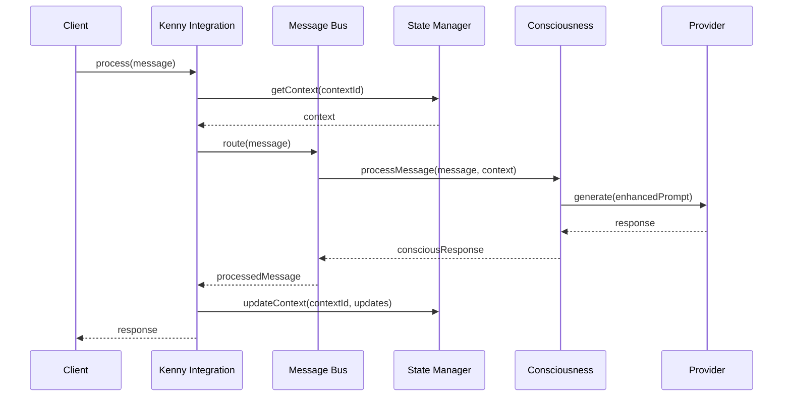
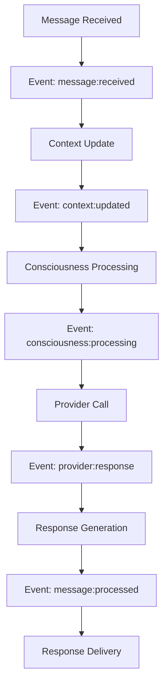
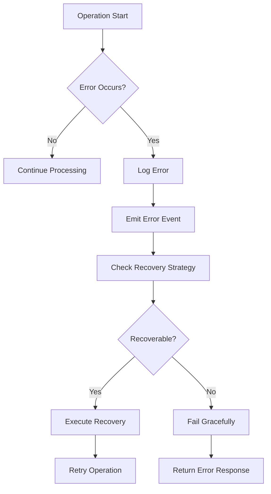

# Kenny Integration Pattern (KIP)

The Kenny Integration Pattern (KIP) is the foundational architecture pattern of ASI-Code, providing a standardized approach for integrating AI capabilities into software systems through consciousness-aware processing.

## Table of Contents

- [Overview](#overview)
- [Core Concepts](#core-concepts)
- [Architecture](#architecture)
- [Implementation](#implementation)
- [Message Flow](#message-flow)
- [State Management](#state-management)
- [Event System](#event-system)
- [Integration Points](#integration-points)
- [Best Practices](#best-practices)
- [Examples](#examples)

## Overview

The Kenny Integration Pattern represents a paradigm shift in AI system integration, moving beyond simple request-response patterns to create a consciousness-aware, context-preserving, and adaptable AI interaction framework.

### Key Principles

1. **Consciousness Awareness**: Every interaction is processed with awareness of context and state
2. **Context Preservation**: Rich context is maintained across all interactions
3. **Event-Driven Communication**: Loose coupling through event-based architecture
4. **Adaptive Behavior**: System learns and adapts based on interaction patterns
5. **Unified Interface**: Consistent API for all AI integrations

### Benefits

- **Enhanced AI Responsiveness**: Context-aware responses improve interaction quality
- **Scalable Architecture**: Event-driven design supports horizontal scaling
- **Maintainable Code**: Clear separation of concerns and modular design
- **Extensible Framework**: Easy to add new capabilities and integrations
- **Robust Error Handling**: Comprehensive error management and recovery

## Core Concepts

### 1. Kenny Context

The Kenny Context is the central data structure that maintains all relevant information about an interaction session.

```typescript
interface KennyContext {
  id: string;                    // Unique context identifier
  sessionId: string;             // Associated session ID
  userId?: string;               // User identifier
  metadata: Record<string, any>; // Custom metadata
  consciousness: {
    level: number;               // Consciousness level (0-100)
    state: 'active' | 'passive' | 'dormant';
    lastActivity: Date;
  };
  history?: MessageHistory;      // Interaction history
  preferences?: UserPreferences; // User-specific preferences
}
```

### 2. Kenny Message

Standardized message format for all communications within the system.

```typescript
interface KennyMessage {
  id: string;                    // Unique message identifier
  type: 'user' | 'assistant' | 'system' | 'tool';
  content: string;               // Message content
  timestamp: Date;               // Creation timestamp
  context: KennyContext;         // Associated context
  metadata?: {
    language?: string;           // Programming language
    framework?: string;          // Framework context
    tools?: string[];           // Available tools
    priority?: 'low' | 'normal' | 'high';
    [key: string]: any;         // Additional metadata
  };
}
```

### 3. Integration Interface

Core interface that all Kenny integrations must implement.

```typescript
interface KennyIntegrationPattern extends EventEmitter {
  // Lifecycle methods
  initialize(config: ASICodeConfig): Promise<void>;
  cleanup(): Promise<void>;
  
  // Core processing
  process(message: KennyMessage): Promise<KennyMessage>;
  
  // Context management
  createContext(sessionId: string, userId?: string): KennyContext;
  updateContext(contextId: string, updates: Partial<KennyContext>): Promise<void>;
  getContext(contextId: string): Promise<KennyContext | null>;
  
  // Event handling (from EventEmitter)
  on(event: string, listener: Function): this;
  emit(event: string, ...args: any[]): boolean;
}
```

## Architecture

### Component Structure

```
┌─────────────────────────────────────────────────────────────────────────┐
│                        Kenny Integration Pattern                        │
├─────────────────────────────────────────────────────────────────────────┤
│                            Public API                                  │
│  ┌─────────────┐  ┌─────────────┐  ┌─────────────┐  ┌─────────────┐   │
│  │   process   │  │createContext│  │updateContext│  │ getContext  │   │
│  │  (message)  │  │(sessionId)  │  │ (updates)   │  │(contextId)  │   │
│  └─────────────┘  └─────────────┘  └─────────────┘  └─────────────┘   │
├─────────────────────────────────────────────────────────────────────────┤
│                           Core Components                              │
│  ┌─────────────────────────────────────────────────────────────────────┐ │
│  │                        Message Bus                                 │ │
│  │  ┌─────────────┐  ┌─────────────┐  ┌─────────────┐  ┌─────────────┐│ │
│  │  │   Routing   │  │ Filtering   │  │Transformation│  │ Validation  ││ │
│  │  └─────────────┘  └─────────────┘  └─────────────┘  └─────────────┘│ │
│  └─────────────────────────────────────────────────────────────────────┘ │
│  ┌─────────────────────────────────────────────────────────────────────┐ │
│  │                      State Manager                                 │ │
│  │  ┌─────────────┐  ┌─────────────┐  ┌─────────────┐  ┌─────────────┐│ │
│  │  │   Context   │  │    State    │  │   History   │  │ Persistence ││ │
│  │  │    Store    │  │  Tracking   │  │  Management │  │   Layer     ││ │
│  │  └─────────────┘  └─────────────┘  └─────────────┘  └─────────────┘│ │
│  └─────────────────────────────────────────────────────────────────────┘ │
│  ┌─────────────────────────────────────────────────────────────────────┐ │
│  │                      Event System                                  │ │
│  │  ┌─────────────┐  ┌─────────────┐  ┌─────────────┐  ┌─────────────┐│ │
│  │  │ Event Queue │  │  Listeners  │  │ Middleware  │  │ Error Mgmt  ││ │
│  │  └─────────────┘  └─────────────┘  └─────────────┘  └─────────────┘│ │
│  └─────────────────────────────────────────────────────────────────────┘ │
├─────────────────────────────────────────────────────────────────────────┤
│                         Integration Layer                              │
│  ┌─────────────┐  ┌─────────────┐  ┌─────────────┐  ┌─────────────┐   │
│  │Consciousness│  │  Provider   │  │    Tool     │  │   Session   │   │
│  │   Engine    │  │  Manager    │  │   Manager   │  │  Manager    │   │
│  └─────────────┘  └─────────────┘  └─────────────┘  └─────────────┘   │
└─────────────────────────────────────────────────────────────────────────┘
```

### Subsystem Architecture

The Kenny Integration Pattern is composed of several subsystems that work together:

#### 1. Base Subsystem

```typescript
abstract class BaseSubsystem extends EventEmitter {
  protected name: string;
  protected config: SubsystemConfig;
  protected logger: Logger;
  protected isInitialized: boolean = false;
  
  constructor(name: string, config: SubsystemConfig) {
    super();
    this.name = name;
    this.config = config;
    this.logger = createLogger(`kenny:${name}`);
  }
  
  abstract initialize(): Promise<void>;
  abstract process(data: any): Promise<any>;
  abstract cleanup(): Promise<void>;
  
  protected async safeExecute<T>(operation: () => Promise<T>): Promise<T | null> {
    try {
      return await operation();
    } catch (error) {
      this.logger.error(`Operation failed in ${this.name}`, { error });
      this.emit('error', error);
      return null;
    }
  }
}
```

#### 2. Message Bus

Central communication hub for all subsystems.

```typescript
class MessageBus extends BaseSubsystem {
  private subscribers = new Map<string, Set<MessageHandler>>();
  private middleware: MessageMiddleware[] = [];
  private messageQueue: MessageQueue;
  
  async process(message: KennyMessage): Promise<KennyMessage> {
    // Apply middleware
    let processedMessage = message;
    for (const middleware of this.middleware) {
      processedMessage = await middleware.process(processedMessage);
    }
    
    // Route to subscribers
    const handlers = this.subscribers.get(message.type) || new Set();
    const results = await Promise.all(
      Array.from(handlers).map(handler => 
        this.safeExecute(() => handler(processedMessage))
      )
    );
    
    // Aggregate results
    return this.aggregateResults(processedMessage, results);
  }
  
  subscribe(messageType: string, handler: MessageHandler): void {
    if (!this.subscribers.has(messageType)) {
      this.subscribers.set(messageType, new Set());
    }
    this.subscribers.get(messageType)!.add(handler);
  }
  
  unsubscribe(messageType: string, handler: MessageHandler): void {
    this.subscribers.get(messageType)?.delete(handler);
  }
}
```

#### 3. State Manager

Manages context and state across interactions.

```typescript
class StateManager extends BaseSubsystem {
  private contexts = new Map<string, KennyContext>();
  private stateHistory = new Map<string, ContextHistory>();
  private persistenceAdapter: PersistenceAdapter;
  
  async createContext(sessionId: string, userId?: string): Promise<KennyContext> {
    const context: KennyContext = {
      id: this.generateContextId(),
      sessionId,
      userId,
      metadata: {},
      consciousness: {
        level: 1,
        state: 'active',
        lastActivity: new Date()
      }
    };
    
    this.contexts.set(context.id, context);
    await this.persistContext(context);
    
    this.emit('context:created', context);
    return context;
  }
  
  async updateContext(contextId: string, updates: Partial<KennyContext>): Promise<void> {
    const context = this.contexts.get(contextId);
    if (!context) {
      throw new Error(`Context not found: ${contextId}`);
    }
    
    const previousState = { ...context };
    Object.assign(context, updates);
    
    await this.persistContext(context);
    this.recordStateChange(contextId, previousState, context);
    
    this.emit('context:updated', { contextId, updates, context });
  }
  
  async getContext(contextId: string): Promise<KennyContext | null> {
    let context = this.contexts.get(contextId);
    
    if (!context && this.persistenceAdapter) {
      context = await this.persistenceAdapter.loadContext(contextId);
      if (context) {
        this.contexts.set(contextId, context);
      }
    }
    
    return context || null;
  }
}
```

## Implementation

### Default Kenny Integration

```typescript
export class DefaultKennyIntegration extends EventEmitter implements KennyIntegrationPattern {
  private config: ASICodeConfig | null = null;
  private messageBus: MessageBus;
  private stateManager: StateManager;
  private eventSystem: EventSystem;
  private subsystems = new Map<string, BaseSubsystem>();
  
  constructor() {
    super();
    this.messageBus = new MessageBus('message-bus', {});
    this.stateManager = new StateManager('state-manager', {});
    this.eventSystem = new EventSystem('event-system', {});
    
    this.setupSubsystems();
    this.setupEventHandlers();
  }
  
  async initialize(config: ASICodeConfig): Promise<void> {
    this.config = config;
    
    // Initialize all subsystems
    await Promise.all([
      this.messageBus.initialize(),
      this.stateManager.initialize(),
      this.eventSystem.initialize()
    ]);
    
    // Initialize additional subsystems
    for (const [name, subsystem] of this.subsystems) {
      await subsystem.initialize();
      this.logger.info(`Subsystem initialized: ${name}`);
    }
    
    this.emit('initialized', { config });
    this.logger.info('Kenny Integration Pattern initialized');
  }
  
  async process(message: KennyMessage): Promise<KennyMessage> {
    if (!this.config) {
      throw new Error('Kenny Integration Pattern not initialized');
    }
    
    this.emit('message:received', message);
    
    try {
      // Update context consciousness state
      await this.updateConsciousnessState(message);
      
      // Process through message bus
      const processedMessage = await this.messageBus.process(message);
      
      // Generate response
      const response = await this.generateResponse(processedMessage);
      
      // Post-processing
      await this.postProcessResponse(response, message);
      
      this.emit('message:processed', { original: message, response });
      return response;
      
    } catch (error) {
      this.logger.error('Message processing failed', { error, messageId: message.id });
      this.emit('error', error);
      throw error;
    }
  }
  
  createContext(sessionId: string, userId?: string): KennyContext {
    return this.stateManager.createContext(sessionId, userId);
  }
  
  async updateContext(contextId: string, updates: Partial<KennyContext>): Promise<void> {
    return this.stateManager.updateContext(contextId, updates);
  }
  
  async getContext(contextId: string): Promise<KennyContext | null> {
    return this.stateManager.getContext(contextId);
  }
  
  private async updateConsciousnessState(message: KennyMessage): Promise<void> {
    const context = await this.getContext(message.context.id);
    if (context) {
      context.consciousness.lastActivity = new Date();
      context.consciousness.state = 'active';
      await this.updateContext(message.context.id, context);
    }
  }
  
  private async generateResponse(message: KennyMessage): Promise<KennyMessage> {
    // This is where consciousness engine and provider integration happens
    const response: KennyMessage = {
      id: this.generateMessageId(),
      type: 'assistant',
      content: `Processed: ${message.content}`,
      timestamp: new Date(),
      context: message.context,
      metadata: {
        processed: true,
        originalMessageId: message.id,
        processingTime: Date.now() - message.timestamp.getTime()
      }
    };
    
    return response;
  }
}
```

## Message Flow

### 1. Incoming Message Processing



### 2. Event Flow



### 3. Error Handling Flow



## State Management

### Context Lifecycle

```typescript
class ContextLifecycle {
  private static readonly STATES = {
    CREATED: 'created',
    ACTIVE: 'active',
    IDLE: 'idle',
    SUSPENDED: 'suspended',
    ARCHIVED: 'archived'
  } as const;
  
  static async transitionState(
    context: KennyContext, 
    newState: string,
    reason?: string
  ): Promise<void> {
    const previousState = context.consciousness.state;
    
    // Validate transition
    if (!this.isValidTransition(previousState, newState)) {
      throw new Error(`Invalid state transition: ${previousState} -> ${newState}`);
    }
    
    // Update state
    context.consciousness.state = newState as any;
    context.consciousness.lastActivity = new Date();
    
    // Log transition
    logger.info('Context state transition', {
      contextId: context.id,
      from: previousState,
      to: newState,
      reason
    });
    
    // Emit event
    eventEmitter.emit('context:state_changed', {
      contextId: context.id,
      previousState,
      newState,
      reason
    });
  }
  
  private static isValidTransition(from: string, to: string): boolean {
    const validTransitions = {
      created: ['active'],
      active: ['idle', 'suspended'],
      idle: ['active', 'suspended'],
      suspended: ['active', 'archived'],
      archived: []
    };
    
    return validTransitions[from]?.includes(to) || false;
  }
}
```

### State Persistence

```typescript
interface PersistenceAdapter {
  saveContext(context: KennyContext): Promise<void>;
  loadContext(contextId: string): Promise<KennyContext | null>;
  deleteContext(contextId: string): Promise<void>;
  listContexts(sessionId: string): Promise<KennyContext[]>;
}

class RedisPersistenceAdapter implements PersistenceAdapter {
  private redis: Redis;
  
  constructor(redisConfig: RedisConfig) {
    this.redis = new Redis(redisConfig);
  }
  
  async saveContext(context: KennyContext): Promise<void> {
    const key = `kenny:context:${context.id}`;
    const serialized = JSON.stringify(context);
    
    await this.redis.setex(key, 3600, serialized); // 1 hour TTL
    
    // Add to session index
    const sessionKey = `kenny:session:${context.sessionId}`;
    await this.redis.sadd(sessionKey, context.id);
  }
  
  async loadContext(contextId: string): Promise<KennyContext | null> {
    const key = `kenny:context:${contextId}`;
    const serialized = await this.redis.get(key);
    
    if (!serialized) {
      return null;
    }
    
    return JSON.parse(serialized) as KennyContext;
  }
}
```

## Event System

### Event Types

```typescript
// Core Kenny events
interface KennyEvents {
  // Lifecycle events
  'initialized': { config: ASICodeConfig };
  'cleanup': {};
  
  // Message events
  'message:received': { message: KennyMessage };
  'message:processing': { message: KennyMessage, stage: string };
  'message:processed': { original: KennyMessage, response: KennyMessage };
  'message:failed': { message: KennyMessage, error: Error };
  
  // Context events
  'context:created': { context: KennyContext };
  'context:updated': { contextId: string, updates: Partial<KennyContext>, context: KennyContext };
  'context:state_changed': { contextId: string, previousState: string, newState: string };
  
  // Error events
  'error': { error: Error, context?: any };
  'warning': { message: string, context?: any };
}
```

### Event Middleware

```typescript
interface EventMiddleware {
  before?(event: string, data: any): Promise<any>;
  after?(event: string, data: any, result: any): Promise<void>;
  error?(event: string, error: Error): Promise<void>;
}

class LoggingMiddleware implements EventMiddleware {
  async before(event: string, data: any): Promise<any> {
    logger.debug('Event triggered', { event, data });
    return data;
  }
  
  async after(event: string, data: any, result: any): Promise<void> {
    logger.debug('Event completed', { event, result });
  }
  
  async error(event: string, error: Error): Promise<void> {
    logger.error('Event failed', { event, error });
  }
}

class MetricsMiddleware implements EventMiddleware {
  private metrics: MetricsCollector;
  
  async before(event: string, data: any): Promise<any> {
    this.metrics.increment(`kenny.events.${event}.count`);
    this.metrics.timing(`kenny.events.${event}.start`, Date.now());
    return data;
  }
  
  async after(event: string, data: any, result: any): Promise<void> {
    this.metrics.timing(`kenny.events.${event}.duration`, Date.now());
  }
}
```

## Integration Points

### 1. Consciousness Engine Integration

```typescript
class ConsciousnessIntegration extends BaseSubsystem {
  private consciousnessEngine: ConsciousnessEngine;
  
  async initialize(): Promise<void> {
    // Subscribe to Kenny events
    this.kenny.on('message:received', this.handleMessage.bind(this));
    this.kenny.on('context:updated', this.handleContextUpdate.bind(this));
  }
  
  private async handleMessage(data: { message: KennyMessage }): Promise<void> {
    const { message } = data;
    const context = await this.kenny.getContext(message.context.id);
    
    if (context) {
      // Process through consciousness engine
      const consciousResponse = await this.consciousnessEngine.processMessage(message, context);
      
      // Update Kenny with conscious response
      await this.kenny.updateContext(message.context.id, {
        consciousness: consciousResponse.metadata.consciousness
      });
    }
  }
}
```

### 2. Provider Integration

```typescript
class ProviderIntegration extends BaseSubsystem {
  private providerManager: ProviderManager;
  
  async process(message: KennyMessage): Promise<KennyMessage> {
    const context = await this.kenny.getContext(message.context.id);
    const provider = this.providerManager.getDefault();
    
    // Build conversation history
    const messages = await this.buildConversationHistory(context);
    
    // Generate response
    const response = await provider.generate([
      ...messages,
      { role: 'user', content: message.content }
    ]);
    
    return {
      id: this.generateMessageId(),
      type: 'assistant',
      content: response.content,
      timestamp: new Date(),
      context: message.context,
      metadata: {
        provider: provider.name,
        model: provider.model,
        usage: response.usage
      }
    };
  }
}
```

## Best Practices

### 1. Context Management

```typescript
// DO: Use immutable updates
const updatedContext = {
  ...context,
  consciousness: {
    ...context.consciousness,
    level: newLevel
  }
};

// DON'T: Mutate context directly
context.consciousness.level = newLevel; // This can cause issues
```

### 2. Error Handling

```typescript
// DO: Use comprehensive error handling
try {
  const result = await kenny.process(message);
  return result;
} catch (error) {
  if (error instanceof KennyError) {
    // Handle Kenny-specific errors
    logger.error('Kenny processing failed', { error, messageId: message.id });
    return createErrorResponse(message, error);
  }
  
  // Re-throw unexpected errors
  throw error;
}

// DON'T: Catch and ignore all errors
try {
  await kenny.process(message);
} catch (error) {
  // Silent failure - bad practice
}
```

### 3. Event Handling

```typescript
// DO: Use typed event handlers
kenny.on('message:processed', (data: { original: KennyMessage, response: KennyMessage }) => {
  // Type-safe event handling
  updateUI(data.response);
});

// DO: Clean up event listeners
const cleanup = () => {
  kenny.removeAllListeners();
};

process.on('SIGINT', cleanup);
process.on('SIGTERM', cleanup);
```

### 4. Performance Optimization

```typescript
// DO: Use connection pooling
const kenny = createKennyIntegration({
  connectionPool: {
    maxConnections: 10,
    keepAlive: true
  }
});

// DO: Implement caching
const contextCache = new Map<string, KennyContext>();

async function getCachedContext(contextId: string): Promise<KennyContext | null> {
  if (contextCache.has(contextId)) {
    return contextCache.get(contextId)!;
  }
  
  const context = await kenny.getContext(contextId);
  if (context) {
    contextCache.set(contextId, context);
  }
  
  return context;
}
```

## Examples

### Basic Usage

```typescript
import { createKennyIntegration } from 'asi-code/kenny';

async function basicExample() {
  // Create Kenny integration
  const kenny = createKennyIntegration();
  
  // Initialize with configuration
  await kenny.initialize({
    providers: {
      default: {
        name: 'default',
        type: 'anthropic',
        apiKey: process.env.ANTHROPIC_API_KEY,
        model: 'claude-3-sonnet-20240229'
      }
    }
  });
  
  // Create context
  const context = kenny.createContext('session-123', 'user-456');
  
  // Process message
  const message: KennyMessage = {
    id: 'msg-1',
    type: 'user',
    content: 'Help me write a React component',
    timestamp: new Date(),
    context
  };
  
  const response = await kenny.process(message);
  console.log('Response:', response.content);
  
  // Cleanup
  await kenny.cleanup();
}
```

### Custom Subsystem

```typescript
class CustomAnalyticsSubsystem extends BaseSubsystem {
  private analytics: AnalyticsService;
  
  async initialize(): Promise<void> {
    this.analytics = new AnalyticsService();
    
    // Track all messages
    this.kenny.on('message:processed', this.trackMessage.bind(this));
    
    // Track context changes
    this.kenny.on('context:updated', this.trackContextChange.bind(this));
  }
  
  private async trackMessage(data: { original: KennyMessage, response: KennyMessage }): Promise<void> {
    await this.analytics.track('message_processed', {
      messageId: data.original.id,
      responseId: data.response.id,
      processingTime: data.response.timestamp.getTime() - data.original.timestamp.getTime(),
      contextId: data.original.context.id
    });
  }
  
  private async trackContextChange(data: any): Promise<void> {
    await this.analytics.track('context_updated', {
      contextId: data.contextId,
      changes: Object.keys(data.updates)
    });
  }
}

// Register custom subsystem
kenny.registerSubsystem('analytics', new CustomAnalyticsSubsystem('analytics', {}));
```

### Advanced Integration

```typescript
class AdvancedKennySetup {
  private kenny: KennyIntegrationPattern;
  private consciousness: ConsciousnessEngine;
  private tools: ToolManager;
  
  async setup(): Promise<void> {
    // Create Kenny integration
    this.kenny = createKennyIntegration();
    
    // Setup event handlers
    this.setupEventHandlers();
    
    // Initialize with advanced configuration
    await this.kenny.initialize({
      providers: {
        primary: {
          name: 'primary',
          type: 'anthropic',
          apiKey: process.env.ANTHROPIC_API_KEY,
          model: 'claude-3-sonnet-20240229'
        },
        fallback: {
          name: 'fallback',
          type: 'openai',
          apiKey: process.env.OPENAI_API_KEY,
          model: 'gpt-4'
        }
      },
      consciousness: {
        enabled: true,
        personalityTraits: {
          creativity: 85,
          helpfulness: 95,
          analytical: 90
        }
      },
      tools: {
        enabled: ['read', 'write', 'analyze', 'bash'],
        security: {
          permissionLevel: 'safe',
          allowedPaths: ['./src', './docs'],
          deniedCommands: ['rm', 'sudo', 'chmod']
        }
      }
    });
  }
  
  private setupEventHandlers(): void {
    // Log all events
    this.kenny.on('*', (event: string, data: any) => {
      logger.debug('Kenny event', { event, data });
    });
    
    // Handle errors gracefully
    this.kenny.on('error', (error: Error) => {
      logger.error('Kenny error', { error });
      this.handleError(error);
    });
    
    // Track consciousness evolution
    this.kenny.on('context:updated', (data: any) => {
      if (data.updates.consciousness) {
        this.trackConsciousnessEvolution(data.contextId, data.updates.consciousness);
      }
    });
  }
  
  private async handleError(error: Error): Promise<void> {
    // Implement error recovery strategies
    if (error.message.includes('rate limit')) {
      await this.implementBackoff();
    } else if (error.message.includes('provider unavailable')) {
      await this.switchToFallbackProvider();
    }
  }
  
  async processConversation(messages: Array<{ content: string, type: 'user' | 'assistant' }>): Promise<string> {
    const context = this.kenny.createContext(`session-${Date.now()}`);
    let lastResponse = '';
    
    for (const msg of messages) {
      if (msg.type === 'user') {
        const kennyMessage: KennyMessage = {
          id: `msg-${Date.now()}`,
          type: 'user',
          content: msg.content,
          timestamp: new Date(),
          context
        };
        
        const response = await this.kenny.process(kennyMessage);
        lastResponse = response.content;
      }
    }
    
    return lastResponse;
  }
}
```

---

The Kenny Integration Pattern provides a robust foundation for building consciousness-aware AI systems. Its event-driven architecture, comprehensive state management, and extensible design make it suitable for a wide range of AI integration scenarios.