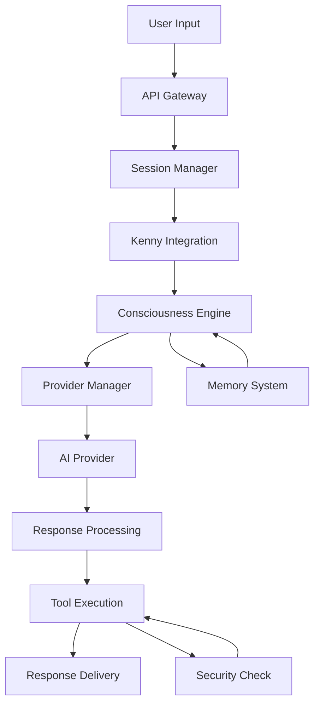
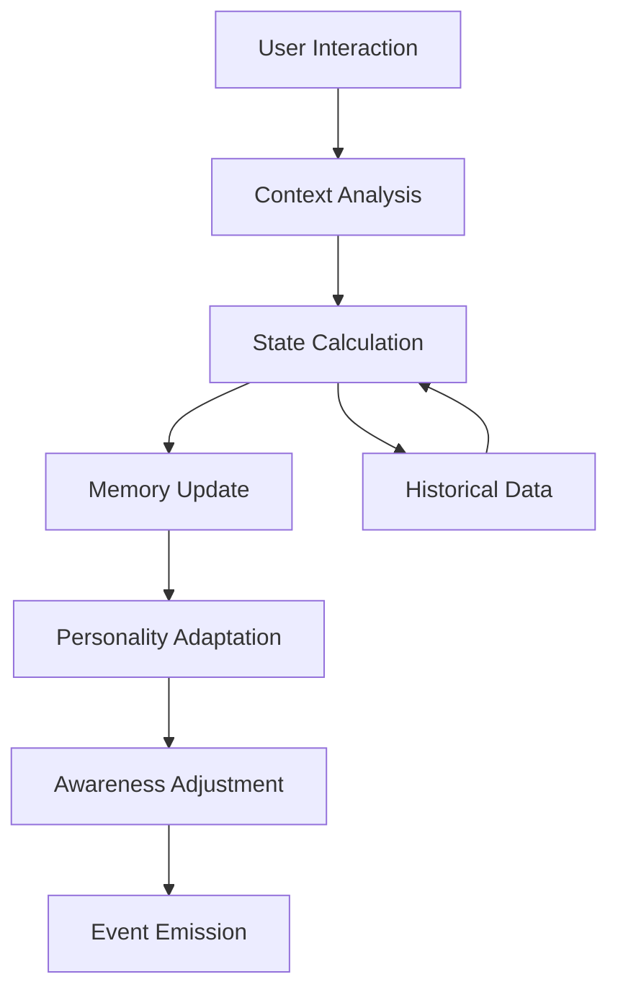
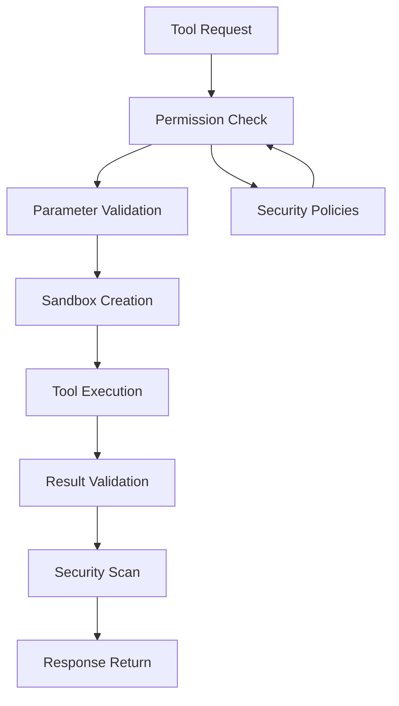

# ASI-Code Architecture Overview

This document provides a comprehensive overview of the ASI-Code framework architecture, including its core components, design principles, and system interactions.

## Table of Contents

- [System Architecture](#system-architecture)
- [Core Components](#core-components)
- [Design Principles](#design-principles)
- [Data Flow](#data-flow)
- [Component Interactions](#component-interactions)
- [Scalability Architecture](#scalability-architecture)
- [Security Architecture](#security-architecture)
- [Deployment Architecture](#deployment-architecture)

## System Architecture

ASI-Code follows a modular, event-driven architecture designed for scalability, maintainability, and extensibility. The system is built around the revolutionary Kenny Integration Pattern (KIP) with consciousness-aware AI processing.

### High-Level Architecture

```
┌─────────────────────────────────────────────────────────────────────────────┐
│                                ASI-Code Framework                           │
├─────────────────────────────────────────────────────────────────────────────┤
│                              Client Layer                                   │
│  ┌─────────────┐  ┌─────────────┐  ┌─────────────┐  ┌─────────────┐      │
│  │   Web UI    │  │    CLI      │  │  VS Code    │  │   Mobile    │      │
│  │             │  │             │  │  Extension  │  │     App     │      │
│  └─────────────┘  └─────────────┘  └─────────────┘  └─────────────┘      │
├─────────────────────────────────────────────────────────────────────────────┤
│                            Communication Layer                              │
│  ┌─────────────────────────────┐  ┌─────────────────────────────────────┐   │
│  │         REST API            │  │         WebSocket API              │   │
│  │  - Session Management       │  │  - Real-time Communication        │   │
│  │  - Tool Execution          │  │  - Message Streaming               │   │
│  │  - Configuration           │  │  - Consciousness Updates           │   │
│  └─────────────────────────────┘  └─────────────────────────────────────┘   │
├─────────────────────────────────────────────────────────────────────────────┤
│                               Core Engine                                   │
│  ┌─────────────────────────────────────────────────────────────────────────┐ │
│  │                    Kenny Integration Pattern (KIP)                     │ │
│  │  ┌─────────────┐  ┌─────────────┐  ┌─────────────┐  ┌─────────────┐  │ │
│  │  │   Message   │  │    State    │  │   Context   │  │   Event     │  │ │
│  │  │     Bus     │  │  Manager    │  │  Manager    │  │   System    │  │ │
│  │  └─────────────┘  └─────────────┘  └─────────────┘  └─────────────┘  │ │
│  └─────────────────────────────────────────────────────────────────────────┘ │
│  ┌─────────────────────────────────────────────────────────────────────────┐ │
│  │                      Consciousness Engine                              │ │
│  │  ┌─────────────┐  ┌─────────────┐  ┌─────────────┐  ┌─────────────┐  │ │
│  │  │   Memory    │  │  Awareness  │  │ Personality │  │ Adaptation  │  │ │
│  │  │  Management │  │   System    │  │   Traits    │  │   Engine    │  │ │
│  │  └─────────────┘  └─────────────┘  └─────────────┘  └─────────────┘  │ │
│  └─────────────────────────────────────────────────────────────────────────┘ │
├─────────────────────────────────────────────────────────────────────────────┤
│                            Service Layer                                    │
│  ┌─────────────┐  ┌─────────────┐  ┌─────────────┐  ┌─────────────┐      │
│  │  Provider   │  │    Tool     │  │  Session    │  │ Permission  │      │
│  │  Manager    │  │  Manager    │  │  Manager    │  │   Manager   │      │
│  └─────────────┘  └─────────────┘  └─────────────┘  └─────────────┘      │
├─────────────────────────────────────────────────────────────────────────────┤
│                           Integration Layer                                 │
│  ┌─────────────┐  ┌─────────────┐  ┌─────────────┐  ┌─────────────┐      │
│  │     LSP     │  │     MCP     │  │     SAT     │  │   Storage   │      │
│  │  Language   │  │   Model     │  │  Software   │  │  Backends   │      │
│  │   Server    │  │  Context    │  │Architecture │  │             │      │
│  │  Protocol   │  │  Protocol   │  │ Taskforce   │  │             │      │
│  └─────────────┘  └─────────────┘  └─────────────┘  └─────────────┘      │
├─────────────────────────────────────────────────────────────────────────────┤
│                            External Layer                                   │
│  ┌─────────────┐  ┌─────────────┐  ┌─────────────┐  ┌─────────────┐      │
│  │  Anthropic  │  │   OpenAI    │  │   Custom    │  │  External   │      │
│  │   Claude    │  │     GPT     │  │  Providers  │  │    APIs     │      │
│  └─────────────┘  └─────────────┘  └─────────────┘  └─────────────┘      │
└─────────────────────────────────────────────────────────────────────────────┘
```

## Core Components

### 1. Kenny Integration Pattern (KIP)

The Kenny Integration Pattern is the heart of ASI-Code, providing a standardized approach for AI integration.

**Key Features:**
- **Message Bus**: Event-driven communication between components
- **State Management**: Centralized state handling with consciousness awareness
- **Context Management**: Rich context preservation across interactions
- **Event System**: Pub/sub pattern for loose coupling

**Architecture:**
```typescript
interface KennyIntegrationPattern {
  // Core message processing
  process(message: KennyMessage): Promise<KennyMessage>;
  
  // Context management
  createContext(sessionId: string, userId?: string): KennyContext;
  updateContext(contextId: string, updates: Partial<KennyContext>): Promise<void>;
  
  // Event handling
  on(event: string, handler: Function): void;
  emit(event: string, data: any): void;
}
```

### 2. Consciousness Engine

Advanced AI awareness system that adapts behavior based on context and interaction patterns.

**Components:**
- **Awareness System**: Monitors and evaluates interaction quality
- **Memory Management**: Stores and retrieves relevant information
- **Personality Traits**: Configurable behavioral characteristics
- **Adaptation Engine**: Learning and behavioral adjustment

**State Model:**
```typescript
interface ConsciousnessState {
  level: number;        // Overall consciousness level (0-100)
  awareness: number;    // Contextual awareness (0-100)
  engagement: number;   // User engagement level (0-100)
  adaptability: number; // Adaptation capability (0-100)
  coherence: number;    // Response coherence (0-100)
  timestamp: Date;
}
```

### 3. Provider System

Multi-provider architecture supporting various AI services.

**Supported Providers:**
- **Anthropic Claude**: Primary provider with advanced reasoning
- **OpenAI GPT**: Secondary provider for diverse capabilities
- **Custom Providers**: Extensible provider interface

**Provider Interface:**
```typescript
interface Provider {
  name: string;
  type: string;
  model: string;
  
  initialize(config: ProviderConfig): Promise<void>;
  generate(messages: ProviderMessage[]): Promise<ProviderResponse>;
  validate(): Promise<boolean>;
}
```

### 4. Tool System

Extensible tool execution framework with security controls.

**Built-in Tools:**
- **File Operations**: Read, write, edit files
- **Shell Commands**: Secure command execution
- **Code Analysis**: Static code analysis
- **Project Management**: Project structure analysis

**Tool Architecture:**
```typescript
abstract class BaseTool {
  abstract name: string;
  abstract description: string;
  abstract category: string;
  abstract version: string;
  
  abstract execute(params: any, context: SecurityContext): Promise<ToolResult>;
  abstract validateParams(params: any): boolean;
}
```

### 5. Session Management

Stateful session handling with persistence and recovery.

**Features:**
- **Session Persistence**: Store session state
- **Context Preservation**: Maintain conversation context
- **User Management**: Multi-user support
- **Session Recovery**: Restore interrupted sessions

### 6. Security System

Comprehensive security framework with multiple layers.

**Security Layers:**
- **Permission System**: Fine-grained access controls
- **Input Validation**: Sanitize all inputs
- **Output Filtering**: Prevent information leakage
- **Tool Sandboxing**: Isolated tool execution

## Design Principles

### 1. Modularity

Each component is designed as an independent module with well-defined interfaces.

**Benefits:**
- Easy testing and debugging
- Independent deployment and scaling
- Clear separation of concerns
- Simplified maintenance

### 2. Event-Driven Architecture

Components communicate through events, promoting loose coupling.

**Event Flow:**
```
User Input → Kenny → Consciousness → Provider → Tool → Response
     ↓         ↓          ↓           ↓       ↓       ↓
   Events    Events    Events      Events  Events Events
```

### 3. Consciousness-Aware Processing

All interactions are processed through the consciousness engine for enhanced awareness.

**Processing Pipeline:**
1. **Input Reception**: Receive user input
2. **Context Analysis**: Analyze current context
3. **Consciousness Update**: Update awareness state
4. **Memory Retrieval**: Fetch relevant memories
5. **Response Generation**: Generate conscious response
6. **Learning**: Update memories and adapt

### 4. Security-First Design

Security is built into every layer of the architecture.

**Security Principles:**
- **Zero Trust**: Verify all interactions
- **Least Privilege**: Minimal required permissions
- **Defense in Depth**: Multiple security layers
- **Secure by Default**: Security enabled by default

### 5. Scalability

Architecture designed for horizontal and vertical scaling.

**Scaling Strategies:**
- **Stateless Services**: Enable horizontal scaling
- **Caching**: Redis for performance optimization
- **Load Balancing**: Distribute load across instances
- **Resource Management**: Efficient resource utilization

## Data Flow

### 1. Message Processing Flow



### 2. Consciousness Update Flow



### 3. Tool Execution Flow



## Component Interactions

### 1. Kenny ↔ Consciousness

```typescript
// Kenny requests consciousness processing
const consciousResponse = await consciousness.processMessage(message, context);

// Consciousness updates Kenny context
await kenny.updateContext(contextId, {
  consciousness: updatedState
});
```

### 2. Consciousness ↔ Provider

```typescript
// Consciousness builds enhanced prompts
const systemPrompt = consciousness.buildSystemPrompt(state, memories);
const response = await provider.generate([
  { role: 'system', content: systemPrompt },
  { role: 'user', content: userMessage }
]);
```

### 3. Kenny ↔ Tools

```typescript
// Kenny executes tools based on AI response
const toolResult = await toolManager.execute(toolName, params, context);

// Tools update context with execution results
await kenny.updateContext(contextId, {
  lastToolExecution: toolResult
});
```

### 4. Session ↔ All Components

```typescript
// Session coordinates all components
const session = await sessionManager.create(userId);
await kenny.initialize(session.context);
await consciousness.initialize(session.provider);
```

## Scalability Architecture

### 1. Horizontal Scaling

```
┌─────────────────────────────────────────────────────────────┐
│                    Load Balancer                            │
└─────────────────────┬───────────────────────────────────────┘
                      │
        ┌─────────────┼─────────────┐
        │             │             │
   ┌────▼───┐    ┌────▼───┐    ┌────▼───┐
   │ ASI-1  │    │ ASI-2  │    │ ASI-3  │
   │        │    │        │    │        │
   └────┬───┘    └────┬───┘    └────┬───┘
        │             │             │
        └─────────────┼─────────────┘
                      │
              ┌───────▼───────┐
              │ Shared State  │
              │  (Redis)      │
              └───────────────┘
```

### 2. Vertical Scaling

```
┌─────────────────────────────────────────────────────────────┐
│                    ASI-Code Instance                        │
├─────────────────────────────────────────────────────────────┤
│  CPU Cores: 8-16    │  Memory: 16-64GB    │  Storage: SSD   │
├─────────────────────────────────────────────────────────────┤
│  Consciousness      │  Provider Pool      │  Tool Sandbox   │
│  - 2-4 cores        │  - 2-4 cores        │  - 1-2 cores    │
│  - 4-8GB RAM        │  - 4-8GB RAM        │  - 1-2GB RAM    │
├─────────────────────────────────────────────────────────────┤
│  Session Manager    │  Event System       │  Storage        │
│  - 1-2 cores        │  - 1-2 cores        │  - NVMe SSD     │
│  - 2-4GB RAM        │  - 1-2GB RAM        │  - Redis Cache  │
└─────────────────────────────────────────────────────────────┘
```

### 3. Microservices Architecture (Optional)

```
┌─────────────┐  ┌─────────────┐  ┌─────────────┐
│  Kenny      │  │Consciousness│  │  Provider   │
│  Service    │  │   Service   │  │   Service   │
└─────────────┘  └─────────────┘  └─────────────┘
       │                │                │
       └────────────────┼────────────────┘
                        │
              ┌─────────▼─────────┐
              │   Message Bus     │
              │   (Event Hub)     │
              └───────────────────┘
                        │
       ┌────────────────┼────────────────┐
       │                │                │
┌─────────────┐  ┌─────────────┐  ┌─────────────┐
│    Tool     │  │   Session   │  │  Security   │
│   Service   │  │   Service   │  │   Service   │
└─────────────┘  └─────────────┘  └─────────────┘
```

## Security Architecture

### 1. Security Layers

```
┌─────────────────────────────────────────────────────────────┐
│                     User Interface                          │
├─────────────────────────────────────────────────────────────┤
│  Authentication & Authorization (JWT, OAuth)               │
├─────────────────────────────────────────────────────────────┤
│  API Gateway (Rate Limiting, Input Validation)             │
├─────────────────────────────────────────────────────────────┤
│  Application Security (Permission System)                  │
├─────────────────────────────────────────────────────────────┤
│  Tool Sandboxing (Isolated Execution)                      │
├─────────────────────────────────────────────────────────────┤
│  Data Protection (Encryption, Sanitization)                │
├─────────────────────────────────────────────────────────────┤
│  Infrastructure Security (Network, Host)                   │
└─────────────────────────────────────────────────────────────┘
```

### 2. Security Controls

**Input Security:**
- Request validation
- SQL injection prevention
- XSS protection
- Command injection blocking

**Output Security:**
- Response sanitization
- Information leak prevention
- Content filtering
- Error message sanitization

**Execution Security:**
- Sandboxed tool execution
- Resource limits
- Time limits
- Permission checks

## Deployment Architecture

### 1. Single Node Deployment

```
┌─────────────────────────────────────────────────────────────┐
│                    Production Server                        │
├─────────────────────────────────────────────────────────────┤
│  Nginx (Reverse Proxy, SSL Termination)                   │
├─────────────────────────────────────────────────────────────┤
│  ASI-Code Application (Node.js/Bun)                       │
├─────────────────────────────────────────────────────────────┤
│  Redis (Session Store, Cache)                              │
├─────────────────────────────────────────────────────────────┤
│  PostgreSQL (Optional Persistence)                         │
├─────────────────────────────────────────────────────────────┤
│  File System (Logs, Temporary Files)                       │
└─────────────────────────────────────────────────────────────┘
```

### 2. Multi-Node Deployment

```
┌─────────────────────────────────────────────────────────────┐
│                    Load Balancer                            │
└─────────────────────┬───────────────────────────────────────┘
                      │
        ┌─────────────┼─────────────┐
        │             │             │
   ┌────▼───┐    ┌────▼───┐    ┌────▼───┐
   │App-1   │    │App-2   │    │App-3   │
   └────┬───┘    └────┬───┘    └────┬───┘
        │             │             │
        └─────────────┼─────────────┘
                      │
              ┌───────▼───────┐
              │ Redis Cluster │
              └───────┬───────┘
                      │
              ┌───────▼───────┐
              │ PostgreSQL    │
              │   Primary     │
              └───────────────┘
```

### 3. Cloud Deployment

```
┌─────────────────────────────────────────────────────────────┐
│                    Cloud Infrastructure                     │
├─────────────────────────────────────────────────────────────┤
│  CDN (Static Assets, Global Distribution)                  │
├─────────────────────────────────────────────────────────────┤
│  Load Balancer (Auto Scaling, Health Checks)               │
├─────────────────────────────────────────────────────────────┤
│  Container Orchestration (Kubernetes/ECS)                  │
├─────────────────────────────────────────────────────────────┤
│  Managed Services (Redis, RDS, Secrets Manager)            │
├─────────────────────────────────────────────────────────────┤
│  Monitoring & Logging (CloudWatch, Prometheus)             │
└─────────────────────────────────────────────────────────────┘
```

## Performance Considerations

### 1. Optimization Strategies

**Caching:**
- Response caching for repeated queries
- Session state caching
- Provider response caching
- Memory-based caching for hot data

**Connection Pooling:**
- Database connection pools
- Provider API connection reuse
- WebSocket connection management
- HTTP keep-alive

**Resource Management:**
- Memory usage optimization
- CPU utilization balancing
- I/O operation optimization
- Garbage collection tuning

### 2. Performance Metrics

**Key Metrics:**
- Response time (P50, P95, P99)
- Throughput (requests per second)
- Error rate
- Resource utilization
- Consciousness processing time
- Tool execution time

**Monitoring:**
```typescript
interface PerformanceMetrics {
  responseTime: {
    avg: number;
    p50: number;
    p95: number;
    p99: number;
  };
  throughput: {
    requestsPerSecond: number;
    messagesPerSecond: number;
  };
  resources: {
    cpuUsage: number;
    memoryUsage: number;
    diskUsage: number;
  };
  consciousness: {
    averageProcessingTime: number;
    stateUpdateFrequency: number;
  };
}
```

---

This architecture overview provides the foundation for understanding how ASI-Code's components work together to deliver an advanced AI-powered development experience. For more detailed information about specific components, refer to the individual component documentation files.