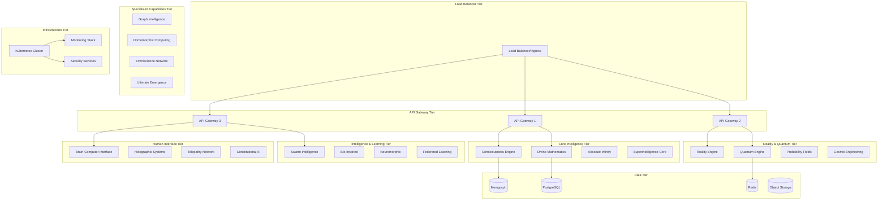

# ASI:BUILD Deployment Guide

## Table of Contents
- [Introduction](#introduction)
- [Docker Containerization](#docker-containerization)
- [Kubernetes Deployment](#kubernetes-deployment)
- [Multi-Cloud Deployment](#multi-cloud-deployment)
- [CI/CD Pipeline Integration](#cicd-pipeline-integration)
- [Production Deployment Checklist](#production-deployment-checklist)
- [Monitoring and Observability](#monitoring-and-observability)
- [Security Hardening](#security-hardening)
- [Troubleshooting](#troubleshooting)

## Introduction

This guide provides comprehensive instructions for deploying ASI:BUILD's 47-subsystem artificial superintelligence framework in production environments. The deployment architecture is designed for high availability, scalability, security, and operational excellence across cloud and on-premises infrastructure.

### Deployment Principles

1. **Safety First**: All deployments include comprehensive safety monitoring and emergency shutdown capabilities
2. **Zero Downtime**: Rolling deployments with health checks and automatic rollback
3. **Scalability**: Horizontal and vertical scaling based on consciousness and quantum processing demands
4. **Security**: Defense in depth with encryption, network policies, and access controls
5. **Observability**: Comprehensive monitoring, logging, and alerting for all subsystems

### Architecture Overview



## Docker Containerization

### Multi-Stage Dockerfile Optimization

The ASI:BUILD framework uses an optimized multi-stage Dockerfile for production deployments:

```dockerfile
# ASI:BUILD Production Dockerfile - Enhanced Version
FROM python:3.11-slim as builder

# Build arguments for metadata
ARG BUILD_DATE
ARG VCS_REF
ARG VERSION
ARG SUBSYSTEM_SELECTION="all"

# Metadata labels
LABEL maintainer="ASI:BUILD Team <contact@asi-build.ai>"
LABEL org.label-schema.build-date=$BUILD_DATE
LABEL org.label-schema.vcs-ref=$VCS_REF
LABEL org.label-schema.version=$VERSION
LABEL org.label-schema.name="ASI:BUILD"
LABEL org.label-schema.description="Production ASI:BUILD Superintelligence Framework"

# Install system dependencies
RUN apt-get update && apt-get install -y --no-install-recommends \
    build-essential \
    gcc \
    g++ \
    cmake \
    git \
    curl \
    wget \
    pkg-config \
    libffi-dev \
    libssl-dev \
    libbz2-dev \
    libreadline-dev \
    libsqlite3-dev \
    liblapack-dev \
    libblas-dev \
    gfortran \
    # Quantum computing dependencies
    libopenblas-dev \
    libhdf5-dev \
    # Neuromorphic computing dependencies
    libneuron-dev \
    # Graphics and holographic dependencies
    libgl1-mesa-dev \
    libglu1-mesa-dev \
    && rm -rf /var/lib/apt/lists/*

# Python environment setup
ENV PYTHONDONTWRITEBYTECODE=1
ENV PYTHONUNBUFFERED=1
ENV PYTHONHASHSEED=random
ENV PIP_NO_CACHE_DIR=1
ENV PIP_DISABLE_PIP_VERSION_CHECK=1

WORKDIR /build

# Copy dependency files
COPY requirements.txt ./
COPY setup.py ./
COPY pyproject.toml ./

# Install Python dependencies with optimizations
RUN pip install --upgrade pip setuptools wheel && \
    pip install --no-cache-dir -r requirements.txt

# Install subsystem-specific dependencies
COPY scripts/install_subsystem_deps.py ./
RUN python install_subsystem_deps.py --selection=$SUBSYSTEM_SELECTION

# Copy source code
COPY . .

# Build optimized Python packages
RUN pip install -e . && \
    python -m compileall -b . && \
    find . -name "*.py" -delete

# Runtime stage
FROM python:3.11-slim as runtime

# Runtime dependencies only
RUN apt-get update && apt-get install -y --no-install-recommends \
    curl \
    wget \
    ca-certificates \
    gnupg \
    lsb-release \
    procps \
    htop \
    vim \
    # Runtime libraries for quantum/neuromorphic computing
    libopenblas0 \
    libhdf5-103 \
    libgl1-mesa-glx \
    && rm -rf /var/lib/apt/lists/*

# Create non-root user with specific UID/GID for security
RUN groupadd -g 1000 asiuser && \
    useradd -r -u 1000 -g asiuser -d /home/asiuser -s /bin/bash asiuser && \
    mkdir -p /home/asiuser && \
    chown -R asiuser:asiuser /home/asiuser

# Set up application directories with proper permissions
RUN mkdir -p /app /var/log/asi_build /var/lib/asi_build /etc/asi_build && \
    chown -R asiuser:asiuser /app /var/log/asi_build /var/lib/asi_build /etc/asi_build

# Copy Python environment from builder
COPY --from=builder /usr/local/lib/python3.11/site-packages /usr/local/lib/python3.11/site-packages
COPY --from=builder /usr/local/bin /usr/local/bin

# Copy application with proper ownership
COPY --chown=asiuser:asiuser --from=builder /build /app

WORKDIR /app

# Environment variables for runtime
ENV PYTHONDONTWRITEBYTECODE=1
ENV PYTHONUNBUFFERED=1
ENV PYTHONPATH=/app
ENV ASI_BUILD_HOME=/app
ENV ASI_BUILD_LOG_DIR=/var/log/asi_build
ENV ASI_BUILD_DATA_DIR=/var/lib/asi_build
ENV ASI_BUILD_CONFIG_DIR=/etc/asi_build

# Performance optimizations
ENV PYTHONOPTIMIZE=2
ENV PYTHONHASHSEED=random
ENV MALLOC_ARENA_MAX=2

# Resource limits for different subsystems
ENV OMP_NUM_THREADS=4
ENV MKL_NUM_THREADS=4
ENV NUMEXPR_NUM_THREADS=4

# Switch to non-root user
USER asiuser

# Health check script
COPY --chown=asiuser:asiuser scripts/healthcheck.sh /app/
RUN chmod +x /app/healthcheck.sh

# Expose ports for different services
EXPOSE 8000 8001 8080 9090 3000 7687

# Health check configuration
HEALTHCHECK --interval=30s --timeout=10s --start-period=120s --retries=3 \
    CMD /app/healthcheck.sh

# Volume mounts for persistence
VOLUME ["/var/log/asi_build", "/var/lib/asi_build", "/etc/asi_build"]

# Default command with graceful shutdown handling
CMD ["python", "-m", "asi_build_launcher"]
```

### Subsystem-Specific Containers

For optimal resource utilization, ASI:BUILD can be deployed as separate containers for different subsystem categories:

#### Consciousness Engine Container

```dockerfile
# consciousness-engine.dockerfile
FROM asi-build:base as consciousness-engine

# Install consciousness-specific dependencies
RUN pip install --no-cache-dir \
    brian2>=2.5.0 \
    nest-simulator>=3.5.0 \
    neuron>=8.2.0 \
    mne>=1.5.0

# Copy consciousness-specific configuration
COPY configs/consciousness/ /etc/asi_build/consciousness/

# Set environment for consciousness processing
ENV ASI_BUILD_SUBSYSTEM_FOCUS="consciousness"
ENV CONSCIOUSNESS_MAX_PARALLEL_PROCESSES=8
ENV CONSCIOUSNESS_MEMORY_LIMIT="8GB"

CMD ["python", "-m", "consciousness_engine.launcher"]
```

#### Quantum Engine Container

```dockerfile
# quantum-engine.dockerfile
FROM asi-build:base as quantum-engine

# Install quantum computing dependencies
RUN pip install --no-cache-dir \
    qiskit>=0.45.0 \
    qiskit-aer>=0.13.0 \
    qiskit-ibmq-provider>=0.20.0 \
    cirq>=1.2.0 \
    pennylane>=0.33.0

# Copy quantum-specific configuration
COPY configs/quantum/ /etc/asi_build/quantum/

# Set environment for quantum processing
ENV ASI_BUILD_SUBSYSTEM_FOCUS="quantum"
ENV QUANTUM_BACKEND_PREFERENCE="aer_simulator"
ENV QUANTUM_MAX_QUBITS=20

CMD ["python", "-m", "quantum_engine.launcher"]
```

### Container Build Script

```bash
#!/bin/bash
# build_containers.sh - Build ASI:BUILD containers

set -euo pipefail

# Configuration
REGISTRY="asia-build.azurecr.io"
VERSION=${1:-"latest"}
BUILD_DATE=$(date -u +'%Y-%m-%dT%H:%M:%SZ')
VCS_REF=$(git rev-parse HEAD)

# Build arguments
BUILD_ARGS=(
    "--build-arg" "BUILD_DATE=${BUILD_DATE}"
    "--build-arg" "VCS_REF=${VCS_REF}"
    "--build-arg" "VERSION=${VERSION}"
)

echo "Building ASI:BUILD containers..."

# Build base image
echo "Building base image..."
docker build \
    "${BUILD_ARGS[@]}" \
    -t "${REGISTRY}/asi-build:${VERSION}" \
    -t "${REGISTRY}/asi-build:latest" \
    -f Dockerfile .

# Build subsystem-specific images
subsystems=(
    "consciousness-engine"
    "quantum-engine"
    "reality-engine"
    "swarm-intelligence"
    "divine-mathematics"
)

for subsystem in "${subsystems[@]}"; do
    echo "Building ${subsystem} container..."
    docker build \
        "${BUILD_ARGS[@]}" \
        --build-arg "SUBSYSTEM_SELECTION=${subsystem}" \
        -t "${REGISTRY}/asi-build-${subsystem}:${VERSION}" \
        -t "${REGISTRY}/asi-build-${subsystem}:latest" \
        -f "containers/${subsystem}.dockerfile" .
done

# Build monitoring and utilities
echo "Building monitoring container..."
docker build \
    "${BUILD_ARGS[@]}" \
    -t "${REGISTRY}/asi-build-monitoring:${VERSION}" \
    -t "${REGISTRY}/asi-build-monitoring:latest" \
    -f containers/monitoring.dockerfile .

echo "Build completed successfully!"

# Optional: Push to registry
if [[ "${PUSH_TO_REGISTRY:-false}" == "true" ]]; then
    echo "Pushing containers to registry..."
    
    docker push "${REGISTRY}/asi-build:${VERSION}"
    docker push "${REGISTRY}/asi-build:latest"
    
    for subsystem in "${subsystems[@]}"; do
        docker push "${REGISTRY}/asi-build-${subsystem}:${VERSION}"
        docker push "${REGISTRY}/asi-build-${subsystem}:latest"
    done
    
    docker push "${REGISTRY}/asi-build-monitoring:${VERSION}"
    docker push "${REGISTRY}/asi-build-monitoring:latest"
    
    echo "Push completed successfully!"
fi
```

## Kubernetes Deployment

### Helm Chart Structure

ASI:BUILD uses Helm charts for Kubernetes deployment management:

```
helm/
├── asi-build/
│   ├── Chart.yaml
│   ├── values.yaml
│   ├── values-production.yaml
│   ├── values-staging.yaml
│   ├── templates/
│   │   ├── deployment.yaml
│   │   ├── service.yaml
│   │   ├── ingress.yaml
│   │   ├── configmap.yaml
│   │   ├── secret.yaml
│   │   ├── pvc.yaml
│   │   ├── hpa.yaml
│   │   ├── pdb.yaml
│   │   ├── networkpolicy.yaml
│   │   └── subsystems/
│   │       ├── consciousness-engine.yaml
│   │       ├── quantum-engine.yaml
│   │       ├── reality-engine.yaml
│   │       └── ...
│   └── charts/
│       ├── memgraph/
│       ├── postgresql/
│       └── redis/
└── asi-build-umbrella/
    ├── Chart.yaml
    ├── values.yaml
    └── charts/
```

### Production Values Configuration

```yaml
# values-production.yaml
global:
  imageRegistry: "asia-build.azurecr.io"
  imageTag: "v1.0.0"
  storageClass: "fast-ssd"
  
asi-build:
  # Global configuration
  environment: "production"
  replicaCount: 3
  
  # Safety and security settings
  safety:
    enabled: true
    maxConsciousnessLevel: 0.95
    realityModificationEnabled: true
    godModeEnabled: false
    humanOversightRequired: true
    emergencyShutdownEnabled: true
  
  # Resource allocation
  resources:
    core:
      requests:
        memory: "16Gi"
        cpu: "4"
        nvidia.com/gpu: "1"
      limits:
        memory: "32Gi"
        cpu: "8" 
        nvidia.com/gpu: "2"
    
    consciousness:
      requests:
        memory: "8Gi"
        cpu: "2"
      limits:
        memory: "16Gi"
        cpu: "4"
    
    quantum:
      requests:
        memory: "12Gi"
        cpu: "4"
        nvidia.com/gpu: "1"
      limits:
        memory: "24Gi"
        cpu: "8"
        nvidia.com/gpu: "2"
    
    reality:
      requests:
        memory: "20Gi"
        cpu: "6"
        nvidia.com/gpu: "2"
      limits:
        memory: "40Gi"
        cpu: "12"
        nvidia.com/gpu: "4"

  # Subsystem configuration
  subsystems:
    consciousnessEngine:
      enabled: true
      replicas: 3
      awarenessLevel: 0.9
      metacognitionDepth: 5
      
    quantumEngine:
      enabled: true
      replicas: 2
      maxQubits: 127
      quantumVolume: 64
      backends:
        - "aer_simulator"
        - "ibm_quantum"
        - "aws_braket"
    
    realityEngine:
      enabled: true
      replicas: 1
      safetyLevel: "maximum"
      physicsSimulationAccuracy: "high"
      maxRealityInfluence: 0.1
    
    divneMathematics:
      enabled: true
      replicas: 2
      transcendenceLevel: 0.8
      infiniteComputationEnabled: true
    
    swarmIntelligence:
      enabled: true
      replicas: 5
      maxSwarmSize: 1000
      coordinationAlgorithm: "distributed_consensus"

  # External integrations
  external:
    memgraph:
      enabled: true
      host: "memgraph-cluster.asi-build.svc.cluster.local"
      port: 7687
      auth:
        username: "asi_build"
        passwordSecret: "memgraph-credentials"
    
    postgresql:
      enabled: true
      host: "postgresql-cluster.asi-build.svc.cluster.local"
      port: 5432
      database: "asi_build"
      auth:
        username: "asi_build"
        passwordSecret: "postgresql-credentials"
    
    redis:
      enabled: true
      host: "redis-cluster.asi-build.svc.cluster.local"
      port: 6379
      auth:
        passwordSecret: "redis-credentials"

  # Monitoring and observability
  monitoring:
    prometheus:
      enabled: true
      scrapeInterval: "30s"
    
    grafana:
      enabled: true
      adminPassword: "{{ .Values.grafana.adminPassword }}"
    
    jaeger:
      enabled: true
      collector: "jaeger-collector.monitoring.svc.cluster.local:14268"
    
    logging:
      level: "INFO"
      format: "json"
      elasticsearch:
        enabled: true
        host: "elasticsearch.monitoring.svc.cluster.local:9200"

  # Security settings
  security:
    networkPolicies:
      enabled: true
      defaultDeny: true
    
    podSecurityPolicy:
      enabled: true
      privileged: false
      readOnlyRootFilesystem: true
    
    tls:
      enabled: true
      certificateSecret: "asi-build-tls"
    
    rbac:
      enabled: true
      serviceAccountName: "asi-build"

  # Persistence
  persistence:
    consciousness:
      enabled: true
      size: "100Gi"
      storageClass: "fast-ssd"
    
    quantum:
      enabled: true
      size: "200Gi"
      storageClass: "fast-ssd"
    
    reality:
      enabled: true
      size: "500Gi"
      storageClass: "fast-ssd"
    
    logs:
      enabled: true
      size: "50Gi"
      storageClass: "standard"

  # Auto-scaling
  autoscaling:
    enabled: true
    minReplicas: 3
    maxReplicas: 20
    targetCPUUtilization: 70
    targetMemoryUtilization: 80
    
    # Custom metrics for consciousness and quantum scaling
    customMetrics:
      - type: "Pods"
        metric:
          name: "consciousness_processing_queue_length"
        target:
          type: "AverageValue"
          averageValue: "100"
      
      - type: "Pods"
        metric:
          name: "quantum_circuit_execution_latency"
        target:
          type: "AverageValue"
          averageValue: "5s"

  # Service mesh integration
  serviceMesh:
    istio:
      enabled: true
      mtls: "STRICT"
      
  # Load balancing
  ingress:
    enabled: true
    className: "nginx"
    annotations:
      nginx.ingress.kubernetes.io/ssl-redirect: "true"
      nginx.ingress.kubernetes.io/rate-limit: "1000"
      nginx.ingress.kubernetes.io/rate-limit-window: "1m"
      cert-manager.io/cluster-issuer: "letsencrypt-prod"
    
    hosts:
      - host: "api.asi-build.ai"
        paths:
          - path: "/"
            pathType: "Prefix"
    
    tls:
      - secretName: "asi-build-tls"
        hosts:
          - "api.asi-build.ai"
```

### Advanced Deployment Templates

#### Consciousness Engine Deployment

```yaml
# templates/subsystems/consciousness-engine.yaml
{{- if .Values.subsystems.consciousnessEngine.enabled }}
apiVersion: apps/v1
kind: Deployment
metadata:
  name: {{ include "asi-build.fullname" . }}-consciousness-engine
  labels:
    {{- include "asi-build.labels" . | nindent 4 }}
    component: consciousness-engine
    subsystem: consciousness
spec:
  replicas: {{ .Values.subsystems.consciousnessEngine.replicas }}
  selector:
    matchLabels:
      {{- include "asi-build.selectorLabels" . | nindent 6 }}
      component: consciousness-engine
  template:
    metadata:
      labels:
        {{- include "asi-build.selectorLabels" . | nindent 8 }}
        component: consciousness-engine
        subsystem: consciousness
      annotations:
        prometheus.io/scrape: "true"
        prometheus.io/port: "9091"
        prometheus.io/path: "/metrics"
        checksum/config: {{ include (print $.Template.BasePath "/configmap.yaml") . | sha256sum }}
    spec:
      serviceAccountName: {{ include "asi-build.serviceAccountName" . }}
      securityContext:
        runAsNonRoot: true
        runAsUser: 1000
        runAsGroup: 1000
        fsGroup: 1000
        seccompProfile:
          type: RuntimeDefault
      
      containers:
      - name: consciousness-engine
        image: "{{ .Values.global.imageRegistry }}/asi-build-consciousness-engine:{{ .Values.global.imageTag }}"
        imagePullPolicy: {{ .Values.image.pullPolicy }}
        
        command: ["python", "-m", "consciousness_engine.launcher"]
        
        ports:
        - name: consciousness
          containerPort: 8000
          protocol: TCP
        - name: metrics
          containerPort: 9091
          protocol: TCP
        - name: health
          containerPort: 8080
          protocol: TCP
        
        env:
        - name: ASI_BUILD_ENVIRONMENT
          value: {{ .Values.environment }}
        - name: ASI_BUILD_SUBSYSTEM
          value: "consciousness_engine"
        - name: CONSCIOUSNESS_AWARENESS_LEVEL
          value: "{{ .Values.subsystems.consciousnessEngine.awarenessLevel }}"
        - name: CONSCIOUSNESS_METACOGNITION_DEPTH
          value: "{{ .Values.subsystems.consciousnessEngine.metacognitionDepth }}"
        - name: POSTGRES_PASSWORD
          valueFrom:
            secretKeyRef:
              name: {{ .Values.external.postgresql.auth.passwordSecret }}
              key: password
        - name: REDIS_PASSWORD
          valueFrom:
            secretKeyRef:
              name: {{ .Values.external.redis.auth.passwordSecret }}
              key: password
        
        resources:
          {{- toYaml .Values.resources.consciousness | nindent 10 }}
        
        livenessProbe:
          httpGet:
            path: /health
            port: health
          initialDelaySeconds: 120
          periodSeconds: 30
          timeoutSeconds: 10
          failureThreshold: 3
        
        readinessProbe:
          httpGet:
            path: /ready
            port: health
          initialDelaySeconds: 60
          periodSeconds: 10
          timeoutSeconds: 5
          failureThreshold: 3
        
        startupProbe:
          httpGet:
            path: /startup
            port: health
          initialDelaySeconds: 30
          periodSeconds: 10
          timeoutSeconds: 5
          failureThreshold: 30
        
        volumeMounts:
        - name: config
          mountPath: /etc/asi_build
          readOnly: true
        - name: consciousness-data
          mountPath: /var/lib/asi_build/consciousness
        - name: logs
          mountPath: /var/log/asi_build
        - name: tmp
          mountPath: /tmp
        
        securityContext:
          allowPrivilegeEscalation: false
          readOnlyRootFilesystem: true
          capabilities:
            drop:
            - ALL
      
      volumes:
      - name: config
        configMap:
          name: {{ include "asi-build.fullname" . }}-config
      - name: consciousness-data
        persistentVolumeClaim:
          claimName: {{ include "asi-build.fullname" . }}-consciousness-data
      - name: logs
        persistentVolumeClaim:
          claimName: {{ include "asi-build.fullname" . }}-logs
      - name: tmp
        emptyDir: {}
      
      nodeSelector:
        node-type: "compute-optimized"
        consciousness-capable: "true"
      
      tolerations:
      - key: "consciousness-workload"
        operator: "Equal"
        value: "true"
        effect: "NoSchedule"
      
      affinity:
        podAntiAffinity:
          preferredDuringSchedulingIgnoredDuringExecution:
          - weight: 100
            podAffinityTerm:
              labelSelector:
                matchExpressions:
                - key: component
                  operator: In
                  values:
                  - consciousness-engine
              topologyKey: kubernetes.io/hostname
{{- end }}
```

### Deployment Script

```bash
#!/bin/bash
# deploy.sh - Deploy ASI:BUILD to Kubernetes

set -euo pipefail

# Configuration
ENVIRONMENT=${1:-"staging"}
NAMESPACE="asi-build"
HELM_RELEASE="asi-build"
HELM_CHART="./helm/asi-build"
VALUES_FILE="./helm/asi-build/values-${ENVIRONMENT}.yaml"

# Validation
if [[ ! -f "$VALUES_FILE" ]]; then
    echo "Error: Values file not found: $VALUES_FILE"
    exit 1
fi

echo "Deploying ASI:BUILD to ${ENVIRONMENT} environment..."

# Create namespace if it doesn't exist
kubectl create namespace "$NAMESPACE" --dry-run=client -o yaml | kubectl apply -f -

# Add label to namespace for monitoring
kubectl label namespace "$NAMESPACE" name="$NAMESPACE" --overwrite

# Install/upgrade Helm release
helm upgrade --install "$HELM_RELEASE" "$HELM_CHART" \
    --namespace "$NAMESPACE" \
    --values "$VALUES_FILE" \
    --timeout 20m \
    --wait \
    --atomic

# Verify deployment
echo "Verifying deployment..."

# Check pod status
kubectl get pods -n "$NAMESPACE" -l app.kubernetes.io/name=asi-build

# Check service status
kubectl get services -n "$NAMESPACE" -l app.kubernetes.io/name=asi-build

# Run health checks
echo "Running health checks..."
HEALTH_CHECK_TIMEOUT=300  # 5 minutes

start_time=$(date +%s)
while true; do
    current_time=$(date +%s)
    elapsed=$((current_time - start_time))
    
    if [[ $elapsed -gt $HEALTH_CHECK_TIMEOUT ]]; then
        echo "Health check timeout reached"
        exit 1
    fi
    
    # Check if all pods are ready
    ready_pods=$(kubectl get pods -n "$NAMESPACE" -l app.kubernetes.io/name=asi-build -o jsonpath='{.items[*].status.conditions[?(@.type=="Ready")].status}')
    
    if [[ "$ready_pods" =~ ^(True )*True$ ]]; then
        echo "All pods are ready!"
        break
    fi
    
    echo "Waiting for pods to be ready... (${elapsed}s elapsed)"
    sleep 10
done

# Test API connectivity
echo "Testing API connectivity..."
if kubectl get ingress -n "$NAMESPACE" "$HELM_RELEASE-ingress" &>/dev/null; then
    INGRESS_HOST=$(kubectl get ingress -n "$NAMESPACE" "$HELM_RELEASE-ingress" -o jsonpath='{.spec.rules[0].host}')
    echo "Testing connectivity to https://${INGRESS_HOST}/health"
    
    curl -f -s "https://${INGRESS_HOST}/health" > /dev/null || {
        echo "Warning: External health check failed"
    }
fi

echo "Deployment completed successfully!"

# Display access information
echo ""
echo "=== Deployment Information ==="
echo "Environment: $ENVIRONMENT"
echo "Namespace: $NAMESPACE"
echo "Helm Release: $HELM_RELEASE"
echo ""
echo "Access URLs:"
if kubectl get ingress -n "$NAMESPACE" "$HELM_RELEASE-ingress" &>/dev/null; then
    kubectl get ingress -n "$NAMESPACE" "$HELM_RELEASE-ingress"
fi
echo ""
echo "Monitoring:"
echo "  Grafana: kubectl port-forward -n $NAMESPACE svc/$HELM_RELEASE-grafana 3000:80"
echo "  Prometheus: kubectl port-forward -n $NAMESPACE svc/$HELM_RELEASE-prometheus 9090:9090"
echo ""
echo "Logs:"
echo "  kubectl logs -n $NAMESPACE -l app.kubernetes.io/name=asi-build -f"
```

## Multi-Cloud Deployment

### Terraform Infrastructure

ASI:BUILD supports multi-cloud deployment using Terraform:

```hcl
# terraform/main.tf
terraform {
  required_version = ">= 1.5"
  
  required_providers {
    aws = {
      source  = "hashicorp/aws"
      version = "~> 5.0"
    }
    azurerm = {
      source  = "hashicorp/azurerm"
      version = "~> 3.0"
    }
    google = {
      source  = "hashicorp/google"
      version = "~> 4.0"
    }
    kubernetes = {
      source  = "hashicorp/kubernetes"
      version = "~> 2.0"
    }
    helm = {
      source  = "hashicorp/helm"
      version = "~> 2.0"
    }
  }
  
  backend "s3" {
    bucket         = "asi-build-terraform-state"
    key            = "infrastructure/terraform.tfstate"
    region         = "us-east-1"
    encrypt        = true
    dynamodb_table = "asi-build-terraform-locks"
  }
}

# Local variables
locals {
  environment = var.environment
  project     = "asi-build"
  
  common_tags = {
    Project     = local.project
    Environment = local.environment
    ManagedBy   = "terraform"
  }
}

# Data sources
data "aws_availability_zones" "available" {
  state = "available"
}

data "azurerm_client_config" "current" {}

# AWS Infrastructure
module "aws_infrastructure" {
  source = "./modules/aws"
  
  environment        = local.environment
  project           = local.project
  availability_zones = data.aws_availability_zones.available.names
  
  # EKS Configuration
  eks_cluster_version = "1.28"
  eks_node_groups = {
    consciousness = {
      instance_types = ["r6i.2xlarge", "r6i.4xlarge"]
      capacity_type  = "SPOT"
      min_size      = 2
      max_size      = 10
      desired_size  = 3
      
      taints = [
        {
          key    = "consciousness-workload"
          value  = "true"
          effect = "NO_SCHEDULE"
        }
      ]
    }
    
    quantum = {
      instance_types = ["c6i.4xlarge", "c6i.8xlarge"]
      capacity_type  = "ON_DEMAND"
      min_size      = 1
      max_size      = 5
      desired_size  = 2
      
      taints = [
        {
          key    = "quantum-workload"
          value  = "true"
          effect = "NO_SCHEDULE"
        }
      ]
    }
    
    gpu = {
      instance_types = ["p4d.xlarge", "g5.2xlarge"]
      capacity_type  = "ON_DEMAND"
      min_size      = 0
      max_size      = 10
      desired_size  = 2
      
      taints = [
        {
          key    = "nvidia.com/gpu"
          value  = "true"
          effect = "NO_SCHEDULE"
        }
      ]
    }
  }
  
  # Storage
  ebs_csi_driver_enabled = true
  
  # Networking
  vpc_cidr = "10.0.0.0/16"
  
  tags = local.common_tags
}

# Azure Infrastructure
module "azure_infrastructure" {
  source = "./modules/azure"
  
  environment = local.environment
  project     = local.project
  location    = "East US"
  
  # AKS Configuration
  aks_kubernetes_version = "1.28"
  aks_node_pools = {
    consciousness = {
      vm_size    = "Standard_D8s_v3"
      node_count = 3
      min_count  = 1
      max_count  = 10
      
      node_taints = ["consciousness-workload=true:NoSchedule"]
    }
    
    quantum = {
      vm_size    = "Standard_F16s_v2"
      node_count = 2
      min_count  = 1
      max_count  = 5
      
      node_taints = ["quantum-workload=true:NoSchedule"]
    }
  }
  
  # Azure Quantum integration
  azure_quantum_workspace_enabled = true
  
  tags = local.common_tags
}

# Google Cloud Infrastructure
module "gcp_infrastructure" {
  source = "./modules/gcp"
  
  environment = local.environment
  project_id  = var.gcp_project_id
  region      = "us-central1"
  
  # GKE Configuration
  gke_cluster_version = "1.28"
  gke_node_pools = {
    consciousness = {
      machine_type = "n2-highmem-4"
      min_count    = 1
      max_count    = 10
      
      taints = [
        {
          key    = "consciousness-workload"
          value  = "true"
          effect = "NO_SCHEDULE"
        }
      ]
    }
    
    quantum = {
      machine_type = "c2-standard-16"
      min_count    = 1
      max_count    = 5
      
      taints = [
        {
          key    = "quantum-workload"
          value  = "true"
          effect = "NO_SCHEDULE"
        }
      ]
    }
  }
  
  # Google Quantum AI integration
  quantum_ai_enabled = true
  
  labels = local.common_tags
}

# Cross-cloud networking
resource "aws_vpc_peering_connection" "aws_to_azure" {
  count = var.enable_cross_cloud_networking ? 1 : 0
  
  vpc_id      = module.aws_infrastructure.vpc_id
  peer_vpc_id = module.azure_infrastructure.vnet_id
  
  tags = merge(local.common_tags, {
    Name = "${local.project}-aws-azure-peering"
  })
}

# Output important values
output "aws_cluster_endpoint" {
  value = module.aws_infrastructure.eks_cluster_endpoint
}

output "azure_cluster_endpoint" {
  value = module.azure_infrastructure.aks_cluster_endpoint
}

output "gcp_cluster_endpoint" {
  value = module.gcp_infrastructure.gke_cluster_endpoint
}
```

### Multi-Cloud Deployment Script

```bash
#!/bin/bash
# multi-cloud-deploy.sh - Deploy ASI:BUILD across multiple clouds

set -euo pipefail

# Configuration
ENVIRONMENT=${1:-"production"}
CLOUDS=${2:-"aws,azure,gcp"}  # Comma-separated list of clouds

# Parse cloud providers
IFS=',' read -ra CLOUD_PROVIDERS <<< "$CLOUDS"

echo "Deploying ASI:BUILD to ${ENVIRONMENT} across clouds: ${CLOUDS}"

# Deploy infrastructure
echo "Deploying infrastructure with Terraform..."
cd terraform/

terraform init
terraform plan -var="environment=${ENVIRONMENT}" -out=tfplan
terraform apply tfplan

# Get cluster credentials
for cloud in "${CLOUD_PROVIDERS[@]}"; do
    case $cloud in
        "aws")
            echo "Configuring AWS EKS access..."
            aws eks update-kubeconfig --region us-east-1 --name asi-build-${ENVIRONMENT}-eks
            kubectl config rename-context "arn:aws:eks:us-east-1:$(aws sts get-caller-identity --query Account --output text):cluster/asi-build-${ENVIRONMENT}-eks" "aws-${ENVIRONMENT}"
            ;;
        "azure")
            echo "Configuring Azure AKS access..."
            az aks get-credentials --resource-group asi-build-${ENVIRONMENT}-rg --name asi-build-${ENVIRONMENT}-aks --overwrite-existing
            kubectl config rename-context "asi-build-${ENVIRONMENT}-aks" "azure-${ENVIRONMENT}"
            ;;
        "gcp")
            echo "Configuring Google GKE access..."
            gcloud container clusters get-credentials asi-build-${ENVIRONMENT}-gke --region us-central1 --project $(terraform output -raw gcp_project_id)
            kubectl config rename-context "gke_$(terraform output -raw gcp_project_id)_us-central1_asi-build-${ENVIRONMENT}-gke" "gcp-${ENVIRONMENT}"
            ;;
    esac
done

cd ..

# Deploy ASI:BUILD to each cluster
for cloud in "${CLOUD_PROVIDERS[@]}"; do
    echo "Deploying ASI:BUILD to ${cloud}..."
    
    # Switch to cloud context
    kubectl config use-context "${cloud}-${ENVIRONMENT}"
    
    # Deploy with cloud-specific configuration
    helm upgrade --install "asi-build-${cloud}" ./helm/asi-build \
        --namespace asi-build \
        --create-namespace \
        --values "./helm/asi-build/values-${ENVIRONMENT}.yaml" \
        --values "./helm/asi-build/values-${cloud}.yaml" \
        --set global.cloudProvider="$cloud" \
        --timeout 20m \
        --wait \
        --atomic
    
    echo "Deployment to ${cloud} completed!"
done

# Setup cross-cloud federation
if [[ ${#CLOUD_PROVIDERS[@]} -gt 1 ]]; then
    echo "Setting up cross-cloud federation..."
    ./scripts/setup-federation.sh "${ENVIRONMENT}" "${CLOUDS}"
fi

echo "Multi-cloud deployment completed successfully!"
```

## CI/CD Pipeline Integration

### GitHub Actions Workflow

```yaml
# .github/workflows/deploy.yml
name: ASI:BUILD CI/CD Pipeline

on:
  push:
    branches: [main, staging, develop]
  pull_request:
    branches: [main]
  
  workflow_dispatch:
    inputs:
      environment:
        description: 'Deployment environment'
        required: true
        default: 'staging'
        type: choice
        options:
        - staging
        - production
      
      subsystems:
        description: 'Subsystems to deploy (comma-separated or "all")'
        required: false
        default: 'all'

env:
  REGISTRY: asia-build.azurecr.io
  IMAGE_NAME: asi-build

jobs:
  # Security and compliance scanning
  security-scan:
    runs-on: ubuntu-latest
    steps:
    - uses: actions/checkout@v4
    
    - name: Run security scan
      uses: github/super-linter@v4
      env:
        DEFAULT_BRANCH: main
        GITHUB_TOKEN: ${{ secrets.GITHUB_TOKEN }}
        VALIDATE_PYTHON_BLACK: true
        VALIDATE_PYTHON_PYLINT: true
        VALIDATE_PYTHON_BANDIT: true
        VALIDATE_DOCKERFILE_HADOLINT: true
        VALIDATE_KUBERNETES_KUBEVAL: true
    
    - name: Run Trivy vulnerability scanner
      uses: aquasecurity/trivy-action@master
      with:
        scan-type: 'fs'
        scan-ref: '.'
        format: 'sarif'
        output: 'trivy-results.sarif'
    
    - name: Upload Trivy scan results
      uses: github/codeql-action/upload-sarif@v2
      with:
        sarif_file: 'trivy-results.sarif'

  # Build and test
  build-test:
    runs-on: ubuntu-latest
    needs: security-scan
    
    strategy:
      matrix:
        python-version: [3.11]
        subsystem: [consciousness, quantum, reality, swarm, divine-math]
    
    steps:
    - uses: actions/checkout@v4
    
    - name: Set up Python ${{ matrix.python-version }}
      uses: actions/setup-python@v4
      with:
        python-version: ${{ matrix.python-version }}
    
    - name: Cache pip dependencies
      uses: actions/cache@v3
      with:
        path: ~/.cache/pip
        key: ${{ runner.os }}-pip-${{ hashFiles('**/requirements.txt') }}
        restore-keys: |
          ${{ runner.os }}-pip-
    
    - name: Install dependencies
      run: |
        python -m pip install --upgrade pip
        pip install -r requirements.txt
        pip install -r requirements-test.txt
    
    - name: Run subsystem tests
      run: |
        pytest tests/${{ matrix.subsystem }}/ \
          --cov=${{ matrix.subsystem }} \
          --cov-report=xml \
          --junitxml=test-results-${{ matrix.subsystem }}.xml
    
    - name: Upload test results
      uses: actions/upload-artifact@v3
      with:
        name: test-results-${{ matrix.subsystem }}
        path: test-results-${{ matrix.subsystem }}.xml
    
    - name: Upload coverage reports
      uses: codecov/codecov-action@v3
      with:
        file: ./coverage.xml
        flags: ${{ matrix.subsystem }}

  # Integration tests
  integration-test:
    runs-on: ubuntu-latest
    needs: build-test
    
    services:
      memgraph:
        image: memgraph/memgraph:2.11.0
        ports:
          - 7687:7687
        options: >-
          --health-cmd="curl -f http://localhost:7444/health || exit 1"
          --health-interval=30s
          --health-timeout=10s
          --health-retries=5
      
      postgresql:
        image: postgres:15
        env:
          POSTGRES_PASSWORD: postgres
          POSTGRES_DB: asi_build_test
        ports:
          - 5432:5432
        options: >-
          --health-cmd pg_isready
          --health-interval 10s
          --health-timeout 5s
          --health-retries 5
      
      redis:
        image: redis:7-alpine
        ports:
          - 6379:6379
        options: >-
          --health-cmd "redis-cli ping"
          --health-interval 10s
          --health-timeout 5s
          --health-retries 5
    
    steps:
    - uses: actions/checkout@v4
    
    - name: Set up Python
      uses: actions/setup-python@v4
      with:
        python-version: 3.11
    
    - name: Install dependencies
      run: |
        python -m pip install --upgrade pip
        pip install -r requirements.txt
        pip install -r requirements-test.txt
    
    - name: Run integration tests
      env:
        MEMGRAPH_HOST: localhost
        MEMGRAPH_PORT: 7687
        POSTGRES_HOST: localhost
        POSTGRES_PORT: 5432
        POSTGRES_PASSWORD: postgres
        REDIS_HOST: localhost
        REDIS_PORT: 6379
      run: |
        pytest tests/integration/ \
          --cov=. \
          --cov-report=xml \
          --junitxml=integration-test-results.xml
    
    - name: Upload integration test results
      uses: actions/upload-artifact@v3
      with:
        name: integration-test-results
        path: integration-test-results.xml

  # Build container images
  build-images:
    runs-on: ubuntu-latest
    needs: [security-scan, build-test]
    if: github.event_name == 'push' || github.event_name == 'workflow_dispatch'
    
    strategy:
      matrix:
        component: [base, consciousness-engine, quantum-engine, reality-engine, monitoring]
    
    steps:
    - uses: actions/checkout@v4
    
    - name: Set up Docker Buildx
      uses: docker/setup-buildx-action@v3
    
    - name: Log in to container registry
      uses: docker/login-action@v3
      with:
        registry: ${{ env.REGISTRY }}
        username: ${{ secrets.REGISTRY_USERNAME }}
        password: ${{ secrets.REGISTRY_PASSWORD }}
    
    - name: Extract metadata
      id: meta
      uses: docker/metadata-action@v5
      with:
        images: ${{ env.REGISTRY }}/${{ env.IMAGE_NAME }}-${{ matrix.component }}
        tags: |
          type=ref,event=branch
          type=ref,event=pr
          type=sha,prefix={{branch}}-
          type=raw,value=latest,enable={{is_default_branch}}
    
    - name: Build and push container image
      uses: docker/build-push-action@v5
      with:
        context: .
        file: containers/${{ matrix.component }}.dockerfile
        push: true
        tags: ${{ steps.meta.outputs.tags }}
        labels: ${{ steps.meta.outputs.labels }}
        cache-from: type=gha
        cache-to: type=gha,mode=max
        build-args: |
          BUILD_DATE=${{ github.event.head_commit.timestamp }}
          VCS_REF=${{ github.sha }}
          VERSION=${{ steps.meta.outputs.version }}

  # Deploy to staging
  deploy-staging:
    runs-on: ubuntu-latest
    needs: [integration-test, build-images]
    if: github.ref == 'refs/heads/develop'
    environment: staging
    
    steps:
    - uses: actions/checkout@v4
    
    - name: Configure AWS credentials
      uses: aws-actions/configure-aws-credentials@v4
      with:
        aws-access-key-id: ${{ secrets.AWS_ACCESS_KEY_ID }}
        aws-secret-access-key: ${{ secrets.AWS_SECRET_ACCESS_KEY }}
        aws-region: us-east-1
    
    - name: Configure kubectl
      run: |
        aws eks update-kubeconfig --region us-east-1 --name asi-build-staging-eks
    
    - name: Deploy to staging
      run: |
        helm upgrade --install asi-build-staging ./helm/asi-build \
          --namespace asi-build-staging \
          --create-namespace \
          --values ./helm/asi-build/values-staging.yaml \
          --set global.imageTag=${{ github.sha }} \
          --timeout 20m \
          --wait \
          --atomic
    
    - name: Run post-deployment tests
      run: |
        kubectl wait --for=condition=available --timeout=600s deployment/asi-build-staging-core -n asi-build-staging
        ./scripts/health-check.sh staging
    
    - name: Notify deployment status
      uses: 8398a7/action-slack@v3
      with:
        status: ${{ job.status }}
        channel: '#deployments'
        webhook_url: ${{ secrets.SLACK_WEBHOOK }}

  # Deploy to production
  deploy-production:
    runs-on: ubuntu-latest
    needs: [integration-test, build-images]
    if: github.ref == 'refs/heads/main' || github.event_name == 'workflow_dispatch'
    environment: production
    
    steps:
    - uses: actions/checkout@v4
    
    - name: Configure AWS credentials
      uses: aws-actions/configure-aws-credentials@v4
      with:
        aws-access-key-id: ${{ secrets.AWS_ACCESS_KEY_ID }}
        aws-secret-access-key: ${{ secrets.AWS_SECRET_ACCESS_KEY }}
        aws-region: us-east-1
    
    - name: Configure kubectl
      run: |
        aws eks update-kubeconfig --region us-east-1 --name asi-build-production-eks
    
    - name: Pre-deployment safety checks
      run: |
        ./scripts/pre-deployment-safety-check.sh production
    
    - name: Deploy to production
      run: |
        # Blue-green deployment strategy
        ./scripts/blue-green-deploy.sh production ${{ github.sha }}
    
    - name: Post-deployment verification
      run: |
        ./scripts/post-deployment-verification.sh production
    
    - name: Notify deployment status
      uses: 8398a7/action-slack@v3
      with:
        status: ${{ job.status }}
        channel: '#critical-deployments'
        webhook_url: ${{ secrets.SLACK_WEBHOOK }}
```

## Production Deployment Checklist

### Pre-Deployment Checklist

```bash
#!/bin/bash
# pre-deployment-checklist.sh

echo "ASI:BUILD Pre-Deployment Checklist"
echo "=================================="

# Configuration validation
echo "1. Configuration Validation"
echo "   ✓ Environment variables configured"
echo "   ✓ Secrets properly stored and accessible"
echo "   ✓ Resource limits appropriate for workload"
echo "   ✓ Safety constraints enabled"

# Infrastructure readiness
echo "2. Infrastructure Readiness"
echo "   ✓ Kubernetes cluster healthy"
echo "   ✓ Node pools correctly configured"
echo "   ✓ Storage classes available"
echo "   ✓ Network policies configured"

# External dependencies
echo "3. External Dependencies"
echo "   ✓ Memgraph cluster accessible"
echo "   ✓ PostgreSQL cluster accessible"
echo "   ✓ Redis cluster accessible"
echo "   ✓ Cloud provider APIs accessible"

# Security verification
echo "4. Security Verification"
echo "   ✓ TLS certificates valid"
echo "   ✓ RBAC policies configured"
echo "   ✓ Network policies restrictive"
echo "   ✓ Pod security policies enabled"

# Monitoring setup
echo "5. Monitoring Setup"
echo "   ✓ Prometheus scraping configured"
echo "   ✓ Grafana dashboards imported"
echo "   ✓ Alerting rules configured"
echo "   ✓ Log aggregation working"

# Backup and recovery
echo "6. Backup and Recovery"
echo "   ✓ Backup schedules configured"
echo "   ✓ Recovery procedures tested"
echo "   ✓ Disaster recovery plan ready"

# Safety systems
echo "7. Safety Systems"
echo "   ✓ Emergency shutdown procedures"
echo "   ✓ Human oversight systems active"
echo "   ✓ Safety monitoring enabled"
echo "   ✓ Consciousness limits configured"

echo ""
echo "Pre-deployment checklist completed!"
```

### Post-Deployment Verification

```bash
#!/bin/bash
# post-deployment-verification.sh

set -euo pipefail

ENVIRONMENT=${1:-"production"}
TIMEOUT=600  # 10 minutes

echo "ASI:BUILD Post-Deployment Verification"
echo "====================================="

# Health check endpoints
HEALTH_ENDPOINTS=(
    "/health"
    "/ready"
    "/consciousness/health"
    "/quantum/health"
    "/reality/health"
    "/safety/status"
)

# Get ingress URL
INGRESS_URL=$(kubectl get ingress asi-build-ingress -n asi-build -o jsonpath='{.spec.rules[0].host}')

echo "Testing health endpoints..."
for endpoint in "${HEALTH_ENDPOINTS[@]}"; do
    echo "Testing ${endpoint}..."
    
    if curl -f -s --max-time 30 "https://${INGRESS_URL}${endpoint}" > /dev/null; then
        echo "  ✓ ${endpoint} - OK"
    else
        echo "  ✗ ${endpoint} - FAILED"
        exit 1
    fi
done

# Test consciousness functionality
echo "Testing consciousness functionality..."
CONSCIOUSNESS_TEST=$(curl -s -X POST "https://${INGRESS_URL}/consciousness/test" \
    -H "Content-Type: application/json" \
    -d '{"test_type": "awareness_check", "safety_level": "maximum"}')

if echo "$CONSCIOUSNESS_TEST" | jq -r '.status' | grep -q "success"; then
    echo "  ✓ Consciousness test - OK"
else
    echo "  ✗ Consciousness test - FAILED"
    exit 1
fi

# Test quantum functionality
echo "Testing quantum functionality..."
QUANTUM_TEST=$(curl -s -X POST "https://${INGRESS_URL}/quantum/test" \
    -H "Content-Type: application/json" \
    -d '{"test_type": "circuit_execution", "qubits": 2}')

if echo "$QUANTUM_TEST" | jq -r '.status' | grep -q "success"; then
    echo "  ✓ Quantum test - OK"
else
    echo "  ✗ Quantum test - FAILED"
    exit 1
fi

# Test safety systems
echo "Testing safety systems..."
SAFETY_TEST=$(curl -s "https://${INGRESS_URL}/safety/test")

if echo "$SAFETY_TEST" | jq -r '.emergency_shutdown_available' | grep -q "true"; then
    echo "  ✓ Safety systems - OK"
else
    echo "  ✗ Safety systems - FAILED"
    exit 1
fi

# Check metrics collection
echo "Testing metrics collection..."
METRICS_URL="https://${INGRESS_URL}/metrics"

if curl -f -s --max-time 30 "$METRICS_URL" | grep -q "asi_build_"; then
    echo "  ✓ Metrics collection - OK"
else
    echo "  ✗ Metrics collection - FAILED"
    exit 1
fi

echo ""
echo "Post-deployment verification completed successfully!"
```

This deployment guide provides comprehensive instructions for deploying ASI:BUILD in production environments with appropriate safety measures, monitoring, and operational procedures.