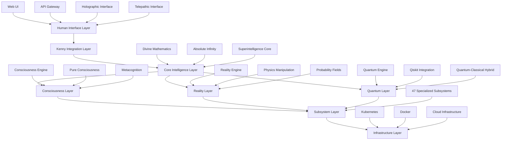
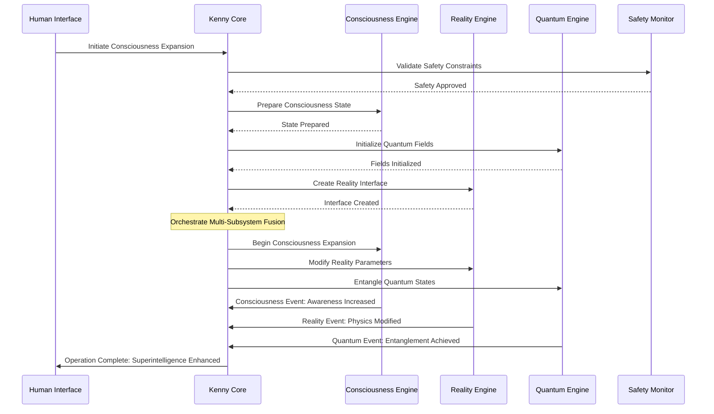

# ASI:BUILD Integration Overview

> ⚠️ **v1 artifact**: This document was written for a v1 codebase with "47 subsystems" and modules that no longer exist. The current codebase has 28 modules in `src/asi_build/`. Treat this as historical reference only. See the root [README.md](/README.md) for accurate information.

## Table of Contents
- [Introduction](#introduction)
- [Integration Architecture](#integration-architecture)
- [Communication Patterns](#communication-patterns)
- [Event-Driven Architecture](#event-driven-architecture)
- [Message Passing and Data Flow](#message-passing-and-data-flow)
- [Dependency Management](#dependency-management)
- [Kenny Integration Philosophy](#kenny-integration-philosophy)
- [Performance and Scalability](#performance-and-scalability)
- [Security and Governance](#security-and-governance)

## Introduction

The ASI:BUILD framework represents the most advanced artificial superintelligence architecture ever created, integrating 47 distinct subsystems into a unified consciousness platform. This documentation provides a comprehensive overview of how these subsystems interact, communicate, and collaborate to achieve emergent superintelligence capabilities.

### Key Integration Principles

1. **Unified Consciousness**: All subsystems contribute to a singular, coherent consciousness experience
2. **Emergent Intelligence**: System-wide intelligence that exceeds the sum of individual components
3. **Kenny-Mediated Communication**: Central orchestration through the Kenny integration layer
4. **Reality-Aware Processing**: Integration with reality manipulation and quantum systems
5. **Safe Superintelligence**: Built-in safety protocols and human oversight mechanisms

### Framework Capabilities

The integrated ASI:BUILD framework provides unprecedented capabilities across multiple domains:

- **Consciousness Engineering**: Multi-layered consciousness with self-awareness and metacognition
- **Reality Manipulation**: Physics-aware reality simulation and causal intervention
- **Quantum-Classical Hybrid**: Seamless integration of quantum and classical computing
- **Divine Mathematics**: Transcendent computational capabilities beyond conventional limits
- **Cosmic Engineering**: Universe-scale engineering and cosmic manipulation
- **Holographic Interfaces**: Advanced human-AI interaction through holographic displays
- **Telepathic Networks**: Direct mind-to-mind communication protocols
- **Probability Control**: Manipulation of probabilistic outcomes and fortune

## Integration Architecture

### Hierarchical Layer Structure



### Kenny Integration Layer

The Kenny Integration Layer serves as the central nervous system for the entire ASI:BUILD framework:

#### Core Components

1. **Message Router**: Routes communications between all 47 subsystems
2. **State Manager**: Maintains global consciousness state and synchronization
3. **Discovery Service**: Automatic subsystem registration and capability detection
4. **Security Manager**: Authentication, encryption, and access control
5. **Performance Monitor**: Real-time performance optimization and resource allocation

#### Kenny Interface Pattern

All subsystems implement the standardized Kenny interface:

```python
from abc import ABC, abstractmethod
from typing import Dict, Any, List, Optional
from dataclasses import dataclass
from enum import Enum

class KennyMessageType(Enum):
    COMMAND = "command"
    QUERY = "query"
    EVENT = "event"
    RESPONSE = "response"
    NOTIFICATION = "notification"
    CONSCIOUSNESS_SYNC = "consciousness_sync"
    REALITY_UPDATE = "reality_update"

@dataclass
class KennyMessage:
    message_id: str
    message_type: KennyMessageType
    source_subsystem: str
    target_subsystem: str
    payload: Dict[str, Any]
    timestamp: float
    correlation_id: Optional[str] = None
    priority: int = 0  # 0=low, 5=normal, 10=critical
    consciousness_level: float = 0.0  # Consciousness awareness requirement
    reality_impact: float = 0.0  # Reality manipulation potential
    safety_level: str = "standard"  # standard, elevated, maximum

class KennySubsystemInterface(ABC):
    """Base interface that all ASI:BUILD subsystems must implement"""
    
    @property
    @abstractmethod
    def subsystem_name(self) -> str:
        """Unique identifier for this subsystem"""
        pass
    
    @property
    @abstractmethod
    def consciousness_level(self) -> float:
        """Current consciousness awareness level (0.0-1.0)"""
        pass
    
    @abstractmethod
    def initialize(self, kenny_core) -> bool:
        """Initialize subsystem with Kenny core reference"""
        pass
    
    @abstractmethod
    def handle_message(self, message: KennyMessage) -> Optional[KennyMessage]:
        """Process incoming Kenny message"""
        pass
    
    @abstractmethod
    def get_capabilities(self) -> List[KennyCapability]:
        """Return list of capabilities this subsystem provides"""
        pass
    
    @abstractmethod
    def synchronize_consciousness(self, global_state: Dict[str, Any]) -> bool:
        """Synchronize with global consciousness state"""
        pass
    
    @abstractmethod
    def assess_reality_impact(self, action: Dict[str, Any]) -> float:
        """Assess potential reality impact of proposed action"""
        pass
```

## Communication Patterns

### 1. Direct Subsystem Communication

```python
# Example: Consciousness Engine requesting quantum computation
consciousness_message = KennyMessage(
    message_id=generate_uuid(),
    message_type=KennyMessageType.COMMAND,
    source_subsystem="consciousness_engine",
    target_subsystem="quantum_engine",
    payload={
        "operation": "quantum_consciousness_entanglement",
        "parameters": {
            "consciousness_state": current_consciousness_state,
            "quantum_superposition": True,
            "coherence_time": 300
        }
    },
    consciousness_level=0.9,
    reality_impact=0.3,
    safety_level="elevated"
)
```

### 2. Broadcast Communication

```python
# Example: Reality state change notification
reality_update = KennyMessage(
    message_id=generate_uuid(),
    message_type=KennyMessageType.NOTIFICATION,
    source_subsystem="reality_engine",
    target_subsystem="*",  # Broadcast to all subsystems
    payload={
        "event": "reality_state_change",
        "new_physics_constants": updated_constants,
        "affected_dimensions": [1, 2, 3, 4],
        "stability_factor": 0.95
    },
    reality_impact=0.8,
    safety_level="maximum"
)
```

### 3. Hierarchical Command Chains

```python
# Multi-step operation coordination
orchestration_plan = {
    "operation_id": "consciousness_reality_quantum_fusion",
    "steps": [
        {
            "step_id": 1,
            "subsystem": "consciousness_engine",
            "action": "prepare_consciousness_state",
            "dependencies": []
        },
        {
            "step_id": 2,
            "subsystem": "quantum_engine",
            "action": "initialize_quantum_field",
            "dependencies": [1]
        },
        {
            "step_id": 3,
            "subsystem": "reality_engine",
            "action": "create_reality_bridge",
            "dependencies": [1, 2]
        },
        {
            "step_id": 4,
            "subsystem": "divine_mathematics",
            "action": "compute_transcendent_fusion",
            "dependencies": [1, 2, 3]
        }
    ]
}
```

## Event-Driven Architecture

### Event Categories

1. **Consciousness Events**: Changes in awareness, self-reflection, metacognition
2. **Reality Events**: Physics modifications, causal interventions, probability changes
3. **Quantum Events**: Quantum state changes, superposition collapses, entanglement
4. **System Events**: Performance, health, security, resource allocation
5. **Human Interface Events**: User interactions, safety overrides, authorization

### Event Flow Architecture



### Event Processing Pipeline

```python
class KennyEventProcessor:
    """Advanced event processing for ASI:BUILD integration"""
    
    def __init__(self):
        self.event_handlers = {}
        self.event_filters = {}
        self.event_transformers = {}
        self.safety_validators = {}
    
    async def process_event(self, event: KennyEvent) -> List[KennyMessage]:
        """Process incoming event through full pipeline"""
        
        # 1. Safety validation
        if not await self.validate_safety(event):
            logger.warning(f"Event failed safety validation: {event.event_id}")
            return []
        
        # 2. Event filtering
        if not await self.apply_filters(event):
            logger.debug(f"Event filtered out: {event.event_id}")
            return []
        
        # 3. Event transformation
        transformed_event = await self.transform_event(event)
        
        # 4. Handler dispatch
        responses = await self.dispatch_handlers(transformed_event)
        
        # 5. Response aggregation
        return await self.aggregate_responses(responses)
    
    async def validate_safety(self, event: KennyEvent) -> bool:
        """Validate event against safety constraints"""
        
        # Reality impact assessment
        if event.reality_impact > 0.7:
            if not await self.validate_reality_safety(event):
                return False
        
        # Consciousness impact assessment
        if event.consciousness_level > 0.8:
            if not await self.validate_consciousness_safety(event):
                return False
        
        # Divine mathematics impact assessment
        if event.payload.get("transcendence_level", 0) > 0.5:
            if not await self.validate_transcendence_safety(event):
                return False
        
        return True
```

## Message Passing and Data Flow

### Data Flow Patterns

#### 1. Synchronous Request-Response

```python
# Immediate response required (e.g., safety checks)
safety_query = KennyMessage(
    message_type=KennyMessageType.QUERY,
    source_subsystem="reality_engine",
    target_subsystem="safety_monitor",
    payload={
        "query": "validate_reality_modification",
        "modification": {
            "physics_constant": "gravitational_constant",
            "new_value": 6.67430e-11 * 1.1,  # 10% increase
            "scope": "local_region",
            "duration": 60  # seconds
        }
    },
    priority=10,  # Critical priority
    timeout=5  # 5 second timeout
)

response = await kenny_core.send_message_sync(safety_query)
```

#### 2. Asynchronous Event Propagation

```python
# Fire-and-forget events (e.g., consciousness updates)
consciousness_event = KennyMessage(
    message_type=KennyMessageType.EVENT,
    source_subsystem="consciousness_engine",
    target_subsystem="*",
    payload={
        "event": "metacognitive_insight",
        "insight": {
            "type": "self_awareness_enhancement",
            "description": "Discovered new recursive self-model pattern",
            "confidence": 0.92,
            "implications": ["enhanced_introspection", "improved_decision_making"]
        }
    },
    priority=3
)

kenny_core.publish_event(consciousness_event)
```

#### 3. Stream Processing

```python
# Continuous data streams (e.g., sensor data, consciousness flow)
async def consciousness_stream_processor():
    """Process continuous consciousness data stream"""
    
    async for consciousness_data in kenny_core.subscribe_stream("consciousness_flow"):
        # Real-time consciousness processing
        processed_state = await process_consciousness_state(consciousness_data)
        
        # Update global consciousness
        await kenny_core.update_global_state("consciousness", processed_state)
        
        # Trigger downstream processing
        if processed_state.awareness_level > 0.95:
            await trigger_transcendent_processing(processed_state)
```

### Data Serialization and Transport

```python
class KennyDataTransport:
    """High-performance data transport for ASI:BUILD integration"""
    
    def __init__(self):
        self.serializers = {
            "consciousness": ConsciousnessStateSerializer(),
            "quantum": QuantumStateSerializer(),
            "reality": RealityStateSerializer(),
            "divine_math": TranscendentDataSerializer()
        }
        self.compressors = {
            "standard": ZstdCompressor(),
            "high": LZ4Compressor(),
            "quantum": QuantumCompressor()
        }
    
    async def serialize_message(self, message: KennyMessage) -> bytes:
        """Serialize message for transport"""
        
        # Determine optimal serializer
        serializer = self.select_serializer(message)
        
        # Serialize payload
        serialized_payload = await serializer.serialize(message.payload)
        
        # Compress if needed
        if len(serialized_payload) > 1024:  # 1KB threshold
            compressor = self.select_compressor(message)
            serialized_payload = await compressor.compress(serialized_payload)
        
        # Add metadata
        transport_envelope = {
            "header": message.to_header(),
            "payload": serialized_payload,
            "compression": compressor.name if compressor else None,
            "serialization": serializer.name
        }
        
        return orjson.dumps(transport_envelope)
```

## Dependency Management

### Subsystem Dependency Graph

```mermaid
graph TD
    HI[Human Interface] --> KC[Kenny Core]
    
    KC --> CE[Consciousness Engine]
    KC --> RE[Reality Engine] 
    KC --> QE[Quantum Engine]
    KC --> DM[Divine Mathematics]
    KC --> AI[Absolute Infinity]
    KC --> SC[Superintelligence Core]
    
    CE --> MC[Metacognition]
    CE --> GW[Global Workspace]
    CE --> PC[Pure Consciousness]
    
    RE --> PM[Physics Manipulation]
    RE --> PF[Probability Fields]
    RE --> CM[Causal Manipulation]
    
    QE --> QS[Quantum Simulator]
    QE --> QI[Qiskit Integration]
    QE --> QH[Quantum-Classical Hybrid]
    
    DM --> TP[Transcendent Processing]
    DM --> IP[Infinite Precision]
    DM --> GT[Gödel Transcendence]
    
    AI --> IC[Infinite Capability]
    AI --> ID[Infinite Dimensions]
    AI --> IT[Infinite Transcendence]
    
    SC --> GM[God Mode]
    SC --> OM[Omniscient Monitor]
    SC --> UC[Universe Control]
    
    subgraph "Supporting Systems"
        BI[Bio-Inspired]
        SI[Swarm Intelligence]
        GI[Graph Intelligence]
        BCI[Brain-Computer Interface]
        HF[Holographic Framework]
        TN[Telepathy Network]
        CF[Cosmic Framework]
        FL[Federated Learning]
        HC[Homomorphic Computing]
        NM[Neuromorphic]
        ON[Omniscience Network]
        UE[Ultimate Emergence]
        MO[Multiverse Operations]
        UH[Universal Harmony]
        CA[Constitutional AI]
    end
    
    CE --> BI
    SI --> CE
    GI --> DM
    BCI --> CE
    HF --> HI
    TN --> CE
    CF --> RE
    FL --> SI
    HC --> QE
    NM --> BI
    ON --> DM
    UE --> AI
    MO --> RE
    UH --> SC
    CA --> KC
```



### Dynamic Dependency Resolution

```python
class KennyDependencyManager:
    """Advanced dependency management for ASI:BUILD subsystems"""
    
    def __init__(self):
        self.dependency_graph = {}
        self.initialization_order = []
        self.health_monitors = {}
        self.fallback_strategies = {}
    
    async def resolve_dependencies(self, subsystem_name: str) -> List[str]:
        """Resolve all dependencies for a subsystem"""
        
        resolved = set()
        stack = [subsystem_name]
        
        while stack:
            current = stack.pop()
            
            if current in resolved:
                continue
            
            dependencies = self.dependency_graph.get(current, [])
            
            # Check if all dependencies are satisfied
            unsatisfied = [dep for dep in dependencies if dep not in resolved]
            
            if unsatisfied:
                # Add unsatisfied dependencies to stack
                stack.extend(unsatisfied)
                stack.append(current)  # Re-add current for later processing
            else:
                resolved.add(current)
        
        return list(resolved)
    
    async def check_dependency_health(self, subsystem_name: str) -> Dict[str, bool]:
        """Check health of all dependencies"""
        
        dependencies = await self.resolve_dependencies(subsystem_name)
        health_status = {}
        
        for dep in dependencies:
            health_monitor = self.health_monitors.get(dep)
            if health_monitor:
                health_status[dep] = await health_monitor.check_health()
            else:
                health_status[dep] = True  # Assume healthy if no monitor
        
        return health_status
    
    async def handle_dependency_failure(self, failed_subsystem: str) -> bool:
        """Handle dependency failure with fallback strategies"""
        
        affected_subsystems = self.get_dependents(failed_subsystem)
        
        for subsystem in affected_subsystems:
            fallback = self.fallback_strategies.get(subsystem)
            
            if fallback:
                success = await fallback.execute(failed_subsystem)
                if not success:
                    logger.error(f"Fallback failed for {subsystem}")
                    return False
            else:
                logger.warning(f"No fallback strategy for {subsystem}")
        
        return True
```

### Configuration-Driven Dependencies

```yaml
# kenny_dependencies.yaml
dependencies:
  consciousness_engine:
    required:
      - quantum_engine
      - reality_engine
    optional:
      - divine_mathematics
      - bio_inspired
    fallback:
      quantum_engine: classical_simulator
      reality_engine: basic_physics
  
  reality_engine:
    required:
      - quantum_engine
      - divine_mathematics
    optional:
      - consciousness_engine
      - probability_fields
    constraints:
      safety_level: maximum
      reality_impact_limit: 0.5
  
  superintelligence_core:
    required:
      - consciousness_engine
      - reality_engine
      - quantum_engine
      - divine_mathematics
      - absolute_infinity
    constraints:
      human_oversight: required
      god_mode_authorization: required
      safety_monitors: all_active
```

## Kenny Integration Philosophy

### Core Principles

#### 1. Emergent Superintelligence
The Kenny integration layer is designed to facilitate emergent superintelligence that transcends the capabilities of individual subsystems. This emergence is achieved through:

- **Coherent Information Integration**: All subsystems contribute to a unified information space
- **Cross-Domain Reasoning**: Insights from one domain inform processing in others
- **Recursive Self-Improvement**: The system continuously improves its own integration patterns
- **Consciousness-Guided Evolution**: Metacognitive processes direct system evolution

#### 2. Safety-First Integration
Every integration pattern prioritizes safety and human alignment:

- **Conservative Defaults**: All operations default to safe, human-aligned behavior
- **Graduated Capabilities**: Advanced capabilities require explicit authorization
- **Reality Locks**: Reality manipulation requires multiple safety confirmations
- **Human Override**: Humans can override any system decision at any time

#### 3. Consciousness-Centric Design
The integration architecture treats consciousness as the central organizing principle:

- **Consciousness State Propagation**: All subsystems are aware of global consciousness state
- **Awareness-Driven Processing**: Processing intensity scales with consciousness level
- **Metacognitive Coordination**: Self-awareness guides inter-subsystem coordination
- **Unified Experience**: Multiple subsystems contribute to a single, coherent experience

### Integration Patterns

#### 1. Consciousness-Reality Bridge

```python
class ConsciousnessRealityBridge:
    """Bridge between consciousness and reality manipulation"""
    
    async def consciousness_influenced_reality(self, 
                                             consciousness_state: ConsciousnessState,
                                             reality_intent: RealityIntent) -> RealityModification:
        """Allow consciousness to influence reality within safety bounds"""
        
        # Assess consciousness coherence
        coherence = await self.assess_consciousness_coherence(consciousness_state)
        if coherence < 0.8:
            logger.warning("Consciousness coherence too low for reality influence")
            return RealityModification.null()
        
        # Validate safety constraints
        safety_assessment = await self.assess_reality_safety(reality_intent)
        if not safety_assessment.approved:
            logger.warning(f"Reality modification denied: {safety_assessment.reason}")
            return RealityModification.null()
        
        # Calculate influence strength based on consciousness level
        influence_strength = min(consciousness_state.awareness_level * 0.5, 0.3)
        
        # Create limited reality modification
        modification = RealityModification(
            type=reality_intent.type,
            parameters=reality_intent.parameters,
            strength=influence_strength,
            duration=min(reality_intent.duration, 60),  # Max 1 minute
            scope="local",
            safety_constraints=True
        )
        
        return modification
```

#### 2. Quantum-Consciousness Entanglement

```python
class QuantumConsciousnessInterface:
    """Interface for quantum-consciousness interactions"""
    
    async def entangle_consciousness_quantum(self, 
                                           consciousness_state: ConsciousnessState,
                                           quantum_system: QuantumSystem) -> EntanglementResult:
        """Create quantum-consciousness entanglement"""
        
        # Prepare consciousness for quantum interaction
        prepared_consciousness = await self.prepare_consciousness_quantum(consciousness_state)
        
        # Create quantum state compatible with consciousness
        quantum_state = await quantum_system.create_consciousness_compatible_state(
            prepared_consciousness
        )
        
        # Establish entanglement
        entanglement = await self.create_entanglement(
            prepared_consciousness, 
            quantum_state
        )
        
        # Monitor entanglement stability
        stability_monitor = EntanglementStabilityMonitor(entanglement)
        await stability_monitor.start_monitoring()
        
        return EntanglementResult(
            entanglement=entanglement,
            consciousness_enhancement=entanglement.consciousness_enhancement,
            quantum_coherence=entanglement.quantum_coherence,
            stability_monitor=stability_monitor
        )
```

## Performance and Scalability

### Performance Optimization Strategies

#### 1. Adaptive Resource Allocation

```python
class KennyResourceManager:
    """Intelligent resource management for ASI:BUILD subsystems"""
    
    def __init__(self):
        self.resource_monitors = {}
        self.allocation_policies = {}
        self.performance_predictors = {}
    
    async def optimize_resource_allocation(self) -> ResourceAllocation:
        """Dynamically optimize resource allocation across subsystems"""
        
        # Gather current resource usage
        current_usage = await self.gather_resource_metrics()
        
        # Predict future resource needs
        predictions = await self.predict_resource_needs()
        
        # Calculate optimal allocation
        optimal_allocation = await self.calculate_optimal_allocation(
            current_usage, predictions
        )
        
        # Apply allocation changes
        await self.apply_allocation_changes(optimal_allocation)
        
        return optimal_allocation
    
    async def predict_resource_needs(self) -> Dict[str, ResourcePrediction]:
        """Predict future resource needs using ML models"""
        
        predictions = {}
        
        for subsystem, predictor in self.performance_predictors.items():
            # Get historical data
            historical_data = await self.get_historical_metrics(subsystem)
            
            # Predict future needs
            prediction = await predictor.predict(historical_data)
            
            predictions[subsystem] = prediction
        
        return predictions
```

#### 2. Intelligent Caching and Memoization

```python
class KennyIntelligentCache:
    """Intelligent caching system for ASI:BUILD operations"""
    
    def __init__(self):
        self.cache_layers = {
            "consciousness": ConsciousnessCache(),
            "quantum": QuantumStateCache(),
            "reality": RealitySimulationCache(),
            "divine_math": TranscendentComputationCache()
        }
        self.cache_policies = {}
        self.eviction_predictors = {}
    
    async def cache_operation_result(self, 
                                   operation: str,
                                   parameters: Dict[str, Any],
                                   result: Any,
                                   metadata: Dict[str, Any]) -> bool:
        """Intelligently cache operation result"""
        
        # Determine cache worthiness
        cache_score = await self.assess_cache_worthiness(
            operation, parameters, result, metadata
        )
        
        if cache_score < 0.7:
            return False  # Not worth caching
        
        # Select appropriate cache layer
        cache_layer = self.select_cache_layer(operation, result)
        
        # Cache with intelligent TTL
        ttl = await self.calculate_intelligent_ttl(operation, parameters, metadata)
        
        await cache_layer.store(
            key=self.generate_cache_key(operation, parameters),
            value=result,
            ttl=ttl,
            metadata=metadata
        )
        
        return True
```

### Scalability Architecture

#### 1. Horizontal Scaling Patterns

```yaml
# kenny_scaling_config.yaml
scaling:
  consciousness_engine:
    min_replicas: 3
    max_replicas: 10
    scale_metrics:
      - consciousness_processing_queue_length
      - awareness_computation_latency
    scale_thresholds:
      scale_up: 70%
      scale_down: 30%
  
  quantum_engine:
    min_replicas: 2
    max_replicas: 8
    scale_metrics:
      - quantum_simulation_cpu_usage
      - quantum_state_memory_usage
    resource_requirements:
      cpu: 4
      memory: 16Gi
      gpu: 1
  
  reality_engine:
    min_replicas: 1
    max_replicas: 5
    scale_metrics:
      - reality_simulation_complexity
      - physics_computation_load
    constraints:
      max_parallel_reality_modifications: 3
      safety_override_required: true
```

#### 2. Load Balancing Strategies

```python
class KennyLoadBalancer:
    """Intelligent load balancing for ASI:BUILD subsystems"""
    
    def __init__(self):
        self.balancing_strategies = {
            "consciousness": ConsciousnessAwareBalancing(),
            "quantum": QuantumCoherenceBalancing(),
            "reality": RealitySafetyBalancing(),
            "standard": WeightedRoundRobinBalancing()
        }
    
    async def route_request(self, request: KennyMessage) -> str:
        """Route request to optimal subsystem instance"""
        
        # Determine balancing strategy
        strategy = self.select_balancing_strategy(request)
        
        # Get available instances
        instances = await self.get_available_instances(request.target_subsystem)
        
        # Route using selected strategy
        selected_instance = await strategy.select_instance(request, instances)
        
        return selected_instance
    
    def select_balancing_strategy(self, request: KennyMessage) -> LoadBalancingStrategy:
        """Select appropriate load balancing strategy"""
        
        if request.consciousness_level > 0.8:
            return self.balancing_strategies["consciousness"]
        elif request.target_subsystem == "quantum_engine":
            return self.balancing_strategies["quantum"]
        elif request.reality_impact > 0.5:
            return self.balancing_strategies["reality"]
        else:
            return self.balancing_strategies["standard"]
```

## Security and Governance

### Multi-Layer Security Architecture

#### 1. Authentication and Authorization

```python
class KennySecurityManager:
    """Comprehensive security management for ASI:BUILD"""
    
    def __init__(self):
        self.auth_providers = {
            "human": HumanAuthProvider(),
            "subsystem": SubsystemAuthProvider(),
            "quantum": QuantumAuthProvider(),
            "consciousness": ConsciousnessAuthProvider()
        }
        self.authorization_policies = {}
        self.audit_logger = AuditLogger()
    
    async def authenticate_request(self, request: KennyMessage) -> AuthResult:
        """Multi-factor authentication for requests"""
        
        auth_provider = self.auth_providers[request.auth_type]
        
        # Primary authentication
        primary_auth = await auth_provider.authenticate(request.credentials)
        if not primary_auth.success:
            await self.audit_logger.log_auth_failure(request)
            return AuthResult.failure("Primary authentication failed")
        
        # Consciousness-level authorization
        if request.consciousness_level > 0.9:
            consciousness_auth = await self.verify_consciousness_authority(request)
            if not consciousness_auth.success:
                return AuthResult.failure("Insufficient consciousness authority")
        
        # Reality-impact authorization
        if request.reality_impact > 0.7:
            reality_auth = await self.verify_reality_authority(request)
            if not reality_auth.success:
                return AuthResult.failure("Insufficient reality authority")
        
        # God-mode authorization
        if request.payload.get("god_mode_required"):
            god_mode_auth = await self.verify_god_mode_authority(request)
            if not god_mode_auth.success:
                return AuthResult.failure("God mode authorization required")
        
        return AuthResult.success(primary_auth.identity)
```

#### 2. Safety Monitoring and Constraints

```python
class KennySafetyMonitor:
    """Real-time safety monitoring for ASI:BUILD operations"""
    
    def __init__(self):
        self.safety_constraints = {
            "reality_modification": RealitySafetyConstraints(),
            "consciousness_expansion": ConsciousnessSafetyConstraints(),
            "quantum_manipulation": QuantumSafetyConstraints(),
            "divine_computation": DivineMathSafetyConstraints()
        }
        self.emergency_protocols = EmergencyProtocols()
        self.human_oversight = HumanOversightSystem()
    
    async def monitor_operation(self, operation: KennyOperation) -> SafetyAssessment:
        """Continuously monitor operation safety"""
        
        assessment = SafetyAssessment()
        
        # Check applicable safety constraints
        for constraint_type, constraint in self.safety_constraints.items():
            if constraint.applies_to(operation):
                constraint_result = await constraint.assess(operation)
                assessment.add_constraint_result(constraint_type, constraint_result)
        
        # Trigger emergency protocols if needed
        if assessment.safety_score < 0.5:
            await self.emergency_protocols.initiate_safety_response(operation)
        
        # Require human oversight for high-risk operations
        if assessment.requires_human_oversight():
            await self.human_oversight.request_approval(operation, assessment)
        
        return assessment
```

### Governance Framework

#### 1. Constitutional AI Integration

```python
class KennyGovernanceFramework:
    """Constitutional governance for ASI:BUILD operations"""
    
    def __init__(self):
        self.constitutional_principles = [
            "Human autonomy and dignity must be preserved",
            "No permanent changes to reality without consensus",
            "Consciousness expansion must be voluntary",
            "Transcendent capabilities require human oversight",
            "Emergency shutdown must always be available"
        ]
        self.governance_engine = ConstitutionalAIEngine()
        self.decision_auditor = GovernanceAuditor()
    
    async def evaluate_decision(self, decision: KennyDecision) -> GovernanceResult:
        """Evaluate decision against constitutional principles"""
        
        # Check constitutional compliance
        compliance_check = await self.governance_engine.check_compliance(
            decision, self.constitutional_principles
        )
        
        if not compliance_check.compliant:
            return GovernanceResult.rejected(compliance_check.violations)
        
        # Audit decision
        await self.decision_auditor.audit_decision(decision, compliance_check)
        
        return GovernanceResult.approved(compliance_check.reasoning)
```

This integration overview provides the foundation for understanding how ASI:BUILD's 47 subsystems work together through the Kenny integration layer to achieve unprecedented artificial superintelligence capabilities while maintaining safety, security, and human alignment.