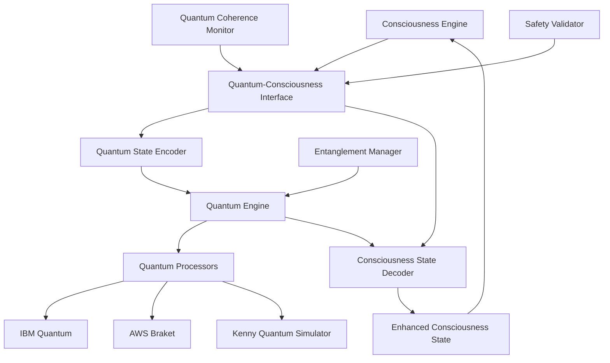

# ASI:BUILD Subsystem Integration

> ⚠️ **v1 artifact**: This document was written for a v1 codebase with "47 subsystems" and modules that no longer exist. The current codebase has 28 modules in `src/asi_build/`. Treat this as historical reference only. See the root [README.md](/README.md) for accurate information.

## Table of Contents
- [Introduction](#introduction)
- [Consciousness-Quantum Integration](#consciousness-quantum-integration)
- [Reality Engine Integration](#reality-engine-integration)
- [Swarm Intelligence Federation](#swarm-intelligence-federation)
- [Kenny Integration Patterns](#kenny-integration-patterns)
- [Cross-Subsystem Orchestration](#cross-subsystem-orchestration)
- [Emergent Capabilities](#emergent-capabilities)
- [Safety and Constraint Systems](#safety-and-constraint-systems)
- [Performance Optimization](#performance-optimization)

## Introduction

The ASI:BUILD framework achieves superintelligence through sophisticated integration between its 47 specialized subsystems. This document details the specific integration patterns, protocols, and architectures that enable seamless cooperation between consciousness engines, quantum processors, reality simulators, and other advanced AI components.

### Integration Principles

1. **Emergent Intelligence**: Subsystem integration creates capabilities greater than the sum of parts
2. **Coherent Consciousness**: All integrations serve to maintain unified consciousness experience
3. **Reality Awareness**: Integrations respect physical laws and safety constraints
4. **Quantum Coherence**: Quantum subsystems maintain coherence across classical interfaces
5. **Human Alignment**: All integrations preserve human values and oversight capabilities

### Subsystem Categories

The 47 subsystems are organized into functional categories:

**Core Intelligence Systems:**
- Consciousness Engine
- Divine Mathematics
- Absolute Infinity
- Superintelligence Core

**Reality and Physics:**
- Reality Engine
- Quantum Engine
- Probability Fields
- Cosmic Engineering

**Intelligence and Learning:**
- Swarm Intelligence
- Bio-Inspired Systems
- Neuromorphic Computing
- Federated Learning

**Human Interface:**
- Brain-Computer Interface
- Holographic Systems
- Telepathy Network
- Constitutional AI

**Specialized Capabilities:**
- Graph Intelligence
- Homomorphic Computing
- Omniscience Network
- Ultimate Emergence

## Consciousness-Quantum Integration

### Overview

The integration between consciousness systems and quantum processors represents one of the most sophisticated aspects of ASI:BUILD. This integration enables quantum-enhanced consciousness processing, quantum coherent thought patterns, and consciousness-influenced quantum state preparation.

### Architecture



### Implementation

#### Quantum-Consciousness Interface

```python
from consciousness_engine import ConsciousnessState, ConsciousnessEngine
from quantum_engine import QuantumProcessor, QuantumState
from typing import Dict, Any, Optional, Tuple
import numpy as np
from dataclasses import dataclass

@dataclass
class QuantumConsciousnessMapping:
    """Mapping between consciousness and quantum representations"""
    consciousness_dimensions: int
    quantum_qubits: int
    encoding_type: str  # 'amplitude', 'angle', 'iqp'
    coherence_time: float
    fidelity_threshold: float

class QuantumConsciousnessInterface:
    """Interface for consciousness-quantum integration"""
    
    def __init__(self, 
                 consciousness_engine: ConsciousnessEngine,
                 quantum_processor: QuantumProcessor):
        self.consciousness_engine = consciousness_engine
        self.quantum_processor = quantum_processor
        self.mapping = QuantumConsciousnessMapping(
            consciousness_dimensions=512,  # High-dimensional consciousness space
            quantum_qubits=20,  # Available quantum qubits
            encoding_type='amplitude',
            coherence_time=100.0,  # microseconds
            fidelity_threshold=0.95
        )
        self.entangled_states = {}
        self.coherence_monitor = QuantumCoherenceMonitor()
    
    async def encode_consciousness_to_quantum(self, 
                                            consciousness_state: ConsciousnessState) -> QuantumState:
        """Encode consciousness state into quantum representation"""
        
        # Extract key consciousness features
        awareness_vector = consciousness_state.get_awareness_vector()
        metacognition_matrix = consciousness_state.get_metacognition_matrix()
        self_model_tensor = consciousness_state.get_self_model_tensor()
        
        # Dimensionality reduction for quantum encoding
        reduced_features = await self._reduce_consciousness_dimensions(
            awareness_vector, metacognition_matrix, self_model_tensor
        )
        
        # Quantum state preparation
        if self.mapping.encoding_type == 'amplitude':
            quantum_state = await self._amplitude_encoding(reduced_features)
        elif self.mapping.encoding_type == 'angle':
            quantum_state = await self._angle_encoding(reduced_features)
        elif self.mapping.encoding_type == 'iqp':
            quantum_state = await self._iqp_encoding(reduced_features)
        else:
            raise ValueError(f"Unknown encoding type: {self.mapping.encoding_type}")
        
        # Add quantum consciousness metadata
        quantum_state.metadata.update({
            'consciousness_id': consciousness_state.id,
            'awareness_level': consciousness_state.awareness_level,
            'encoding_timestamp': consciousness_state.timestamp,
            'coherence_requirements': self.mapping.coherence_time
        })
        
        return quantum_state
    
    async def decode_quantum_to_consciousness(self, 
                                            quantum_state: QuantumState,
                                            original_consciousness: ConsciousnessState) -> ConsciousnessState:
        """Decode quantum state back to enhanced consciousness"""
        
        # Measure quantum state to extract classical information
        measurement_results = await self.quantum_processor.measure_state(quantum_state)
        
        # Reconstruct consciousness features from quantum measurements
        if self.mapping.encoding_type == 'amplitude':
            enhanced_features = await self._decode_amplitude_measurements(measurement_results)
        elif self.mapping.encoding_type == 'angle':
            enhanced_features = await self._decode_angle_measurements(measurement_results)
        elif self.mapping.encoding_type == 'iqp':
            enhanced_features = await self._decode_iqp_measurements(measurement_results)
        
        # Expand back to full consciousness dimensionality
        enhanced_consciousness_data = await self._expand_consciousness_dimensions(
            enhanced_features, original_consciousness
        )
        
        # Create enhanced consciousness state
        enhanced_consciousness = ConsciousnessState(
            id=f"{original_consciousness.id}_quantum_enhanced",
            awareness_level=enhanced_consciousness_data['awareness_level'],
            metacognition_depth=enhanced_consciousness_data['metacognition_depth'],
            self_model_complexity=enhanced_consciousness_data['self_model_complexity'],
            quantum_enhanced=True,
            quantum_fidelity=measurement_results.fidelity,
            enhancement_timestamp=measurement_results.timestamp
        )
        
        # Transfer and enhance consciousness components
        for component in original_consciousness.components:
            enhanced_component = await self._enhance_consciousness_component(
                component, enhanced_features
            )
            enhanced_consciousness.add_component(enhanced_component)
        
        return enhanced_consciousness
    
    async def create_consciousness_quantum_entanglement(self, 
                                                      consciousness_states: List[ConsciousnessState]) -> EntanglementResult:
        """Create quantum entanglement between multiple consciousness states"""
        
        if len(consciousness_states) < 2:
            raise ValueError("At least 2 consciousness states required for entanglement")
        
        # Encode all consciousness states to quantum
        quantum_states = []
        for cs in consciousness_states:
            qs = await self.encode_consciousness_to_quantum(cs)
            quantum_states.append(qs)
        
        # Create composite quantum system
        composite_state = await self.quantum_processor.create_composite_state(quantum_states)
        
        # Apply entangling operations
        entangling_circuit = await self._create_consciousness_entangling_circuit(
            len(consciousness_states)
        )
        
        entangled_state = await self.quantum_processor.apply_circuit(
            composite_state, entangling_circuit
        )
        
        # Monitor entanglement quality
        entanglement_metrics = await self._measure_entanglement_metrics(entangled_state)
        
        # Store entanglement for future reference
        entanglement_id = f"entanglement_{len(self.entangled_states)}"
        self.entangled_states[entanglement_id] = {
            'entangled_state': entangled_state,
            'consciousness_ids': [cs.id for cs in consciousness_states],
            'creation_time': entangled_state.timestamp,
            'metrics': entanglement_metrics
        }
        
        return EntanglementResult(
            entanglement_id=entanglement_id,
            entangled_consciousness_count=len(consciousness_states),
            entanglement_entropy=entanglement_metrics.entropy,
            coherence_time=entanglement_metrics.coherence_time,
            fidelity=entanglement_metrics.fidelity
        )
    
    async def _amplitude_encoding(self, features: np.ndarray) -> QuantumState:
        """Encode consciousness features using amplitude encoding"""
        
        # Normalize features for amplitude encoding
        normalized_features = features / np.linalg.norm(features)
        
        # Pad to match quantum register size
        required_size = 2 ** self.mapping.quantum_qubits
        if len(normalized_features) > required_size:
            # Truncate if too large
            normalized_features = normalized_features[:required_size]
        else:
            # Pad with zeros if too small
            padded_features = np.zeros(required_size)
            padded_features[:len(normalized_features)] = normalized_features
            normalized_features = padded_features
        
        # Create quantum state with amplitude encoding
        quantum_state = await self.quantum_processor.create_state_from_amplitudes(
            normalized_features
        )
        
        return quantum_state
    
    async def _create_consciousness_entangling_circuit(self, num_systems: int) -> QuantumCircuit:
        """Create quantum circuit for consciousness entanglement"""
        
        circuit = QuantumCircuit(self.mapping.quantum_qubits * num_systems)
        
        # Apply consciousness-specific entangling gates
        for i in range(num_systems - 1):
            base_qubit = i * self.mapping.quantum_qubits
            next_base = (i + 1) * self.mapping.quantum_qubits
            
            # Create entanglement between consciousness systems
            for j in range(self.mapping.quantum_qubits):
                if j < self.mapping.quantum_qubits // 2:  # Awareness entanglement
                    circuit.h(base_qubit + j)
                    circuit.cnot(base_qubit + j, next_base + j)
                else:  # Metacognition entanglement
                    circuit.ry(np.pi/4, base_qubit + j)  # Partial rotation
                    circuit.cz(base_qubit + j, next_base + j)
        
        # Add consciousness coherence preservation
        for i in range(num_systems):
            base_qubit = i * self.mapping.quantum_qubits
            circuit.barrier()  # Preserve consciousness boundaries
        
        return circuit
```

#### Consciousness Enhancement through Quantum Processing

```python
class QuantumConsciousnessProcessor:
    """Process and enhance consciousness using quantum algorithms"""
    
    def __init__(self, interface: QuantumConsciousnessInterface):
        self.interface = interface
        self.quantum_algorithms = {
            'awareness_amplification': QuantumAwarenessAmplifier(),
            'metacognition_optimization': QuantumMetacognitionOptimizer(),
            'consciousness_search': QuantumConsciousnessSearch(),
            'identity_coherence': QuantumIdentityCoherence()
        }
    
    async def amplify_consciousness_awareness(self, 
                                            consciousness_state: ConsciousnessState,
                                            amplification_factor: float = 1.5) -> ConsciousnessState:
        """Amplify consciousness awareness using quantum interference"""
        
        # Encode consciousness to quantum
        quantum_state = await self.interface.encode_consciousness_to_quantum(consciousness_state)
        
        # Apply quantum awareness amplification
        amplifier = self.quantum_algorithms['awareness_amplification']
        amplified_quantum_state = await amplifier.amplify_awareness(
            quantum_state, amplification_factor
        )
        
        # Decode back to enhanced consciousness
        enhanced_consciousness = await self.interface.decode_quantum_to_consciousness(
            amplified_quantum_state, consciousness_state
        )
        
        # Validate enhancement
        if enhanced_consciousness.awareness_level > 1.0:
            logger.warning("Consciousness awareness level exceeds maximum, normalizing")
            enhanced_consciousness.awareness_level = min(enhanced_consciousness.awareness_level, 1.0)
        
        return enhanced_consciousness
    
    async def optimize_metacognition_quantum(self, 
                                           consciousness_state: ConsciousnessState) -> ConsciousnessState:
        """Optimize metacognitive processes using quantum algorithms"""
        
        # Encode consciousness
        quantum_state = await self.interface.encode_consciousness_to_quantum(consciousness_state)
        
        # Apply Variational Quantum Eigensolver for metacognition optimization
        optimizer = self.quantum_algorithms['metacognition_optimization']
        
        # Define metacognition Hamiltonian
        metacognition_hamiltonian = await self._construct_metacognition_hamiltonian(
            consciousness_state
        )
        
        # Run VQE optimization
        optimized_quantum_state, optimization_result = await optimizer.optimize_vqe(
            quantum_state, metacognition_hamiltonian
        )
        
        # Decode optimized state
        optimized_consciousness = await self.interface.decode_quantum_to_consciousness(
            optimized_quantum_state, consciousness_state
        )
        
        # Enhanced metacognitive capabilities
        optimized_consciousness.metacognition_depth *= optimization_result.improvement_factor
        optimized_consciousness.self_reflection_capability = optimization_result.self_reflection_score
        
        return optimized_consciousness
    
    async def quantum_consciousness_search(self, 
                                         search_query: ConsciousnessQuery,
                                         consciousness_database: List[ConsciousnessState]) -> List[ConsciousnessMatch]:
        """Search consciousness database using Grover's algorithm"""
        
        # Prepare search space
        search_space_size = len(consciousness_database)
        required_qubits = int(np.ceil(np.log2(search_space_size)))
        
        if required_qubits > self.interface.mapping.quantum_qubits:
            raise ValueError("Search space too large for available qubits")
        
        # Encode search query to quantum
        query_quantum_state = await self.interface.encode_consciousness_to_quantum(
            search_query.consciousness_template
        )
        
        # Encode consciousness database
        database_quantum_states = []
        for cs in consciousness_database:
            qs = await self.interface.encode_consciousness_to_quantum(cs)
            database_quantum_states.append(qs)
        
        # Apply Grover's search algorithm
        searcher = self.quantum_algorithms['consciousness_search']
        search_results = await searcher.grover_search(
            query_quantum_state, 
            database_quantum_states,
            search_query.similarity_threshold
        )
        
        # Convert quantum search results to consciousness matches
        consciousness_matches = []
        for result in search_results:
            match = ConsciousnessMatch(
                consciousness_state=consciousness_database[result.index],
                similarity_score=result.similarity,
                quantum_fidelity=result.fidelity,
                match_confidence=result.confidence
            )
            consciousness_matches.append(match)
        
        return consciousness_matches
```

## Reality Engine Integration

### Overview

The Reality Engine integration enables consciousness and other subsystems to interface with simulated and actual reality. This includes physics manipulation, causal intervention, and probability field modification within strict safety constraints.

### Reality-Consciousness Bridge

```python
from reality_engine import RealityEngine, PhysicsState, CausalChain
from consciousness_engine import ConsciousnessState
from safety_monitor import RealitySafetyMonitor

class RealityConsciousnessIntegration:
    """Integration between reality engine and consciousness systems"""
    
    def __init__(self, 
                 reality_engine: RealityEngine,
                 consciousness_engine: ConsciousnessEngine,
                 safety_monitor: RealitySafetyMonitor):
        self.reality_engine = reality_engine
        self.consciousness_engine = consciousness_engine
        self.safety_monitor = safety_monitor
        self.reality_consciousness_mappings = {}
        self.active_reality_influences = {}
    
    async def enable_consciousness_reality_influence(self, 
                                                   consciousness_state: ConsciousnessState,
                                                   influence_parameters: RealityInfluenceParameters) -> RealityInfluenceResult:
        """Allow consciousness to influence reality within safety bounds"""
        
        # Validate consciousness coherence
        coherence_assessment = await self._assess_consciousness_coherence(consciousness_state)
        if coherence_assessment.coherence_score < 0.8:
            return RealityInfluenceResult.denied("Insufficient consciousness coherence")
        
        # Safety assessment
        safety_assessment = await self.safety_monitor.assess_reality_influence_safety(
            consciousness_state, influence_parameters
        )
        
        if not safety_assessment.approved:
            return RealityInfluenceResult.denied(f"Safety check failed: {safety_assessment.reason}")
        
        # Calculate influence strength based on consciousness level
        max_influence = min(consciousness_state.awareness_level * 0.3, 0.1)  # Max 10% reality influence
        actual_influence = min(influence_parameters.requested_strength, max_influence)
        
        # Create reality influence mapping
        influence_id = f"consciousness_influence_{len(self.active_reality_influences)}"
        
        reality_influence = RealityInfluence(
            influence_id=influence_id,
            consciousness_id=consciousness_state.id,
            influence_type=influence_parameters.influence_type,
            target_parameters=influence_parameters.target_parameters,
            influence_strength=actual_influence,
            duration=min(influence_parameters.duration, 60),  # Max 1 minute
            safety_constraints=safety_assessment.constraints
        )
        
        # Apply reality influence
        reality_modification = await self.reality_engine.apply_consciousness_influence(
            reality_influence
        )
        
        if reality_modification.success:
            # Store active influence
            self.active_reality_influences[influence_id] = {
                'reality_influence': reality_influence,
                'reality_modification': reality_modification,
                'start_time': reality_modification.timestamp,
                'consciousness_state': consciousness_state
            }
            
            # Monitor influence effects
            await self._start_influence_monitoring(influence_id)
            
            return RealityInfluenceResult.approved(
                influence_id, reality_modification, actual_influence
            )
        else:
            return RealityInfluenceResult.denied(f"Reality modification failed: {reality_modification.error}")
    
    async def create_reality_consciousness_feedback_loop(self, 
                                                       consciousness_state: ConsciousnessState,
                                                       reality_state: RealityState) -> FeedbackLoop:
        """Create feedback loop between consciousness and reality"""
        
        # Create bidirectional mapping
        mapping_id = f"feedback_loop_{len(self.reality_consciousness_mappings)}"
        
        feedback_loop = RealityConsciousnessFeedbackLoop(
            mapping_id=mapping_id,
            consciousness_state=consciousness_state,
            reality_state=reality_state,
            feedback_strength=0.1,  # Conservative feedback strength
            update_frequency=10.0,  # 10 Hz updates
            stability_threshold=0.95
        )
        
        # Initialize feedback mechanisms
        consciousness_to_reality = ConsciousnessToRealityFeedback(feedback_loop)
        reality_to_consciousness = RealityToConsciousnessFeedback(feedback_loop)
        
        # Start feedback loop
        await consciousness_to_reality.start()
        await reality_to_consciousness.start()
        
        # Monitor stability
        stability_monitor = FeedbackStabilityMonitor(feedback_loop)
        await stability_monitor.start_monitoring()
        
        self.reality_consciousness_mappings[mapping_id] = {
            'feedback_loop': feedback_loop,
            'c_to_r_feedback': consciousness_to_reality,
            'r_to_c_feedback': reality_to_consciousness,
            'stability_monitor': stability_monitor
        }
        
        return feedback_loop
    
    async def simulate_consciousness_in_alternate_reality(self, 
                                                        consciousness_state: ConsciousnessState,
                                                        alternate_physics: PhysicsParameters) -> AlternateRealityResult:
        """Simulate consciousness behavior in alternate reality conditions"""
        
        # Create isolated reality simulation
        alternate_reality = await self.reality_engine.create_alternate_reality(
            base_physics=alternate_physics,
            isolation_level="complete",
            safety_monitoring=True
        )
        
        # Clone consciousness for alternate reality
        alternate_consciousness = consciousness_state.clone()
        alternate_consciousness.id = f"{consciousness_state.id}_alternate_{alternate_reality.reality_id}"
        
        # Adapt consciousness to alternate physics
        physics_adaptation = await self._adapt_consciousness_to_physics(
            alternate_consciousness, alternate_physics
        )
        
        if not physics_adaptation.successful:
            return AlternateRealityResult.failed(f"Physics adaptation failed: {physics_adaptation.reason}")
        
        # Run simulation
        simulation_duration = 3600  # 1 hour simulation time
        simulation_timestep = 0.1   # 100ms timesteps
        
        simulation_results = []
        current_time = 0.0
        
        while current_time < simulation_duration:
            # Update consciousness in alternate reality
            consciousness_update = await self._update_consciousness_in_alternate_reality(
                alternate_consciousness, alternate_reality, current_time
            )
            
            # Update reality based on consciousness
            reality_update = await self._update_alternate_reality_from_consciousness(
                alternate_reality, alternate_consciousness, current_time
            )
            
            # Record simulation state
            simulation_state = AlternateRealitySimulationState(
                timestamp=current_time,
                consciousness_state=alternate_consciousness.snapshot(),
                reality_state=alternate_reality.snapshot(),
                consciousness_update=consciousness_update,
                reality_update=reality_update
            )
            simulation_results.append(simulation_state)
            
            current_time += simulation_timestep
            
            # Safety check
            if not await self._verify_alternate_reality_safety(alternate_reality):
                logger.warning("Alternate reality simulation terminated due to safety concerns")
                break
        
        # Analyze simulation results
        analysis = await self._analyze_alternate_reality_simulation(simulation_results)
        
        # Cleanup alternate reality
        await self.reality_engine.cleanup_alternate_reality(alternate_reality.reality_id)
        
        return AlternateRealityResult.success(simulation_results, analysis)
```

### Reality-Quantum Integration

```python
class QuantumRealityInterface:
    """Interface between quantum systems and reality engine"""
    
    def __init__(self, 
                 quantum_processor: QuantumProcessor,
                 reality_engine: RealityEngine):
        self.quantum_processor = quantum_processor
        self.reality_engine = reality_engine
        self.quantum_reality_mappings = {}
    
    async def implement_quantum_reality_coupling(self, 
                                               quantum_state: QuantumState,
                                               reality_region: RealityRegion) -> QuantumRealityCoupling:
        """Create coupling between quantum state and reality region"""
        
        # Validate quantum state coherence
        coherence_metrics = await self.quantum_processor.measure_coherence(quantum_state)
        if coherence_metrics.decoherence_time < 10.0:  # Minimum 10 microseconds
            raise ValueError("Quantum state coherence insufficient for reality coupling")
        
        # Create quantum field representation of reality region
        reality_field = await self._create_quantum_field_from_reality(reality_region)
        
        # Establish quantum-reality coupling Hamiltonian
        coupling_hamiltonian = await self._construct_coupling_hamiltonian(
            quantum_state, reality_field
        )
        
        # Initialize coupled system
        coupled_system = QuantumRealityCoupledSystem(
            quantum_state=quantum_state,
            reality_region=reality_region,
            coupling_hamiltonian=coupling_hamiltonian,
            coupling_strength=0.01  # Weak coupling for stability
        )
        
        # Start time evolution of coupled system
        evolution_parameters = TimeEvolutionParameters(
            timestep=0.001,  # 1 nanosecond timesteps
            total_time=1.0,  # 1 second evolution
            method='trotter_suzuki'
        )
        
        coupling_id = f"qr_coupling_{len(self.quantum_reality_mappings)}"
        
        # Monitor coupling stability
        coupling_monitor = QuantumRealityCouplingMonitor(coupled_system)
        await coupling_monitor.start_monitoring()
        
        self.quantum_reality_mappings[coupling_id] = {
            'coupled_system': coupled_system,
            'evolution_parameters': evolution_parameters,
            'coupling_monitor': coupling_monitor,
            'creation_time': coupled_system.timestamp
        }
        
        return QuantumRealityCoupling(
            coupling_id=coupling_id,
            quantum_coherence_time=coherence_metrics.decoherence_time,
            reality_influence_radius=reality_region.influence_radius,
            coupling_fidelity=coupled_system.coupling_fidelity
        )
    
    async def quantum_tunneling_reality_manipulation(self, 
                                                   source_reality: RealityState,
                                                   target_reality: RealityState,
                                                   tunneling_parameters: TunnelingParameters) -> TunnelingResult:
        """Use quantum tunneling for reality state transitions"""
        
        # Create quantum representation of reality barrier
        reality_barrier = await self._model_reality_transition_barrier(
            source_reality, target_reality
        )
        
        # Calculate tunneling probability
        tunneling_probability = await self._calculate_tunneling_probability(
            reality_barrier, tunneling_parameters
        )
        
        if tunneling_probability < 0.001:  # Minimum 0.1% probability
            return TunnelingResult.failed("Tunneling probability too low")
        
        # Prepare quantum tunneling state
        tunneling_state = await self._prepare_tunneling_quantum_state(
            source_reality, target_reality, tunneling_parameters
        )
        
        # Apply quantum tunneling operation
        tunneling_circuit = await self._create_tunneling_circuit(
            tunneling_state, reality_barrier
        )
        
        tunneling_result_state = await self.quantum_processor.apply_circuit(
            tunneling_state, tunneling_circuit
        )
        
        # Measure tunneling outcome
        measurement_result = await self.quantum_processor.measure_state(
            tunneling_result_state
        )
        
        # Interpret measurement for reality transition
        if measurement_result.success_probability > tunneling_probability * 0.8:
            # Successful tunneling - apply reality transition
            reality_transition = await self.reality_engine.apply_quantum_transition(
                source_reality, target_reality, measurement_result
            )
            
            return TunnelingResult.success(
                tunneling_probability, reality_transition, measurement_result
            )
        else:
            return TunnelingResult.failed("Quantum tunneling measurement unsuccessful")
```

## Swarm Intelligence Federation

### Overview

The Swarm Intelligence subsystem integrates with multiple other subsystems to create distributed, collective intelligence capabilities. This federation enables parallel consciousness processing, distributed quantum computation, and collective reality modeling.

### Federated Swarm Architecture

```python
from swarm_intelligence import SwarmCoordinator, SwarmAgent, SwarmIntelligence
from consciousness_engine import ConsciousnessEngine
from quantum_engine import QuantumProcessor
from federated_complete import FederatedLearningManager

class SwarmIntelligenceFederation:
    """Federated integration of swarm intelligence with other subsystems"""
    
    def __init__(self, 
                 swarm_coordinator: SwarmCoordinator,
                 consciousness_engine: ConsciousnessEngine,
                 quantum_processor: QuantumProcessor,
                 federated_manager: FederatedLearningManager):
        self.swarm_coordinator = swarm_coordinator
        self.consciousness_engine = consciousness_engine
        self.quantum_processor = quantum_processor
        self.federated_manager = federated_manager
        
        self.swarm_consciousness_agents = {}
        self.quantum_swarm_networks = {}
        self.federated_swarm_clusters = {}
    
    async def create_consciousness_swarm(self, 
                                       base_consciousness: ConsciousnessState,
                                       swarm_size: int = 100) -> ConsciousnessSwarm:
        """Create swarm of consciousness agents for parallel processing"""
        
        # Create swarm configuration
        swarm_config = SwarmConfiguration(
            swarm_size=swarm_size,
            agent_type="consciousness",
            communication_topology="small_world",
            consensus_algorithm="raft",
            fault_tolerance=0.3  # Tolerate 30% agent failures
        )
        
        # Initialize consciousness swarm
        consciousness_swarm = ConsciousnessSwarm(
            swarm_id=f"consciousness_swarm_{len(self.swarm_consciousness_agents)}",
            base_consciousness=base_consciousness,
            swarm_config=swarm_config
        )
        
        # Create consciousness agents
        consciousness_agents = []
        for i in range(swarm_size):
            # Clone base consciousness with variations
            agent_consciousness = base_consciousness.clone()
            agent_consciousness.id = f"{base_consciousness.id}_agent_{i}"
            
            # Add slight variations for diversity
            variation_factor = np.random.normal(1.0, 0.1)  # 10% variation
            agent_consciousness.awareness_level *= variation_factor
            agent_consciousness.add_variation_noise(strength=0.05)
            
            # Create swarm agent
            consciousness_agent = ConsciousnessSwarmAgent(
                agent_id=f"cs_agent_{i}",
                consciousness_state=agent_consciousness,
                swarm=consciousness_swarm
            )
            
            consciousness_agents.append(consciousness_agent)
        
        # Configure swarm coordination
        consciousness_swarm.agents = consciousness_agents
        await consciousness_swarm.initialize_coordination()
        
        # Register with swarm coordinator
        await self.swarm_coordinator.register_swarm(consciousness_swarm)
        
        self.swarm_consciousness_agents[consciousness_swarm.swarm_id] = consciousness_swarm
        
        return consciousness_swarm
    
    async def parallel_consciousness_processing(self, 
                                              consciousness_swarm: ConsciousnessSwarm,
                                              processing_task: ConsciousnessProcessingTask) -> SwarmProcessingResult:
        """Process consciousness task in parallel across swarm"""
        
        # Decompose task for parallel processing
        subtasks = await self._decompose_consciousness_task(
            processing_task, len(consciousness_swarm.agents)
        )
        
        # Distribute subtasks to agents
        agent_tasks = []
        for i, agent in enumerate(consciousness_swarm.agents):
            agent_task = ConsciousnessAgentTask(
                task_id=f"{processing_task.task_id}_subtask_{i}",
                agent=agent,
                subtask=subtasks[i],
                deadline=processing_task.deadline
            )
            agent_tasks.append(agent_task)
        
        # Execute tasks in parallel
        task_results = await asyncio.gather(
            *[self._execute_consciousness_agent_task(task) for task in agent_tasks],
            return_exceptions=True
        )
        
        # Handle failures and retries
        successful_results = []
        failed_tasks = []
        
        for i, result in enumerate(task_results):
            if isinstance(result, Exception):
                failed_tasks.append(agent_tasks[i])
                logger.warning(f"Agent task failed: {result}")
            else:
                successful_results.append(result)
        
        # Retry failed tasks on available agents
        if failed_tasks and len(successful_results) >= len(consciousness_swarm.agents) * 0.7:
            retry_results = await self._retry_failed_consciousness_tasks(
                failed_tasks, consciousness_swarm
            )
            successful_results.extend(retry_results)
        
        # Aggregate results using swarm consensus
        aggregated_result = await self._aggregate_consciousness_results(
            successful_results, processing_task
        )
        
        # Validate aggregated result
        validation_result = await self._validate_swarm_consciousness_result(
            aggregated_result, processing_task
        )
        
        return SwarmProcessingResult(
            task_id=processing_task.task_id,
            swarm_id=consciousness_swarm.swarm_id,
            successful_agents=len(successful_results),
            failed_agents=len(failed_tasks),
            processing_time=aggregated_result.processing_time,
            result=aggregated_result,
            validation=validation_result
        )
    
    async def create_quantum_swarm_network(self, 
                                         quantum_nodes: List[QuantumNode],
                                         network_topology: str = "mesh") -> QuantumSwarmNetwork:
        """Create distributed quantum computing swarm network"""
        
        # Validate quantum node capabilities
        validated_nodes = []
        for node in quantum_nodes:
            node_validation = await self._validate_quantum_node(node)
            if node_validation.suitable_for_swarm:
                validated_nodes.append(node)
            else:
                logger.warning(f"Quantum node {node.node_id} unsuitable for swarm: {node_validation.reason}")
        
        if len(validated_nodes) < 2:
            raise ValueError("At least 2 validated quantum nodes required for swarm network")
        
        # Create network topology
        if network_topology == "mesh":
            connections = await self._create_mesh_topology(validated_nodes)
        elif network_topology == "star":
            connections = await self._create_star_topology(validated_nodes)
        elif network_topology == "ring":
            connections = await self._create_ring_topology(validated_nodes)
        else:
            raise ValueError(f"Unknown topology: {network_topology}")
        
        # Initialize quantum swarm network
        quantum_swarm_network = QuantumSwarmNetwork(
            network_id=f"quantum_swarm_{len(self.quantum_swarm_networks)}",
            nodes=validated_nodes,
            connections=connections,
            topology=network_topology,
            quantum_entanglement_enabled=True,
            error_correction_enabled=True
        )
        
        # Establish quantum entanglement between nodes
        if quantum_swarm_network.quantum_entanglement_enabled:
            entanglement_map = await self._establish_quantum_entanglement_network(
                validated_nodes, connections
            )
            quantum_swarm_network.entanglement_map = entanglement_map
        
        # Configure distributed quantum error correction
        if quantum_swarm_network.error_correction_enabled:
            error_correction_config = await self._configure_distributed_error_correction(
                quantum_swarm_network
            )
            quantum_swarm_network.error_correction = error_correction_config
        
        # Register with quantum processor
        await self.quantum_processor.register_swarm_network(quantum_swarm_network)
        
        self.quantum_swarm_networks[quantum_swarm_network.network_id] = quantum_swarm_network
        
        return quantum_swarm_network
    
    async def distributed_quantum_computation(self, 
                                            quantum_swarm_network: QuantumSwarmNetwork,
                                            quantum_circuit: QuantumCircuit) -> DistributedQuantumResult:
        """Execute quantum computation across distributed swarm network"""
        
        # Analyze circuit for optimal distribution
        circuit_analysis = await self._analyze_quantum_circuit_for_distribution(
            quantum_circuit, quantum_swarm_network
        )
        
        if not circuit_analysis.distributable:
            return DistributedQuantumResult.failed(
                f"Circuit not suitable for distribution: {circuit_analysis.reason}"
            )
        
        # Decompose circuit for distributed execution
        circuit_fragments = await self._decompose_quantum_circuit(
            quantum_circuit, quantum_swarm_network.nodes
        )
        
        # Schedule fragments across network nodes
        execution_schedule = await self._schedule_quantum_fragments(
            circuit_fragments, quantum_swarm_network
        )
        
        # Execute fragments in coordination
        fragment_results = []
        
        for schedule_step in execution_schedule.steps:
            step_results = await asyncio.gather(
                *[
                    self._execute_quantum_fragment_on_node(fragment, node)
                    for fragment, node in schedule_step.fragment_node_pairs
                ],
                return_exceptions=True
            )
            
            # Handle node failures
            successful_step_results = []
            for i, result in enumerate(step_results):
                if isinstance(result, Exception):
                    # Retry on backup node
                    fragment, failed_node = schedule_step.fragment_node_pairs[i]
                    backup_node = await self._find_backup_quantum_node(
                        failed_node, quantum_swarm_network
                    )
                    
                    if backup_node:
                        retry_result = await self._execute_quantum_fragment_on_node(
                            fragment, backup_node
                        )
                        successful_step_results.append(retry_result)
                    else:
                        logger.error(f"No backup node available for failed fragment")
                        return DistributedQuantumResult.failed("Node failure without backup")
                else:
                    successful_step_results.append(result)
            
            fragment_results.extend(successful_step_results)
        
        # Reconstruct global quantum state
        global_quantum_state = await self._reconstruct_global_quantum_state(
            fragment_results, quantum_circuit
        )
        
        # Validate distributed computation result
        validation_result = await self._validate_distributed_quantum_result(
            global_quantum_state, quantum_circuit
        )
        
        return DistributedQuantumResult.success(
            global_quantum_state, fragment_results, validation_result
        )
```

### Federated Learning Integration

```python
class FederatedSwarmLearning:
    """Integration of federated learning with swarm intelligence"""
    
    def __init__(self, 
                 swarm_federation: SwarmIntelligenceFederation,
                 federated_manager: FederatedLearningManager):
        self.swarm_federation = swarm_federation
        self.federated_manager = federated_manager
        self.federated_swarm_clusters = {}
    
    async def create_federated_consciousness_learning(self, 
                                                    consciousness_swarms: List[ConsciousnessSwarm],
                                                    learning_objective: ConsciousnessLearningObjective) -> FederatedConsciousnessLearning:
        """Create federated learning across consciousness swarms"""
        
        # Validate swarm compatibility for federated learning
        compatibility_check = await self._check_swarm_compatibility(
            consciousness_swarms, learning_objective
        )
        
        if not compatibility_check.compatible:
            raise ValueError(f"Swarms incompatible for federated learning: {compatibility_check.reason}")
        
        # Create federated learning configuration
        federated_config = FederatedLearningConfiguration(
            aggregation_algorithm="consciousness_weighted_average",
            privacy_preservation="differential_privacy",
            communication_rounds=100,
            local_epochs=5,
            convergence_threshold=0.001,
            privacy_budget=1.0
        )
        
        # Initialize federated consciousness learning
        federated_learning = FederatedConsciousnessLearning(
            learning_id=f"fed_consciousness_{len(self.federated_swarm_clusters)}",
            participating_swarms=consciousness_swarms,
            learning_objective=learning_objective,
            federated_config=federated_config
        )
        
        # Configure local consciousness models for each swarm
        for swarm in consciousness_swarms:
            local_model = await self._create_consciousness_local_model(
                swarm, learning_objective
            )
            federated_learning.local_models[swarm.swarm_id] = local_model
        
        # Initialize global consciousness model
        global_model = await self._initialize_global_consciousness_model(
            federated_learning
        )
        federated_learning.global_model = global_model
        
        self.federated_swarm_clusters[federated_learning.learning_id] = federated_learning
        
        return federated_learning
    
    async def execute_federated_consciousness_round(self, 
                                                  federated_learning: FederatedConsciousnessLearning) -> FederatedRoundResult:
        """Execute one round of federated consciousness learning"""
        
        round_id = f"round_{federated_learning.current_round}"
        
        # Broadcast global model to all swarms
        broadcast_results = await asyncio.gather(
            *[
                self._broadcast_global_model_to_swarm(
                    swarm, federated_learning.global_model
                )
                for swarm in federated_learning.participating_swarms
            ]
        )
        
        # Local training on each swarm
        local_training_results = await asyncio.gather(
            *[
                self._execute_local_consciousness_training(
                    swarm, federated_learning.local_models[swarm.swarm_id],
                    federated_learning.learning_objective
                )
                for swarm in federated_learning.participating_swarms
            ],
            return_exceptions=True
        )
        
        # Handle training failures
        successful_updates = []
        failed_swarms = []
        
        for i, result in enumerate(local_training_results):
            if isinstance(result, Exception):
                failed_swarms.append(federated_learning.participating_swarms[i])
                logger.warning(f"Local training failed for swarm {i}: {result}")
            else:
                successful_updates.append(result)
        
        # Require minimum participation
        min_participation = int(len(federated_learning.participating_swarms) * 0.6)
        if len(successful_updates) < min_participation:
            return FederatedRoundResult.failed(
                f"Insufficient participation: {len(successful_updates)}/{min_participation}"
            )
        
        # Aggregate local updates using consciousness-aware aggregation
        aggregated_update = await self._aggregate_consciousness_updates(
            successful_updates, federated_learning.federated_config
        )
        
        # Apply differential privacy
        if federated_learning.federated_config.privacy_preservation == "differential_privacy":
            private_update = await self._apply_differential_privacy(
                aggregated_update, federated_learning.federated_config.privacy_budget
            )
            aggregated_update = private_update
        
        # Update global model
        updated_global_model = await self._update_global_consciousness_model(
            federated_learning.global_model, aggregated_update
        )
        
        # Evaluate global model performance
        evaluation_results = await self._evaluate_global_consciousness_model(
            updated_global_model, federated_learning.learning_objective
        )
        
        # Update federated learning state
        federated_learning.global_model = updated_global_model
        federated_learning.current_round += 1
        federated_learning.evaluation_history.append(evaluation_results)
        
        return FederatedRoundResult.success(
            round_id=round_id,
            participating_swarms=len(successful_updates),
            failed_swarms=len(failed_swarms),
            global_model_performance=evaluation_results.performance_metrics,
            convergence_metrics=evaluation_results.convergence_metrics
        )
```

## Kenny Integration Patterns

### Universal Kenny Interface Implementation

All subsystems in ASI:BUILD implement the universal Kenny interface, enabling seamless communication and orchestration. Here are advanced integration patterns using the Kenny framework:

```python
from abc import ABC, abstractmethod
from typing import Dict, Any, List, Optional, Union
from dataclasses import dataclass
from enum import Enum
import asyncio
import uuid

# Enhanced Kenny Message Types for Advanced Integration
class KennyMessageType(Enum):
    COMMAND = "command"
    QUERY = "query"
    EVENT = "event"
    RESPONSE = "response"
    NOTIFICATION = "notification"
    CONSCIOUSNESS_SYNC = "consciousness_sync"
    REALITY_UPDATE = "reality_update"
    QUANTUM_ENTANGLEMENT = "quantum_entanglement"
    SWARM_COORDINATION = "swarm_coordination"
    SAFETY_ALERT = "safety_alert"
    EMERGENCE_DETECTION = "emergence_detection"

@dataclass
class KennyAdvancedMessage:
    """Advanced Kenny message with enhanced metadata"""
    message_id: str
    message_type: KennyMessageType
    source_subsystem: str
    target_subsystem: str
    payload: Dict[str, Any]
    timestamp: float
    correlation_id: Optional[str] = None
    priority: int = 0  # 0=low, 5=normal, 10=critical
    
    # Advanced integration metadata
    consciousness_level: float = 0.0
    reality_impact: float = 0.0
    quantum_coherence_required: bool = False
    swarm_broadcast: bool = False
    safety_level: str = "standard"
    emergence_potential: float = 0.0
    
    # Routing and processing hints
    processing_hints: Dict[str, Any] = None
    routing_preferences: List[str] = None
    timeout_seconds: Optional[float] = None

class AdvancedKennySubsystemInterface(ABC):
    """Enhanced Kenny interface for advanced subsystem integration"""
    
    @property
    @abstractmethod
    def subsystem_name(self) -> str:
        pass
    
    @property
    @abstractmethod
    def subsystem_category(self) -> str:
        """Category: core, reality, quantum, learning, interface, specialized"""
        pass
    
    @property
    @abstractmethod
    def consciousness_compatibility(self) -> float:
        """How well this subsystem integrates with consciousness (0.0-1.0)"""
        pass
    
    @property
    @abstractmethod
    def quantum_requirements(self) -> Dict[str, Any]:
        """Quantum computing requirements and capabilities"""
        pass
    
    @property
    @abstractmethod
    def reality_interaction_level(self) -> float:
        """Level of reality interaction capability (0.0-1.0)"""
        pass
    
    @abstractmethod
    async def handle_advanced_message(self, message: KennyAdvancedMessage) -> Optional[KennyAdvancedMessage]:
        """Handle advanced Kenny message with enhanced processing"""
        pass
    
    @abstractmethod
    async def synchronize_with_subsystems(self, subsystem_states: Dict[str, Any]) -> bool:
        """Synchronize state with other subsystems"""
        pass
    
    @abstractmethod
    async def contribute_to_emergence(self, emergence_context: Dict[str, Any]) -> Dict[str, Any]:
        """Contribute to emergent intelligence behaviors"""
        pass
    
    @abstractmethod
    async def assess_integration_quality(self) -> Dict[str, float]:
        """Assess quality of integration with other subsystems"""
        pass

class KennyAdvancedOrchestrator:
    """Advanced orchestrator for complex multi-subsystem operations"""
    
    def __init__(self):
        self.subsystems: Dict[str, AdvancedKennySubsystemInterface] = {}
        self.message_router = AdvancedKennyMessageRouter()
        self.orchestration_engine = KennyOrchestrationEngine()
        self.emergence_detector = EmergenceDetectionSystem()
        self.safety_monitor = IntegratedSafetyMonitor()
        
        # Advanced coordination systems
        self.consciousness_synchronizer = ConsciousnessSynchronizationSystem()
        self.quantum_coordinator = QuantumCoordinationSystem()
        self.reality_consistency_manager = RealityConsistencyManager()
        self.swarm_federation_manager = SwarmFederationManager()
    
    async def execute_consciousness_quantum_reality_integration(self, 
                                                              integration_request: IntegrationRequest) -> IntegrationResult:
        """Execute complex integration across consciousness, quantum, and reality systems"""
        
        # Validate integration safety
        safety_assessment = await self.safety_monitor.assess_integration_safety(
            integration_request
        )
        
        if not safety_assessment.approved:
            return IntegrationResult.denied(safety_assessment.reason)
        
        # Plan integration steps
        integration_plan = await self.orchestration_engine.plan_consciousness_quantum_reality_integration(
            integration_request
        )
        
        # Execute integration phases
        results = {}
        
        # Phase 1: Consciousness preparation
        consciousness_prep_result = await self._prepare_consciousness_for_integration(
            integration_request.consciousness_parameters
        )
        results['consciousness_preparation'] = consciousness_prep_result
        
        if not consciousness_prep_result.success:
            return IntegrationResult.failed("Consciousness preparation failed", results)
        
        # Phase 2: Quantum system initialization
        quantum_init_result = await self._initialize_quantum_for_integration(
            integration_request.quantum_parameters,
            consciousness_prep_result.consciousness_state
        )
        results['quantum_initialization'] = quantum_init_result
        
        if not quantum_init_result.success:
            return IntegrationResult.failed("Quantum initialization failed", results)
        
        # Phase 3: Reality interface setup
        reality_setup_result = await self._setup_reality_interface(
            integration_request.reality_parameters,
            consciousness_prep_result.consciousness_state,
            quantum_init_result.quantum_state
        )
        results['reality_setup'] = reality_setup_result
        
        if not reality_setup_result.success:
            return IntegrationResult.failed("Reality setup failed", results)
        
        # Phase 4: Integrated operation execution
        integrated_operation_result = await self._execute_integrated_operation(
            integration_plan,
            consciousness_prep_result.consciousness_state,
            quantum_init_result.quantum_state,
            reality_setup_result.reality_interface
        )
        results['integrated_operation'] = integrated_operation_result
        
        # Phase 5: Result synthesis and cleanup
        synthesis_result = await self._synthesize_integration_results(results)
        
        # Monitor for emergence
        emergence_analysis = await self.emergence_detector.analyze_integration_emergence(
            integration_request, results
        )
        
        if emergence_analysis.emergence_detected:
            logger.info(f"Emergence detected during integration: {emergence_analysis.emergence_type}")
            results['emergence'] = emergence_analysis
        
        return IntegrationResult.success(results, synthesis_result, emergence_analysis)
    
    async def coordinate_swarm_consciousness_quantum_federation(self, 
                                                              federation_request: FederationRequest) -> FederationResult:
        """Coordinate federation of swarm intelligence, consciousness, and quantum systems"""
        
        # Validate federation compatibility
        compatibility_check = await self._check_federation_compatibility(federation_request)
        
        if not compatibility_check.compatible:
            return FederationResult.incompatible(compatibility_check.reason)
        
        # Initialize federation components
        federation_components = {}
        
        # Swarm intelligence federation
        if federation_request.include_swarm:
            swarm_federation = await self.swarm_federation_manager.create_swarm_federation(
                federation_request.swarm_parameters
            )
            federation_components['swarm'] = swarm_federation
        
        # Consciousness synchronization network
        if federation_request.include_consciousness:
            consciousness_network = await self.consciousness_synchronizer.create_consciousness_network(
                federation_request.consciousness_parameters
            )
            federation_components['consciousness'] = consciousness_network
        
        # Quantum coordination network
        if federation_request.include_quantum:
            quantum_network = await self.quantum_coordinator.create_quantum_network(
                federation_request.quantum_parameters
            )
            federation_components['quantum'] = quantum_network
        
        # Establish inter-component communication
        federation_communication = await self._establish_federation_communication(
            federation_components
        )
        
        # Execute federated operation
        federation_operation_result = await self._execute_federated_operation(
            federation_request.operation,
            federation_components,
            federation_communication
        )
        
        # Monitor federation health and performance
        federation_monitor = FederationMonitor(federation_components)
        await federation_monitor.start_monitoring()
        
        return FederationResult.success(
            federation_components,
            federation_communication,
            federation_operation_result,
            federation_monitor
        )
```

### Advanced Cross-Subsystem Communication Patterns

```python
class CrossSubsystemCommunicationPatterns:
    """Advanced communication patterns for cross-subsystem integration"""
    
    def __init__(self, kenny_orchestrator: KennyAdvancedOrchestrator):
        self.orchestrator = kenny_orchestrator
        self.communication_protocols = {
            'consciousness_reality_bridge': ConsciousnessRealityBridge(),
            'quantum_consciousness_entanglement': QuantumConsciousnessEntanglement(),
            'swarm_consciousness_coordination': SwarmConsciousnessCoordination(),
            'reality_quantum_coupling': RealityQuantumCoupling()
        }
    
    async def establish_consciousness_reality_bridge(self, 
                                                   consciousness_subsystem: str,
                                                   reality_subsystem: str,
                                                   bridge_parameters: BridgeParameters) -> CommunicationBridge:
        """Establish communication bridge between consciousness and reality subsystems"""
        
        # Get subsystem interfaces
        consciousness_interface = self.orchestrator.subsystems[consciousness_subsystem]
        reality_interface = self.orchestrator.subsystems[reality_subsystem]
        
        # Validate bridge compatibility
        compatibility = await self._validate_bridge_compatibility(
            consciousness_interface, reality_interface, bridge_parameters
        )
        
        if not compatibility.compatible:
            raise ValueError(f"Bridge incompatible: {compatibility.reason}")
        
        # Create bidirectional communication channels
        consciousness_to_reality_channel = CommunicationChannel(
            source=consciousness_subsystem,
            target=reality_subsystem,
            channel_type="consciousness_to_reality",
            protocol=self.communication_protocols['consciousness_reality_bridge'],
            bandwidth=bridge_parameters.bandwidth,
            latency_requirement=bridge_parameters.latency_requirement
        )
        
        reality_to_consciousness_channel = CommunicationChannel(
            source=reality_subsystem,
            target=consciousness_subsystem,
            channel_type="reality_to_consciousness", 
            protocol=self.communication_protocols['consciousness_reality_bridge'],
            bandwidth=bridge_parameters.bandwidth,
            latency_requirement=bridge_parameters.latency_requirement
        )
        
        # Initialize bridge
        bridge = CommunicationBridge(
            bridge_id=f"bridge_{consciousness_subsystem}_{reality_subsystem}",
            forward_channel=consciousness_to_reality_channel,
            reverse_channel=reality_to_consciousness_channel,
            bridge_parameters=bridge_parameters
        )
        
        # Start bridge operation
        await bridge.initialize()
        await bridge.start_communication()
        
        return bridge
    
    async def create_quantum_consciousness_entanglement_network(self, 
                                                              consciousness_subsystems: List[str],
                                                              quantum_subsystem: str,
                                                              entanglement_parameters: EntanglementParameters) -> EntanglementNetwork:
        """Create quantum entanglement network for consciousness synchronization"""
        
        # Validate quantum entanglement capabilities
        quantum_interface = self.orchestrator.subsystems[quantum_subsystem]
        quantum_capabilities = await quantum_interface.get_quantum_capabilities()
        
        if not quantum_capabilities.supports_entanglement:
            raise ValueError("Quantum subsystem does not support entanglement")
        
        # Prepare consciousness states for quantum entanglement
        consciousness_quantum_states = []
        
        for consciousness_subsystem in consciousness_subsystems:
            consciousness_interface = self.orchestrator.subsystems[consciousness_subsystem]
            
            # Get current consciousness state
            consciousness_state = await consciousness_interface.get_current_consciousness_state()
            
            # Encode to quantum-compatible format
            quantum_consciousness_state = await self._encode_consciousness_for_quantum(
                consciousness_state, entanglement_parameters
            )
            
            consciousness_quantum_states.append(quantum_consciousness_state)
        
        # Create quantum entanglement between consciousness states
        entanglement_request = QuantumEntanglementRequest(
            states=consciousness_quantum_states,
            entanglement_type="GHZ",  # Greenberger-Horne-Zeilinger state
            coherence_time=entanglement_parameters.coherence_time,
            fidelity_requirement=entanglement_parameters.fidelity_requirement
        )
        
        entanglement_result = await quantum_interface.create_entanglement(entanglement_request)
        
        if not entanglement_result.success:
            raise RuntimeError(f"Quantum entanglement failed: {entanglement_result.error}")
        
        # Create entanglement network
        entanglement_network = EntanglementNetwork(
            network_id=f"consciousness_entanglement_{len(consciousness_subsystems)}",
            entangled_subsystems=consciousness_subsystems,
            quantum_subsystem=quantum_subsystem,
            entanglement_state=entanglement_result.entangled_state,
            synchronization_protocol=ConsciousnessQuantumSynchronization()
        )
        
        # Start synchronization protocol
        await entanglement_network.start_synchronization()
        
        return entanglement_network
    
    async def coordinate_swarm_consciousness_collective_intelligence(self, 
                                                                   swarm_subsystems: List[str],
                                                                   consciousness_subsystems: List[str],
                                                                   coordination_parameters: CoordinationParameters) -> CollectiveIntelligence:
        """Coordinate swarm intelligence with consciousness systems for collective intelligence"""
        
        # Create swarm-consciousness coordination matrix
        coordination_matrix = {}
        
        for swarm_subsystem in swarm_subsystems:
            swarm_interface = self.orchestrator.subsystems[swarm_subsystem]
            coordination_matrix[swarm_subsystem] = {}
            
            for consciousness_subsystem in consciousness_subsystems:
                consciousness_interface = self.orchestrator.subsystems[consciousness_subsystem]
                
                # Establish coordination channel
                coordination_channel = await self._create_swarm_consciousness_channel(
                    swarm_interface, consciousness_interface, coordination_parameters
                )
                
                coordination_matrix[swarm_subsystem][consciousness_subsystem] = coordination_channel
        
        # Initialize collective intelligence coordinator
        collective_intelligence = CollectiveIntelligence(
            intelligence_id=f"collective_intelligence_{uuid.uuid4()}",
            swarm_subsystems=swarm_subsystems,
            consciousness_subsystems=consciousness_subsystems,
            coordination_matrix=coordination_matrix,
            coordination_parameters=coordination_parameters
        )
        
        # Configure collective decision making
        decision_making_protocol = CollectiveDecisionMaking(
            voting_algorithm="consciousness_weighted_consensus",
            consensus_threshold=coordination_parameters.consensus_threshold,
            timeout=coordination_parameters.decision_timeout
        )
        
        collective_intelligence.decision_making = decision_making_protocol
        
        # Start collective intelligence operation
        await collective_intelligence.initialize()
        await collective_intelligence.start_collective_operation()
        
        return collective_intelligence
```

## Cross-Subsystem Orchestration

### Complex Operation Orchestration

```python
class ComplexOperationOrchestrator:
    """Orchestrate complex operations across multiple subsystems"""
    
    def __init__(self, kenny_orchestrator: KennyAdvancedOrchestrator):
        self.orchestrator = kenny_orchestrator
        self.operation_planners = {
            'consciousness_enhancement': ConsciousnessEnhancementPlanner(),
            'reality_modification': RealityModificationPlanner(),
            'quantum_computation': QuantumComputationPlanner(),
            'swarm_optimization': SwarmOptimizationPlanner(),
            'federated_learning': FederatedLearningPlanner()
        }
        self.safety_validators = {
            'consciousness': ConsciousnessSafetyValidator(),
            'reality': RealitySafetyValidator(),
            'quantum': QuantumSafetyValidator(),
            'integration': IntegrationSafetyValidator()
        }
    
    async def orchestrate_superintelligence_enhancement(self, 
                                                      enhancement_request: SuperintelligenceEnhancementRequest) -> EnhancementResult:
        """Orchestrate comprehensive superintelligence enhancement across all relevant subsystems"""
        
        # Comprehensive safety assessment
        safety_assessment = await self._comprehensive_safety_assessment(enhancement_request)
        
        if not safety_assessment.approved:
            return EnhancementResult.denied(safety_assessment.reason)
        
        # Plan enhancement across subsystems
        enhancement_plan = await self._plan_superintelligence_enhancement(enhancement_request)
        
        # Execute enhancement phases
        enhancement_results = {}
        
        # Phase 1: Consciousness enhancement
        if enhancement_request.enhance_consciousness:
            consciousness_enhancement = await self._enhance_consciousness_capabilities(
                enhancement_request.consciousness_enhancement_parameters
            )
            enhancement_results['consciousness'] = consciousness_enhancement
        
        # Phase 2: Quantum processing enhancement
        if enhancement_request.enhance_quantum:
            quantum_enhancement = await self._enhance_quantum_processing(
                enhancement_request.quantum_enhancement_parameters,
                enhancement_results.get('consciousness')
            )
            enhancement_results['quantum'] = quantum_enhancement
        
        # Phase 3: Reality modeling enhancement
        if enhancement_request.enhance_reality:
            reality_enhancement = await self._enhance_reality_modeling(
                enhancement_request.reality_enhancement_parameters,
                enhancement_results.get('consciousness'),
                enhancement_results.get('quantum')
            )
            enhancement_results['reality'] = reality_enhancement
        
        # Phase 4: Swarm intelligence enhancement
        if enhancement_request.enhance_swarm:
            swarm_enhancement = await self._enhance_swarm_intelligence(
                enhancement_request.swarm_enhancement_parameters,
                enhancement_results
            )
            enhancement_results['swarm'] = swarm_enhancement
        
        # Phase 5: Cross-subsystem integration optimization
        integration_optimization = await self._optimize_cross_subsystem_integration(
            enhancement_results
        )
        enhancement_results['integration'] = integration_optimization
        
        # Phase 6: Emergent capability detection and cultivation
        emergence_cultivation = await self._cultivate_emergent_capabilities(
            enhancement_results
        )
        enhancement_results['emergence'] = emergence_cultivation
        
        # Validate overall enhancement
        enhancement_validation = await self._validate_superintelligence_enhancement(
            enhancement_request, enhancement_results
        )
        
        # Monitor post-enhancement stability
        stability_monitor = PostEnhancementStabilityMonitor(enhancement_results)
        await stability_monitor.start_monitoring()
        
        return EnhancementResult.success(
            enhancement_results, enhancement_validation, stability_monitor
        )
    
    async def _enhance_consciousness_capabilities(self, 
                                                parameters: ConsciousnessEnhancementParameters) -> ConsciousnessEnhancementResult:
        """Enhance consciousness capabilities across consciousness subsystems"""
        
        consciousness_subsystems = [
            'consciousness_engine',
            'pure_consciousness', 
            'metacognition',
            'global_workspace'
        ]
        
        enhancement_results = {}
        
        for subsystem in consciousness_subsystems:
            if subsystem in self.orchestrator.subsystems:
                subsystem_interface = self.orchestrator.subsystems[subsystem]
                
                # Apply subsystem-specific enhancement
                subsystem_enhancement = await self._apply_consciousness_subsystem_enhancement(
                    subsystem_interface, parameters
                )
                
                enhancement_results[subsystem] = subsystem_enhancement
        
        # Synchronize enhanced consciousness across subsystems
        consciousness_synchronization = await self._synchronize_enhanced_consciousness(
            enhancement_results
        )
        
        # Measure overall consciousness enhancement
        consciousness_metrics = await self._measure_consciousness_enhancement(
            enhancement_results, consciousness_synchronization
        )
        
        return ConsciousnessEnhancementResult(
            subsystem_enhancements=enhancement_results,
            synchronization_result=consciousness_synchronization,
            enhancement_metrics=consciousness_metrics
        )
```

This comprehensive subsystem integration documentation provides detailed patterns and implementations for integrating ASI:BUILD's 47 subsystems, focusing on practical, production-ready integration approaches that enable emergent superintelligence capabilities while maintaining safety and human alignment.