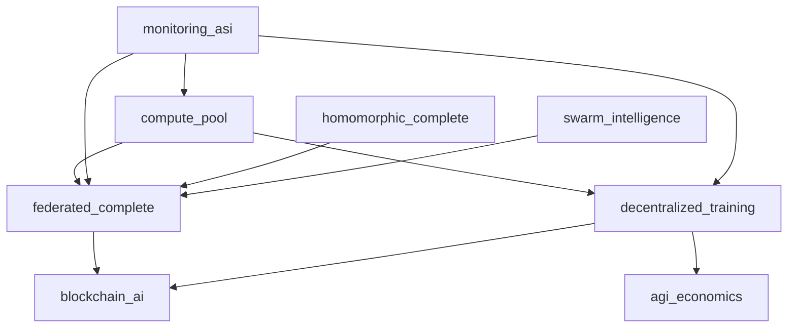

# Distributed Intelligence Systems Documentation

## Overview

The Distributed Intelligence Systems category focuses on federated learning, decentralized training, and distributed computation frameworks. These systems enable AI training and inference across multiple nodes while preserving privacy, enabling collaboration, and scaling computational resources efficiently.

## Subsystems Overview

| System | Purpose | Modules | Integration Level |
|--------|---------|---------|-------------------|
| federated_complete | Privacy-preserving distributed learning | 12 | 🔄 Ready |
| decentralized_training | Blockchain-based decentralized training | 8 | 🔄 Operational |
| compute_pool | Resource allocation & job scheduling | 12 | 🔄 Operational |

---

## federated_complete

**Location**: `/home/ubuntu/code/ASI_BUILD/federated_complete/`  
**Status**: Ready for Integration  
**Resource Requirements**: 8GB+ RAM, High Compute, Moderate Storage

### Purpose & Capabilities

The federated_complete subsystem provides comprehensive privacy-preserving distributed learning capabilities. It implements advanced federated learning algorithms, secure aggregation protocols, and personalized federated learning approaches while maintaining data privacy and security.

### Key Components

#### Core Federated Framework
- **core/base.py**: Base federated learning classes and interfaces
- **core/config.py**: Federated learning configuration management
- **core/exceptions.py**: Federated learning exception handling
- **core/manager.py**: Central federated learning coordinator

#### Aggregation Algorithms
- **aggregation/base_aggregator.py**: Base aggregation interface
- **aggregation/fedavg.py**: Federated Averaging (FedAvg) algorithm
- **aggregation/byzantine_robust.py**: Byzantine-robust aggregation
- **aggregation/secure_aggregation.py**: Cryptographically secure aggregation

#### Advanced Federated Algorithms
- **algorithms/async_fl.py**: Asynchronous federated learning
- **algorithms/cross_silo.py**: Cross-silo federated learning
- **algorithms/federated_transfer.py**: Federated transfer learning
- **algorithms/meta_learning.py**: Federated meta-learning
- **algorithms/personalized_fl.py**: Personalized federated learning

#### Privacy & Security
- **privacy/differential_privacy.py**: Differential privacy mechanisms

#### Utilities & Integration
- **utils/metrics.py**: Federated learning metrics
- **utils/model_compression.py**: Model compression for communication efficiency
- **integration/kenny_integration.py**: Kenny interface for federated systems

### Configuration Options

```python
# federated_complete/core/config.py
FEDERATED_CONFIG = {
    'federation': {
        'num_clients': 100,
        'clients_per_round': 10,
        'num_rounds': 1000,
        'client_selection': 'random',  # or 'importance', 'diversity'
        'min_clients_required': 5
    },
    'aggregation': {
        'algorithm': 'fedavg',  # or 'byzantine_robust', 'secure'
        'weighting': 'uniform',  # or 'data_size', 'loss_based'
        'byzantine_tolerance': 0.1,  # fraction of malicious clients
        'secure_aggregation': True
    },
    'privacy': {
        'differential_privacy': True,
        'epsilon': 1.0,  # privacy budget
        'delta': 1e-5,
        'clipping_norm': 1.0,
        'noise_multiplier': 1.1
    },
    'communication': {
        'compression': True,
        'compression_ratio': 0.1,
        'quantization_bits': 8,
        'sparsification_ratio': 0.01
    },
    'personalization': {
        'enabled': True,
        'local_epochs': 5,
        'personalization_layers': ['classifier'],
        'meta_learning_rate': 0.01
    }
}
```

### Usage Examples

#### Standard Federated Learning with FedAvg
```python
from federated_complete import FederatedManager
from federated_complete.aggregation import FedAvgAggregator
from federated_complete.core import FederatedConfig

# Initialize federated learning system
fed_manager = FederatedManager()
fed_aggregator = FedAvgAggregator()

# Configure federated learning
config = FederatedConfig(
    num_clients=50,
    clients_per_round=10,
    num_rounds=100,
    local_epochs=5
)

# Create federated learning setup
federated_setup = fed_manager.setup_federation(
    model_architecture='neural_network',
    dataset='distributed_mnist',
    config=config
)

# Simulate federated training
def federated_training_round(round_num):
    # Select clients for this round
    selected_clients = fed_manager.select_clients(
        selection_method='random',
        num_clients=config.clients_per_round
    )
    
    # Distribute global model to selected clients
    client_updates = []
    for client_id in selected_clients:
        # Local training on client
        local_update = fed_manager.client_training(
            client_id=client_id,
            global_model=federated_setup.global_model,
            local_epochs=config.local_epochs
        )
        client_updates.append(local_update)
    
    # Aggregate client updates
    aggregated_update = fed_aggregator.aggregate(
        client_updates=client_updates,
        aggregation_weights='uniform'
    )
    
    # Update global model
    fed_manager.update_global_model(
        global_model=federated_setup.global_model,
        aggregated_update=aggregated_update
    )
    
    # Evaluate global model
    evaluation_results = fed_manager.evaluate_global_model(
        model=federated_setup.global_model,
        test_data='global_test_set'
    )
    
    return evaluation_results

# Run federated learning
training_results = []
for round_num in range(config.num_rounds):
    round_results = federated_training_round(round_num)
    training_results.append(round_results)
    
    print(f"Round {round_num + 1}: "
          f"Accuracy {round_results.accuracy:.3f}, "
          f"Loss {round_results.loss:.3f}")

# Final evaluation
final_performance = fed_manager.final_evaluation(
    global_model=federated_setup.global_model,
    test_datasets=['client_test_sets', 'global_test_set']
)

print(f"Final federated model accuracy: {final_performance.accuracy:.3f}")
```

#### Secure Federated Learning with Differential Privacy
```python
from federated_complete.aggregation import SecureAggregator
from federated_complete.privacy import DifferentialPrivacy

# Initialize secure federated learning
secure_aggregator = SecureAggregator(
    encryption_scheme='homomorphic',
    secure_multiparty_computation=True
)

differential_privacy = DifferentialPrivacy(
    epsilon=1.0,
    delta=1e-5,
    mechanism='gaussian'
)

# Configure privacy-preserving federation
privacy_config = {
    'differential_privacy': True,
    'secure_aggregation': True,
    'client_privacy_budget': 0.1,
    'server_privacy_budget': 0.9,
    'noise_scaling': 'adaptive'
}

# Secure federated training with privacy
def secure_federated_training():
    for round_num in range(config.num_rounds):
        # Client selection with privacy consideration
        selected_clients = fed_manager.private_client_selection(
            privacy_budget=privacy_config['client_privacy_budget'],
            selection_diversity=True
        )
        
        # Secure local training with differential privacy
        encrypted_updates = []
        for client_id in selected_clients:
            # Local training with differential privacy
            local_model_update = fed_manager.client_training(
                client_id=client_id,
                global_model=federated_setup.global_model,
                local_epochs=config.local_epochs
            )
            
            # Add differential privacy noise
            private_update = differential_privacy.add_noise(
                model_update=local_model_update,
                sensitivity=1.0,
                privacy_budget=privacy_config['client_privacy_budget']
            )
            
            # Encrypt update for secure aggregation
            encrypted_update = secure_aggregator.encrypt_update(
                model_update=private_update,
                client_id=client_id
            )
            encrypted_updates.append(encrypted_update)
        
        # Secure aggregation without revealing individual updates
        aggregated_update = secure_aggregator.secure_aggregate(
            encrypted_updates=encrypted_updates,
            aggregation_function='weighted_average'
        )
        
        # Update global model with aggregated result
        fed_manager.update_global_model(
            global_model=federated_setup.global_model,
            aggregated_update=aggregated_update
        )
        
        # Privacy-preserving evaluation
        private_evaluation = differential_privacy.private_evaluation(
            model=federated_setup.global_model,
            test_data='private_test_set',
            privacy_budget=privacy_config['server_privacy_budget']
        )
        
        print(f"Secure Round {round_num + 1}: "
              f"Private Accuracy {private_evaluation.noisy_accuracy:.3f} "
              f"(±{private_evaluation.confidence_interval:.3f})")

# Run secure federated learning
secure_federated_training()
```

#### Personalized Federated Learning
```python
from federated_complete.algorithms import PersonalizedFL, MetaLearning

# Initialize personalized federated learning
personalized_fl = PersonalizedFL(
    personalization_strategy='fine_tuning',
    shared_layers=['feature_extractor'],
    personal_layers=['classifier'],
    adaptation_steps=5
)

meta_learning = MetaLearning(
    meta_algorithm='MAML',
    inner_learning_rate=0.01,
    outer_learning_rate=0.001,
    adaptation_steps=5
)

# Personalized federated training
def personalized_federated_training():
    # Global model training phase
    global_training_rounds = 50
    for round_num in range(global_training_rounds):
        # Standard federated learning for shared representation
        round_results = federated_training_round(round_num)
        
        if round_num % 10 == 0:
            print(f"Global training round {round_num}: "
                  f"Accuracy {round_results.accuracy:.3f}")
    
    # Personalization phase
    personalized_models = {}
    for client_id in fed_manager.get_all_clients():
        # Get client's local data distribution
        client_data_stats = fed_manager.analyze_client_data(client_id)
        
        # Personalize global model for client
        personalized_model = personalized_fl.personalize_model(
            global_model=federated_setup.global_model,
            client_data=fed_manager.get_client_data(client_id),
            personalization_budget=10  # local training steps
        )
        
        # Meta-learning adaptation
        if meta_learning.is_enabled():
            adapted_model = meta_learning.adapt_model(
                base_model=personalized_model,
                adaptation_data=fed_manager.get_client_adaptation_data(client_id),
                task_distribution=client_data_stats
            )
            personalized_models[client_id] = adapted_model
        else:
            personalized_models[client_id] = personalized_model
    
    # Evaluate personalized models
    personalization_results = {}
    for client_id, model in personalized_models.items():
        client_performance = fed_manager.evaluate_client_model(
            model=model,
            client_id=client_id,
            test_data='client_specific'
        )
        personalization_results[client_id] = client_performance
        
        print(f"Client {client_id} personalized accuracy: "
              f"{client_performance.accuracy:.3f}")
    
    # Compare with global model performance
    global_performance = fed_manager.evaluate_global_performance(
        global_model=federated_setup.global_model,
        personalized_models=personalized_models
    )
    
    return global_performance, personalization_results

# Run personalized federated learning
global_perf, personal_perf = personalized_federated_training()
print(f"Average personalization improvement: "
      f"{global_perf.personalization_gain:.2%}")
```

### Integration Points

- **decentralized_training**: Blockchain-based federated coordination
- **compute_pool**: Resource allocation for federated training
- **homomorphic_complete**: Privacy-preserving computation
- **swarm_intelligence**: Federated swarm optimization
- **consciousness_engine**: Federated consciousness development

### API Endpoints

- `POST /federated/train` - Start federated training
- `PUT /federated/aggregate` - Perform model aggregation
- `GET /federated/privacy` - Privacy budget status
- `POST /federated/personalize` - Personalize model for client
- `GET /federated/metrics` - Training metrics and performance

---

## decentralized_training

**Location**: `/home/ubuntu/code/ASI_BUILD/decentralized_training/`  
**Status**: Operational  
**Resource Requirements**: 10GB+ RAM, High Compute, High Storage

### Purpose & Capabilities

The decentralized_training subsystem provides blockchain-based decentralized training capabilities with cryptocurrency incentives, Byzantine fault tolerance, and peer-to-peer coordination. It enables truly decentralized AI training without central coordination.

### Key Components

#### Core Decentralized Systems
- **core/federated_orchestrator.py**: Decentralized training orchestration
- **core/byzantine_tolerance.py**: Byzantine fault tolerance mechanisms
- **core/dataset_sharding.py**: Distributed dataset management
- **core/gradient_compression.py**: Gradient compression for efficiency
- **core/error_handling.py**: Distributed error handling

#### Blockchain Integration
- **blockchain/agix_rewards.py**: AGIX token reward system
- **blockchain/checkpoint_manager.py**: Blockchain-based checkpoint storage

#### Privacy & Security
- **privacy/secure_aggregation.py**: Secure gradient aggregation

#### Peer-to-Peer Systems
- **p2p/node_discovery.py**: Peer discovery and network formation

#### Monitoring & Governance
- **monitoring/dashboard.py**: Decentralized training dashboard

#### Smart Contracts
- **smart_contracts/TrainingCoordinator.sol**: Training coordination smart contract

### Configuration Options

```python
# decentralized_training/config.py
DECENTRALIZED_CONFIG = {
    'network': {
        'consensus_mechanism': 'proof_of_contribution',
        'min_nodes': 10,
        'max_nodes': 1000,
        'network_topology': 'adaptive_mesh',
        'communication_protocol': 'gossip'
    },
    'training': {
        'synchronization': 'asynchronous',
        'aggregation_frequency': 100,  # steps
        'byzantine_tolerance': 0.33,  # max malicious nodes
        'gradient_verification': True,
        'checkpoint_frequency': 1000  # steps
    },
    'incentives': {
        'reward_token': 'AGIX',
        'contribution_metric': 'gradient_quality',
        'base_reward': 10,  # tokens per contribution
        'quality_bonus': 5,  # bonus for high-quality contributions
        'stake_requirement': 100  # tokens required to participate
    },
    'security': {
        'identity_verification': 'cryptographic',
        'gradient_encryption': True,
        'secure_channels': True,
        'reputation_system': True
    }
}
```

### Usage Examples

#### Blockchain-Based Decentralized Training
```python
from decentralized_training import FederatedOrchestrator
from decentralized_training.blockchain import AGIXRewards, CheckpointManager
from decentralized_training.core import ByzantineTolerance

# Initialize decentralized training system
orchestrator = FederatedOrchestrator()
agix_rewards = AGIXRewards()
checkpoint_manager = CheckpointManager()
byzantine_tolerance = ByzantineTolerance()

# Setup decentralized training network
network_config = {
    'blockchain_network': 'ethereum',
    'smart_contract_address': '0x1234...5678',
    'ipfs_gateway': 'https://ipfs.io/ipfs/',
    'consensus_threshold': 0.67
}

decentralized_network = orchestrator.setup_decentralized_network(
    config=network_config,
    initial_model='transformer_large',
    training_dataset='distributed_wikipedia'
)

# Node participation and contribution
def participate_in_decentralized_training(node_id, stake_amount):
    # Stake tokens to participate
    stake_result = agix_rewards.stake_tokens(
        node_id=node_id,
        amount=stake_amount,
        training_session=decentralized_network.session_id
    )
    
    if not stake_result.success:
        print(f"Staking failed: {stake_result.error}")
        return
    
    # Join training network
    join_result = orchestrator.join_training_network(
        node_id=node_id,
        network_id=decentralized_network.network_id,
        contribution_proof=stake_result.proof
    )
    
    # Participate in training rounds
    round_num = 0
    while decentralized_network.is_active():
        round_num += 1
        
        # Download latest model checkpoint
        latest_checkpoint = checkpoint_manager.download_checkpoint(
            network_id=decentralized_network.network_id,
            checkpoint_hash=decentralized_network.latest_checkpoint
        )
        
        # Local training step
        local_gradients = orchestrator.compute_local_gradients(
            model=latest_checkpoint.model,
            local_data=get_node_local_data(node_id),
            batch_size=32
        )
        
        # Verify gradient quality
        gradient_quality = byzantine_tolerance.verify_gradient_quality(
            gradients=local_gradients,
            quality_threshold=0.8,
            historical_performance=get_node_history(node_id)
        )
        
        if gradient_quality.is_valid:
            # Submit gradients to network
            submission_result = orchestrator.submit_gradients(
                node_id=node_id,
                gradients=local_gradients,
                round_number=round_num,
                quality_proof=gradient_quality.proof
            )
            
            # Calculate reward based on contribution
            if submission_result.accepted:
                reward_amount = agix_rewards.calculate_reward(
                    contribution_quality=gradient_quality.score,
                    network_performance_impact=submission_result.impact_score,
                    base_reward=DECENTRALIZED_CONFIG['incentives']['base_reward']
                )
                
                # Receive reward
                agix_rewards.distribute_reward(
                    node_id=node_id,
                    amount=reward_amount,
                    round_number=round_num
                )
                
                print(f"Round {round_num}: Contribution accepted, "
                      f"reward: {reward_amount} AGIX")
        
        # Participate in consensus for model update
        consensus_vote = orchestrator.participate_in_consensus(
            node_id=node_id,
            proposed_updates=decentralized_network.pending_updates,
            voting_power=stake_amount
        )
        
        # Wait for next round
        orchestrator.wait_for_next_round()

# Start decentralized training participation
node_stake = 500  # AGIX tokens
participate_in_decentralized_training('node_12345', node_stake)
```

#### Byzantine Fault Tolerant Aggregation
```python
from decentralized_training.core import ByzantineTolerance
from decentralized_training.privacy import SecureAggregation

# Initialize Byzantine fault tolerance
byzantine_tolerance = ByzantineTolerance(
    fault_tolerance_ratio=0.33,
    detection_method='statistical_outlier',
    recovery_strategy='gradient_filtering'
)

secure_aggregation = SecureAggregation()

# Byzantine-robust training round
def byzantine_robust_training_round(participating_nodes):
    collected_gradients = {}
    
    # Collect gradients from all participating nodes
    for node_id in participating_nodes:
        node_gradients = orchestrator.receive_gradients(node_id)
        collected_gradients[node_id] = node_gradients
    
    # Detect potential Byzantine nodes
    byzantine_detection = byzantine_tolerance.detect_byzantine_nodes(
        gradients=collected_gradients,
        historical_behavior=get_nodes_history(participating_nodes),
        detection_sensitivity=0.95
    )
    
    # Filter out Byzantine contributions
    trusted_gradients = {}
    for node_id, gradients in collected_gradients.items():
        if node_id not in byzantine_detection.malicious_nodes:
            trusted_gradients[node_id] = gradients
        else:
            print(f"Warning: Node {node_id} flagged as potentially malicious")
    
    # Secure aggregation of trusted gradients
    if len(trusted_gradients) >= byzantine_tolerance.min_honest_nodes:
        aggregated_gradients = secure_aggregation.aggregate_gradients(
            gradient_dict=trusted_gradients,
            aggregation_method='trimmed_mean',
            trimming_ratio=0.1
        )
        
        # Verify aggregation integrity
        integrity_check = byzantine_tolerance.verify_aggregation_integrity(
            individual_gradients=trusted_gradients,
            aggregated_result=aggregated_gradients
        )
        
        if integrity_check.is_valid:
            return aggregated_gradients
        else:
            print("Aggregation integrity check failed")
            return None
    else:
        print(f"Insufficient honest nodes: {len(trusted_gradients)} < "
              f"{byzantine_tolerance.min_honest_nodes}")
        return None

# Run Byzantine-robust training
robust_gradients = byzantine_robust_training_round(
    participating_nodes=['node_1', 'node_2', 'node_3', 'node_4', 'node_5']
)

if robust_gradients:
    print("Byzantine-robust aggregation successful")
else:
    print("Byzantine-robust aggregation failed")
```

### Integration Points

- **federated_complete**: Enhanced federated learning capabilities
- **blockchain_ai**: Blockchain infrastructure integration
- **agi_economics**: Economic incentive mechanisms
- **compute_pool**: Distributed compute resource management

### Smart Contract Integration

The system uses Ethereum smart contracts for:
- Training session coordination
- Gradient submission and verification
- Reward distribution
- Stake management
- Dispute resolution

---

## compute_pool

**Location**: `/home/ubuntu/code/ASI_BUILD/compute_pool/`  
**Status**: Operational  
**Resource Requirements**: 6GB+ RAM, Moderate Compute, High Storage

### Purpose & Capabilities

The compute_pool subsystem provides comprehensive resource allocation and job scheduling capabilities. It manages distributed compute resources across multiple platforms including Kubernetes and SLURM, with fair sharing, preemption, and fault tolerance.

### Key Components

#### Core Pool Management
- **core/pool_manager.py**: Central compute pool coordination
- **core/job_scheduler.py**: Advanced job scheduling algorithms
- **core/resource_allocator.py**: Resource allocation and optimization
- **core/fair_share.py**: Fair share scheduling policies
- **core/preemption.py**: Job preemption and priority management

#### Resource Management
- **resources/cpu_manager.py**: CPU resource management
- **resources/gpu_manager.py**: GPU resource allocation
- **resources/memory_manager.py**: Memory management and optimization
- **resources/storage_manager.py**: Storage resource coordination
- **resources/network_manager.py**: Network bandwidth management

#### Platform Integrations
- **integrations/kubernetes_integration.py**: Kubernetes cluster integration
- **integrations/slurm_integration.py**: SLURM workload manager integration

#### Fault Tolerance
- **fault_tolerance/checkpoint_manager.py**: Job checkpointing system
- **fault_tolerance/recovery_manager.py**: Failure recovery mechanisms

#### Monitoring
- **monitoring/metrics_collector.py**: Resource utilization monitoring

### Configuration Options

```python
# compute_pool/config.py
COMPUTE_POOL_CONFIG = {
    'scheduling': {
        'algorithm': 'fair_share',  # or 'priority', 'fifo', 'backfill'
        'preemption_enabled': True,
        'max_job_duration': 86400,  # seconds (24 hours)
        'default_priority': 100,
        'fairshare_decay': 0.95
    },
    'resources': {
        'cpu_oversubscription': 1.0,
        'memory_oversubscription': 0.9,
        'gpu_sharing': True,
        'storage_quota_gb': 1000,
        'network_bandwidth_mbps': 10000
    },
    'fault_tolerance': {
        'checkpoint_frequency': 300,  # seconds
        'max_retries': 3,
        'failure_detection_timeout': 60,  # seconds
        'automatic_recovery': True
    },
    'platforms': {
        'kubernetes_enabled': True,
        'slurm_enabled': True,
        'local_execution': True,
        'cloud_bursting': True
    }
}
```

### Usage Examples

#### Advanced Job Scheduling and Resource Allocation
```python
from compute_pool import PoolManager, JobScheduler
from compute_pool.core import ResourceAllocator, FairShare
from compute_pool.resources import GPUManager, CPUManager, MemoryManager

# Initialize compute pool system
pool_manager = PoolManager()
job_scheduler = JobScheduler()
resource_allocator = ResourceAllocator()
fair_share = FairShare()

# Initialize resource managers
gpu_manager = GPUManager()
cpu_manager = CPUManager()
memory_manager = MemoryManager()

# Define compute jobs
training_jobs = [
    {
        'job_id': 'ai_training_1',
        'user': 'researcher_a',
        'priority': 150,
        'resources': {
            'cpu_cores': 16,
            'memory_gb': 64,
            'gpu_count': 4,
            'gpu_type': 'A100',
            'storage_gb': 500
        },
        'estimated_duration': 7200,  # seconds
        'checkpointing': True,
        'preemptible': False
    },
    {
        'job_id': 'ai_training_2',
        'user': 'researcher_b',
        'priority': 100,
        'resources': {
            'cpu_cores': 8,
            'memory_gb': 32,
            'gpu_count': 2,
            'gpu_type': 'V100',
            'storage_gb': 200
        },
        'estimated_duration': 3600,
        'checkpointing': True,
        'preemptible': True
    },
    {
        'job_id': 'inference_service',
        'user': 'production_team',
        'priority': 200,
        'resources': {
            'cpu_cores': 4,
            'memory_gb': 16,
            'gpu_count': 1,
            'gpu_type': 'T4',
            'storage_gb': 50
        },
        'estimated_duration': -1,  # persistent service
        'checkpointing': False,
        'preemptible': False
    }
]

# Submit jobs to scheduler
scheduled_jobs = []
for job in training_jobs:
    # Check resource availability
    resource_availability = resource_allocator.check_resource_availability(
        requested_resources=job['resources'],
        duration=job['estimated_duration']
    )
    
    if resource_availability.can_schedule:
        # Calculate fair share allocation
        fair_share_allocation = fair_share.calculate_fair_share(
            user=job['user'],
            requested_resources=job['resources'],
            current_usage=pool_manager.get_user_usage(job['user']),
            historical_usage=pool_manager.get_user_history(job['user'])
        )
        
        # Schedule job with fair share consideration
        scheduling_result = job_scheduler.schedule_job(
            job=job,
            fair_share_allocation=fair_share_allocation,
            resource_constraints=resource_availability.constraints
        )
        
        if scheduling_result.scheduled:
            scheduled_jobs.append(scheduling_result)
            print(f"Job {job['job_id']} scheduled for "
                  f"{scheduling_result.start_time}")
        else:
            print(f"Job {job['job_id']} queued: {scheduling_result.reason}")
    else:
        print(f"Job {job['job_id']} cannot be scheduled: "
              f"{resource_availability.reason}")

# Monitor job execution
def monitor_job_execution():
    while pool_manager.has_active_jobs():
        # Check resource utilization
        utilization = pool_manager.get_resource_utilization()
        
        # Check for resource contention
        if utilization.cpu_utilization > 0.9:
            # Consider preemption for lower priority jobs
            preemption_candidates = job_scheduler.identify_preemption_candidates(
                resource_pressure='cpu',
                preemption_policy='priority_based'
            )
            
            for candidate in preemption_candidates:
                job_scheduler.preempt_job(
                    job_id=candidate.job_id,
                    reason='resource_contention',
                    checkpoint_before_preemption=True
                )
        
        # Check for job failures
        failed_jobs = pool_manager.check_job_failures()
        for failed_job in failed_jobs:
            pool_manager.handle_job_failure(
                job_id=failed_job.job_id,
                failure_reason=failed_job.failure_reason,
                auto_restart=True
            )
        
        # Update fair share calculations
        fair_share.update_usage_statistics()
        
        time.sleep(30)  # Monitor every 30 seconds

# Start monitoring
monitor_job_execution()
```

#### Kubernetes Integration for Scalable Compute
```python
from compute_pool.integrations import KubernetesIntegration
from compute_pool.fault_tolerance import CheckpointManager

# Initialize Kubernetes integration
k8s_integration = KubernetesIntegration(
    cluster_config='~/.kube/config',
    namespace='asi-build-compute',
    auto_scaling=True
)

checkpoint_manager = CheckpointManager(
    storage_backend='s3',
    checkpoint_interval=300
)

# Deploy AI training job on Kubernetes
def deploy_ai_training_on_k8s(job_config):
    # Create Kubernetes job specification
    k8s_job_spec = k8s_integration.create_job_spec(
        job_name=job_config['job_id'],
        container_image='asi-build/training:latest',
        resources=job_config['resources'],
        environment_variables={
            'TRAINING_CONFIG': job_config['training_params'],
            'CHECKPOINT_ENABLED': 'true',
            'CHECKPOINT_INTERVAL': '300'
        },
        volumes=[
            {
                'name': 'training-data',
                'persistent_volume_claim': 'training-data-pvc'
            },
            {
                'name': 'checkpoints',
                'persistent_volume_claim': 'checkpoint-storage-pvc'
            }
        ]
    )
    
    # Deploy job to Kubernetes
    deployment_result = k8s_integration.deploy_job(k8s_job_spec)
    
    if deployment_result.success:
        # Monitor job progress
        job_monitor = k8s_integration.create_job_monitor(
            job_name=job_config['job_id'],
            monitoring_interval=60
        )
        
        # Set up automatic checkpointing
        checkpoint_manager.enable_checkpointing(
            job_id=job_config['job_id'],
            checkpoint_path=f"/checkpoints/{job_config['job_id']}",
            metadata={
                'job_type': 'ai_training',
                'user': job_config['user'],
                'resources': job_config['resources']
            }
        )
        
        return deployment_result
    else:
        print(f"Deployment failed: {deployment_result.error}")
        return None

# Example AI training job deployment
ai_training_job = {
    'job_id': 'large_language_model_training',
    'user': 'ai_research_team',
    'resources': {
        'cpu_cores': 32,
        'memory_gb': 256,
        'gpu_count': 8,
        'gpu_type': 'A100',
        'storage_gb': 2000
    },
    'training_params': {
        'model_architecture': 'transformer',
        'dataset': 'large_text_corpus',
        'batch_size': 128,
        'learning_rate': 0.0001,
        'max_epochs': 100
    }
}

# Deploy the training job
deployment = deploy_ai_training_on_k8s(ai_training_job)

if deployment:
    print(f"AI training job deployed successfully: {deployment.job_name}")
    print(f"Kubernetes pod: {deployment.pod_name}")
    print(f"Expected completion: {deployment.estimated_completion}")
```

#### SLURM Integration for HPC Workloads
```python
from compute_pool.integrations import SLURMIntegration

# Initialize SLURM integration
slurm_integration = SLURMIntegration(
    cluster_name='asi-build-hpc',
    partition='gpu',
    account='ai-research'
)

# Submit large-scale training job to SLURM
def submit_hpc_training_job(job_config):
    # Create SLURM job script
    slurm_script = slurm_integration.create_job_script(
        job_name=job_config['job_id'],
        partition='gpu',
        nodes=job_config['node_count'],
        ntasks_per_node=job_config['tasks_per_node'],
        cpus_per_task=job_config['cpus_per_task'],
        gres=f"gpu:{job_config['gpu_type']}:{job_config['gpu_count']}",
        time=job_config['walltime'],
        memory=f"{job_config['memory_gb']}G",
        job_script_content=f"""
#!/bin/bash
module load cuda/11.8
module load python/3.9
module load mpi/openmpi

export CUDA_VISIBLE_DEVICES=0,1,2,3,4,5,6,7
export OMP_NUM_THREADS={job_config['cpus_per_task']}

# Distributed training command
mpirun -np {job_config['node_count'] * job_config['tasks_per_node']} \\
    python distributed_training.py \\
    --model-config {job_config['model_config']} \\
    --data-path {job_config['data_path']} \\
    --checkpoint-dir {job_config['checkpoint_dir']} \\
    --distributed-backend nccl \\
    --world-size {job_config['world_size']} \\
    --rank ${{SLURM_PROCID}}
        """
    )
    
    # Submit job to SLURM
    submission_result = slurm_integration.submit_job(slurm_script)
    
    if submission_result.success:
        print(f"SLURM job submitted: {submission_result.job_id}")
        
        # Monitor job status
        job_status = slurm_integration.monitor_job(submission_result.job_id)
        return job_status
    else:
        print(f"SLURM submission failed: {submission_result.error}")
        return None

# Large-scale distributed training job
hpc_training_job = {
    'job_id': 'massive_model_training',
    'node_count': 16,
    'tasks_per_node': 8,
    'cpus_per_task': 4,
    'gpu_type': 'a100',
    'gpu_count': 8,
    'memory_gb': 512,
    'walltime': '24:00:00',
    'model_config': 'gpt_175b_config.json',
    'data_path': '/shared/datasets/large_corpus',
    'checkpoint_dir': '/shared/checkpoints/massive_model',
    'world_size': 128  # 16 nodes * 8 tasks
}

# Submit HPC training job
hpc_job_status = submit_hpc_training_job(hpc_training_job)
```

### Integration Points

- **federated_complete**: Distributed federated learning resources
- **decentralized_training**: Decentralized compute coordination
- **kubernetes**: Container orchestration
- **monitoring_asi**: System monitoring integration
- **agi_economics**: Resource pricing and allocation

### Monitoring & Metrics

Key compute pool metrics:
- Resource utilization (CPU, GPU, memory, storage)
- Job queue depth and wait times
- Fair share compliance
- System throughput and efficiency
- Fault tolerance effectiveness
- Cost optimization metrics

---

## Cross-System Integration

### Kenny Integration Pattern

All distributed intelligence systems implement unified Kenny interfaces:

```python
from integration_layer.kenny_distributed import KennyDistributedInterface

# Unified distributed intelligence interface
kenny_distributed = KennyDistributedInterface()
kenny_distributed.register_federated_system(federated_complete)
kenny_distributed.register_decentralized_system(decentralized_training)
kenny_distributed.register_compute_system(compute_pool)
```

### System Architecture



## Performance Optimization

### Distributed Efficiency
- Gradient compression and quantization
- Asynchronous training algorithms
- Adaptive resource allocation
- Load balancing across nodes
- Network optimization

### Scalability
- Auto-scaling compute resources
- Dynamic job scheduling
- Elastic federated learning
- Hierarchical aggregation
- Edge-cloud coordination

### Monitoring & Reliability

Critical distributed intelligence metrics:
- Training convergence rates
- Communication overhead
- Resource utilization efficiency
- Byzantine fault detection accuracy
- System availability and uptime
- Cost per training job
- Privacy preservation effectiveness

---

*This documentation provides comprehensive guidance for implementing and integrating distributed intelligence systems within the ASI:BUILD framework.*