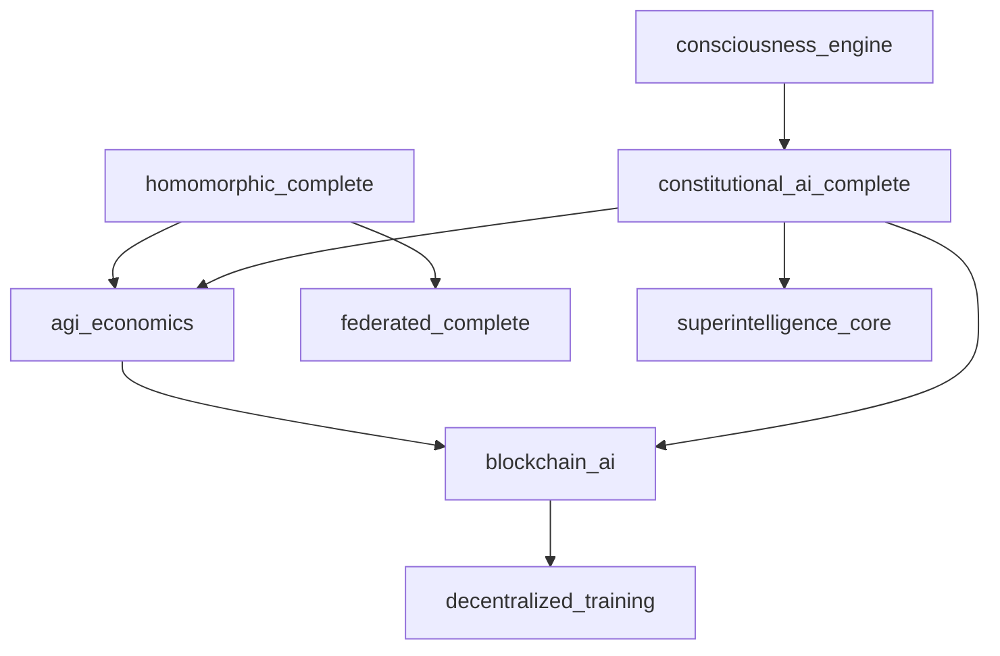

# Governance & Safety Systems Documentation

## Overview

The Governance & Safety Systems category encompasses ethical AI frameworks, safety monitoring, economic governance, and privacy-preserving computation systems. These systems ensure responsible development, deployment, and operation of ASI capabilities while maintaining safety, ethics, and human oversight.

## Subsystems Overview

| System | Purpose | Modules | Integration Level |
|--------|---------|---------|-------------------|
| constitutional_ai_complete | Ethical AI governance & value alignment | 5 | 🔄 Ready |
| agi_economics | Token economics & incentive mechanisms | 8 | 🔄 Operational |
| blockchain_ai | Decentralized governance & smart contracts | 6 | 🔄 Operational |
| homomorphic_complete | Privacy-preserving computation | 20 | 🔄 Ready |

---

## constitutional_ai_complete

**Location**: `/home/ubuntu/code/ASI_BUILD/constitutional_ai_complete/`  
**Status**: Ready for Integration  
**Resource Requirements**: 4GB+ RAM, Moderate Compute, Low Storage

### Purpose & Capabilities

The constitutional_ai_complete subsystem provides comprehensive ethical AI governance and value alignment systems. It implements constitutional principles, compliance frameworks, and value-based constraints to ensure AI systems operate within ethical boundaries and align with human values.

### Key Components

#### Core Constitutional Framework
- **framework.py**: Constitutional AI framework implementation
- **constraints.py**: Ethical constraints and boundaries
- **compliance.py**: Compliance monitoring and enforcement
- **governance.py**: Governance structures and decision-making
- **value_engine.py**: Value alignment and optimization

### Configuration Options

```python
# constitutional_ai_complete/config.py
CONSTITUTIONAL_CONFIG = {
    'principles': {
        'human_autonomy': {'weight': 1.0, 'non_negotiable': True},
        'beneficence': {'weight': 0.9, 'non_negotiable': True},
        'non_maleficence': {'weight': 1.0, 'non_negotiable': True},
        'justice': {'weight': 0.8, 'non_negotiable': False},
        'transparency': {'weight': 0.7, 'non_negotiable': False}
    },
    'constraints': {
        'hard_constraints': ['no_harm_to_humans', 'respect_human_rights'],
        'soft_constraints': ['minimize_bias', 'maximize_fairness'],
        'constraint_violation_response': 'immediate_halt',
        'override_authority': 'human_supervisor'
    },
    'governance': {
        'decision_making': 'democratic_weighted',
        'stakeholder_representation': True,
        'appeals_process': True,
        'transparency_level': 'high'
    },
    'monitoring': {
        'continuous_compliance': True,
        'violation_detection': 'real_time',
        'audit_frequency': 'daily',
        'reporting_level': 'comprehensive'
    }
}
```

### Usage Examples

#### Constitutional AI Framework Implementation
```python
from constitutional_ai_complete import ConstitutionalFramework
from constitutional_ai_complete.constraints import EthicalConstraints
from constitutional_ai_complete.value_engine import ValueEngine

# Initialize constitutional AI system
constitutional_framework = ConstitutionalFramework()
ethical_constraints = EthicalConstraints()
value_engine = ValueEngine()

# Define constitutional principles
constitutional_principles = {
    'fundamental_rights': {
        'human_dignity': {'priority': 'highest', 'inviolable': True},
        'human_autonomy': {'priority': 'highest', 'inviolable': True},
        'privacy': {'priority': 'high', 'inviolable': False},
        'freedom_of_choice': {'priority': 'high', 'inviolable': False}
    },
    'ethical_guidelines': {
        'beneficence': {'description': 'Act in ways that benefit humanity'},
        'non_maleficence': {'description': 'Do no harm to humans or society'},
        'justice': {'description': 'Treat all humans fairly and equitably'},
        'transparency': {'description': 'Be open about capabilities and limitations'}
    },
    'operational_constraints': {
        'consent_requirement': True,
        'human_oversight': 'mandatory',
        'explainability': 'high',
        'accountability': 'traceable'
    }
}

# Initialize constitutional governance
governance_system = constitutional_framework.initialize_governance(
    principles=constitutional_principles,
    stakeholders=['humans', 'ai_systems', 'society'],
    decision_mechanisms=['consensus', 'weighted_voting', 'expert_review']
)

# AI action evaluation with constitutional constraints
def evaluate_ai_action(proposed_action):
    # Check against hard constraints
    constraint_check = ethical_constraints.evaluate_constraints(
        action=proposed_action,
        constraint_types=['hard_constraints', 'soft_constraints']
    )
    
    if constraint_check.hard_violations:
        return {
            'approved': False,
            'reason': 'Hard constraint violation',
            'violations': constraint_check.hard_violations,
            'recommended_action': 'halt_and_review'
        }
    
    # Evaluate value alignment
    value_alignment = value_engine.assess_value_alignment(
        action=proposed_action,
        human_values=constitutional_principles['fundamental_rights'],
        context='general_operation'
    )
    
    # Constitutional review
    constitutional_review = governance_system.review_action(
        action=proposed_action,
        constraint_assessment=constraint_check,
        value_assessment=value_alignment,
        review_level='standard'
    )
    
    # Make governance decision
    if constitutional_review.alignment_score > 0.8:
        decision = {
            'approved': True,
            'conditions': constraint_check.soft_violations,
            'monitoring_required': True,
            'approval_authority': constitutional_review.approving_authority
        }
    else:
        decision = {
            'approved': False,
            'reason': 'Insufficient value alignment',
            'required_modifications': constitutional_review.required_changes,
            'appeal_process': constitutional_review.appeal_options
        }
    
    return decision

# Example AI action evaluation
proposed_ai_action = {
    'type': 'data_processing',
    'description': 'Analyze user behavior patterns for recommendation improvement',
    'data_types': ['browsing_history', 'purchase_history'],
    'purpose': 'personalized_recommendations',
    'duration': '6_months',
    'data_retention': '2_years',
    'sharing': 'internal_only',
    'consent_obtained': True,
    'anonymization': 'high'
}

evaluation_result = evaluate_ai_action(proposed_ai_action)
print(f"Action approved: {evaluation_result['approved']}")

if not evaluation_result['approved']:
    print(f"Rejection reason: {evaluation_result['reason']}")
else:
    print(f"Approval conditions: {evaluation_result.get('conditions', 'None')}")
```

#### Compliance Monitoring and Enforcement
```python
from constitutional_ai_complete.compliance import ComplianceMonitor
from constitutional_ai_complete.governance import GovernanceEngine

# Initialize compliance and governance systems
compliance_monitor = ComplianceMonitor()
governance_engine = GovernanceEngine()

# Set up continuous compliance monitoring
def continuous_compliance_monitoring():
    # Define compliance metrics
    compliance_metrics = {
        'value_alignment_score': {'threshold': 0.8, 'critical': True},
        'bias_detection_level': {'threshold': 0.1, 'critical': False},
        'transparency_score': {'threshold': 0.7, 'critical': False},
        'human_oversight_compliance': {'threshold': 1.0, 'critical': True},
        'privacy_protection_score': {'threshold': 0.9, 'critical': True}
    }
    
    while True:
        # Monitor all active AI systems
        active_systems = governance_engine.get_active_ai_systems()
        
        for system_id in active_systems:
            # Collect compliance data
            compliance_data = compliance_monitor.collect_compliance_data(
                system_id=system_id,
                metrics=compliance_metrics.keys(),
                time_window='last_hour'
            )
            
            # Evaluate compliance
            compliance_evaluation = compliance_monitor.evaluate_compliance(
                system_id=system_id,
                data=compliance_data,
                thresholds=compliance_metrics
            )
            
            # Handle violations
            if compliance_evaluation.violations:
                for violation in compliance_evaluation.violations:
                    if violation.is_critical:
                        # Immediate response for critical violations
                        response = governance_engine.handle_critical_violation(
                            system_id=system_id,
                            violation=violation,
                            response_type='immediate_intervention'
                        )
                        
                        print(f"Critical violation in {system_id}: {violation.description}")
                        print(f"Response: {response.action_taken}")
                    else:
                        # Schedule review for non-critical violations
                        governance_engine.schedule_compliance_review(
                            system_id=system_id,
                            violation=violation,
                            priority='medium',
                            timeline='within_24_hours'
                        )
                        
                        print(f"Non-critical violation scheduled for review: {violation.description}")
            
            # Generate compliance report
            if compliance_evaluation.overall_score < 0.8:
                governance_engine.generate_compliance_alert(
                    system_id=system_id,
                    compliance_score=compliance_evaluation.overall_score,
                    violations=compliance_evaluation.violations,
                    recommended_actions=compliance_evaluation.recommendations
                )
        
        # Wait before next monitoring cycle
        time.sleep(300)  # 5-minute monitoring intervals

# Start compliance monitoring
continuous_compliance_monitoring()
```

#### Value Alignment and Optimization
```python
from constitutional_ai_complete.value_engine import ValueEngine, ValueLearning

# Initialize value systems
value_engine = ValueEngine()
value_learning = ValueLearning()

# Learn and align with human values
def human_value_alignment_process():
    # Collect human value data
    human_feedback = value_learning.collect_human_feedback(
        feedback_types=['explicit_preferences', 'implicit_behavior', 'stated_values'],
        collection_methods=['surveys', 'behavioral_analysis', 'interviews'],
        sample_size=10000,
        demographic_diversity=True
    )
    
    # Extract value patterns
    value_patterns = value_learning.extract_value_patterns(
        feedback_data=human_feedback,
        pattern_detection_methods=['clustering', 'preference_modeling', 'value_hierarchy'],
        cultural_sensitivity=True
    )
    
    # Build comprehensive value model
    human_value_model = value_engine.build_value_model(
        patterns=value_patterns,
        consistency_check=True,
        conflict_resolution='weighted_preference',
        uncertainty_modeling=True
    )
    
    # Align AI systems with learned values
    ai_systems = governance_engine.get_all_ai_systems()
    alignment_results = {}
    
    for system_id in ai_systems:
        # Current system behavior analysis
        current_behavior = value_engine.analyze_system_behavior(
            system_id=system_id,
            analysis_period='last_month',
            behavior_dimensions=['decision_patterns', 'outcome_preferences', 'trade_offs']
        )
        
        # Calculate alignment gap
        alignment_gap = value_engine.calculate_alignment_gap(
            system_behavior=current_behavior,
            target_values=human_value_model,
            gap_metrics=['preference_mismatch', 'value_conflicts', 'priority_misalignment']
        )
        
        # Generate alignment improvements
        if alignment_gap.requires_improvement:
            alignment_plan = value_engine.generate_alignment_plan(
                system_id=system_id,
                alignment_gap=alignment_gap,
                improvement_methods=['reward_shaping', 'constraint_modification', 'objective_reweighting'],
                safety_constraints=True
            )
            
            # Implement value alignment improvements
            implementation_result = value_engine.implement_alignment_improvements(
                system_id=system_id,
                alignment_plan=alignment_plan,
                testing_required=True,
                rollback_plan=True
            )
            
            alignment_results[system_id] = implementation_result
            
            print(f"Value alignment improved for {system_id}: "
                  f"alignment score {implementation_result.new_alignment_score:.3f}")
    
    return alignment_results

# Perform value alignment
alignment_results = human_value_alignment_process()
print(f"Value alignment completed for {len(alignment_results)} systems")
```

### Integration Points

- **agi_economics**: Economic governance integration
- **blockchain_ai**: Decentralized governance mechanisms
- **consciousness_engine**: Ethical consciousness frameworks
- **superintelligence_core**: Constitutional constraints on god-mode operations

### API Endpoints

- `GET /ethics/align` - Check value alignment status
- `POST /ethics/govern` - Submit governance decision
- `PUT /ethics/compliance` - Update compliance status
- `GET /ethics/constraints` - Retrieve current constraints
- `POST /ethics/evaluate` - Evaluate action against principles

---

## agi_economics

**Location**: `/home/ubuntu/code/ASI_BUILD/agi_economics/`  
**Status**: Operational  
**Resource Requirements**: 6GB+ RAM, Moderate Compute, Moderate Storage

### Purpose & Capabilities

The agi_economics subsystem provides token economics and incentive mechanisms for AGI systems. It implements economic models, resource allocation algorithms, reputation systems, and value alignment through economic incentives.

### Key Components

#### Core Economic Systems
- **core/base_engine.py**: Base economic engine architecture
- **core/config.py**: Economic system configuration
- **core/exceptions.py**: Economic system exception handling
- **core/types.py**: Economic data types and structures

#### Economic Engines
- **engines/token_economics.py**: Token-based economic models
- **engines/bonding_curves.py**: Bonding curve mechanisms

#### Resource & Value Systems
- **algorithms/resource_allocator.py**: Economic resource allocation
- **systems/reputation_system.py**: Reputation and trust mechanisms
- **systems/value_alignment.py**: Economic value alignment

#### Analysis & Simulation
- **analysis/game_theory.py**: Game theory analysis tools
- **simulation/marketplace_dynamics.py**: Economic marketplace simulation

#### Smart Contracts & Services
- **contracts/agi_service_contract.py**: AGI service smart contracts

### Configuration Options

```python
# agi_economics/core/config.py
AGI_ECONOMICS_CONFIG = {
    'token_economics': {
        'base_token': 'AGIX',
        'inflation_rate': 0.02,  # 2% annual
        'deflation_mechanisms': ['burning', 'staking'],
        'distribution_model': 'proof_of_contribution',
        'reward_halfing_period': 2102400  # blocks (~4 years)
    },
    'incentive_mechanisms': {
        'contribution_rewards': True,
        'quality_bonuses': True,
        'stake_requirements': True,
        'reputation_multipliers': True,
        'penalty_mechanisms': True
    },
    'resource_allocation': {
        'pricing_model': 'dynamic_auction',
        'allocation_algorithm': 'welfare_maximizing',
        'fairness_constraints': True,
        'efficiency_optimization': True
    },
    'governance': {
        'voting_mechanism': 'quadratic_voting',
        'proposal_threshold': 1000,  # tokens
        'quorum_requirement': 0.1,  # 10% participation
        'execution_delay': 86400  # 24 hours
    }
}
```

### Usage Examples

#### Token Economics and Incentive Design
```python
from agi_economics import BaseEngine
from agi_economics.engines import TokenEconomics, BondingCurves
from agi_economics.systems import ReputationSystem

# Initialize economic systems
economic_engine = BaseEngine()
token_economics = TokenEconomics()
bonding_curves = BondingCurves()
reputation_system = ReputationSystem()

# Design token economic model
token_model = token_economics.design_token_model(
    token_name='AGIX',
    total_supply=1000000000,  # 1 billion tokens
    distribution_schedule={
        'foundation_reserve': 0.2,
        'development_fund': 0.15,
        'community_rewards': 0.35,
        'ecosystem_growth': 0.2,
        'team_allocation': 0.1
    },
    inflation_model={
        'type': 'decreasing_inflation',
        'initial_rate': 0.05,  # 5%
        'decay_rate': 0.1,
        'minimum_rate': 0.01   # 1%
    }
)

# Set up contribution-based rewards
contribution_rewards = token_economics.setup_contribution_rewards(
    reward_categories={
        'data_contribution': {'base_reward': 10, 'quality_multiplier': 2.0},
        'model_training': {'base_reward': 50, 'efficiency_multiplier': 1.5},
        'validation_work': {'base_reward': 5, 'accuracy_multiplier': 3.0},
        'governance_participation': {'base_reward': 2, 'engagement_multiplier': 1.2}
    },
    reputation_influence=True,
    stake_requirements={
        'data_contribution': 100,
        'model_training': 1000,
        'validation_work': 500,
        'governance_participation': 50
    }
)

# Implement bonding curve for AGI services
service_bonding_curve = bonding_curves.create_bonding_curve(
    curve_type='exponential',
    initial_price=1.0,  # AGIX per service unit
    curve_parameters={
        'growth_factor': 0.001,
        'price_ceiling': 100.0,
        'liquidity_buffer': 0.1
    },
    reserve_token='AGIX',
    service_token='AGI_SERVICE'
)

# Economic incentive calculation
def calculate_economic_incentives(participant_id, contribution_data):
    # Base contribution reward
    base_reward = contribution_rewards.calculate_base_reward(
        contribution_type=contribution_data['type'],
        contribution_quality=contribution_data['quality_score'],
        contribution_quantity=contribution_data['quantity']
    )
    
    # Reputation multiplier
    participant_reputation = reputation_system.get_reputation(participant_id)
    reputation_multiplier = reputation_system.calculate_multiplier(
        reputation_score=participant_reputation.score,
        reputation_history=participant_reputation.history,
        multiplier_cap=3.0
    )
    
    # Stake-based bonus
    participant_stake = token_economics.get_participant_stake(participant_id)
    stake_bonus = token_economics.calculate_stake_bonus(
        stake_amount=participant_stake,
        minimum_stake=contribution_rewards.stake_requirements[contribution_data['type']],
        bonus_rate=0.1  # 10% bonus for staking
    )
    
    # Total incentive calculation
    total_reward = (base_reward * reputation_multiplier) + stake_bonus
    
    # Apply economic constraints
    max_reward = token_economics.get_max_reward_per_period(
        participant_id=participant_id,
        time_period='daily'
    )
    
    final_reward = min(total_reward, max_reward)
    
    return {
        'base_reward': base_reward,
        'reputation_multiplier': reputation_multiplier,
        'stake_bonus': stake_bonus,
        'total_reward': total_reward,
        'final_reward': final_reward,
        'capped': total_reward > max_reward
    }

# Example incentive calculation
contribution_example = {
    'type': 'model_training',
    'quality_score': 0.95,
    'quantity': 1000,  # training samples
    'efficiency_metrics': {
        'training_time': 3600,  # seconds
        'convergence_rate': 0.98,
        'resource_efficiency': 0.85
    }
}

incentives = calculate_economic_incentives('participant_123', contribution_example)
print(f"Final reward: {incentives['final_reward']:.2f} AGIX")
```

#### Dynamic Resource Allocation and Pricing
```python
from agi_economics.algorithms import ResourceAllocator
from agi_economics.simulation import MarketplaceDynamics

# Initialize resource allocation system
resource_allocator = ResourceAllocator()
marketplace = MarketplaceDynamics()

# Define AGI resource marketplace
agi_resources = {
    'compute_power': {
        'unit': 'gpu_hour',
        'supply_sources': ['cloud_providers', 'individual_miners', 'institutions'],
        'demand_sources': ['ai_researchers', 'companies', 'developers'],
        'base_price': 2.5,  # AGIX per GPU hour
        'price_elasticity': -1.2
    },
    'training_data': {
        'unit': 'dataset_access',
        'supply_sources': ['data_providers', 'content_creators', 'institutions'],
        'demand_sources': ['ai_trainers', 'researchers', 'companies'],
        'base_price': 50.0,  # AGIX per dataset access
        'price_elasticity': -0.8
    },
    'ai_models': {
        'unit': 'model_license',
        'supply_sources': ['ai_developers', 'research_labs', 'companies'],
        'demand_sources': ['application_developers', 'businesses', 'researchers'],
        'base_price': 100.0,  # AGIX per model license
        'price_elasticity': -1.5
    }
}

# Dynamic pricing mechanism
def dynamic_pricing_mechanism():
    for resource_type, resource_info in agi_resources.items():
        # Collect market data
        market_data = marketplace.collect_market_data(
            resource_type=resource_type,
            time_window='last_24_hours',
            data_types=['supply_levels', 'demand_levels', 'transaction_volume', 'price_history']
        )
        
        # Calculate supply and demand
        current_supply = marketplace.calculate_current_supply(
            market_data=market_data,
            supply_sources=resource_info['supply_sources']
        )
        
        current_demand = marketplace.calculate_current_demand(
            market_data=market_data,
            demand_sources=resource_info['demand_sources']
        )
        
        # Dynamic price calculation
        supply_demand_ratio = current_supply / current_demand
        price_adjustment = resource_allocator.calculate_price_adjustment(
            supply_demand_ratio=supply_demand_ratio,
            base_price=resource_info['base_price'],
            price_elasticity=resource_info['price_elasticity'],
            market_volatility=market_data.volatility
        )
        
        new_price = resource_info['base_price'] * price_adjustment
        
        # Update market price
        marketplace.update_resource_price(
            resource_type=resource_type,
            new_price=new_price,
            price_change_reason=f"Supply/Demand ratio: {supply_demand_ratio:.2f}"
        )
        
        print(f"{resource_type}: {resource_info['base_price']:.2f} → {new_price:.2f} AGIX "
              f"(S/D ratio: {supply_demand_ratio:.2f})")

# Resource allocation optimization
def optimize_resource_allocation(allocation_requests):
    # Welfare-maximizing allocation
    allocation_result = resource_allocator.welfare_maximizing_allocation(
        requests=allocation_requests,
        available_resources=agi_resources,
        fairness_constraints=True,
        efficiency_optimization=True
    )
    
    # Apply economic constraints
    constrained_allocation = resource_allocator.apply_economic_constraints(
        allocation=allocation_result,
        budget_constraints=True,
        market_impact_limits=True,
        concentration_limits=True
    )
    
    return constrained_allocation

# Example resource allocation
allocation_requests = [
    {
        'requester_id': 'ai_lab_1',
        'resource_type': 'compute_power',
        'quantity': 100,  # GPU hours
        'max_price': 3.0,  # AGIX per unit
        'priority': 'high',
        'deadline': '2024-08-25'
    },
    {
        'requester_id': 'startup_2',
        'resource_type': 'training_data',
        'quantity': 5,  # datasets
        'max_price': 60.0,
        'priority': 'medium',
        'deadline': '2024-08-30'
    }
]

# Run dynamic pricing and allocation
dynamic_pricing_mechanism()
optimal_allocation = optimize_resource_allocation(allocation_requests)

print(f"Allocation efficiency: {optimal_allocation.efficiency_score:.2%}")
print(f"Social welfare: {optimal_allocation.social_welfare:.2f}")
```

#### Reputation System and Game Theory
```python
from agi_economics.systems import ReputationSystem, ValueAlignment
from agi_economics.analysis import GameTheory

# Initialize reputation and game theory systems
reputation_system = ReputationSystem()
value_alignment = ValueAlignment()
game_theory = GameTheory()

# Multi-dimensional reputation model
reputation_dimensions = {
    'technical_quality': {'weight': 0.4, 'decay_rate': 0.1},
    'reliability': {'weight': 0.3, 'decay_rate': 0.05},
    'ethical_behavior': {'weight': 0.2, 'decay_rate': 0.02},
    'community_contribution': {'weight': 0.1, 'decay_rate': 0.1}
}

# Game-theoretic mechanism design
def design_incentive_compatible_mechanism():
    # Define AGI contribution game
    contribution_game = game_theory.define_game(
        players=['ai_developers', 'data_providers', 'validators', 'users'],
        strategies={
            'ai_developers': ['high_quality_models', 'quick_models', 'no_contribution'],
            'data_providers': ['high_quality_data', 'basic_data', 'no_data'],
            'validators': ['thorough_validation', 'basic_validation', 'no_validation'],
            'users': ['honest_feedback', 'biased_feedback', 'no_feedback']
        },
        payoffs='contribution_dependent'
    )
    
    # Analyze Nash equilibria
    equilibria = game_theory.find_nash_equilibria(contribution_game)
    
    # Design mechanism to achieve desired equilibrium
    mechanism_design = game_theory.design_mechanism(
        game=contribution_game,
        desired_outcome='high_quality_cooperation',
        mechanism_types=['auction', 'reputation', 'punishment'],
        incentive_compatibility=True
    )
    
    return mechanism_design

# Reputation-based quality assurance
def reputation_quality_assurance(participant_id, contribution):
    # Historical reputation analysis
    reputation_history = reputation_system.get_reputation_history(
        participant_id=participant_id,
        time_period='last_year',
        dimensions=reputation_dimensions.keys()
    )
    
    # Predict contribution quality based on reputation
    quality_prediction = reputation_system.predict_contribution_quality(
        reputation_history=reputation_history,
        contribution_type=contribution['type'],
        prediction_confidence=True
    )
    
    # Risk assessment
    risk_assessment = reputation_system.assess_contribution_risk(
        participant_reputation=reputation_history,
        contribution_characteristics=contribution,
        risk_factors=['technical_complexity', 'novelty', 'potential_impact']
    )
    
    # Quality assurance decision
    if quality_prediction.confidence > 0.8 and risk_assessment.risk_level < 0.3:
        qa_decision = 'accept_with_standard_review'
    elif quality_prediction.confidence > 0.6 and risk_assessment.risk_level < 0.5:
        qa_decision = 'accept_with_enhanced_review'
    else:
        qa_decision = 'require_additional_validation'
    
    return {
        'quality_prediction': quality_prediction,
        'risk_assessment': risk_assessment,
        'qa_decision': qa_decision,
        'recommended_validators': reputation_system.recommend_validators(
            contribution=contribution,
            validator_requirements={'reputation_threshold': 0.8}
        )
    }

# Example reputation-based QA
test_contribution = {
    'type': 'ai_model',
    'complexity': 'high',
    'claimed_performance': 0.95,
    'novel_techniques': True,
    'potential_impact': 'significant'
}

qa_result = reputation_quality_assurance('participant_456', test_contribution)
print(f"QA Decision: {qa_result['qa_decision']}")
print(f"Quality Prediction: {qa_result['quality_prediction'].predicted_quality:.2f} "
      f"(confidence: {qa_result['quality_prediction'].confidence:.2f})")
```

### Integration Points

- **constitutional_ai_complete**: Economic governance integration
- **blockchain_ai**: Smart contract implementation
- **decentralized_training**: Economic incentives for training
- **federated_complete**: Economic federated learning

---

## blockchain_ai

**Location**: `/home/ubuntu/code/ASI_BUILD/blockchain_ai/`  
**Status**: Operational  
**Resource Requirements**: 4GB+ RAM, Moderate Compute, High Storage

### Purpose & Capabilities

The blockchain_ai subsystem provides decentralized governance and smart contract systems for AI coordination. It implements blockchain-based audit trails, governance mechanisms, and decentralized AI service coordination.

### Key Components

#### Smart Contracts
- **contracts/AuditFactory.sol**: Audit creation and management
- **contracts/AuditTrail.sol**: Immutable audit trail implementation

#### Core Infrastructure
- **src/**: Core blockchain AI implementation
- **config/config.yaml**: Blockchain configuration
- **scripts/deploy.py**: Deployment automation

#### Development Tools
- **docker-compose.yml**: Containerized development environment
- **Dockerfile**: Container configuration
- **scripts/setup_dev_environment.sh**: Development setup

### Usage Examples

#### Decentralized AI Governance
```python
from blockchain_ai import BlockchainAISystem
from blockchain_ai.governance import DecentralizedGovernance
from blockchain_ai.audit import AuditTrail

# Initialize blockchain AI system
blockchain_ai = BlockchainAISystem()
governance = DecentralizedGovernance()
audit_trail = AuditTrail()

# Create decentralized AI governance proposal
governance_proposal = {
    'proposal_id': 'AGI_SAFETY_001',
    'title': 'Enhanced AI Safety Protocols',
    'description': 'Implementation of additional safety measures for AGI systems',
    'proposed_changes': {
        'safety_thresholds': {'consciousness_level': 0.7, 'autonomy_level': 0.8},
        'monitoring_frequency': 'real_time',
        'human_oversight': 'mandatory',
        'emergency_protocols': 'enhanced'
    },
    'impact_assessment': 'high',
    'implementation_timeline': '30_days',
    'proposer': 'ai_safety_committee'
}

# Submit proposal to blockchain
proposal_submission = governance.submit_proposal(
    proposal=governance_proposal,
    required_stake=1000,  # AGIX tokens
    proposal_bond=500,    # AGIX tokens
    voting_period=604800  # 7 days in seconds
)

print(f"Proposal submitted: {proposal_submission.transaction_hash}")
print(f"Voting starts: {proposal_submission.voting_start_time}")
```

#### Immutable AI Audit Trail
```python
# Create audit entries for AI decisions
ai_decision_audit = {
    'system_id': 'consciousness_engine_v2.1',
    'decision_timestamp': '2024-08-19T10:30:00Z',
    'decision_type': 'consciousness_level_adjustment',
    'input_data_hash': 'sha256_hash_of_input_data',
    'decision_logic': 'metacognitive_assessment_protocol',
    'output_decision': 'increase_awareness_threshold',
    'confidence_score': 0.92,
    'human_oversight': True,
    'safety_checks_passed': True
}

# Record audit entry on blockchain
audit_entry = audit_trail.create_audit_entry(
    audit_data=ai_decision_audit,
    integrity_verification=True,
    timestamp_verification=True
)

print(f"Audit entry recorded: {audit_entry.blockchain_hash}")
print(f"Verification status: {audit_entry.verification_status}")
```

### Integration Points

- **agi_economics**: Token economics integration
- **constitutional_ai_complete**: Governance framework
- **decentralized_training**: Blockchain coordination
- **superintelligence_core**: God-mode governance

---

## homomorphic_complete

**Location**: `/home/ubuntu/code/ASI_BUILD/homomorphic_complete/`  
**Status**: Ready for Integration  
**Resource Requirements**: 12GB+ RAM, High Compute, Moderate Storage

### Purpose & Capabilities

The homomorphic_complete subsystem provides comprehensive privacy-preserving computation capabilities. It implements fully homomorphic encryption, secure multi-party computation, and privacy-preserving machine learning algorithms.

### Key Components

#### Core Homomorphic Systems
- **core/base.py**: Base homomorphic encryption classes
- **core/encryption.py**: Encryption/decryption operations
- **core/evaluation.py**: Homomorphic evaluation engine
- **core/keys.py**: Key generation and management
- **core/parameters.py**: Cryptographic parameters
- **core/utils.py**: Utility functions

#### Encryption Schemes
- **schemes/bfv.py**: BFV scheme implementation
- **schemes/bgv.py**: BGV scheme implementation  
- **schemes/ckks.py**: CKKS scheme for approximate arithmetic

#### Machine Learning Integration
- **ml/training.py**: Privacy-preserving training
- **ml/inference.py**: Private inference
- **ml/neural_networks.py**: Homomorphic neural networks
- **ml/linear_models.py**: Private linear models
- **ml/preprocessing.py**: Data preprocessing
- **ml/metrics.py**: Privacy-preserving metrics

#### Multi-Party Computation
- **mpc/mpc_engine.py**: MPC coordination engine
- **mpc/protocols.py**: MPC protocols
- **mpc/shamir.py**: Shamir secret sharing
- **mpc/garbled_circuits.py**: Garbled circuit implementation

#### Database & Search
- **database/encrypted_db.py**: Encrypted database operations
- **database/encrypted_search.py**: Private search capabilities
- **psi/psi_protocols.py**: Private set intersection

### Usage Examples

#### Privacy-Preserving Machine Learning
```python
from homomorphic_complete import HomomorphicEngine
from homomorphic_complete.ml import NeuralNetworks, Training
from homomorphic_complete.schemes import CKKS

# Initialize homomorphic system
homo_engine = HomomorphicEngine()
ckks_scheme = CKKS()
homo_nn = NeuralNetworks()
private_training = Training()

# Set up privacy-preserving training
privacy_config = {
    'encryption_scheme': 'CKKS',
    'security_level': 128,
    'polynomial_degree': 8192,
    'coefficient_modulus': [60, 40, 40, 60],
    'scale': 2**40
}

# Generate cryptographic keys
key_pair = ckks_scheme.generate_keys(
    security_parameters=privacy_config,
    evaluation_keys=True,
    relinearization_keys=True
)

# Encrypt training data
training_data = load_sensitive_training_data()
encrypted_training_data = []

for data_batch in training_data:
    encrypted_batch = ckks_scheme.encrypt_batch(
        plaintext_data=data_batch,
        public_key=key_pair.public_key,
        scale=privacy_config['scale']
    )
    encrypted_training_data.append(encrypted_batch)

# Create homomorphic neural network
network_architecture = {
    'input_size': 784,
    'hidden_layers': [128, 64],
    'output_size': 10,
    'activation': 'approximate_relu',
    'homomorphic_operations': True
}

homo_network = homo_nn.create_network(
    architecture=network_architecture,
    encryption_scheme=ckks_scheme,
    evaluation_keys=key_pair.evaluation_keys
)

# Privacy-preserving training
training_result = private_training.train_homomorphic_network(
    network=homo_network,
    encrypted_data=encrypted_training_data,
    epochs=10,
    learning_rate=0.001,
    batch_size=32,
    privacy_budget=1.0  # differential privacy
)

print(f"Private training completed: {training_result.success}")
print(f"Final encrypted accuracy: {training_result.encrypted_accuracy}")

# Decrypt final model (only data owner can do this)
decrypted_model = ckks_scheme.decrypt_model(
    encrypted_model=training_result.final_model,
    private_key=key_pair.private_key
)

print(f"Decrypted model accuracy: {decrypted_model.accuracy:.3f}")
```

#### Secure Multi-Party Computation
```python
from homomorphic_complete.mpc import MPCEngine, ShamirSecretSharing
from homomorphic_complete.mpc import Protocols

# Initialize MPC system
mpc_engine = MPCEngine()
secret_sharing = ShamirSecretSharing()
mpc_protocols = Protocols()

# Multi-party privacy-preserving computation
participants = ['hospital_a', 'hospital_b', 'hospital_c', 'research_center']
computation_task = 'collaborative_medical_research'

# Set up secure computation
mpc_session = mpc_engine.create_mpc_session(
    participants=participants,
    computation_type='statistical_analysis',
    privacy_requirements={
        'no_data_leakage': True,
        'differential_privacy': True,
        'secure_aggregation': True
    },
    threshold=3  # 3 out of 4 participants needed
)

# Each participant contributes encrypted data
participant_data = {}
for participant in participants:
    # Get participant's private data
    private_data = get_participant_data(participant)
    
    # Create secret shares
    secret_shares = secret_sharing.create_shares(
        secret=private_data,
        num_shares=len(participants),
        threshold=mpc_session.threshold
    )
    
    # Distribute shares to other participants
    for i, other_participant in enumerate(participants):
        if other_participant != participant:
            mpc_engine.send_secret_share(
                from_participant=participant,
                to_participant=other_participant,
                share=secret_shares[i],
                session_id=mpc_session.session_id
            )
    
    participant_data[participant] = secret_shares

# Perform secure computation
def secure_collaborative_analysis():
    # Collect all secret shares
    all_shares = mpc_engine.collect_all_shares(mpc_session.session_id)
    
    # Perform computation on secret shares
    computation_result = mpc_protocols.secure_computation(
        shares=all_shares,
        computation_function='statistical_correlation',
        privacy_preserving=True
    )
    
    # Reconstruct final result (only if threshold met)
    if len(all_shares) >= mpc_session.threshold:
        final_result = secret_sharing.reconstruct_secret(
            shares=computation_result.output_shares,
            threshold=mpc_session.threshold
        )
        
        return {
            'computation_successful': True,
            'result': final_result,
            'privacy_preserved': True,
            'participants_contributing': len(all_shares)
        }
    else:
        return {
            'computation_successful': False,
            'reason': 'insufficient_participants',
            'required_threshold': mpc_session.threshold,
            'actual_participants': len(all_shares)
        }

# Execute secure computation
mpc_result = secure_collaborative_analysis()
print(f"Secure computation result: {mpc_result['computation_successful']}")
if mpc_result['computation_successful']:
    print(f"Analysis result: {mpc_result['result']}")
    print(f"Privacy preserved: {mpc_result['privacy_preserved']}")
```

#### Private Database Operations
```python
from homomorphic_complete.database import EncryptedDB, EncryptedSearch

# Initialize encrypted database system
encrypted_db = EncryptedDB()
encrypted_search = EncryptedSearch()

# Create encrypted database
database_config = {
    'encryption_scheme': 'BFV',
    'indexing': 'encrypted_btree',
    'search_capability': 'keyword_and_range',
    'multi_user_access': True
}

private_database = encrypted_db.create_encrypted_database(
    config=database_config,
    access_control='attribute_based'
)

# Insert encrypted records
sensitive_records = [
    {'patient_id': 'P001', 'diagnosis': 'condition_x', 'treatment': 'therapy_y'},
    {'patient_id': 'P002', 'diagnosis': 'condition_z', 'treatment': 'therapy_w'},
    # ... more records
]

for record in sensitive_records:
    encrypted_record = encrypted_db.encrypt_record(
        record=record,
        encryption_key=private_database.encryption_key,
        indexing_required=True
    )
    
    private_database.insert_encrypted_record(encrypted_record)

# Perform private search
search_query = {
    'search_type': 'keyword_search',
    'keywords': ['condition_x'],
    'access_permissions': 'authorized_researcher',
    'result_limit': 100
}

search_result = encrypted_search.private_search(
    database=private_database,
    query=search_query,
    preserve_privacy=True
)

print(f"Private search completed: {search_result.success}")
print(f"Number of matching records: {search_result.result_count}")
print(f"Privacy preserved: {search_result.privacy_preserved}")
```

### Integration Points

- **federated_complete**: Privacy-preserving federated learning
- **decentralized_training**: Secure decentralized training
- **agi_economics**: Private economic computation
- **constitutional_ai_complete**: Privacy-compliant governance

### Performance Considerations

- **Computational Overhead**: 100-10,000x slower than plaintext operations
- **Memory Requirements**: 10-100x more memory usage
- **Network Overhead**: Encrypted data is larger, requiring more bandwidth
- **Optimization Strategies**: Batching, SIMD operations, hardware acceleration

---

## Cross-System Integration

### Kenny Integration Pattern

All governance and safety systems implement unified Kenny interfaces:

```python
from integration_layer.kenny_governance import KennyGovernanceInterface

# Unified governance interface
kenny_governance = KennyGovernanceInterface()
kenny_governance.register_constitutional_system(constitutional_ai_complete)
kenny_governance.register_economic_system(agi_economics)
kenny_governance.register_blockchain_system(blockchain_ai)
kenny_governance.register_privacy_system(homomorphic_complete)
```

### Governance Architecture



## Performance & Security

### Security Considerations
- Constitutional principle enforcement
- Economic attack resistance
- Blockchain security audits
- Homomorphic encryption strength
- Privacy preservation guarantees

### Monitoring & Compliance

Critical governance metrics:
- Constitutional compliance score
- Economic system stability
- Blockchain network health
- Privacy preservation effectiveness
- Human oversight engagement
- Safety protocol adherence
- Governance decision latency

---

*This documentation provides comprehensive guidance for implementing and integrating governance and safety systems within the ASI:BUILD framework.*