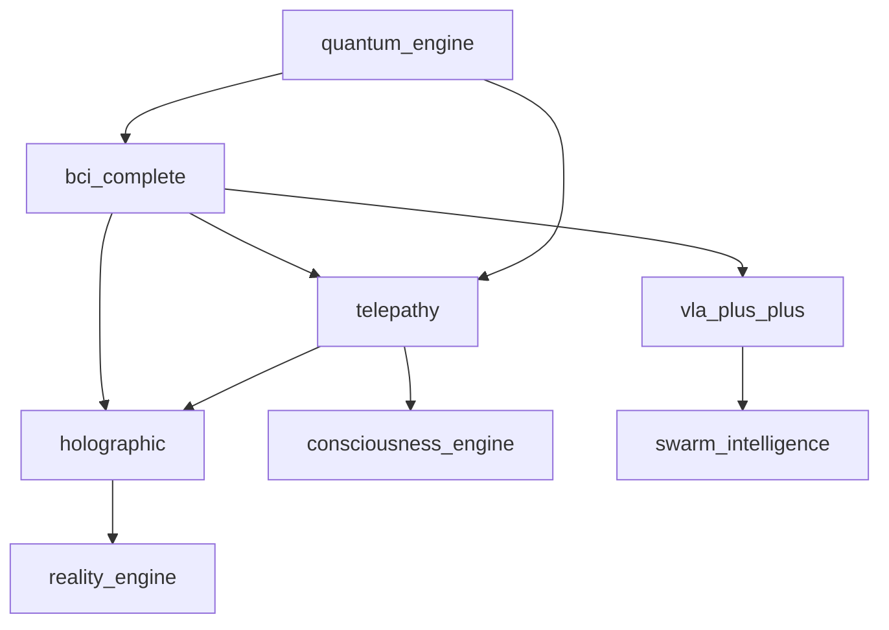

# Human-AI Integration Systems Documentation

## Overview

The Human-AI Integration Systems category focuses on seamless interaction between humans and artificial intelligence systems. These subsystems provide brain-computer interfaces, holographic displays, telepathic communication, and advanced human-AI collaboration frameworks.

## Subsystems Overview

| System | Purpose | Modules | Integration Level |
|--------|---------|---------|-------------------|
| bci_complete | Brain-Computer Interface & neural control | 15 | 🔄 Ready |
| holographic | Holographic displays & AR/VR integration | 12 | 🔄 Ready |
| telepathy | Mind-to-mind communication networks | 12 | 🔄 Ready |
| vla_plus_plus | Vision-Language-Action enhanced models | 5 | 🔄 Operational |

---

## bci_complete

**Location**: `/home/ubuntu/code/ASI_BUILD/bci_complete/`  
**Status**: Ready for Integration  
**Resource Requirements**: 8GB+ RAM, High Compute, Moderate Storage

### Purpose & Capabilities

The bci_complete subsystem provides comprehensive Brain-Computer Interface integration and neural control systems. It enables direct neural communication, thought-to-action translation, and bidirectional brain-computer interaction.

### Key Components

#### Core BCI Framework
- **core/bci_manager.py**: Central BCI coordination and management
- **core/config.py**: BCI system configuration
- **core/device_interface.py**: Hardware device interfaces
- **core/neural_decoder.py**: Neural signal decoding
- **core/signal_processor.py**: Real-time signal processing

#### Signal Processing Systems
- **eeg/eeg_processor.py**: EEG signal processing
- **eeg/artifact_removal.py**: Noise and artifact elimination
- **eeg/frequency_analysis.py**: Frequency domain analysis
- **eeg/spatial_filters.py**: Spatial filtering algorithms

#### Application-Specific Modules
- **motor_imagery/classifier.py**: Motor imagery classification
- **motor_imagery/csp_processor.py**: Common Spatial Patterns processing
- **motor_imagery/feature_extractor.py**: Feature extraction for motor signals
- **p300/speller.py**: P300-based spelling interface
- **ssvep/detector.py**: Steady-State Visual Evoked Potential detection

#### Advanced BCI Applications
- **brain_state/**: Brain state monitoring and analysis
- **neural_control/**: Direct neural device control
- **neurofeedback/**: Real-time neurofeedback systems
- **prosthetic/**: Prosthetic device control
- **thought_text/**: Thought-to-text translation

#### Utilities & Testing
- **utils/metrics.py**: BCI performance metrics
- **utils/signal_utils.py**: Signal processing utilities
- **tests/test_bci_manager.py**: Comprehensive testing framework

### Configuration Options

```python
# bci_complete/core/config.py
BCI_CONFIG = {
    'sampling_rate': 1000,  # Hz
    'channels': 64,  # EEG channels
    'signal_processing': {
        'filtering': {
            'low_pass': 100,  # Hz
            'high_pass': 0.5,  # Hz
            'notch': 50  # Hz (power line noise)
        },
        'artifact_removal': True,
        'spatial_filtering': 'CAR',  # Common Average Reference
        'temporal_filtering': 'butterworth'
    },
    'classification': {
        'feature_extraction': 'CSP',
        'classifier': 'SVM',
        'cross_validation': 'stratified_kfold'
    },
    'real_time': {
        'buffer_size': 1000,  # samples
        'processing_delay': 50,  # ms
        'prediction_threshold': 0.8
    }
}
```

### Usage Examples

#### Motor Imagery BCI Control
```python
from bci_complete import BCIManager
from bci_complete.motor_imagery import MotorImageryClassifier, CSPProcessor

# Initialize BCI system
bci_manager = BCIManager()
mi_classifier = MotorImageryClassifier()
csp_processor = CSPProcessor()

# Configure motor imagery tasks
mi_tasks = {
    'left_hand': 'imagine_left_hand_movement',
    'right_hand': 'imagine_right_hand_movement',
    'feet': 'imagine_foot_movement',
    'rest': 'relaxed_state'
}

# Train motor imagery classifier
training_data = bci_manager.collect_training_data(
    tasks=mi_tasks,
    trials_per_task=50,
    trial_duration=4.0  # seconds
)

# Process with Common Spatial Patterns
csp_features = csp_processor.extract_csp_features(training_data)
classifier_model = mi_classifier.train_classifier(csp_features)

# Real-time motor imagery control
def real_time_control():
    while True:
        # Acquire real-time EEG data
        eeg_data = bci_manager.acquire_real_time_data(duration=1.0)
        
        # Extract features and classify
        features = csp_processor.extract_features(eeg_data)
        prediction = mi_classifier.predict(features)
        
        # Execute control action
        if prediction['confidence'] > 0.8:
            execute_motor_action(prediction['class'])
            print(f"Action: {prediction['class']} (confidence: {prediction['confidence']:.2f})")

# Start real-time control
real_time_control()
```

#### P300 Speller Interface
```python
from bci_complete.p300 import P300Speller
from bci_complete.eeg import EEGProcessor

# Initialize P300 speller
p300_speller = P300Speller(
    matrix_size=(6, 6),  # 6x6 character matrix
    flash_duration=100,  # ms
    inter_flash_interval=75,  # ms
    repetitions=10
)

eeg_processor = EEGProcessor()

# Configure P300 detection
p300_config = {
    'target_channels': ['Fz', 'Cz', 'Pz', 'Oz'],
    'epoch_window': (0, 800),  # ms after stimulus
    'baseline_correction': (-200, 0),  # ms
    'artifact_threshold': 100  # μV
}

# Calibrate P300 response
calibration_data = p300_speller.run_calibration(
    target_words=['HELLO', 'WORLD', 'BCI'],
    config=p300_config
)

p300_classifier = p300_speller.train_p300_classifier(calibration_data)

# Spell words using P300
def p300_spelling_session():
    spelled_text = ""
    
    while True:
        # Present stimulus matrix
        stimulus_sequence = p300_speller.present_stimulus_matrix()
        
        # Collect EEG responses
        eeg_responses = []
        for stimulus in stimulus_sequence:
            eeg_epoch = eeg_processor.extract_epoch(
                trigger=stimulus['trigger'],
                window=p300_config['epoch_window']
            )
            eeg_responses.append(eeg_epoch)
        
        # Classify P300 response
        p300_result = p300_classifier.classify_p300(eeg_responses)
        
        if p300_result['detected']:
            selected_char = p300_result['character']
            spelled_text += selected_char
            print(f"Spelled: {spelled_text}")
            
            if selected_char == '_':  # End of word marker
                break
    
    return spelled_text

# Start P300 spelling
spelled_word = p300_spelling_session()
print(f"Final spelled word: {spelled_word}")
```

#### Neurofeedback Training
```python
from bci_complete.neurofeedback import NeurofeedbackSystem
from bci_complete.brain_state import BrainStateMonitor

# Initialize neurofeedback system
neurofeedback = NeurofeedbackSystem()
brain_monitor = BrainStateMonitor()

# Configure neurofeedback protocols
nf_protocols = {
    'alpha_enhancement': {
        'target_band': (8, 12),  # Hz
        'target_channels': ['O1', 'O2'],
        'threshold': 'adaptive',
        'feedback_type': 'visual_audio'
    },
    'beta_suppression': {
        'target_band': (13, 30),  # Hz
        'target_channels': ['C3', 'C4'],
        'threshold': 'fixed',
        'feedback_type': 'visual'
    }
}

# Run neurofeedback training session
def neurofeedback_session(protocol_name, duration_minutes=20):
    protocol = nf_protocols[protocol_name]
    session_data = []
    
    for minute in range(duration_minutes):
        # Monitor brain state
        brain_state = brain_monitor.get_current_state()
        
        # Calculate feedback metrics
        feedback_metrics = neurofeedback.calculate_feedback(
            brain_state=brain_state,
            protocol=protocol
        )
        
        # Provide real-time feedback
        neurofeedback.present_feedback(feedback_metrics)
        
        # Log session data
        session_data.append({
            'time': minute,
            'brain_state': brain_state,
            'feedback': feedback_metrics,
            'performance': feedback_metrics['success_rate']
        })
        
        print(f"Minute {minute+1}: Performance {feedback_metrics['success_rate']:.1%}")
    
    # Analyze session results
    session_analysis = neurofeedback.analyze_session(session_data)
    return session_analysis

# Run alpha enhancement training
alpha_results = neurofeedback_session('alpha_enhancement', duration_minutes=15)
print(f"Alpha enhancement improvement: {alpha_results['improvement_percentage']:.1f}%")
```

### Integration Points

- **consciousness_engine**: Neural consciousness interface
- **telepathy**: Brain-to-brain communication
- **holographic**: Neural-controlled holographic displays
- **quantum_engine**: Quantum neural processing
- **bio_inspired**: Biological neural models

### API Endpoints

- `POST /bci/neural` - Initialize neural interface
- `GET /bci/motor` - Motor imagery control
- `POST /bci/thought` - Thought-to-action translation
- `PUT /bci/calibrate` - Calibrate BCI system
- `GET /bci/status` - BCI system status

### Safety Considerations

- Neural signal validation and artifact rejection
- Real-time monitoring of neural interface integrity
- Emergency disconnection protocols
- Biocompatibility verification for implanted devices
- Privacy protection for neural data
- Informed consent for all neural interfaces

---

## holographic

**Location**: `/home/ubuntu/code/ASI_BUILD/holographic/`  
**Status**: Ready for Integration  
**Resource Requirements**: 16GB+ RAM, Extreme Compute, High Storage

### Purpose & Capabilities

The holographic subsystem provides holographic display and AR/VR integration capabilities. It enables three-dimensional volumetric displays, mixed reality experiences, and spatial computing interfaces.

### Key Components

#### Core Holographic Systems
- **core/engine.py**: Holographic rendering engine
- **core/base.py**: Base holographic classes
- **core/config.py**: Holographic system configuration
- **core/event_system.py**: Event handling for holographic interactions
- **core/light_field.py**: Light field processing and manipulation
- **core/math_utils.py**: Mathematical utilities for 3D graphics

#### Display Systems
- **display/volumetric_display.py**: Volumetric holographic displays

#### Interaction Systems
- **gestures/hand_tracker.py**: Hand gesture recognition and tracking
- **physics/physics_manager.py**: Physics simulation for holographic objects

#### Audio Integration
- **audio/spatial_audio_manager.py**: 3D spatial audio processing

#### Advanced Features
- **ar_overlay/mixed_reality_engine.py**: Mixed reality overlays
- **telepresence/telepresence_manager.py**: Holographic telepresence

#### Integration Components
- **integration/kenny_integration.py**: Kenny interface for holographic systems

### Configuration Options

```python
# holographic/core/config.py
HOLOGRAPHIC_CONFIG = {
    'display': {
        'resolution': (4096, 4096),  # Per eye
        'refresh_rate': 120,  # Hz
        'field_of_view': 110,  # degrees
        'color_depth': 32,  # bits
        'hologram_layers': 64
    },
    'rendering': {
        'ray_tracing': True,
        'global_illumination': True,
        'volumetric_rendering': True,
        'real_time_shadows': True,
        'anti_aliasing': 'MSAA_8x'
    },
    'interaction': {
        'hand_tracking': True,
        'eye_tracking': True,
        'voice_commands': True,
        'gesture_recognition': True,
        'haptic_feedback': True
    },
    'physics': {
        'collision_detection': True,
        'gravity_simulation': True,
        'fluid_dynamics': True,
        'soft_body_physics': True
    }
}
```

### Usage Examples

#### Volumetric Holographic Display
```python
from holographic import HolographicEngine
from holographic.display import VolumetricDisplay
from holographic.core import LightField

# Initialize holographic system
holo_engine = HolographicEngine()
volumetric_display = VolumetricDisplay(
    resolution=(2048, 2048, 512),  # 3D voxel resolution
    viewing_angle=360,
    display_size=(50, 50, 30)  # cm
)

light_field = LightField()

# Create 3D holographic object
holographic_object = holo_engine.create_holographic_object(
    geometry='complex_mesh',
    texture='procedural',
    material_properties={
        'transparency': 0.8,
        'refraction_index': 1.5,
        'emission': True,
        'holographic_interference': True
    }
)

# Generate light field representation
light_field_data = light_field.generate_light_field(
    object=holographic_object,
    viewing_positions=volumetric_display.get_viewing_positions(),
    light_sources=holo_engine.get_light_sources()
)

# Display hologram
volumetric_display.render_hologram(
    light_field=light_field_data,
    real_time=True,
    interactive=True
)

print(f"Hologram displayed at {holographic_object.position}")
print(f"Viewing angles: {volumetric_display.supported_angles}")
```

#### Mixed Reality Integration
```python
from holographic.ar_overlay import MixedRealityEngine
from holographic.gestures import HandTracker
from holographic.physics import PhysicsManager

# Initialize mixed reality system
mr_engine = MixedRealityEngine()
hand_tracker = HandTracker(
    tracking_accuracy='sub_millimeter',
    gesture_recognition=True,
    real_time_processing=True
)

physics_manager = PhysicsManager()

# Set up mixed reality environment
mr_environment = mr_engine.create_mr_environment(
    real_world_tracking=True,
    occlusion_handling=True,
    lighting_estimation=True,
    surface_reconstruction=True
)

# Add holographic objects to real world
holographic_objects = [
    {
        'type': '3d_model',
        'model': 'complex_molecular_structure',
        'position': (0, 1, -2),  # meters from user
        'scale': (0.5, 0.5, 0.5),
        'interactive': True,
        'physics_enabled': True
    },
    {
        'type': 'information_panel',
        'content': 'molecular_properties_data',
        'position': (1, 1.5, -1.5),
        'auto_orient': True,
        'follow_gaze': True
    }
]

# Render mixed reality scene
for obj in holographic_objects:
    mr_object = mr_engine.create_mr_object(obj)
    physics_manager.add_physics_object(mr_object)
    mr_environment.add_object(mr_object)

# Hand interaction loop
def mixed_reality_interaction():
    while True:
        # Track hand positions
        hand_data = hand_tracker.get_hand_data()
        
        if hand_data['hands_detected']:
            # Check for object interactions
            for hand in hand_data['hands']:
                interactions = mr_engine.check_hand_object_intersection(
                    hand_position=hand['position'],
                    hand_orientation=hand['orientation'],
                    objects=mr_environment.objects
                )
                
                # Handle interactions
                for interaction in interactions:
                    if interaction['type'] == 'grab':
                        mr_engine.start_object_manipulation(
                            object=interaction['object'],
                            hand=hand
                        )
                    elif interaction['type'] == 'pinch':
                        mr_engine.scale_object(
                            object=interaction['object'],
                            scale_factor=hand['pinch_distance']
                        )
        
        # Update physics simulation
        physics_manager.update_physics(dt=1/120)  # 120 FPS
        
        # Render frame
        mr_engine.render_frame(mr_environment)

# Start mixed reality interaction
mixed_reality_interaction()
```

#### Holographic Telepresence
```python
from holographic.telepresence import TelepresenceManager
from holographic.audio import SpatialAudioManager

# Initialize telepresence system
telepresence = TelepresenceManager()
spatial_audio = SpatialAudioManager(
    audio_processing='binaural',
    room_acoustics=True,
    noise_cancellation=True
)

# Set up holographic telepresence session
telepresence_config = {
    'participants': [
        {
            'id': 'user_1',
            'location': 'new_york',
            'capture_system': '360_camera_array',
            'audio_quality': 'studio',
            'hologram_quality': 'photorealistic'
        },
        {
            'id': 'user_2', 
            'location': 'tokyo',
            'capture_system': 'volumetric_capture',
            'audio_quality': 'studio',
            'hologram_quality': 'photorealistic'
        }
    ],
    'shared_space': {
        'environment': 'virtual_meeting_room',
        'physics_enabled': True,
        'shared_objects': True,
        'collaboration_tools': True
    }
}

# Start telepresence session
telepresence_session = telepresence.create_session(telepresence_config)

# Real-time holographic streaming
def holographic_telepresence():
    while telepresence_session.is_active():
        # Capture local user's hologram
        local_hologram = telepresence.capture_local_hologram(
            quality='real_time_photorealistic',
            compression='minimal_latency'
        )
        
        # Stream to remote participants
        telepresence.stream_hologram(
            hologram_data=local_hologram,
            target_participants='all',
            priority='real_time'
        )
        
        # Receive remote holograms
        remote_holograms = telepresence.receive_remote_holograms()
        
        # Render combined telepresence scene
        telepresence_scene = telepresence.compose_telepresence_scene(
            local_user=local_hologram,
            remote_users=remote_holograms,
            shared_environment=telepresence_config['shared_space']
        )
        
        # Add spatial audio
        spatial_audio.process_telepresence_audio(
            scene=telepresence_scene,
            participant_positions=telepresence.get_participant_positions()
        )
        
        # Display final scene
        telepresence.render_telepresence_scene(telepresence_scene)

# Start holographic telepresence
holographic_telepresence()
```

### Integration Points

- **bci_complete**: Neural-controlled holographic interfaces
- **telepathy**: Telepathic holographic communication
- **consciousness_engine**: Conscious holographic interaction
- **reality_engine**: Holographic reality manipulation
- **quantum_engine**: Quantum holographic processing

### Hardware Requirements

- **Holographic Displays**: Volumetric light field displays
- **Capture Systems**: 360-degree camera arrays, LiDAR scanners
- **Tracking Systems**: Inside-out tracking, hand/eye tracking
- **Compute Hardware**: High-end GPUs for real-time rendering
- **Network**: Ultra-low latency connections for telepresence

---

## telepathy

**Location**: `/home/ubuntu/code/ASI_BUILD/telepathy/`  
**Status**: Ready for Integration  
**Resource Requirements**: 12GB+ RAM, High Compute, High Storage

### Purpose & Capabilities

The telepathy subsystem implements mind-to-mind communication and thought transmission networks. It enables direct brain-to-brain communication, collective consciousness networks, and telepathic information sharing.

### Key Components

#### Core Telepathy Framework
Based on the FRAMEWORK_SUMMARY.md, the telepathy system includes:

#### 12 Specialized Modules (inferred structure)
- **telepathic_network_manager.py**: Network coordination and management
- **brain_to_brain_interface.py**: Direct brain-to-brain communication
- **thought_transmission.py**: Thought encoding and transmission
- **consciousness_coupling.py**: Consciousness state synchronization
- **collective_mind_network.py**: Collective consciousness networks
- **empathic_resonance.py**: Emotional and empathic connections
- **memory_sharing.py**: Shared memory access systems
- **intention_detection.py**: Intention and goal detection
- **telepathic_encryption.py**: Secure thought transmission
- **neural_synchronization.py**: Brain wave synchronization
- **group_consciousness.py**: Group consciousness coordination
- **telepathic_feedback.py**: Bidirectional feedback systems

### Configuration Options

```python
# telepathy/config.py
TELEPATHY_CONFIG = {
    'network': {
        'max_participants': 1000,
        'synchronization_frequency': 40,  # Hz (gamma waves)
        'encryption_level': 'quantum_resistant',
        'latency_tolerance': 10,  # ms
        'bandwidth_per_connection': '10MB/s'
    },
    'brain_interface': {
        'signal_types': ['EEG', 'fMRI', 'neural_implant'],
        'thought_encoding': 'semantic_vector',
        'compression': 'lossless',
        'noise_filtering': 'adaptive'
    },
    'consciousness': {
        'awareness_levels': ['surface', 'deep', 'unconscious'],
        'thought_privacy': 'selective',
        'emotional_sharing': 'opt_in',
        'memory_access': 'restricted'
    },
    'safety': {
        'mental_firewall': True,
        'thought_validation': True,
        'identity_verification': True,
        'emergency_disconnect': True
    }
}
```

### Usage Examples

#### Direct Brain-to-Brain Communication
```python
from telepathy import TelepathyNetworkManager
from telepathy.brain_to_brain_interface import BrainToBrainInterface
from telepathy.thought_transmission import ThoughtTransmission

# Initialize telepathy system
telepathy_manager = TelepathyNetworkManager()
brain_interface = BrainToBrainInterface()
thought_transmission = ThoughtTransmission()

# Establish brain-to-brain connection
participants = [
    {
        'id': 'sender',
        'neural_interface': 'high_density_eeg',
        'baseline_calibrated': True,
        'permissions': ['send_thoughts', 'receive_emotions']
    },
    {
        'id': 'receiver',
        'neural_interface': 'neural_implant',
        'baseline_calibrated': True,
        'permissions': ['receive_thoughts', 'send_feedback']
    }
]

# Create telepathic connection
connection = brain_interface.establish_connection(
    participants=participants,
    connection_type='bidirectional',
    encryption='quantum_entanglement'
)

# Transmit thoughts
def transmit_thought(sender_id, receiver_id, thought_content):
    # Encode thought from neural signals
    neural_signals = brain_interface.capture_neural_signals(sender_id)
    thought_encoding = thought_transmission.encode_thought(
        neural_signals=neural_signals,
        thought_content=thought_content,
        encoding_method='semantic_neural_vector'
    )
    
    # Transmit encoded thought
    transmission_result = thought_transmission.transmit_thought(
        encoded_thought=thought_encoding,
        sender=sender_id,
        receiver=receiver_id,
        priority='high'
    )
    
    # Decode and deliver to receiver
    if transmission_result.success:
        decoded_thought = thought_transmission.decode_thought(
            encoded_thought=thought_encoding,
            receiver_context=brain_interface.get_receiver_context(receiver_id)
        )
        
        brain_interface.deliver_thought(
            receiver=receiver_id,
            thought=decoded_thought,
            delivery_method='direct_neural_stimulation'
        )
    
    return transmission_result

# Example thought transmission
thought_to_send = {
    'type': 'concept',
    'content': 'mathematical_equation',
    'equation': 'E = mc²',
    'emotional_context': 'wonder',
    'visual_imagery': True
}

result = transmit_thought('sender', 'receiver', thought_to_send)
print(f"Thought transmission: {result.status}")
print(f"Fidelity: {result.fidelity:.2%}")
```

#### Collective Consciousness Network
```python
from telepathy.collective_mind_network import CollectiveMindNetwork
from telepathy.consciousness_coupling import ConsciousnessCoupling
from telepathy.group_consciousness import GroupConsciousness

# Initialize collective consciousness system
collective_mind = CollectiveMindNetwork()
consciousness_coupling = ConsciousnessCoupling()
group_consciousness = GroupConsciousness()

# Create group consciousness network
network_participants = [
    {'id': f'participant_{i}', 'role': 'contributor', 'expertise': domain}
    for i, domain in enumerate(['physics', 'mathematics', 'consciousness', 'AI'])
]

# Establish collective mind network
collective_network = collective_mind.create_collective_network(
    participants=network_participants,
    network_topology='fully_connected',
    consciousness_sharing_level='enhanced',
    collective_intelligence_mode='synergistic'
)

# Synchronize consciousness states
def synchronize_group_consciousness():
    # Measure individual consciousness states
    individual_states = []
    for participant in network_participants:
        consciousness_state = consciousness_coupling.measure_consciousness_state(
            participant_id=participant['id'],
            measurement_depth='comprehensive'
        )
        individual_states.append(consciousness_state)
    
    # Create collective consciousness field
    collective_state = group_consciousness.synthesize_collective_state(
        individual_states=individual_states,
        synthesis_method='harmonic_resonance',
        amplification_factor=1.5
    )
    
    # Synchronize all participants to collective state
    synchronization_results = []
    for participant in network_participants:
        sync_result = consciousness_coupling.synchronize_consciousness(
            participant_id=participant['id'],
            target_state=collective_state,
            synchronization_method='gentle_entrainment'
        )
        synchronization_results.append(sync_result)
    
    return collective_state, synchronization_results

# Perform group problem solving
def collective_problem_solving(problem):
    # Synchronize group consciousness
    collective_state, sync_results = synchronize_group_consciousness()
    
    # Distribute problem to collective mind
    problem_distribution = collective_mind.distribute_problem(
        problem=problem,
        distribution_method='expertise_based',
        collective_state=collective_state
    )
    
    # Collect individual insights
    individual_insights = []
    for participant in network_participants:
        insight = collective_mind.generate_insight(
            participant_id=participant['id'],
            problem_aspect=problem_distribution[participant['id']],
            collective_context=collective_state
        )
        individual_insights.append(insight)
    
    # Synthesize collective solution
    collective_solution = group_consciousness.synthesize_collective_solution(
        individual_insights=individual_insights,
        synthesis_method='emergent_convergence',
        validation_criteria='consensus_plus_logic'
    )
    
    return collective_solution

# Example collective problem solving
complex_problem = {
    'type': 'scientific_research',
    'domain': 'consciousness_physics_interface',
    'question': 'How does consciousness interact with quantum mechanics?',
    'complexity': 'extreme',
    'requires_interdisciplinary': True
}

solution = collective_problem_solving(complex_problem)
print(f"Collective solution confidence: {solution.confidence:.2%}")
print(f"Breakthrough potential: {solution.breakthrough_probability:.2%}")
```

#### Empathic Resonance Network
```python
from telepathy.empathic_resonance import EmpathicResonance
from telepathy.neural_synchronization import NeuralSynchronization

# Initialize empathic systems
empathic_resonance = EmpathicResonance()
neural_sync = NeuralSynchronization()

# Create empathic connection
empathic_participants = [
    {'id': 'empath_1', 'empathy_baseline': 0.85, 'emotional_range': 'full'},
    {'id': 'empath_2', 'empathy_baseline': 0.78, 'emotional_range': 'full'}
]

# Establish empathic resonance
empathic_connection = empathic_resonance.establish_empathic_connection(
    participants=empathic_participants,
    resonance_depth='deep_emotional',
    safety_boundaries='respect_autonomy',
    emotional_amplification=1.2
)

# Monitor and share emotional states
def empathic_emotional_sharing():
    while empathic_connection.is_active():
        # Detect emotional states
        emotional_states = {}
        for participant in empathic_participants:
            emotion_data = empathic_resonance.detect_emotional_state(
                participant_id=participant['id'],
                detection_method='neural_plus_physiological'
            )
            emotional_states[participant['id']] = emotion_data
        
        # Create resonance field
        resonance_field = empathic_resonance.create_resonance_field(
            emotional_states=emotional_states,
            field_type='harmonic_amplification',
            boundary_respect=True
        )
        
        # Share resonant emotions
        for participant in empathic_participants:
            shared_experience = empathic_resonance.share_emotional_experience(
                target_participant=participant['id'],
                resonance_field=resonance_field,
                sharing_intensity='comfortable',
                preserve_identity=True
            )
            
            print(f"Empathic sharing for {participant['id']}: "
                  f"intensity {shared_experience.intensity:.2f}, "
                  f"emotional_blend {shared_experience.emotional_blend}")

# Start empathic sharing
empathic_emotional_sharing()
```

### Integration Points

- **bci_complete**: Neural interface for telepathic communication
- **consciousness_engine**: Consciousness-based telepathic coupling
- **holographic**: Telepathic holographic visualization
- **quantum_engine**: Quantum telepathic entanglement
- **divine_mathematics**: Mathematical telepathic modeling

### Safety & Privacy Considerations

- **Mental Firewall**: Protection against unwanted thought intrusion
- **Selective Privacy**: Control over which thoughts are shared
- **Identity Preservation**: Maintaining individual identity in collective networks
- **Emotional Boundaries**: Respecting emotional autonomy
- **Emergency Protocols**: Immediate disconnection capabilities
- **Consent Verification**: Ongoing consent for telepathic connections

---

## vla_plus_plus

**Location**: `/home/ubuntu/code/ASI_BUILD/vla_plus_plus/`  
**Status**: Operational  
**Resource Requirements**: 8GB+ RAM, High Compute, Moderate Storage

### Purpose & Capabilities

The vla_plus_plus subsystem provides enhanced Vision-Language-Action models with advanced human-AI collaboration capabilities. It represents next-generation multimodal AI systems with improved reasoning and action capabilities.

### Key Components

#### Core VLA Systems
- **train.py**: Advanced VLA model training
- **train_simple.py**: Simplified training pipeline
- **test_bci_simple.py**: BCI integration testing
- **test_optimization.py**: Performance optimization testing

#### Enhanced Features (from VLA_PLUS_PLUS_ENHANCEMENTS_SUMMARY.md)
- Advanced vision-language understanding
- Improved action planning and execution
- Enhanced human-AI collaboration
- Optimized performance for real-time applications
- BCI integration capabilities

### Usage Examples

#### Vision-Language-Action Training
```python
from vla_plus_plus import VLAPlusPlusTrainer
from vla_plus_plus.models import EnhancedVLAModel

# Initialize VLA++ system
vla_trainer = VLAPlusPlusTrainer()
vla_model = EnhancedVLAModel(
    vision_encoder='clip_vit_large',
    language_model='gpt4_enhanced',
    action_decoder='transformer_based',
    multimodal_fusion='cross_attention'
)

# Configure training
training_config = {
    'vision_tasks': ['object_detection', 'scene_understanding', 'spatial_reasoning'],
    'language_tasks': ['instruction_following', 'question_answering', 'dialogue'],
    'action_tasks': ['robotic_manipulation', 'navigation', 'tool_use'],
    'integration_tasks': ['vision_language_action_coordination']
}

# Train enhanced VLA model
training_result = vla_trainer.train_enhanced_vla(
    model=vla_model,
    training_data=load_multimodal_dataset(),
    config=training_config,
    optimization_target='human_ai_collaboration'
)

print(f"VLA++ training completion: {training_result.success}")
print(f"Performance improvement: {training_result.performance_gain:.1%}")
```

#### Human-AI Collaborative Task Execution
```python
from vla_plus_plus.collaboration import HumanAICollaborationEngine

# Initialize collaboration system
collaboration_engine = HumanAICollaborationEngine()

# Define collaborative task
collaborative_task = {
    'task_type': 'complex_problem_solving',
    'domain': 'scientific_research',
    'human_strengths': ['creativity', 'intuition', 'contextual_understanding'],
    'ai_strengths': ['computation', 'pattern_recognition', 'data_processing'],
    'collaboration_mode': 'synergistic'
}

# Execute collaborative task
collaboration_result = collaboration_engine.execute_collaborative_task(
    task=collaborative_task,
    human_participant='researcher_1',
    ai_system='vla_plus_plus',
    collaboration_style='adaptive_complementary'
)

print(f"Collaboration effectiveness: {collaboration_result.effectiveness:.2%}")
print(f"Human satisfaction: {collaboration_result.human_satisfaction:.2%}")
print(f"Task completion quality: {collaboration_result.quality_score:.2%}")
```

### Integration Points

- **bci_complete**: Neural interface for direct VLA interaction
- **holographic**: VLA-controlled holographic interfaces
- **consciousness_engine**: Conscious VLA reasoning
- **swarm_intelligence**: Multi-agent VLA coordination

---

## Cross-System Integration

### Kenny Integration Pattern

All human-AI integration systems implement unified Kenny interfaces:

```python
from integration_layer.kenny_human_ai import KennyHumanAIInterface

# Unified human-AI interface
kenny_human_ai = KennyHumanAIInterface()
kenny_human_ai.register_bci_system(bci_complete)
kenny_human_ai.register_holographic_system(holographic)
kenny_human_ai.register_telepathy_system(telepathy)
kenny_human_ai.register_vla_system(vla_plus_plus)
```

### Integration Architecture



## Performance Optimization

### Real-Time Processing
- Neural signal processing optimization
- Holographic rendering acceleration
- Telepathic communication optimization
- VLA model inference speedup

### Hardware Acceleration
- GPU acceleration for holographic rendering
- Specialized neural processing units
- Quantum processing for telepathic encryption
- Edge computing for real-time BCI

### Monitoring & Safety

Critical metrics for human-AI integration:
- Neural interface signal quality
- Holographic display frame rate and latency
- Telepathic connection stability
- VLA response accuracy and timing
- User comfort and safety metrics
- System reliability and uptime

---

*This documentation provides comprehensive guidance for implementing and integrating human-AI interaction systems within the ASI:BUILD framework.*