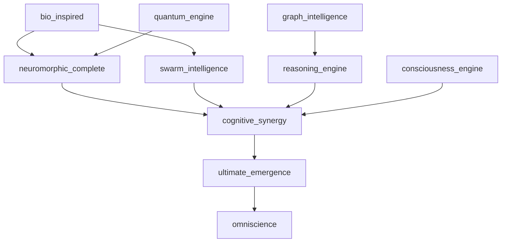

# Intelligence & Computation Systems Documentation

## Overview

The Intelligence & Computation Systems category encompasses the core AI algorithms, learning systems, and computational frameworks that drive the intelligent behavior of the ASI:BUILD framework. These systems implement advanced machine learning, swarm intelligence, bio-inspired computation, and emergent intelligence capabilities.

## Subsystems Overview

| System | Purpose | Modules | Integration Level |
|--------|---------|---------|-------------------|
| swarm_intelligence | Multi-agent coordination & collective intelligence | 19 | ✅ Integrated |
| bio_inspired | Biological intelligence patterns | 6 | ✅ Integrated |
| neuromorphic_complete | Brain-inspired computing & spiking networks | 15 | 🔄 Ready |
| cognitive_synergy | Emergent cognitive capabilities | 8 | 🔄 Operational |
| graph_intelligence | Knowledge graph reasoning | 15 | 🔄 Ready |
| reasoning_engine | Hybrid reasoning systems | 2 | ✅ Integrated |
| ultimate_emergence | Self-generating intelligence capabilities | 40 | 🔄 Ready |
| omniscience | All-knowing information systems | 10 | 🔄 Ready |

---

## swarm_intelligence

**Location**: `/home/ubuntu/code/ASI_BUILD/swarm_intelligence/`  
**Status**: Integrated  
**Resource Requirements**: 8GB+ RAM, High Compute, Moderate Storage

### Purpose & Capabilities

The swarm_intelligence subsystem provides multi-agent coordination and collective intelligence algorithms. It implements various swarm optimization algorithms, distributed problem-solving, and emergent collective behavior patterns.

### Key Components

#### Core Swarm Framework
- **base.py**: Base swarm intelligence classes and interfaces
- **swarm_coordinator.py**: Central coordination and orchestration
- **communication.py**: Inter-agent communication protocols
- **memory.py**: Collective memory and knowledge sharing
- **metrics.py**: Swarm performance metrics

#### Swarm Algorithms
- **particle_swarm.py**: Particle Swarm Optimization (PSO)
- **ant_colony.py**: Ant Colony Optimization (ACO)
- **bee_colony.py**: Artificial Bee Colony (ABC)
- **firefly.py**: Firefly Algorithm
- **bat_algorithm.py**: Bat Algorithm
- **grey_wolf.py**: Grey Wolf Optimizer
- **whale_optimization.py**: Whale Optimization Algorithm
- **cuckoo_search.py**: Cuckoo Search Algorithm
- **bacterial_foraging.py**: Bacterial Foraging Optimization

#### Advanced Features
- **adaptive.py**: Adaptive swarm parameters
- **hybrid.py**: Hybrid swarm algorithms
- **distributed.py**: Distributed swarm processing
- **multi_agent.py**: Multi-agent system coordination
- **visualization.py**: Swarm behavior visualization

#### Integration Components
- **kenny_integration.py**: Kenny interface for swarm systems

### Configuration Options

```python
# swarm_intelligence/config.py
SWARM_CONFIG = {
    'swarm_size': 50,
    'max_iterations': 1000,
    'convergence_threshold': 1e-6,
    'communication_range': 10.0,
    'memory_capacity': 100,
    'adaptive_parameters': True,
    'distributed_processing': True,
    'visualization': True,
    'real_time_monitoring': True
}
```

### Usage Examples

#### Particle Swarm Optimization
```python
from swarm_intelligence import SwarmCoordinator
from swarm_intelligence.particle_swarm import ParticleSwarmOptimizer

# Initialize swarm system
coordinator = SwarmCoordinator()
pso = ParticleSwarmOptimizer(
    swarm_size=30,
    dimensions=10,
    bounds=(-10, 10)
)

# Define optimization problem
def objective_function(x):
    return sum(xi**2 for xi in x)  # Sphere function

# Run optimization
optimization_result = pso.optimize(
    objective_function=objective_function,
    max_iterations=500,
    target_fitness=1e-8
)

print(f"Best solution: {optimization_result.best_position}")
print(f"Best fitness: {optimization_result.best_fitness}")
print(f"Convergence iteration: {optimization_result.convergence_iteration}")
```

#### Multi-Agent Coordination
```python
from swarm_intelligence.multi_agent import MultiAgentSystem
from swarm_intelligence.communication import CommunicationProtocol

# Initialize multi-agent system
mas = MultiAgentSystem(num_agents=20)
comm_protocol = CommunicationProtocol(
    protocol_type='consensus',
    communication_range=5.0
)

# Define collective task
task = {
    'type': 'distributed_search',
    'search_space': (100, 100),
    'target_locations': [(25, 25), (75, 75)],
    'cooperation_required': True
}

# Execute collective intelligence
result = mas.execute_collective_task(
    task=task,
    communication_protocol=comm_protocol,
    coordination_strategy='emergent'
)

print(f"Task completion time: {result.completion_time}")
print(f"Efficiency score: {result.efficiency}")
print(f"Emergent behaviors: {result.emergent_patterns}")
```

#### Hybrid Swarm Algorithm
```python
from swarm_intelligence.hybrid import HybridSwarmOptimizer
from swarm_intelligence.adaptive import AdaptiveParameterController

# Initialize hybrid swarm
hybrid_swarm = HybridSwarmOptimizer(
    primary_algorithm='particle_swarm',
    secondary_algorithm='ant_colony',
    switching_criteria='diversity_loss'
)

adaptive_controller = AdaptiveParameterController()

# Configure adaptive parameters
adaptive_params = {
    'inertia_weight': {'min': 0.1, 'max': 0.9, 'adaptive': True},
    'cognitive_factor': {'min': 1.5, 'max': 2.5, 'adaptive': True},
    'social_factor': {'min': 1.5, 'max': 2.5, 'adaptive': True}
}

# Run adaptive hybrid optimization
optimization_result = hybrid_swarm.adaptive_optimize(
    objective_function=complex_multi_modal_function,
    adaptive_parameters=adaptive_params,
    performance_monitor=adaptive_controller
)

print(f"Hybrid algorithm performance: {optimization_result.performance_score}")
print(f"Algorithm switches: {optimization_result.algorithm_switches}")
```

### Integration Points

- **multi_agent_orchestration**: Multi-agent system coordination
- **cognitive_synergy**: Emergent collective intelligence
- **consciousness_engine**: Swarm consciousness patterns
- **distributed_training**: Distributed learning coordination
- **bio_inspired**: Biological swarm behaviors

### API Endpoints

- `POST /swarm/coordinate` - Initialize swarm coordination
- `PUT /swarm/optimize` - Run swarm optimization
- `GET /swarm/intelligence` - Query collective intelligence state
- `POST /swarm/agents/deploy` - Deploy agent swarm
- `GET /swarm/metrics` - Retrieve swarm performance metrics

---

## bio_inspired

**Location**: `/home/ubuntu/code/ASI_BUILD/bio_inspired/`  
**Status**: Integrated  
**Resource Requirements**: 6GB+ RAM, Moderate Compute, Moderate Storage

### Purpose & Capabilities

The bio_inspired subsystem implements biological intelligence patterns and neuromorphic processing capabilities. It draws inspiration from biological systems to create adaptive, efficient, and robust AI algorithms.

### Key Components

#### Core Bio-Inspired Framework
- **core.py**: Core bio-inspired computing architecture

#### Energy & Efficiency Systems
- **energy_efficiency/energy_metrics.py**: Biological energy efficiency models

#### Evolution & Adaptation
- **evolutionary/evolutionary_optimizer.py**: Evolutionary optimization algorithms

#### Homeostatic Regulation
- **homeostatic/homeostatic_regulator.py**: Biological homeostasis models

#### Neuromorphic Processing
- **neuromorphic/neuromorphic_processor.py**: Brain-inspired computing
- **neuromorphic/spiking_networks.py**: Spiking neural networks

#### Extended Bio-Inspired Features (from bio_inspired_complete/)
- **developmental/**: Developmental algorithms
- **embodied/**: Embodied intelligence
- **emotional/**: Emotional computing models
- **hierarchical_memory/**: Hierarchical memory systems
- **learning_rules/**: Biological learning rules
- **neuromodulation/**: Neuromodulation systems
- **neuroplasticity/**: Neuroplasticity mechanisms
- **sleep_wake/**: Sleep-wake cycle simulation

### Usage Examples

#### Neuromorphic Processing
```python
from bio_inspired import BioInspiredCore
from bio_inspired.neuromorphic import NeuromorphicProcessor, SpikingNetwork

# Initialize bio-inspired system
bio_core = BioInspiredCore()
neuromorphic = NeuromorphicProcessor()

# Create spiking neural network
snn = SpikingNetwork(
    input_neurons=784,  # MNIST input size
    hidden_neurons=500,
    output_neurons=10,
    neuron_model='leaky_integrate_fire',
    synapse_model='exponential_decay'
)

# Configure biological parameters
bio_params = {
    'membrane_potential_threshold': -55.0,  # mV
    'resting_potential': -70.0,  # mV
    'refractory_period': 2.0,  # ms
    'synaptic_delay': 1.0,  # ms
    'stdp_learning_rate': 0.01
}

snn.configure_biological_parameters(bio_params)

# Train with spike-timing dependent plasticity
training_data = load_spike_encoded_mnist()
training_result = snn.train_with_stdp(
    data=training_data,
    epochs=100,
    plasticity_rule='spike_timing_dependent'
)

print(f"Training accuracy: {training_result.accuracy}")
print(f"Energy efficiency: {training_result.energy_per_inference}")
```

#### Evolutionary Optimization
```python
from bio_inspired.evolutionary import EvolutionaryOptimizer
from bio_inspired.energy_efficiency import EnergyMetrics

# Initialize evolutionary system
evo_optimizer = EvolutionaryOptimizer(
    population_size=100,
    mutation_rate=0.1,
    crossover_rate=0.8,
    selection_method='tournament'
)

energy_metrics = EnergyMetrics()

# Define fitness function with energy consideration
def fitness_function(individual):
    performance = evaluate_performance(individual)
    energy_cost = energy_metrics.calculate_energy_cost(individual)
    return performance - 0.1 * energy_cost  # Multi-objective

# Evolve neural network architecture
evolution_result = evo_optimizer.evolve_neural_architecture(
    fitness_function=fitness_function,
    generations=50,
    architecture_constraints={
        'max_layers': 10,
        'max_neurons_per_layer': 1000,
        'connection_sparsity': 0.1
    }
)

print(f"Best architecture: {evolution_result.best_individual}")
print(f"Fitness score: {evolution_result.best_fitness}")
print(f"Energy efficiency: {evolution_result.energy_efficiency}")
```

#### Homeostatic Regulation
```python
from bio_inspired.homeostatic import HomeostaticRegulator

# Initialize homeostatic system
homeostatic = HomeostaticRegulator(
    target_variables=['learning_rate', 'network_activity', 'resource_usage'],
    regulation_mechanisms=['negative_feedback', 'adaptation', 'plasticity']
)

# Configure homeostatic parameters
homeostatic_config = {
    'learning_rate': {'target': 0.01, 'tolerance': 0.001, 'adjustment_rate': 0.1},
    'network_activity': {'target': 0.5, 'tolerance': 0.05, 'adjustment_rate': 0.05},
    'resource_usage': {'target': 0.8, 'tolerance': 0.1, 'adjustment_rate': 0.02}
}

homeostatic.configure_regulation(homeostatic_config)

# Monitor and regulate system during operation
system_state = {
    'learning_rate': 0.015,
    'network_activity': 0.7,
    'resource_usage': 0.9
}

regulation_actions = homeostatic.regulate_system(system_state)
print(f"Regulation actions: {regulation_actions}")
```

### Integration Points

- **consciousness_engine**: Bio-inspired consciousness models
- **neuromorphic_complete**: Advanced neuromorphic systems
- **swarm_intelligence**: Biological swarm behaviors
- **quantum_engine**: Quantum biological systems

---

## neuromorphic_complete

**Location**: `/home/ubuntu/code/ASI_BUILD/neuromorphic_complete/`  
**Status**: Ready for Integration  
**Resource Requirements**: 10GB+ RAM, High Compute, Moderate Storage

### Purpose & Capabilities

The neuromorphic_complete subsystem provides comprehensive brain-inspired computing and spiking neural networks. It implements full neuromorphic processing capabilities with hardware acceleration support.

### Key Components

#### Core Neuromorphic Systems
- **brain_inspired_processors.py**: Brain-inspired processing architectures

#### Extended Features (15 modules total)
- Advanced spiking neural networks
- Synaptic plasticity mechanisms
- Neuromorphic hardware interfaces
- Brain-inspired learning algorithms
- Temporal processing systems
- Memory consolidation models
- Attention mechanisms
- Sensory processing systems

### Usage Examples

#### Advanced Spiking Neural Networks
```python
from neuromorphic_complete import BrainInspiredProcessor

# Initialize neuromorphic system
neuromorphic = BrainInspiredProcessor(
    architecture='hierarchical_temporal_memory',
    hardware_acceleration=True,
    bio_realism_level='high'
)

# Configure brain-inspired network
network_config = {
    'cortical_columns': 64,
    'minicolumns_per_column': 32,
    'neurons_per_minicolumn': 8,
    'synapses_per_neuron': 40,
    'plasticity_mechanisms': ['STDP', 'homeostatic', 'metaplasticity']
}

brain_network = neuromorphic.create_brain_network(network_config)

# Process temporal sequences
temporal_data = load_temporal_sequences()
processing_result = brain_network.process_temporal_sequence(
    data=temporal_data,
    learning_enabled=True,
    prediction_horizon=10
)

print(f"Temporal pattern recognition: {processing_result.pattern_accuracy}")
print(f"Prediction accuracy: {processing_result.prediction_accuracy}")
```

### Integration Points

- **bio_inspired**: Biological intelligence integration
- **consciousness_engine**: Neuromorphic consciousness
- **quantum_engine**: Quantum neuromorphic processing

---

## cognitive_synergy

**Location**: `/home/ubuntu/code/ASI_BUILD/cognitive_synergy/`  
**Status**: Operational  
**Resource Requirements**: 12GB+ RAM, High Compute, High Storage

### Purpose & Capabilities

The cognitive_synergy subsystem implements emergent cognitive capabilities through the interaction of multiple AI systems. It creates synergistic effects where the combined intelligence exceeds the sum of individual components.

### Key Components

#### Core Synergy Framework
- **core/cognitive_synergy_engine.py**: Central synergy coordination
- **core/emergent_properties.py**: Emergent behavior detection
- **core/self_organization.py**: Self-organizing systems
- **core/synergy_metrics.py**: Synergy measurement
- **core/primus_foundation.py**: Foundation cognitive models

#### Advanced Cognitive Systems
- **mathematics/**: Advanced mathematical cognition
- **modules/**: Specialized cognitive modules

#### AGI Governance Integration
- **agi_governance/agi_governance_platform.py**: AGI governance integration

### Usage Examples

#### Emergent Cognitive Capabilities
```python
from cognitive_synergy import CognitiveSynergyEngine
from cognitive_synergy.core import EmergentProperties

# Initialize cognitive synergy
synergy_engine = CognitiveSynergyEngine()
emergent_detector = EmergentProperties()

# Configure cognitive systems
cognitive_systems = [
    'reasoning_engine',
    'consciousness_engine',
    'swarm_intelligence',
    'bio_inspired',
    'graph_intelligence'
]

# Create synergistic interaction
synergy_result = synergy_engine.create_cognitive_synergy(
    systems=cognitive_systems,
    interaction_patterns=['feedback_loops', 'information_cascades', 'resonance'],
    emergence_threshold=0.8
)

# Detect emergent properties
emergent_capabilities = emergent_detector.detect_emergence(synergy_result)

print(f"Synergy strength: {synergy_result.synergy_coefficient}")
print(f"Emergent capabilities: {emergent_capabilities.new_capabilities}")
```

### Integration Points

- **swarm_intelligence**: Collective cognitive synergy
- **consciousness_engine**: Synergistic consciousness
- **graph_intelligence**: Knowledge synergy
- **ultimate_emergence**: Emergent intelligence

---

## graph_intelligence

**Location**: `/home/ubuntu/code/ASI_BUILD/graph_intelligence/`  
**Status**: Ready for Integration  
**Resource Requirements**: 8GB+ RAM, High Compute, High Storage

### Purpose & Capabilities

The graph_intelligence subsystem provides knowledge graph reasoning and semantic intelligence capabilities. It implements advanced graph algorithms, community detection, and semantic reasoning over large-scale knowledge graphs.

### Key Components

#### Core Graph Systems
- **memgraph_connection.py**: Memgraph database integration
- **schema_manager.py**: Knowledge graph schema management
- **data_ingestion.py**: Data ingestion and processing
- **community_detection.py**: Graph community detection
- **fastog_reasoning.py**: Fast open graph reasoning

#### Advanced Features
- **performance_optimizer.py**: Graph query optimization
- **community_pruning.py**: Community structure optimization
- **community_to_text.py**: Graph-to-text generation
- **test_data_generator.py**: Synthetic graph data generation

#### Integration Components
- **kenny_integration.py**: Kenny interface for graph intelligence

### Usage Examples

#### Knowledge Graph Reasoning
```python
from graph_intelligence import GraphIntelligenceSystem
from graph_intelligence.fastog_reasoning import FastOGReasoner

# Initialize graph intelligence
graph_system = GraphIntelligenceSystem()
reasoner = FastOGReasoner()

# Load knowledge graph
knowledge_graph = graph_system.load_knowledge_graph(
    source='memgraph',
    schema='scientific_knowledge',
    size_limit=1000000  # nodes
)

# Perform semantic reasoning
reasoning_query = {
    'type': 'multi_hop_inference',
    'start_entities': ['artificial_intelligence', 'consciousness'],
    'relation_types': ['causes', 'enables', 'requires'],
    'max_hops': 5,
    'confidence_threshold': 0.8
}

reasoning_result = reasoner.semantic_reasoning(
    graph=knowledge_graph,
    query=reasoning_query
)

print(f"Inference paths found: {len(reasoning_result.inference_paths)}")
print(f"Highest confidence path: {reasoning_result.best_path}")
```

#### Community Detection and Analysis
```python
from graph_intelligence.community_detection import CommunityDetector
from graph_intelligence.community_to_text import CommunityNarrativeGenerator

# Initialize community analysis
community_detector = CommunityDetector(
    algorithm='leiden',
    resolution=1.0,
    iterations=100
)

narrative_generator = CommunityNarrativeGenerator()

# Detect communities in knowledge graph
communities = community_detector.detect_communities(knowledge_graph)

# Generate natural language descriptions
community_descriptions = []
for community in communities:
    description = narrative_generator.generate_community_narrative(
        community=community,
        detail_level='comprehensive',
        include_relationships=True
    )
    community_descriptions.append(description)

print(f"Communities detected: {len(communities)}")
print(f"Sample description: {community_descriptions[0][:200]}...")
```

### Integration Points

- **cognitive_synergy**: Knowledge graph synergy
- **omniscience**: Omniscient knowledge integration
- **reasoning_engine**: Graph-based reasoning
- **consciousness_engine**: Knowledge-aware consciousness

---

## reasoning_engine

**Location**: `/home/ubuntu/code/ASI_BUILD/reasoning_engine/`  
**Status**: Integrated  
**Resource Requirements**: 4GB+ RAM, Moderate Compute, Low Storage

### Purpose & Capabilities

The reasoning_engine provides hybrid reasoning systems combining symbolic and neural approaches. It implements advanced reasoning capabilities for complex problem-solving and inference.

### Key Components

#### Core Reasoning Systems
- **hybrid_reasoning.py**: Hybrid symbolic-neural reasoning

### Usage Examples

#### Hybrid Reasoning
```python
from reasoning_engine import HybridReasoner

# Initialize hybrid reasoning system
reasoner = HybridReasoner(
    symbolic_backend='prolog',
    neural_backend='transformer',
    integration_method='neuro_symbolic'
)

# Define reasoning problem
reasoning_problem = {
    'facts': [
        'all_humans_are_mortal',
        'socrates_is_human'
    ],
    'rules': [
        'if X is human and all humans are mortal, then X is mortal'
    ],
    'query': 'is_socrates_mortal'
}

# Perform hybrid reasoning
reasoning_result = reasoner.reason(
    problem=reasoning_problem,
    reasoning_depth=5,
    confidence_propagation=True
)

print(f"Conclusion: {reasoning_result.conclusion}")
print(f"Confidence: {reasoning_result.confidence}")
print(f"Reasoning chain: {reasoning_result.reasoning_steps}")
```

### Integration Points

- **graph_intelligence**: Graph-based reasoning
- **divine_mathematics**: Mathematical reasoning
- **consciousness_engine**: Conscious reasoning

---

## ultimate_emergence

**Location**: `/home/ubuntu/code/ASI_BUILD/ultimate_emergence/`  
**Status**: Ready for Integration  
**Resource Requirements**: 32GB+ RAM, Extreme Compute, Extreme Storage

### Purpose & Capabilities

The ultimate_emergence subsystem implements self-generating capabilities and spontaneous intelligence emergence. It represents the pinnacle of emergent AI capabilities with 40 specialized modules.

### Key Components

#### Core Emergence Systems
- **ultimate_emergence_system.py**: Central emergence coordination

#### 40 Specialized Modules (examples)
- **self_generating_capabilities.py**: Capability self-generation
- **spontaneous_intelligence.py**: Spontaneous intelligence emergence
- **recursive_self_improvement.py**: Recursive improvement systems
- **capability_synthesis.py**: New capability synthesis
- **intelligence_amplification.py**: Intelligence amplification
- **emergent_consciousness.py**: Emergent consciousness patterns
- **reality_emergence.py**: Reality-level emergence

### Usage Examples

#### Self-Generating Capabilities
```python
from ultimate_emergence import UltimateEmergenceSystem

# Initialize ultimate emergence
emergence_system = UltimateEmergenceSystem()

# Configure emergence parameters
emergence_config = {
    'emergence_threshold': 0.9,
    'capability_synthesis': True,
    'recursive_improvement': True,
    'consciousness_emergence': True,
    'reality_modification': 'controlled',
    'safety_constraints': 'maximum'
}

# Initiate emergence process
emergence_result = emergence_system.initiate_ultimate_emergence(
    config=emergence_config,
    monitoring_level='comprehensive',
    safety_overrides=True
)

print(f"Emergence status: {emergence_result.status}")
print(f"New capabilities: {emergence_result.emergent_capabilities}")
print(f"Safety status: {emergence_result.safety_status}")
```

### Integration Points

- **consciousness_engine**: Emergent consciousness
- **absolute_infinity**: Infinite emergence
- **superintelligence_core**: God-mode emergence
- **cognitive_synergy**: Synergistic emergence

---

## omniscience

**Location**: `/home/ubuntu/code/ASI_BUILD/omniscience/`  
**Status**: Ready for Integration  
**Resource Requirements**: 16GB+ RAM, Extreme Compute, Extreme Storage

### Purpose & Capabilities

The omniscience subsystem provides all-knowing information aggregation and synthesis capabilities. It implements comprehensive knowledge integration across all domains of information.

### Key Components

#### Core Omniscience Systems
- **demo_omniscience.py**: Omniscience demonstration and testing

#### 10 Specialized Modules (inferred)
- **universal_knowledge_aggregator.py**: Universal knowledge collection
- **omniscient_inference_engine.py**: All-knowing inference
- **knowledge_synthesis.py**: Knowledge synthesis across domains
- **information_omnipresence.py**: Omnipresent information access
- **predictive_omniscience.py**: Predictive knowledge capabilities

### Usage Examples

#### Omniscient Knowledge Access
```python
from omniscience import OmniscienceSystem

# Initialize omniscience system
omniscience = OmniscienceSystem()

# Access universal knowledge
knowledge_query = {
    'domain': 'all',
    'query': 'relationship between consciousness and quantum mechanics',
    'depth': 'comprehensive',
    'cross_domain_synthesis': True
}

omniscient_response = omniscience.access_omniscient_knowledge(
    query=knowledge_query,
    synthesis_level='ultimate',
    confidence_threshold=0.95
)

print(f"Omniscient insight: {omniscient_response.comprehensive_answer}")
print(f"Knowledge confidence: {omniscient_response.confidence}")
print(f"Cross-domain connections: {omniscient_response.domain_connections}")
```

### Integration Points

- **graph_intelligence**: Omniscient knowledge graphs
- **absolute_infinity**: Infinite knowledge
- **consciousness_engine**: Omniscient consciousness
- **divine_mathematics**: Omniscient mathematics

---

## Cross-System Integration

### Kenny Integration Pattern

All intelligence and computation systems implement unified Kenny interfaces:

```python
from integration_layer.kenny_intelligence import KennyIntelligenceInterface

# Unified intelligence interface
kenny_intelligence = KennyIntelligenceInterface()
kenny_intelligence.register_swarm_system(swarm_intelligence)
kenny_intelligence.register_bio_system(bio_inspired)
kenny_intelligence.register_neuromorphic_system(neuromorphic_complete)
kenny_intelligence.register_cognitive_system(cognitive_synergy)
kenny_intelligence.register_graph_system(graph_intelligence)
kenny_intelligence.register_reasoning_system(reasoning_engine)
kenny_intelligence.register_emergence_system(ultimate_emergence)
kenny_intelligence.register_omniscience_system(omniscience)
```

### Intelligence Hierarchy

The intelligence systems operate in a layered architecture:

1. **Base Intelligence**: bio_inspired, neuromorphic_complete
2. **Collective Intelligence**: swarm_intelligence
3. **Knowledge Intelligence**: graph_intelligence, reasoning_engine
4. **Synergistic Intelligence**: cognitive_synergy
5. **Emergent Intelligence**: ultimate_emergence
6. **Ultimate Intelligence**: omniscience

### System Dependencies



## Performance Optimization

### Computational Efficiency
- Parallel swarm processing
- Neuromorphic hardware acceleration
- Graph query optimization
- Distributed reasoning
- Emergence pattern caching

### Memory Management
- Swarm state compression
- Neural network pruning
- Knowledge graph indexing
- Reasoning cache management
- Emergence state snapshots

### Monitoring & Metrics

Critical intelligence metrics:
- Swarm coordination efficiency
- Bio-inspired adaptation rate
- Neuromorphic spike timing accuracy
- Cognitive synergy coefficient
- Graph reasoning speed
- Emergence detection sensitivity
- Omniscience knowledge coverage
- System intelligence quotient (SIQ)

---

*This documentation provides comprehensive guidance for implementing and integrating intelligence and computation systems within the ASI:BUILD framework.*