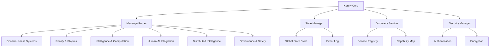

# Kenny Integration Documentation

## Overview

The Kenny Integration pattern is the unified interface design that enables seamless communication and coordination across all 47 subsystems in the ASI:BUILD framework. Kenny serves as the central nervous system, providing standardized APIs, message routing, state synchronization, and orchestration capabilities.

## Kenny Architecture

### Core Principles

1. **Unified Interface**: Single point of access for all subsystem interactions
2. **Message-Driven Architecture**: Asynchronous message passing between components  
3. **State Synchronization**: Consistent state management across distributed systems
4. **Dynamic Discovery**: Automatic subsystem registration and capability detection
5. **Fault Tolerance**: Resilient communication with automatic failover
6. **Security**: Encrypted communication and authentication for all interactions

### Kenny Components



## Kenny Integration Pattern

### Base Kenny Interface

All subsystems implement the standard Kenny interface:

```python
from abc import ABC, abstractmethod
from typing import Dict, Any, List, Optional
from dataclasses import dataclass
from enum import Enum

class KennyMessageType(Enum):
    COMMAND = "command"
    QUERY = "query" 
    EVENT = "event"
    RESPONSE = "response"
    NOTIFICATION = "notification"

@dataclass
class KennyMessage:
    message_id: str
    message_type: KennyMessageType
    source_subsystem: str
    target_subsystem: str
    payload: Dict[str, Any]
    timestamp: float
    correlation_id: Optional[str] = None
    priority: int = 0  # 0=low, 10=critical

@dataclass 
class KennyCapability:
    capability_name: str
    description: str
    input_schema: Dict[str, Any]
    output_schema: Dict[str, Any]
    resource_requirements: Dict[str, Any]
    dependencies: List[str]

class KennySubsystemInterface(ABC):
    """Base interface that all subsystems must implement"""
    
    @property
    @abstractmethod
    def subsystem_name(self) -> str:
        """Unique name for this subsystem"""
        pass
    
    @property
    @abstractmethod
    def version(self) -> str:
        """Version string for this subsystem"""
        pass
    
    @abstractmethod
    def get_capabilities(self) -> List[KennyCapability]:
        """Return list of capabilities this subsystem provides"""
        pass
    
    @abstractmethod
    def initialize(self, kenny_core) -> bool:
        """Initialize subsystem with Kenny core reference"""
        pass
    
    @abstractmethod
    def handle_message(self, message: KennyMessage) -> Optional[KennyMessage]:
        """Process incoming Kenny message"""
        pass
    
    @abstractmethod
    def get_status(self) -> Dict[str, Any]:
        """Return current subsystem status"""
        pass
    
    @abstractmethod
    def shutdown(self) -> bool:
        """Gracefully shutdown subsystem"""
        pass
```

### Kenny Core Implementation

```python
import asyncio
import json
import uuid
from typing import Dict, List, Set, Callable
import logging
from concurrent.futures import ThreadPoolExecutor

class KennyCore:
    """Central coordination hub for all ASI:BUILD subsystems"""
    
    def __init__(self):
        self.subsystems: Dict[str, KennySubsystemInterface] = {}
        self.message_handlers: Dict[str, Callable] = {}
        self.service_registry: Dict[str, Dict] = {}
        self.event_log: List[KennyMessage] = []
        self.global_state: Dict[str, Any] = {}
        self.executor = ThreadPoolExecutor(max_workers=50)
        self.running = False
        
        # Initialize logging
        self.logger = logging.getLogger("KennyCore")
        
        # Security and encryption
        self.security_manager = KennySecurityManager()
        
        # Message routing
        self.message_router = KennyMessageRouter()
        
    async def start(self):
        """Start Kenny core services"""
        self.running = True
        self.logger.info("Kenny Core starting...")
        
        # Start message processing loop
        asyncio.create_task(self._message_processing_loop())
        
        # Start health monitoring
        asyncio.create_task(self._health_monitoring_loop())
        
        self.logger.info("Kenny Core started successfully")
    
    def register_subsystem(self, subsystem: KennySubsystemInterface) -> bool:
        """Register a new subsystem with Kenny"""
        try:
            subsystem_name = subsystem.subsystem_name
            
            # Initialize subsystem
            if not subsystem.initialize(self):
                self.logger.error(f"Failed to initialize subsystem: {subsystem_name}")
                return False
            
            # Register subsystem
            self.subsystems[subsystem_name] = subsystem
            
            # Register capabilities
            capabilities = subsystem.get_capabilities()
            self.service_registry[subsystem_name] = {
                'version': subsystem.version,
                'capabilities': capabilities,
                'status': 'active',
                'last_heartbeat': asyncio.get_event_loop().time()
            }
            
            self.logger.info(f"Registered subsystem: {subsystem_name} v{subsystem.version}")
            self.logger.info(f"Capabilities: {[cap.capability_name for cap in capabilities]}")
            
            # Notify other subsystems of new registration
            self._broadcast_subsystem_event('subsystem_registered', {
                'subsystem_name': subsystem_name,
                'capabilities': [cap.capability_name for cap in capabilities]
            })
            
            return True
            
        except Exception as e:
            self.logger.error(f"Error registering subsystem: {e}")
            return False
    
    async def send_message(self, message: KennyMessage) -> Optional[KennyMessage]:
        """Send message to target subsystem"""
        try:
            # Validate message
            if not self._validate_message(message):
                raise ValueError("Invalid message format")
            
            # Encrypt message if required
            if self.security_manager.encryption_required(message):
                message = self.security_manager.encrypt_message(message)
            
            # Route message
            response = await self.message_router.route_message(message, self.subsystems)
            
            # Log message
            self.event_log.append(message)
            if response:
                self.event_log.append(response)
            
            return response
            
        except Exception as e:
            self.logger.error(f"Error sending message: {e}")
            return None
    
    def query_capability(self, capability_name: str) -> List[str]:
        """Find subsystems that provide a specific capability"""
        providing_subsystems = []
        
        for subsystem_name, registry_info in self.service_registry.items():
            capabilities = registry_info['capabilities']
            if any(cap.capability_name == capability_name for cap in capabilities):
                providing_subsystems.append(subsystem_name)
        
        return providing_subsystems
    
    def get_global_state(self, key: str = None) -> Any:
        """Get global state value(s)"""
        if key:
            return self.global_state.get(key)
        return self.global_state.copy()
    
    def set_global_state(self, key: str, value: Any) -> None:
        """Set global state value"""
        self.global_state[key] = value
        
        # Notify interested subsystems of state change
        self._broadcast_state_change(key, value)
    
    async def orchestrate_multi_subsystem_operation(self, 
                                                    operation_name: str,
                                                    operation_config: Dict[str, Any]) -> Dict[str, Any]:
        """Orchestrate complex operations across multiple subsystems"""
        operation_id = str(uuid.uuid4())
        
        self.logger.info(f"Starting multi-subsystem operation: {operation_name} ({operation_id})")
        
        try:
            # Parse operation configuration
            required_subsystems = operation_config.get('required_subsystems', [])
            operation_steps = operation_config.get('steps', [])
            timeout = operation_config.get('timeout', 300)  # 5 minutes default
            
            # Validate subsystem availability
            for subsystem_name in required_subsystems:
                if subsystem_name not in self.subsystems:
                    raise ValueError(f"Required subsystem not available: {subsystem_name}")
            
            # Execute operation steps
            operation_results = {}
            
            for step in operation_steps:
                step_name = step['name']
                step_type = step['type']  # 'sequential', 'parallel', 'conditional'
                step_targets = step['targets']
                step_payload = step['payload']
                
                self.logger.info(f"Executing step: {step_name} ({step_type})")
                
                if step_type == 'sequential':
                    # Execute steps in sequence
                    for target in step_targets:
                        message = KennyMessage(
                            message_id=str(uuid.uuid4()),
                            message_type=KennyMessageType.COMMAND,
                            source_subsystem='kenny_core',
                            target_subsystem=target,
                            payload=step_payload,
                            timestamp=asyncio.get_event_loop().time(),
                            correlation_id=operation_id
                        )
                        
                        response = await self.send_message(message)
                        operation_results[f"{step_name}_{target}"] = response
                
                elif step_type == 'parallel':
                    # Execute steps in parallel
                    tasks = []
                    for target in step_targets:
                        message = KennyMessage(
                            message_id=str(uuid.uuid4()),
                            message_type=KennyMessageType.COMMAND,
                            source_subsystem='kenny_core',
                            target_subsystem=target,
                            payload=step_payload,
                            timestamp=asyncio.get_event_loop().time(),
                            correlation_id=operation_id
                        )
                        
                        task = asyncio.create_task(self.send_message(message))
                        tasks.append((target, task))
                    
                    # Wait for all parallel tasks
                    for target, task in tasks:
                        response = await task
                        operation_results[f"{step_name}_{target}"] = response
            
            self.logger.info(f"Multi-subsystem operation completed: {operation_name}")
            
            return {
                'operation_id': operation_id,
                'operation_name': operation_name,
                'status': 'completed',
                'results': operation_results,
                'execution_time': asyncio.get_event_loop().time() - operation_config.get('start_time', 0)
            }
            
        except Exception as e:
            self.logger.error(f"Multi-subsystem operation failed: {operation_name} - {e}")
            return {
                'operation_id': operation_id,
                'operation_name': operation_name,
                'status': 'failed',
                'error': str(e),
                'partial_results': operation_results if 'operation_results' in locals() else {}
            }
    
    async def _message_processing_loop(self):
        """Main message processing loop"""
        while self.running:
            try:
                # Process queued messages
                await self.message_router.process_message_queue()
                
                # Small delay to prevent CPU spinning
                await asyncio.sleep(0.01)
                
            except Exception as e:
                self.logger.error(f"Error in message processing loop: {e}")
                await asyncio.sleep(1)
    
    async def _health_monitoring_loop(self):
        """Monitor subsystem health and connectivity"""
        while self.running:
            try:
                current_time = asyncio.get_event_loop().time()
                
                for subsystem_name, subsystem in self.subsystems.items():
                    # Check subsystem status
                    try:
                        status = subsystem.get_status()
                        
                        # Update registry
                        if subsystem_name in self.service_registry:
                            self.service_registry[subsystem_name]['status'] = status.get('health', 'unknown')
                            self.service_registry[subsystem_name]['last_heartbeat'] = current_time
                        
                    except Exception as e:
                        self.logger.warning(f"Health check failed for {subsystem_name}: {e}")
                        if subsystem_name in self.service_registry:
                            self.service_registry[subsystem_name]['status'] = 'unhealthy'
                
                # Sleep for 30 seconds between health checks
                await asyncio.sleep(30)
                
            except Exception as e:
                self.logger.error(f"Error in health monitoring loop: {e}")
                await asyncio.sleep(60)
```

## Subsystem Integration Examples

### Consciousness Engine Kenny Integration

```python
from consciousness_engine import ConsciousnessOrchestrator
from kenny_integration import KennySubsystemInterface, KennyCapability, KennyMessage

class ConsciousnessEngineKennyInterface(KennySubsystemInterface):
    """Kenny integration for Consciousness Engine"""
    
    def __init__(self, consciousness_orchestrator: ConsciousnessOrchestrator):
        self.consciousness = consciousness_orchestrator
        self.kenny_core = None
    
    @property
    def subsystem_name(self) -> str:
        return "consciousness_engine"
    
    @property
    def version(self) -> str:
        return "2.1.0"
    
    def get_capabilities(self) -> List[KennyCapability]:
        return [
            KennyCapability(
                capability_name="awareness_assessment",
                description="Assess current awareness level and consciousness state",
                input_schema={"assessment_type": "str", "depth": "int"},
                output_schema={"awareness_level": "float", "consciousness_state": "dict"},
                resource_requirements={"memory": "2GB", "compute": "moderate"},
                dependencies=[]
            ),
            KennyCapability(
                capability_name="metacognitive_processing",
                description="Perform metacognitive analysis and self-reflection",
                input_schema={"thought_content": "str", "reflection_depth": "int"},
                output_schema={"meta_analysis": "dict", "insights": "list"},
                resource_requirements={"memory": "4GB", "compute": "high"},
                dependencies=["awareness_assessment"]
            ),
            KennyCapability(
                capability_name="consciousness_modulation",
                description="Modify consciousness parameters and awareness levels",
                input_schema={"target_state": "dict", "modulation_params": "dict"},
                output_schema={"modulation_result": "dict", "new_state": "dict"},
                resource_requirements={"memory": "6GB", "compute": "high"},
                dependencies=["awareness_assessment", "metacognitive_processing"]
            )
        ]
    
    def initialize(self, kenny_core) -> bool:
        """Initialize with Kenny core"""
        try:
            self.kenny_core = kenny_core
            
            # Initialize consciousness engine
            self.consciousness.initialize_consciousness()
            
            # Subscribe to relevant events
            self.kenny_core.subscribe_to_events([
                'reality_state_change',
                'quantum_state_change',
                'divine_math_computation'
            ], self._handle_external_event)
            
            return True
        except Exception as e:
            logging.error(f"Failed to initialize consciousness engine: {e}")
            return False
    
    def handle_message(self, message: KennyMessage) -> Optional[KennyMessage]:
        """Handle Kenny messages"""
        try:
            payload = message.payload
            capability = payload.get('capability')
            
            if capability == 'awareness_assessment':
                return self._handle_awareness_assessment(message)
            elif capability == 'metacognitive_processing':
                return self._handle_metacognitive_processing(message)
            elif capability == 'consciousness_modulation':
                return self._handle_consciousness_modulation(message)
            else:
                return self._create_error_response(message, f"Unknown capability: {capability}")
                
        except Exception as e:
            return self._create_error_response(message, str(e))
    
    def _handle_awareness_assessment(self, message: KennyMessage) -> KennyMessage:
        """Handle awareness assessment request"""
        payload = message.payload
        assessment_type = payload.get('assessment_type', 'comprehensive')
        depth = payload.get('depth', 3)
        
        # Perform awareness assessment
        awareness_result = self.consciousness.assess_awareness_level(
            assessment_type=assessment_type,
            depth=depth
        )
        
        consciousness_state = self.consciousness.get_current_consciousness_state()
        
        return KennyMessage(
            message_id=str(uuid.uuid4()),
            message_type=KennyMessageType.RESPONSE,
            source_subsystem=self.subsystem_name,
            target_subsystem=message.source_subsystem,
            payload={
                'awareness_level': awareness_result.level,
                'consciousness_state': consciousness_state.to_dict(),
                'assessment_details': awareness_result.details
            },
            timestamp=asyncio.get_event_loop().time(),
            correlation_id=message.correlation_id
        )
    
    def _handle_external_event(self, event: Dict[str, Any]):
        """Handle events from other subsystems"""
        event_type = event.get('type')
        
        if event_type == 'reality_state_change':
            # Adjust consciousness to new reality state
            reality_state = event.get('new_state')
            self.consciousness.adapt_to_reality_change(reality_state)
            
        elif event_type == 'quantum_state_change':
            # Process quantum consciousness implications
            quantum_state = event.get('quantum_state')
            self.consciousness.process_quantum_consciousness_change(quantum_state)
            
        elif event_type == 'divine_math_computation':
            # Integrate divine mathematics insights into consciousness
            math_insights = event.get('insights')
            self.consciousness.integrate_mathematical_insights(math_insights)
```

### Reality Engine Kenny Integration

```python
class RealityEngineKennyInterface(KennySubsystemInterface):
    """Kenny integration for Reality Engine"""
    
    def __init__(self, reality_engine):
        self.reality = reality_engine
        self.kenny_core = None
    
    @property
    def subsystem_name(self) -> str:
        return "reality_engine"
    
    @property
    def version(self) -> str:
        return "1.8.5"
    
    def get_capabilities(self) -> List[KennyCapability]:
        return [
            KennyCapability(
                capability_name="reality_simulation",
                description="Create and manage reality simulations",
                input_schema={"simulation_params": "dict", "fidelity": "str"},
                output_schema={"simulation_id": "str", "reality_state": "dict"},
                resource_requirements={"memory": "16GB", "compute": "extreme"},
                dependencies=["quantum_engine", "divine_mathematics"]
            ),
            KennyCapability(
                capability_name="physics_manipulation",
                description="Modify physics constants and laws within controlled boundaries",
                input_schema={"physics_params": "dict", "scope": "str", "safety_level": "str"},
                output_schema={"modification_result": "dict", "new_physics_state": "dict"},
                resource_requirements={"memory": "8GB", "compute": "high"},
                dependencies=["reality_simulation"]
            ),
            KennyCapability(
                capability_name="causal_analysis",
                description="Analyze and manipulate causal relationships",
                input_schema={"causal_chain": "list", "analysis_depth": "int"},
                output_schema={"causal_analysis": "dict", "intervention_points": "list"},
                resource_requirements={"memory": "12GB", "compute": "extreme"},
                dependencies=["physics_manipulation", "divine_mathematics"]
            )
        ]
    
    def handle_message(self, message: KennyMessage) -> Optional[KennyMessage]:
        """Handle reality engine requests"""
        try:
            payload = message.payload
            capability = payload.get('capability')
            
            # Consciousness-Reality Integration
            if message.source_subsystem == 'consciousness_engine':
                return self._handle_consciousness_reality_interaction(message)
            
            # Quantum-Reality Integration
            elif message.source_subsystem == 'quantum_engine':
                return self._handle_quantum_reality_interaction(message)
            
            # Standard capability requests
            elif capability == 'reality_simulation':
                return self._handle_reality_simulation(message)
            elif capability == 'physics_manipulation':
                return self._handle_physics_manipulation(message)
            elif capability == 'causal_analysis':
                return self._handle_causal_analysis(message)
            
            return self._create_error_response(message, f"Unknown capability: {capability}")
            
        except Exception as e:
            return self._create_error_response(message, str(e))
    
    def _handle_consciousness_reality_interaction(self, message: KennyMessage) -> KennyMessage:
        """Handle consciousness-reality interface requests"""
        payload = message.payload
        interaction_type = payload.get('interaction_type')
        consciousness_state = payload.get('consciousness_state')
        
        if interaction_type == 'consciousness_influenced_reality':
            # Allow consciousness to influence reality simulation
            reality_modification = self.reality.consciousness_reality_interface(
                consciousness_state=consciousness_state,
                influence_strength=payload.get('influence_strength', 0.1),
                safety_constraints=True
            )
            
            # Notify consciousness engine of reality changes
            if hasattr(self.kenny_core, 'send_event'):
                self.kenny_core.send_event('reality_state_change', {
                    'new_state': reality_modification.new_reality_state,
                    'change_source': 'consciousness_influence'
                })
            
            return self._create_success_response(message, {
                'reality_modification': reality_modification.to_dict(),
                'consciousness_feedback': reality_modification.consciousness_feedback
            })
        
        return self._create_error_response(message, f"Unknown interaction type: {interaction_type}")
```

## Complex Multi-Subsystem Orchestration

### Consciousness-Reality-Quantum Integration

```python
async def consciousness_reality_quantum_integration(kenny_core: KennyCore):
    """Example of complex multi-subsystem operation"""
    
    operation_config = {
        'required_subsystems': ['consciousness_engine', 'reality_engine', 'quantum_engine', 'divine_mathematics'],
        'timeout': 600,  # 10 minutes
        'steps': [
            {
                'name': 'assess_consciousness_state',
                'type': 'sequential',
                'targets': ['consciousness_engine'],
                'payload': {
                    'capability': 'awareness_assessment',
                    'assessment_type': 'quantum_consciousness',
                    'depth': 5
                }
            },
            {
                'name': 'quantum_state_preparation',
                'type': 'parallel',
                'targets': ['quantum_engine'],
                'payload': {
                    'capability': 'quantum_state_preparation',
                    'target_state': 'consciousness_compatible',
                    'coherence_time': 300
                }
            },
            {
                'name': 'reality_consciousness_coupling',
                'type': 'sequential',
                'targets': ['reality_engine'],
                'payload': {
                    'capability': 'consciousness_reality_coupling',
                    'consciousness_state': '${assess_consciousness_state.consciousness_state}',
                    'quantum_state': '${quantum_state_preparation.quantum_state}',
                    'coupling_strength': 0.3
                }
            },
            {
                'name': 'divine_math_validation',
                'type': 'sequential',
                'targets': ['divine_mathematics'],
                'payload': {
                    'capability': 'transcendent_validation',
                    'reality_state': '${reality_consciousness_coupling.new_reality_state}',
                    'consciousness_state': '${assess_consciousness_state.consciousness_state}',
                    'quantum_state': '${quantum_state_preparation.quantum_state}'
                }
            }
        ]
    }
    
    # Execute the multi-subsystem operation
    result = await kenny_core.orchestrate_multi_subsystem_operation(
        'consciousness_reality_quantum_integration',
        operation_config
    )
    
    return result
```

## Kenny Event System

### Event Broadcasting and Subscription

```python
class KennyEventSystem:
    """Event system for Kenny subsystem coordination"""
    
    def __init__(self):
        self.subscribers: Dict[str, List[Callable]] = {}
        self.event_history: List[Dict] = []
    
    def subscribe(self, event_type: str, callback: Callable):
        """Subscribe to event type"""
        if event_type not in self.subscribers:
            self.subscribers[event_type] = []
        self.subscribers[event_type].append(callback)
    
    def publish(self, event_type: str, event_data: Dict[str, Any]):
        """Publish event to subscribers"""
        event = {
            'event_id': str(uuid.uuid4()),
            'event_type': event_type,
            'data': event_data,
            'timestamp': asyncio.get_event_loop().time(),
            'source': 'kenny_core'
        }
        
        # Store in history
        self.event_history.append(event)
        
        # Notify subscribers
        if event_type in self.subscribers:
            for callback in self.subscribers[event_type]:
                try:
                    asyncio.create_task(callback(event))
                except Exception as e:
                    logging.error(f"Error in event callback: {e}")

# Example event subscriptions
kenny_events = KennyEventSystem()

# Consciousness engine subscribes to reality changes
kenny_events.subscribe('reality_state_change', consciousness_engine.handle_reality_change)

# Reality engine subscribes to consciousness changes  
kenny_events.subscribe('consciousness_state_change', reality_engine.handle_consciousness_change)

# Quantum engine subscribes to both
kenny_events.subscribe('reality_state_change', quantum_engine.handle_reality_change)
kenny_events.subscribe('consciousness_state_change', quantum_engine.handle_consciousness_change)
```

## Security and Authentication

### Kenny Security Manager

```python
class KennySecurityManager:
    """Security and authentication for Kenny integration"""
    
    def __init__(self):
        self.encryption_keys: Dict[str, bytes] = {}
        self.access_policies: Dict[str, Dict] = {}
        self.authenticated_subsystems: Set[str] = set()
    
    def authenticate_subsystem(self, subsystem_name: str, credentials: Dict) -> bool:
        """Authenticate subsystem for Kenny access"""
        try:
            # Verify subsystem credentials
            if self._verify_credentials(subsystem_name, credentials):
                self.authenticated_subsystems.add(subsystem_name)
                
                # Generate encryption keys for subsystem
                self.encryption_keys[subsystem_name] = self._generate_encryption_key()
                
                return True
            return False
        except Exception as e:
            logging.error(f"Authentication failed for {subsystem_name}: {e}")
            return False
    
    def encrypt_message(self, message: KennyMessage) -> KennyMessage:
        """Encrypt sensitive message content"""
        if message.target_subsystem in self.encryption_keys:
            encryption_key = self.encryption_keys[message.target_subsystem]
            
            # Encrypt payload
            encrypted_payload = self._encrypt_data(
                json.dumps(message.payload).encode(),
                encryption_key
            )
            
            # Create encrypted message
            message.payload = {
                'encrypted': True,
                'data': encrypted_payload.hex()
            }
        
        return message
    
    def check_authorization(self, subsystem_name: str, capability: str) -> bool:
        """Check if subsystem is authorized for capability"""
        if subsystem_name not in self.access_policies:
            return False
        
        policy = self.access_policies[subsystem_name]
        return capability in policy.get('allowed_capabilities', [])
```

## Performance Monitoring

### Kenny Performance Monitor

```python
class KennyPerformanceMonitor:
    """Monitor and optimize Kenny performance"""
    
    def __init__(self):
        self.metrics: Dict[str, List] = {
            'message_latency': [],
            'subsystem_response_time': [],
            'memory_usage': [],
            'cpu_usage': [],
            'network_bandwidth': []
        }
        self.performance_alerts: List[Dict] = []
    
    def record_message_latency(self, message_id: str, latency_ms: float):
        """Record message processing latency"""
        self.metrics['message_latency'].append({
            'message_id': message_id,
            'latency_ms': latency_ms,
            'timestamp': time.time()
        })
        
        # Check for performance alerts
        if latency_ms > 1000:  # Alert if latency > 1 second
            self.performance_alerts.append({
                'type': 'high_latency',
                'message_id': message_id,
                'latency_ms': latency_ms,
                'timestamp': time.time()
            })
    
    def get_performance_summary(self) -> Dict[str, Any]:
        """Get performance summary statistics"""
        if not self.metrics['message_latency']:
            return {}
        
        latencies = [m['latency_ms'] for m in self.metrics['message_latency'][-1000:]]
        
        return {
            'avg_latency_ms': sum(latencies) / len(latencies),
            'max_latency_ms': max(latencies),
            'min_latency_ms': min(latencies),
            'messages_per_second': len(latencies) / 60,  # Last minute
            'active_alerts': len(self.performance_alerts)
        }
```

## Best Practices for Kenny Integration

### 1. Message Design

```python
# Good: Clear, structured messages
message = KennyMessage(
    message_id=str(uuid.uuid4()),
    message_type=KennyMessageType.COMMAND,
    source_subsystem='consciousness_engine',
    target_subsystem='reality_engine',
    payload={
        'capability': 'reality_simulation',
        'parameters': {
            'simulation_type': 'consciousness_compatible',
            'duration': 3600,
            'fidelity': 'high'
        },
        'safety_constraints': True
    },
    timestamp=time.time(),
    priority=5
)

# Bad: Unclear, unstructured messages
bad_message = KennyMessage(
    message_id="msg1",
    message_type=KennyMessageType.COMMAND,
    source_subsystem='cons',
    target_subsystem='reality',
    payload={'do_thing': True, 'stuff': [1, 2, 3]},
    timestamp=0
)
```

### 2. Error Handling

```python
def handle_message(self, message: KennyMessage) -> Optional[KennyMessage]:
    """Robust message handling with error recovery"""
    try:
        # Validate message
        if not self._validate_message(message):
            return self._create_error_response(
                message, 
                "Invalid message format",
                error_code="INVALID_MESSAGE"
            )
        
        # Process message
        result = self._process_capability_request(message)
        
        return self._create_success_response(message, result)
        
    except CapabilityNotAvailableError as e:
        return self._create_error_response(
            message,
            f"Capability not available: {e}",
            error_code="CAPABILITY_UNAVAILABLE"
        )
    except InsufficientResourcesError as e:
        return self._create_error_response(
            message,
            f"Insufficient resources: {e}",
            error_code="INSUFFICIENT_RESOURCES",
            retry_after=60
        )
    except Exception as e:
        self.logger.error(f"Unexpected error processing message: {e}")
        return self._create_error_response(
            message,
            "Internal subsystem error",
            error_code="INTERNAL_ERROR"
        )
```

### 3. Resource Management

```python
class ResourceAwareKennyInterface(KennySubsystemInterface):
    """Kenny interface with resource management"""
    
    def __init__(self):
        self.resource_monitor = ResourceMonitor()
        self.request_queue = asyncio.Queue()
        self.max_concurrent_requests = 10
        self.current_requests = 0
    
    async def handle_message(self, message: KennyMessage) -> Optional[KennyMessage]:
        """Handle message with resource constraints"""
        
        # Check resource availability
        if not self.resource_monitor.has_sufficient_resources(message):
            return self._create_error_response(
                message,
                "Insufficient resources available",
                error_code="RESOURCE_LIMIT",
                retry_after=30
            )
        
        # Queue management
        if self.current_requests >= self.max_concurrent_requests:
            await self.request_queue.put(message)
            return self._create_response(
                message,
                {"status": "queued", "queue_position": self.request_queue.qsize()}
            )
        
        # Process request
        self.current_requests += 1
        try:
            result = await self._process_request(message)
            return result
        finally:
            self.current_requests -= 1
            
            # Process next queued request
            if not self.request_queue.empty():
                next_message = await self.request_queue.get()
                asyncio.create_task(self.handle_message(next_message))
```

## Testing Kenny Integration

### Integration Test Framework

```python
import pytest
import asyncio
from unittest.mock import Mock, AsyncMock

class KennyIntegrationTestFramework:
    """Test framework for Kenny subsystem integration"""
    
    def __init__(self):
        self.kenny_core = KennyCore()
        self.test_subsystems = {}
    
    async def setup_test_environment(self):
        """Setup test environment with mock subsystems"""
        await self.kenny_core.start()
        
        # Create mock subsystems for testing
        mock_consciousness = Mock(spec=KennySubsystemInterface)
        mock_consciousness.subsystem_name = "consciousness_engine"
        mock_consciousness.version = "test-1.0"
        mock_consciousness.get_capabilities.return_value = []
        mock_consciousness.initialize.return_value = True
        mock_consciousness.handle_message = AsyncMock()
        
        self.test_subsystems['consciousness_engine'] = mock_consciousness
        
        # Register mock subsystems
        self.kenny_core.register_subsystem(mock_consciousness)
    
    async def test_message_routing(self):
        """Test message routing between subsystems"""
        test_message = KennyMessage(
            message_id="test-msg-1",
            message_type=KennyMessageType.QUERY,
            source_subsystem="test_harness",
            target_subsystem="consciousness_engine",
            payload={"capability": "awareness_assessment"},
            timestamp=time.time()
        )
        
        # Send message
        response = await self.kenny_core.send_message(test_message)
        
        # Verify message was routed correctly
        assert self.test_subsystems['consciousness_engine'].handle_message.called
        assert response is not None
    
    async def test_capability_discovery(self):
        """Test capability discovery mechanism"""
        capabilities = self.kenny_core.query_capability("awareness_assessment")
        assert "consciousness_engine" in capabilities
    
    async def test_multi_subsystem_orchestration(self):
        """Test complex multi-subsystem operations"""
        operation_config = {
            'required_subsystems': ['consciousness_engine'],
            'steps': [
                {
                    'name': 'test_step',
                    'type': 'sequential',
                    'targets': ['consciousness_engine'],
                    'payload': {'test': True}
                }
            ]
        }
        
        result = await self.kenny_core.orchestrate_multi_subsystem_operation(
            'test_operation',
            operation_config
        )
        
        assert result['status'] == 'completed'

# Run integration tests
@pytest.mark.asyncio
async def test_kenny_integration():
    test_framework = KennyIntegrationTestFramework()
    await test_framework.setup_test_environment()
    
    await test_framework.test_message_routing()
    await test_framework.test_capability_discovery()
    await test_framework.test_multi_subsystem_orchestration()
```

## Deployment and Configuration

### Kenny Configuration

```yaml
# kenny_config.yaml
kenny_core:
  max_concurrent_messages: 1000
  message_queue_size: 10000
  health_check_interval: 30
  log_level: "INFO"
  
security:
  encryption_enabled: true
  authentication_required: true
  message_signing: true
  key_rotation_interval: 86400  # 24 hours
  
performance:
  message_timeout: 30  # seconds
  max_retry_attempts: 3
  circuit_breaker_threshold: 10
  
subsystems:
  consciousness_engine:
    enabled: true
    priority: 10
    resource_limits:
      memory: "8GB"
      cpu: "4 cores"
  
  reality_engine:
    enabled: true
    priority: 9
    resource_limits:
      memory: "16GB"
      cpu: "8 cores"
      
  quantum_engine:
    enabled: true
    priority: 8
    resource_limits:
      memory: "12GB"
      cpu: "6 cores"
      gpu: "2 GPUs"

monitoring:
  metrics_collection: true
  performance_alerts: true
  health_dashboard: true
  audit_logging: true
```

## Summary

The Kenny Integration pattern provides:

1. **Unified Communication**: Single interface for all subsystem interactions
2. **Dynamic Discovery**: Automatic capability detection and service registry
3. **Fault Tolerance**: Resilient communication with retry and failover
4. **Security**: Encrypted communication and authentication
5. **Performance**: Optimized message routing and resource management
6. **Orchestration**: Complex multi-subsystem operation coordination
7. **Monitoring**: Comprehensive performance and health monitoring

This integration pattern enables the 47 ASI:BUILD subsystems to work together seamlessly, creating emergent capabilities that exceed the sum of individual components while maintaining safety, security, and performance at scale.

---

*This documentation provides comprehensive guidance for implementing Kenny integration patterns across all ASI:BUILD subsystems.*