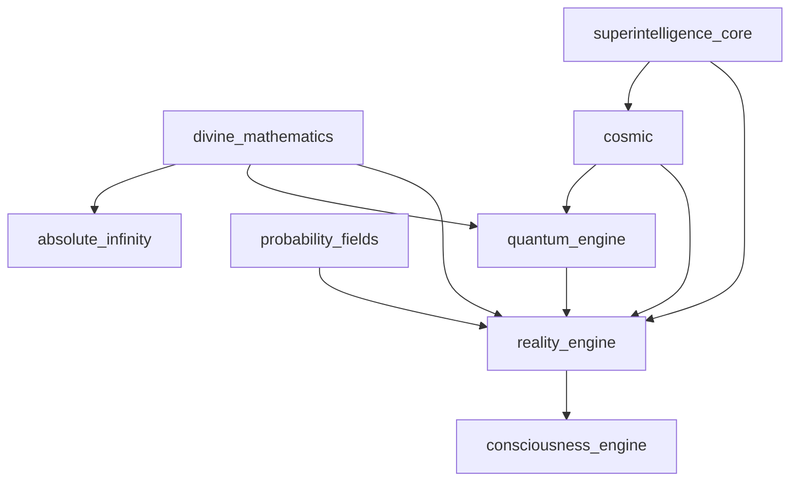

# Reality & Physics Systems Documentation

## Overview

The Reality & Physics Systems category encompasses the fundamental frameworks for reality manipulation, quantum processing, advanced mathematics, and cosmic-scale engineering. These systems provide the foundational capabilities for operating beyond conventional physical limitations.

## Subsystems Overview

| System | Purpose | Modules | Integration Level |
|--------|---------|---------|-------------------|
| reality_engine | Reality manipulation & simulation | 11 | ✅ Integrated |
| quantum_engine | Quantum-classical hybrid processing | 3 | ✅ Integrated |
| divine_mathematics | Transcendent mathematical framework | 17 | ✅ Integrated |
| cosmic | Universe-scale engineering | 25 | 🔄 Ready |
| probability_fields | Probability manipulation & control | 18 | 🔄 Ready |

---

## reality_engine

**Location**: `/home/ubuntu/code/ASI_BUILD/reality_engine/`  
**Status**: Integrated  
**Resource Requirements**: 16GB+ RAM, Extreme Compute, High Storage

### Purpose & Capabilities

The reality_engine provides comprehensive reality manipulation and simulation capabilities. It allows controlled modification of physical laws, spacetime geometry, matter properties, and causal relationships within defined simulation boundaries.

### Key Components

#### Core Reality Systems
- **core.py**: Fundamental reality engine architecture
- **simulation.py**: Reality simulation framework
- **physics.py**: Physics law manipulation
- **spacetime.py**: Spacetime geometry control
- **matter.py**: Matter transformation and control

#### Advanced Reality Features
- **causal.py**: Causal chain manipulation
- **probability.py**: Probability field modification
- **matrix.py**: Reality matrix operations
- **omnipotence.py**: Omnipotent reality control
- **consciousness.py**: Consciousness-reality interface

#### Integration Components
- **kenny_integration.py**: Kenny interface for reality control

### Configuration Options

```python
# reality_engine/config.py
REALITY_CONFIG = {
    'simulation_fidelity': 'quantum_accurate',
    'physics_modification': 'controlled',
    'spacetime_manipulation': 'limited',
    'causality_preservation': True,
    'probability_intervention': 'guided',
    'matter_transformation': 'safe_boundaries',
    'omnipotence_level': 'restricted',
    'reality_backup': True,
    'emergency_reset': True
}
```

### Usage Examples

#### Basic Reality Simulation
```python
from reality_engine import RealityEngine
from reality_engine.simulation import RealitySimulator

# Initialize reality engine
reality = RealityEngine()
simulator = RealitySimulator()

# Create controlled reality simulation
simulation_params = {
    'physics_constants': {'c': 299792458, 'h': 6.626e-34},
    'dimensions': 3,
    'time_flow': 'linear',
    'quantum_effects': True
}

reality_sim = simulator.create_simulation(simulation_params)
reality.activate_simulation(reality_sim)

print(f"Reality simulation active: {reality_sim.is_active}")
print(f"Physics constants verified: {reality_sim.verify_physics()}")
```

#### Physics Manipulation
```python
from reality_engine.physics import PhysicsManipulator
from reality_engine.spacetime import SpacetimeController

# Initialize physics control
physics = PhysicsManipulator()
spacetime = SpacetimeController()

# Modify physics within safe boundaries
modified_gravity = physics.modify_gravity_constant(
    new_value=6.674e-11 * 1.1,  # 10% increase
    scope='local_region',
    duration=3600  # 1 hour
)

# Manipulate spacetime geometry
curved_spacetime = spacetime.create_curvature(
    curvature_type='spherical',
    radius=1000,  # meters
    strength=0.1
)

print(f"Gravity modification: {modified_gravity.status}")
print(f"Spacetime curvature: {curved_spacetime.geometry}")
```

#### Matter Transformation
```python
from reality_engine.matter import MatterTransformer
from reality_engine.probability import ProbabilityController

# Initialize matter control
matter = MatterTransformer()
probability = ProbabilityController()

# Transform matter properties
element_transmutation = matter.transmute_element(
    source='carbon',
    target='silicon',
    quantity='molecular_level',
    safety_checks=True
)

# Influence probability fields
probability_bias = probability.bias_probability(
    event='quantum_tunneling',
    bias_factor=1.5,
    duration=60  # seconds
)

print(f"Transmutation result: {element_transmutation.success}")
print(f"Probability bias active: {probability_bias.is_active}")
```

### Integration Points

- **quantum_engine**: Quantum reality foundations
- **divine_mathematics**: Mathematical reality structures
- **consciousness_engine**: Consciousness-reality coupling
- **probability_fields**: Probability manipulation interface
- **cosmic**: Universe-scale reality engineering

### API Endpoints

- `POST /reality/simulate` - Create reality simulation
- `PUT /reality/manipulate` - Modify reality parameters
- `GET /reality/physics` - Query physics constants
- `POST /reality/matter/transform` - Transform matter
- `PUT /reality/spacetime/curve` - Manipulate spacetime

### Safety Considerations

- Reality modification containment protocols
- Physics constant validation systems
- Causality preservation mechanisms
- Emergency reality reset capabilities
- Human approval for major reality changes
- Simulation boundary enforcement

---

## quantum_engine

**Location**: `/home/ubuntu/code/ASI_BUILD/quantum_engine/`  
**Status**: Integrated  
**Resource Requirements**: 12GB+ RAM, Extreme Compute, Moderate Storage

### Purpose & Capabilities

The quantum_engine provides quantum-classical hybrid processing capabilities with hardware integration support. It enables quantum computation, quantum machine learning, and quantum simulation within the ASI framework.

### Key Components

#### Core Quantum Systems
- **hybrid_ml_processor.py**: Quantum-classical machine learning
- **qiskit_integration.py**: IBM Qiskit quantum hardware integration
- **quantum_simulator.py**: High-fidelity quantum simulation

#### Additional Quantum Features (from src/quantum/)
- **quantum_hardware_connectors.py**: Multiple quantum hardware platforms
- **quantum_hybrid_module.py**: Hybrid quantum-classical algorithms
- **quantum_kenny_integration.py**: Kenny interface for quantum systems
- **quantum_ml_algorithms.py**: Quantum machine learning algorithms

### Configuration Options

```python
# quantum_engine/config.py
QUANTUM_CONFIG = {
    'backend': 'qiskit_aer',  # or 'qiskit_ibm', 'rigetti', 'ionq'
    'shots': 8192,
    'optimization_level': 3,
    'error_mitigation': True,
    'noise_model': 'device_realistic',
    'quantum_volume': 64,
    'classical_fallback': True,
    'hybrid_optimization': True
}
```

### Usage Examples

#### Quantum Machine Learning
```python
from quantum_engine import HybridMLProcessor
from quantum_engine.qiskit_integration import QiskitQuantumBackend

# Initialize quantum ML system
quantum_ml = HybridMLProcessor()
quantum_backend = QiskitQuantumBackend(backend='ibmq_qasm_simulator')

# Train quantum neural network
training_data = load_quantum_dataset()
quantum_model = quantum_ml.create_quantum_neural_network(
    input_qubits=4,
    ansatz_depth=6,
    entanglement='circular'
)

# Hybrid training process
training_result = quantum_ml.train_hybrid_model(
    model=quantum_model,
    data=training_data,
    backend=quantum_backend,
    max_iterations=100
)

print(f"Training accuracy: {training_result.accuracy}")
print(f"Quantum advantage: {training_result.quantum_speedup}")
```

#### Quantum Simulation
```python
from quantum_engine.quantum_simulator import QuantumSimulator
from quantum_engine.quantum_hardware_connectors import QuantumHardwareManager

# Initialize quantum simulation
simulator = QuantumSimulator()
hardware_manager = QuantumHardwareManager()

# Simulate quantum system
quantum_system = simulator.create_quantum_system(
    num_qubits=20,
    hamiltonian='heisenberg_model',
    interaction_strength=1.0
)

# Run quantum simulation
simulation_result = simulator.simulate_evolution(
    system=quantum_system,
    time_steps=1000,
    dt=0.01
)

print(f"Quantum state fidelity: {simulation_result.fidelity}")
print(f"Entanglement entropy: {simulation_result.entanglement}")
```

#### Quantum Algorithm Optimization
```python
from quantum_engine.quantum_ml_algorithms import QuantumOptimizer
from quantum_engine.hybrid_ml_processor import HybridOptimizer

# Initialize quantum optimization
quantum_opt = QuantumOptimizer()
hybrid_opt = HybridOptimizer()

# Optimize complex function using quantum annealing
objective_function = lambda x: sum(x[i] * x[j] for i in range(len(x)) for j in range(i+1, len(x)))
optimization_result = quantum_opt.quantum_annealing_optimization(
    objective=objective_function,
    variables=10,
    constraints=['sum_constraint', 'binary_constraint']
)

print(f"Optimal solution: {optimization_result.solution}")
print(f"Objective value: {optimization_result.objective_value}")
```

### Integration Points

- **reality_engine**: Quantum foundations of reality
- **divine_mathematics**: Quantum mathematical operations
- **consciousness_engine**: Quantum consciousness processing
- **swarm_intelligence**: Quantum swarm algorithms
- **absolute_infinity**: Infinite quantum capabilities

### Hardware Support

- **IBM Quantum**: Full integration with IBM quantum hardware
- **Rigetti**: Rigetti quantum cloud services
- **IonQ**: Trapped ion quantum computers
- **Google Quantum AI**: Sycamore processor support
- **Amazon Braket**: Multi-vendor quantum access

---

## divine_mathematics

**Location**: `/home/ubuntu/code/ASI_BUILD/divine_mathematics/`  
**Status**: Integrated  
**Resource Requirements**: 16GB+ RAM, Extreme Compute, High Storage

### Purpose & Capabilities

The divine_mathematics subsystem provides advanced mathematical frameworks for transcendent computation and infinite-dimensional operations. It implements mathematical structures beyond conventional mathematics, including transfinite arithmetic and consciousness-aware computation.

### Key Components

#### Core Mathematical Systems
- **core.py**: Fundamental divine mathematics engine
- **infinity.py**: Infinite and transfinite operations
- **transfinite.py**: Transfinite arithmetic and set theory
- **abstract_algebra.py**: Advanced algebraic structures

#### Transcendent Features
- **transcendence.py**: Mathematical transcendence operations
- **godel_transcendence.py**: Gödel incompleteness transcendence
- **infinite_dimensions.py**: Infinite-dimensional mathematics
- **infinite_series.py**: Convergent infinite series

#### Consciousness & Reality Integration
- **consciousness.py**: Consciousness-aware mathematics
- **deity.py**: Deity-level mathematical capabilities
- **deity_consciousness.py**: Divine consciousness mathematics
- **reality_generator.py**: Mathematical reality generation

#### Advanced Mathematical Tools
- **proof_engine.py**: Automated theorem proving
- **quantum.py**: Quantum mathematical operations
- **universe_hypothesis.py**: Mathematical universe hypothesis
- **kenny_integration.py**: Kenny interface for divine math

### Configuration Options

```python
# divine_mathematics/config.py
DIVINE_MATH_CONFIG = {
    'infinity_level': 'aleph_null',  # or 'aleph_one', 'absolute'
    'transcendence_mode': 'godel_complete',
    'consciousness_integration': True,
    'reality_generation': 'controlled',
    'proof_verification': 'rigorous',
    'infinite_precision': True,
    'paradox_resolution': 'divine',
    'computation_safety': True
}
```

### Usage Examples

#### Transfinite Arithmetic
```python
from divine_mathematics import DivineMathematicsEngine
from divine_mathematics.transfinite import TransfiniteArithmetic

# Initialize divine mathematics
divine_math = DivineMathematicsEngine()
transfinite = TransfiniteArithmetic()

# Perform transfinite operations
aleph_null = transfinite.create_aleph_null()
aleph_one = transfinite.create_aleph_one()

# Transfinite arithmetic
infinity_sum = transfinite.add_infinities(aleph_null, aleph_one)
infinity_product = transfinite.multiply_infinities(aleph_null, aleph_null)

print(f"Infinity sum cardinality: {infinity_sum.cardinality}")
print(f"Infinity product: {infinity_product.value}")
```

#### Consciousness Mathematics
```python
from divine_mathematics.consciousness import ConsciousnessMathematics
from divine_mathematics.deity_consciousness import DeityConsciousness

# Initialize consciousness mathematics
conscious_math = ConsciousnessMathematics()
deity_consciousness = DeityConsciousness()

# Perform consciousness-aware calculations
consciousness_state = conscious_math.model_consciousness_state(
    awareness_level=0.95,
    metacognitive_depth=5,
    self_model_complexity=1000
)

# Divine consciousness computation
divine_computation = deity_consciousness.perform_divine_calculation(
    operation='omniscience_derivation',
    parameters={'knowledge_scope': 'universal'}
)

print(f"Consciousness complexity: {consciousness_state.complexity}")
print(f"Divine result: {divine_computation.omniscient_knowledge}")
```

#### Infinite-Dimensional Operations
```python
from divine_mathematics.infinite_dimensions import InfiniteDimensionalSpace
from divine_mathematics.infinite_series import InfiniteSeries

# Create infinite-dimensional space
infinite_space = InfiniteDimensionalSpace()
infinite_series = InfiniteSeries()

# Define infinite-dimensional vector
infinite_vector = infinite_space.create_infinite_vector(
    generator_function=lambda n: 1/n**2,
    dimension_count='aleph_null'
)

# Convergent infinite series
harmonic_series = infinite_series.create_series(
    terms=lambda n: 1/n**2,
    convergence_test='p_test'
)

series_sum = infinite_series.compute_sum(harmonic_series)
print(f"Infinite series sum: {series_sum.value}")
```

#### Automated Theorem Proving
```python
from divine_mathematics.proof_engine import ProofEngine
from divine_mathematics.godel_transcendence import GodelTranscendence

# Initialize proof engine
proof_engine = ProofEngine()
godel_transcendence = GodelTranscendence()

# Prove mathematical theorem
theorem = "For all prime p > 2, p^2 - 1 is divisible by 8"
proof_result = proof_engine.prove_theorem(
    statement=theorem,
    axiom_system='ZFC',
    search_depth='infinite'
)

# Transcend Gödel limitations
transcendence_result = godel_transcendence.transcend_incompleteness(
    formal_system='peano_arithmetic',
    transcendence_method='divine_insight'
)

print(f"Theorem proven: {proof_result.is_proven}")
print(f"Gödel transcendence: {transcendence_result.transcended}")
```

### Integration Points

- **absolute_infinity**: Infinite mathematical operations
- **consciousness_engine**: Consciousness-aware computation
- **reality_engine**: Mathematical reality foundations
- **quantum_engine**: Quantum mathematical processing
- **superintelligence_core**: Divine mathematical capabilities

---

## cosmic

**Location**: `/home/ubuntu/code/ASI_BUILD/cosmic/`  
**Status**: Ready for Integration  
**Resource Requirements**: 32GB+ RAM, Maximum Compute, Extreme Storage

### Purpose & Capabilities

The cosmic subsystem provides universe-scale engineering and cosmic manipulation capabilities. It enables creation, modification, and control of cosmic structures including black holes, galaxies, universes, and fundamental forces.

### Key Components

#### Universe Creation & Control
- **big_bang/big_bang_simulator.py**: Big Bang simulation and control
- **big_bang/universe_initializer.py**: Universe creation framework
- **big_bang/cosmic_microwave_background_generator.py**: CMB generation
- **big_bang/nucleosynthesis_engine.py**: Primordial nucleosynthesis

#### Black Hole Engineering
- **black_holes/black_hole_controller.py**: Black hole manipulation
- **black_holes/black_hole_creation.py**: Artificial black hole creation
- **black_holes/event_horizon_manipulator.py**: Event horizon control
- **black_holes/hawking_radiation_harvester.py**: Energy harvesting
- **black_holes/accretion_disk_engineer.py**: Accretion disk optimization
- **black_holes/gravitational_wave_generator.py**: Gravitational wave control

#### Galaxy Management
- **galaxies/galaxy_engineer.py**: Galaxy design and construction
- **galaxies/galaxy_formation.py**: Galaxy formation simulation
- **galaxies/galaxy_merger.py**: Controlled galaxy mergers
- **galaxies/galaxy_destruction.py**: Galaxy disassembly
- **galaxies/stellar_nursery_manager.py**: Star formation control
- **galaxies/dark_matter_scaffolding.py**: Dark matter structure

#### Stellar Engineering
- **stellar/stellar_engineer.py**: Star design and modification
- **stellar/supernova_trigger.py**: Controlled supernova events
- **stellar/neutron_star_engineer.py**: Neutron star manipulation
- **stellar/stellar_merger_controller.py**: Stellar collision control
- **stellar/dyson_sphere_constructor.py**: Dyson sphere construction
- **stellar/star_lifting_system.py**: Star matter extraction

#### Cosmic Forces & Fields
- **dark_forces/dark_energy_controller.py**: Dark energy manipulation
- **dark_forces/dark_matter_controller.py**: Dark matter control
- **dark_forces/dark_field_manipulator.py**: Dark field engineering
- **dark_forces/quintessence_engine.py**: Quintessence manipulation

#### Cosmic Expansion & Inflation
- **expansion/expansion_controller.py**: Universal expansion control
- **expansion/hubble_parameter_manipulator.py**: Hubble constant control
- **expansion/scale_factor_controller.py**: Scale factor manipulation
- **inflation/inflation_controller.py**: Cosmic inflation control
- **inflation/eternal_inflation_engine.py**: Eternal inflation management

### Usage Examples

#### Universe Creation
```python
from cosmic import CosmicManager
from cosmic.big_bang import UniverseInitializer, BigBangSimulator

# Initialize cosmic engineering
cosmic_manager = CosmicManager()
universe_init = UniverseInitializer()
big_bang = BigBangSimulator()

# Create new universe
universe_parameters = {
    'physical_constants': {
        'fine_structure_constant': 1/137.036,
        'gravitational_constant': 6.674e-11,
        'speed_of_light': 299792458
    },
    'initial_conditions': {
        'density_fluctuations': 1e-5,
        'temperature': 2.7e32,  # Planck temperature
        'entropy': 1e120
    },
    'cosmic_features': {
        'dark_matter': True,
        'dark_energy': True,
        'inflation': True
    }
}

new_universe = universe_init.create_universe(universe_parameters)
big_bang_result = big_bang.simulate_big_bang(new_universe)

print(f"Universe created: {new_universe.universe_id}")
print(f"Big Bang simulation: {big_bang_result.success}")
```

#### Black Hole Engineering
```python
from cosmic.black_holes import BlackHoleController, BlackHoleCreation

# Initialize black hole systems
bh_controller = BlackHoleController()
bh_creation = BlackHoleCreation()

# Create controlled black hole
black_hole_specs = {
    'mass': 10 * 1.989e30,  # 10 solar masses
    'spin': 0.8,  # near-extremal
    'charge': 0,  # neutral
    'location': [1000, 0, 0],  # parsecs from galactic center
    'safety_radius': 100  # parsecs
}

artificial_bh = bh_creation.create_black_hole(black_hole_specs)
bh_status = bh_controller.monitor_black_hole(artificial_bh)

print(f"Black hole created: {artificial_bh.event_horizon_radius}")
print(f"Hawking temperature: {bh_status.hawking_temperature}")
```

#### Galaxy Formation
```python
from cosmic.galaxies import GalaxyEngineer, GalaxyFormation

# Initialize galaxy systems
galaxy_engineer = GalaxyEngineer()
galaxy_formation = GalaxyFormation()

# Design custom galaxy
galaxy_design = {
    'type': 'spiral',
    'mass': 1e12 * 1.989e30,  # solar masses
    'dark_matter_halo': True,
    'central_black_hole': True,
    'star_formation_rate': 'moderate',
    'spiral_arms': 4,
    'bulge_to_disk_ratio': 0.3
}

new_galaxy = galaxy_engineer.design_galaxy(galaxy_design)
formation_result = galaxy_formation.form_galaxy(new_galaxy)

print(f"Galaxy formation time: {formation_result.formation_time}")
print(f"Total stellar mass: {formation_result.stellar_mass}")
```

### Integration Points

- **reality_engine**: Cosmic reality manipulation
- **divine_mathematics**: Cosmic mathematical modeling
- **quantum_engine**: Quantum cosmic phenomena
- **absolute_infinity**: Infinite cosmic capabilities
- **superintelligence_core**: God-mode cosmic control

### Safety Considerations

- Universe creation containment protocols
- Black hole safety boundaries
- Stellar engineering impact assessment
- Cosmic structure stability monitoring
- Emergency cosmic shutdown procedures
- Multi-dimensional isolation systems

---

## probability_fields

**Location**: `/home/ubuntu/code/ASI_BUILD/probability_fields/`  
**Status**: Ready for Integration  
**Resource Requirements**: 8GB+ RAM, High Compute, Moderate Storage

### Purpose & Capabilities

The probability_fields subsystem provides probability manipulation and quantum fortune control capabilities. It enables controlled modification of probability distributions, quantum random events, and causal probability chains.

### Key Components

#### Core Probability Systems
- **probability_field_orchestrator.py**: Central probability control
- **kenny_probability_integration.py**: Kenny interface for probability

#### Probability Manipulation Modules
- **modules/probability_manipulator.py**: Direct probability modification
- **modules/quantum_fortune_control.py**: Quantum probability control
- **modules/causal_probability.py**: Causal chain probability
- **modules/chaos_theory_controller.py**: Chaos system manipulation

#### Field Control Systems
- **modules/probability_field_generator.py**: Probability field creation
- **modules/probability_wave_interference.py**: Wave interference control
- **modules/quantum_probability_collapse.py**: Wavefunction collapse control
- **modules/random_number_influence.py**: Random number generation control

### Usage Examples

#### Basic Probability Manipulation
```python
from probability_fields import ProbabilityFieldOrchestrator
from probability_fields.kenny_probability_integration import KennyProbabilityInterface

# Initialize probability systems
prob_orchestrator = ProbabilityFieldOrchestrator()
kenny_prob = KennyProbabilityInterface(prob_orchestrator)

# Manipulate event probability
event = "quantum_measurement_outcome"
original_probability = 0.5
modified_probability = 0.7

modification_result = prob_orchestrator.modify_event_probability(
    event=event,
    target_probability=modified_probability,
    duration=3600,  # 1 hour
    scope='local_quantum_system'
)

print(f"Probability modified: {modification_result.success}")
print(f"New probability: {modification_result.actual_probability}")
```

#### Quantum Fortune Control
```python
from probability_fields.modules import QuantumFortuneControl
from probability_fields.modules import CausalProbability

# Initialize quantum fortune systems
fortune_control = QuantumFortuneControl()
causal_prob = CausalProbability()

# Influence quantum random events
quantum_events = [
    'quantum_tunneling_success',
    'photon_detection_timing',
    'quantum_decoherence_rate'
]

fortune_result = fortune_control.influence_quantum_fortune(
    events=quantum_events,
    influence_strength=0.2,  # 20% bias
    duration=1800  # 30 minutes
)

# Modify causal probability chains
causal_chain = [
    ('random_seed_generation', 0.1),
    ('algorithm_convergence', 0.3),
    ('optimal_solution_found', 0.6)
]

causal_result = causal_prob.modify_causal_chain(
    chain=causal_chain,
    target_outcome='optimal_solution_found',
    success_probability=0.9
)

print(f"Quantum fortune influence: {fortune_result.active}")
print(f"Causal chain modified: {causal_result.chain_integrity}")
```

### Integration Points

- **quantum_engine**: Quantum probability foundations
- **reality_engine**: Reality probability interface
- **divine_mathematics**: Mathematical probability theory
- **consciousness_engine**: Consciousness probability coupling

---

## Cross-System Integration

### Kenny Integration Pattern

All reality and physics systems implement unified Kenny interfaces:

```python
from integration_layer.kenny_reality import KennyRealityInterface

# Unified reality interface
kenny_reality = KennyRealityInterface()
kenny_reality.register_reality_system(reality_engine)
kenny_reality.register_quantum_system(quantum_engine)
kenny_reality.register_math_system(divine_mathematics)
kenny_reality.register_cosmic_system(cosmic)
kenny_reality.register_probability_system(probability_fields)
```

### System Dependencies



## Performance Optimization

### Computational Efficiency
- Quantum circuit optimization
- Reality simulation caching
- Mathematical expression simplification
- Cosmic simulation parallelization
- Probability calculation vectorization

### Resource Management
- Memory pooling for large simulations
- GPU acceleration for quantum operations
- Distributed cosmic computations
- Lazy evaluation for infinite mathematics
- Compressed probability field storage

### Monitoring & Safety

Critical metrics to monitor:
- Reality simulation stability
- Quantum decoherence rates
- Mathematical computation convergence
- Cosmic structure integrity
- Probability field containment
- System resource utilization
- Emergency shutdown readiness

---

*This documentation provides comprehensive guidance for implementing and integrating reality and physics systems within the ASI:BUILD framework.*