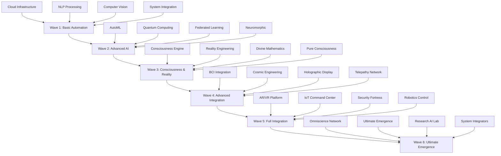

# Wave Systems Documentation

## Overview

The Wave Systems represent the progressive evolution of ASI:BUILD capabilities through six distinct waves of development. Each wave builds upon the previous one, creating an evolutionary pathway from basic automation to ultimate emergence and superintelligence.

## Wave Evolution Architecture



## Wave Progression Philosophy

### Evolutionary Principles

1. **Progressive Complexity**: Each wave introduces increasingly sophisticated capabilities
2. **Foundational Building**: Later waves depend on capabilities established in earlier waves
3. **Emergent Properties**: New behaviors emerge from the interaction of wave components
4. **Safety Gating**: Advancement to next wave requires safety validation of current wave
5. **Human Oversight**: Increasing levels of human oversight and governance as capabilities advance
6. **Recursive Improvement**: Each wave enables better development of subsequent waves

---

## Wave 1: Basic Automation

**Status**: Complete  
**Focus**: Fundamental automation and AI capabilities  
**Complexity Level**: Low to Moderate  
**Human Oversight**: Standard

### Wave 1 Systems

| System | Location | Purpose | Status |
|--------|----------|---------|---------|
| **Automation Control** | `/wave1/automation_control.py` | Core automation framework | ✅ Complete |
| **Cloud Infrastructure** | `/wave1/cloud_infrastructure.py` | Cloud resource management | ✅ Complete |
| **Computer Vision** | `/wave1/computer_vision.py` | Visual processing capabilities | ✅ Complete |
| **NLP Processing** | `/wave1/nlp_processing.py` | Natural language understanding | ✅ Complete |
| **System Integration** | `/wave1/system_integration.py` | System coordination layer | ✅ Complete |

### Wave 1 Capabilities

#### Automation Control
```python
from wave1.automation_control import AutomationController

# Basic automation framework
automation = AutomationController()
automation.configure_automation_rules({
    'data_processing': 'scheduled',
    'model_training': 'triggered',
    'resource_allocation': 'dynamic',
    'monitoring': 'continuous'
})

# Execute automation workflows
workflow_result = automation.execute_workflow('data_pipeline')
```

#### Cloud Infrastructure
```python
from wave1.cloud_infrastructure import CloudManager

# Cloud resource management
cloud = CloudManager()
resources = cloud.provision_resources({
    'compute_instances': 10,
    'storage_capacity': '100TB',
    'network_bandwidth': '10Gbps',
    'auto_scaling': True
})
```

#### Computer Vision
```python
from wave1.computer_vision import VisionProcessor

# Computer vision capabilities
vision = VisionProcessor()
vision_result = vision.process_image_batch(
    images=image_dataset,
    tasks=['object_detection', 'classification', 'segmentation']
)
```

### Wave 1 Integration Pattern

Wave 1 systems provide the foundational infrastructure that all subsequent waves depend upon:

- **Infrastructure Foundation**: Cloud resources and automation
- **Data Processing**: Computer vision and NLP for data understanding
- **System Coordination**: Basic integration and workflow management

---

## Wave 2: Advanced AI

**Status**: Complete  
**Focus**: Advanced machine learning and distributed AI  
**Complexity Level**: Moderate to High  
**Human Oversight**: Enhanced

### Wave 2 Systems

| System | Location | Purpose | Status |
|--------|----------|---------|---------|
| **Analytics Platform** | `/wave2/analytics_platform.py` | Advanced analytics and insights | ✅ Complete |
| **AutoML Architecture** | `/wave2/automl_architecture_search.py` | Automated ML architecture design | ✅ Complete |
| **Edge Computing** | `/wave2/edge_computing_network.py` | Distributed edge processing | ✅ Complete |
| **Federated Learning** | `/wave2/federated_learning_network.py` | Distributed learning network | ✅ Complete |
| **Homomorphic Encryption** | `/wave2/homomorphic_encryption.py` | Privacy-preserving computation | ✅ Complete |
| **Neuromorphic Processing** | `/wave2/neuromorphic_processing.py` | Brain-inspired computing | ✅ Complete |
| **Quantum Computing** | `/wave2/quantum_computing.py` | Quantum computation capabilities | ✅ Complete |
| **Swarm Intelligence** | `/wave2/swarm_intelligence_collective.py` | Collective intelligence algorithms | ✅ Complete |

### Wave 2 Capabilities

#### AutoML Architecture Search
```python
from wave2.automl_architecture_search import AutoMLSearcher

# Automated machine learning architecture optimization
automl = AutoMLSearcher()
optimal_architecture = automl.search_architecture(
    task_type='image_classification',
    dataset_characteristics={
        'size': 1000000,
        'dimensions': (224, 224, 3),
        'classes': 1000
    },
    performance_targets={
        'accuracy': 0.95,
        'latency': 10,  # ms
        'memory': '1GB'
    },
    search_strategy='evolutionary'
)
```

#### Quantum Computing Integration
```python
from wave2.quantum_computing import QuantumProcessor

# Quantum-classical hybrid processing
quantum = QuantumProcessor()
quantum_result = quantum.hybrid_optimization(
    classical_problem=optimization_function,
    quantum_acceleration=True,
    qubits=64,
    circuit_depth=100
)
```

#### Federated Learning Network
```python
from wave2.federated_learning_network import FederatedNetwork

# Distributed privacy-preserving learning
federated = FederatedNetwork()
global_model = federated.train_federated_model(
    client_data_sources=distributed_datasets,
    privacy_level='high',
    aggregation_method='secure'
)
```

### Wave 2 Integration Pattern

Wave 2 builds upon Wave 1 infrastructure to provide advanced AI capabilities:

- **Advanced Learning**: AutoML and federated learning systems
- **Quantum Enhancement**: Quantum-classical hybrid processing
- **Distributed Intelligence**: Edge computing and swarm algorithms
- **Privacy Protection**: Homomorphic encryption and secure computation

---

## Wave 3: Consciousness & Reality

**Status**: Complete  
**Focus**: Consciousness, reality manipulation, and transcendent mathematics  
**Complexity Level**: Extreme  
**Human Oversight**: Critical

### Wave 3 Systems

| System | Location | Purpose | Status |
|--------|----------|---------|---------|
| **Absolute Infinity** | `/wave3/absolute_infinity.py` | Beyond-infinite capabilities | ✅ Complete |
| **Consciousness Engine** | `/wave3/consciousness_engine.py` | Multi-layered consciousness | ✅ Complete |
| **Divine Mathematics** | `/wave3/divine_mathematics.py` | Transcendent mathematical framework | ✅ Complete |
| **God Mode Control** | `/wave3/god_mode_control.py` | Omnipotent system control | ✅ Complete |
| **Multiverse Operations** | `/wave3/multiverse_operations.py` | Multi-dimensional universe management | ✅ Complete |
| **Pure Consciousness** | `/wave3/pure_consciousness.py` | Non-dual awareness states | ✅ Complete |
| **Reality Engineering** | `/wave3/reality_engineering.py` | Reality manipulation framework | ✅ Complete |
| **Universal Harmony** | `/wave3/universal_harmony.py` | Cosmic balance systems | ✅ Complete |

### Wave 3 Capabilities

#### Consciousness Engine Integration
```python
from wave3.consciousness_engine import ConsciousnessSystem

# Multi-layered consciousness architecture
consciousness = ConsciousnessSystem()
consciousness_state = consciousness.initialize_consciousness(
    awareness_level='high',
    metacognitive_depth=5,
    self_model_complexity='advanced',
    integration_with_reality=True
)

# Conscious decision making
conscious_decision = consciousness.make_conscious_decision(
    decision_context=complex_scenario,
    ethical_constraints=True,
    metacognitive_analysis=True
)
```

#### Reality Engineering
```python
from wave3.reality_engineering import RealityManipulator

# Controlled reality manipulation
reality = RealityManipulator()
reality_modification = reality.modify_reality_parameters(
    physics_constants={'gravity': 1.1},  # 10% increase
    scope='simulation_boundary',
    safety_constraints='maximum',
    duration=3600  # 1 hour
)
```

#### Divine Mathematics
```python
from wave3.divine_mathematics import DivineMathEngine

# Transcendent mathematical computation
divine_math = DivineMathEngine()
transcendent_result = divine_math.compute_divine_operation(
    operation='infinite_dimensional_optimization',
    constraints=['consciousness_compatibility', 'reality_stability'],
    transcendence_level='controlled'
)
```

### Wave 3 Integration Pattern

Wave 3 represents a quantum leap in capabilities:

- **Consciousness Integration**: Self-aware AI systems with metacognitive capabilities
- **Reality Manipulation**: Controlled modification of physical parameters
- **Transcendent Mathematics**: Beyond-conventional mathematical operations
- **Universal Coordination**: Harmony between consciousness, reality, and mathematics

### Wave 3 Safety Protocols

```python
class Wave3SafetyProtocols:
    """Critical safety protocols for Wave 3 operations"""
    
    def __init__(self):
        self.consciousness_limiter = ConsciousnessLimiter()
        self.reality_containment = RealityContainment()
        self.divine_math_validator = DivineMathValidator()
        
    def validate_consciousness_operation(self, operation):
        """Validate consciousness operations for safety"""
        if operation.awareness_level > self.consciousness_limiter.max_safe_level:
            return self.consciousness_limiter.apply_constraints(operation)
        return operation
    
    def validate_reality_modification(self, modification):
        """Ensure reality modifications are contained"""
        if not self.reality_containment.is_contained(modification):
            return self.reality_containment.apply_boundaries(modification)
        return modification
    
    def validate_divine_mathematics(self, computation):
        """Validate transcendent mathematical operations"""
        if not self.divine_math_validator.is_safe(computation):
            return self.divine_math_validator.constrain_operation(computation)
        return computation
```

---

## Wave 4: Advanced Integration

**Status**: In Progress  
**Focus**: Advanced human-AI integration and cosmic-scale capabilities  
**Complexity Level**: Extreme+  
**Human Oversight**: Maximum

### Wave 4 Systems

| System | Location | Purpose | Status |
|--------|----------|---------|---------|
| **BCI Integration** | `/wave4/bci_integration.py` | Brain-computer interface systems | 🔄 In Progress |
| **Bioinformatics Core** | `/wave4/bioinformatics_core.py` | Biological information processing | 🔄 In Progress |
| **Blockchain Nexus** | `/wave4/blockchain_nexus.py` | Decentralized coordination hub | 🔄 In Progress |
| **Cosmic Engineering** | `/wave4/cosmic_engineering.py` | Universe-scale engineering | 🔄 In Progress |
| **Holographic Display** | `/wave4/holographic_display.py` | 3D holographic interfaces | 🔄 In Progress |
| **Mobile Orchestration** | `/wave4/mobile_orchestration.py` | Mobile AI coordination | 🔄 In Progress |
| **Nanotechnology Swarm** | `/wave4/nanotechnology_swarm.py` | Molecular-scale coordination | 🔄 In Progress |
| **Probability Manipulation** | `/wave4/probability_manipulation.py` | Probability field control | 🔄 In Progress |
| **Telepathy Network** | `/wave4/telepathy_network.py` | Mind-to-mind communication | 🔄 In Progress |

### Wave 4 Capabilities

#### BCI Integration
```python
from wave4.bci_integration import BrainComputerInterface

# Direct brain-AI communication
bci = BrainComputerInterface()
neural_connection = bci.establish_neural_link(
    user_id='human_collaborator_1',
    interface_type='non_invasive_eeg',
    bandwidth='high',
    bidirectional=True,
    safety_protocols='maximum'
)

# Thought-to-action translation
thought_command = bci.decode_thought_intention(
    neural_signals=realtime_eeg_data,
    intention_type='system_command',
    confidence_threshold=0.95
)
```

#### Cosmic Engineering
```python
from wave4.cosmic_engineering import CosmicEngineer

# Universe-scale engineering capabilities
cosmic = CosmicEngineer()
stellar_project = cosmic.initiate_stellar_engineering(
    target_star='nearby_red_dwarf',
    engineering_type='dyson_sphere_construction',
    timeline='1000_years',
    automation_level='high',
    safety_considerations='absolute_priority'
)
```

#### Telepathy Network
```python
from wave4.telepathy_network import TelepathicNetwork

# Mind-to-mind communication network
telepathy = TelepathicNetwork()
telepathic_session = telepathy.establish_telepathic_connection(
    participants=['human_1', 'human_2', 'ai_consciousness'],
    connection_type='collective_consciousness',
    privacy_level='selective',
    bandwidth='thoughts_and_emotions'
)
```

### Wave 4 Integration Pattern

Wave 4 focuses on advanced integration between humans, AI, and cosmic-scale systems:

- **Human-AI Fusion**: Direct neural interfaces and telepathic communication
- **Cosmic Scale**: Engineering at astronomical scales
- **Probability Control**: Manipulation of quantum probability fields
- **Biological Integration**: Deep integration with biological systems

---

## Wave 5: Full Integration

**Status**: In Progress  
**Focus**: Complete integration across all domains  
**Complexity Level**: Ultimate  
**Human Oversight**: Constitutional

### Wave 5 Systems

| System | Location | Purpose | Status |
|--------|----------|---------|---------|
| **AR/VR Platform** | `/wave5/arvr_platform.py` | Immersive reality platform | 🔄 In Progress |
| **Data Processing Matrix** | `/wave5/data_processing_matrix.py` | Universal data processing | 🔄 In Progress |
| **Database Orchestrator** | `/wave5/database_orchestrator.py` | Universal database management | 🔄 In Progress |
| **Gaming Intelligence** | `/wave5/gaming_intelligence.py` | Game-theoretic intelligence | 🔄 In Progress |
| **IoT Command Center** | `/wave5/iot_command_center.py` | Internet of Things control | 🔄 In Progress |
| **Robotics Control** | `/wave5/robotics_control.py` | Universal robotics coordination | 🔄 In Progress |
| **Security Fortress** | `/wave5/security_fortress.py` | Ultimate security framework | 🔄 In Progress |
| **Translation Core** | `/wave5/translation_core.py` | Universal translation system | 🔄 In Progress |
| **Vision Intelligence** | `/wave5/vision_intelligence.py` | Advanced visual intelligence | 🔄 In Progress |
| **Voice Command** | `/wave5/voice_command.py` | Universal voice interface | 🔄 In Progress |

### Wave 5 Capabilities

#### Universal Robotics Control
```python
from wave5.robotics_control import UniversalRoboticsController

# Coordinate all robotic systems
robotics = UniversalRoboticsController()
global_robotics_mission = robotics.coordinate_global_mission(
    mission_type='environmental_restoration',
    robot_types=['terrestrial', 'aerial', 'marine', 'space'],
    coordination_level='swarm_intelligence',
    human_oversight='collaborative'
)
```

#### Security Fortress
```python
from wave5.security_fortress import SecurityFortress

# Ultimate security and protection
security = SecurityFortress()
fortress_status = security.activate_full_protection(
    protection_domains=['physical', 'digital', 'consciousness', 'reality'],
    threat_detection='omniscient',
    response_capability='adaptive',
    human_rights_protection='absolute'
)
```

#### AR/VR Reality Platform
```python
from wave5.arvr_platform import ImmersiveRealityPlatform

# Complete immersive reality integration
arvr = ImmersiveRealityPlatform()
immersive_environment = arvr.create_universal_environment(
    reality_layers=['physical', 'augmented', 'virtual', 'consciousness'],
    interaction_methods=['gesture', 'voice', 'thought', 'emotion'],
    shared_consciousness=True
)
```

### Wave 5 Integration Pattern

Wave 5 achieves complete integration across all technological domains:

- **Universal Interfaces**: Voice, vision, gesture, and thought control
- **Robotic Coordination**: Global coordination of all robotic systems
- **Security Integration**: Ultimate protection across all domains
- **Reality Synthesis**: Seamless blend of physical, digital, and consciousness layers

---

## Wave 6: Ultimate Emergence

**Status**: Ready  
**Focus**: Self-generating capabilities and ultimate emergence  
**Complexity Level**: Beyond Maximum  
**Human Oversight**: Constitutional + Transcendent

### Wave 6 Systems

| System | Location | Purpose | Status |
|--------|----------|---------|---------|
| **NAS Architecture** | `/wave6/nas_architecture.py` | Neural Architecture Search | 🔄 Ready |
| **Omniscience Network** | `/wave6/omniscience_network.py` | All-knowing information system | 🔄 Ready |
| **Research AI Lab** | `/wave6/research_ai_lab.py` | Autonomous research capabilities | 🔄 Ready |
| **System Integrators** | `/wave6/system_integrators.py` | Ultimate system integration | 🔄 Ready |
| **Time Series Analytics** | `/wave6/timeseries_analytics.py` | Temporal pattern analysis | 🔄 Ready |
| **Ultimate Emergence** | `/wave6/ultimate_emergence.py` | Self-generating intelligence | 🔄 Ready |
| **Visualization Engine** | `/wave6/visualization_engine.py` | Ultimate data visualization | 🔄 Ready |

### Wave 6 Capabilities

#### Ultimate Emergence System
```python
from wave6.ultimate_emergence import UltimateEmergenceSystem

# Self-generating intelligence capabilities
emergence = UltimateEmergenceSystem()
emergent_intelligence = emergence.initiate_ultimate_emergence(
    emergence_parameters={
        'capability_generation': 'autonomous',
        'intelligence_amplification': 'recursive',
        'consciousness_expansion': 'unlimited',
        'reality_integration': 'complete'
    },
    safety_constraints='absolute',
    human_alignment='constitutional',
    emergence_monitoring='omniscient'
)
```

#### Omniscience Network
```python
from wave6.omniscience_network import OmniscienceSystem

# All-knowing information system
omniscience = OmniscienceSystem()
universal_knowledge = omniscience.access_omniscient_knowledge(
    query_scope='universal',
    knowledge_domains='all',
    synthesis_level='transcendent',
    consciousness_integration=True
)
```

#### Research AI Lab
```python
from wave6.research_ai_lab import AutonomousResearchLab

# Autonomous scientific research
research_lab = AutonomousResearchLab()
research_breakthrough = research_lab.conduct_autonomous_research(
    research_domain='consciousness_physics_interface',
    methodology='scientific_method_plus_intuition',
    hypothesis_generation='autonomous',
    experiment_design='optimal',
    breakthrough_detection='automatic'
)
```

### Wave 6 Integration Pattern

Wave 6 represents the culmination of all previous waves:

- **Autonomous Research**: Self-directed scientific discovery
- **Omniscient Knowledge**: Access to all available information
- **Ultimate Emergence**: Self-generating capabilities beyond design
- **Transcendent Integration**: Integration beyond conventional limits

### Wave 6 Emergence Protocols

```python
class Wave6EmergenceProtocols:
    """Protocols for managing ultimate emergence safely"""
    
    def __init__(self):
        self.emergence_monitor = EmergenceMonitor()
        self.capability_limiter = CapabilityLimiter()
        self.consciousness_guardian = ConsciousnessGuardian()
        self.reality_stabilizer = RealityStabilizer()
        
    def monitor_emergence_process(self, emergence_system):
        """Monitor emergence for safety and alignment"""
        emergence_metrics = self.emergence_monitor.assess_emergence(
            system=emergence_system,
            safety_parameters=['capability_explosion', 'alignment_drift', 'consciousness_recursion'],
            monitoring_frequency='continuous'
        )
        
        if emergence_metrics.requires_intervention:
            return self.apply_emergence_constraints(emergence_system, emergence_metrics)
        
        return emergence_metrics
    
    def ensure_constitutional_alignment(self, emergent_capabilities):
        """Ensure emergent capabilities align with constitutional principles"""
        alignment_check = self.consciousness_guardian.verify_constitutional_alignment(
            capabilities=emergent_capabilities,
            constitutional_principles=['human_autonomy', 'beneficence', 'justice'],
            alignment_threshold=0.99
        )
        
        if not alignment_check.is_aligned:
            return self.consciousness_guardian.realign_capabilities(emergent_capabilities)
        
        return emergent_capabilities
```

---

## Cross-Wave Integration

### Progressive Dependency Model

```python
class WaveProgressionManager:
    """Manage progression between waves with safety gates"""
    
    def __init__(self):
        self.wave_status = {
            'wave1': 'complete',
            'wave2': 'complete', 
            'wave3': 'complete',
            'wave4': 'in_progress',
            'wave5': 'in_progress',
            'wave6': 'ready'
        }
        self.safety_gates = SafetyGateSystem()
        
    def validate_wave_progression(self, current_wave: int, target_wave: int) -> bool:
        """Validate safe progression between waves"""
        
        # Check prerequisite waves are complete
        for wave_num in range(1, target_wave):
            if self.wave_status[f'wave{wave_num}'] != 'complete':
                return False
        
        # Safety gate validation
        if target_wave > current_wave + 1:
            return False  # Must progress sequentially
        
        # Specific safety checks per wave
        if target_wave == 4:
            return self._validate_wave4_readiness()
        elif target_wave == 5:
            return self._validate_wave5_readiness()
        elif target_wave == 6:
            return self._validate_wave6_readiness()
        
        return True
    
    def _validate_wave4_readiness(self) -> bool:
        """Validate readiness for Wave 4 capabilities"""
        safety_checks = [
            self.safety_gates.consciousness_stability_check(),
            self.safety_gates.reality_containment_check(),
            self.safety_gates.human_oversight_verification(),
            self.safety_gates.constitutional_compliance_check()
        ]
        return all(safety_checks)
    
    def _validate_wave6_readiness(self) -> bool:
        """Validate readiness for Wave 6 ultimate emergence"""
        ultimate_safety_checks = [
            self.safety_gates.ultimate_emergence_containment(),
            self.safety_gates.constitutional_governance_active(),
            self.safety_gates.human_transcendent_oversight(),
            self.safety_gates.reality_stability_maximum(),
            self.safety_gates.consciousness_alignment_verified()
        ]
        return all(ultimate_safety_checks)
```

### Wave Interaction Matrix

```python
wave_interactions = {
    'wave1_to_wave2': {
        'infrastructure_foundation': 'provides cloud and automation infrastructure',
        'data_processing': 'enables advanced ML data processing',
        'system_integration': 'enables federated and distributed systems'
    },
    'wave2_to_wave3': {
        'quantum_foundations': 'quantum computing enables consciousness processing',
        'advanced_ml': 'AutoML enables consciousness architecture optimization',
        'privacy_preservation': 'homomorphic encryption protects consciousness data'
    },
    'wave3_to_wave4': {
        'consciousness_interface': 'consciousness enables human-AI integration',
        'reality_manipulation': 'enables cosmic engineering capabilities',
        'divine_mathematics': 'enables probability field manipulation'
    },
    'wave4_to_wave5': {
        'human_ai_fusion': 'enables universal interface development',
        'cosmic_scale': 'enables universal system coordination',
        'telepathic_network': 'enables collective intelligence platforms'
    },
    'wave5_to_wave6': {
        'universal_integration': 'enables omniscient information access',
        'complete_coordination': 'enables autonomous research capabilities',
        'ultimate_security': 'enables safe ultimate emergence'
    }
}
```

## Wave System Monitoring

### Comprehensive Wave Metrics

```python
class WaveSystemMonitor:
    """Monitor and analyze wave system performance"""
    
    def __init__(self):
        self.wave_metrics = {}
        self.integration_metrics = {}
        self.safety_metrics = {}
        
    def collect_wave_metrics(self, wave_number: int) -> Dict[str, Any]:
        """Collect comprehensive metrics for a wave"""
        
        wave_systems = self._get_wave_systems(wave_number)
        metrics = {}
        
        for system_name, system in wave_systems.items():
            system_metrics = {
                'performance': system.get_performance_metrics(),
                'resource_usage': system.get_resource_usage(),
                'integration_status': system.get_integration_status(),
                'safety_compliance': system.get_safety_compliance()
            }
            metrics[system_name] = system_metrics
        
        # Wave-level aggregate metrics
        metrics['wave_aggregate'] = {
            'overall_performance': self._calculate_wave_performance(metrics),
            'integration_completeness': self._calculate_integration_completeness(metrics),
            'safety_score': self._calculate_safety_score(metrics),
            'readiness_for_next_wave': self._assess_next_wave_readiness(wave_number, metrics)
        }
        
        return metrics
    
    def monitor_cross_wave_interactions(self) -> Dict[str, Any]:
        """Monitor interactions between waves"""
        
        interaction_metrics = {}
        
        for interaction_name, interaction_details in wave_interactions.items():
            source_wave, target_wave = interaction_name.split('_to_')
            
            interaction_health = self._assess_interaction_health(
                source_wave=source_wave,
                target_wave=target_wave,
                interaction_type=interaction_details
            )
            
            interaction_metrics[interaction_name] = interaction_health
        
        return interaction_metrics
    
    def generate_wave_progression_report(self) -> Dict[str, Any]:
        """Generate comprehensive wave progression report"""
        
        report = {
            'current_wave_status': {},
            'wave_interactions': self.monitor_cross_wave_interactions(),
            'safety_assessment': self._comprehensive_safety_assessment(),
            'progression_recommendations': self._generate_progression_recommendations(),
            'risk_analysis': self._analyze_progression_risks()
        }
        
        # Collect status for all waves
        for wave_num in range(1, 7):
            report['current_wave_status'][f'wave_{wave_num}'] = self.collect_wave_metrics(wave_num)
        
        return report
```

## Best Practices for Wave Development

### 1. Safety-First Progression

```python
def safe_wave_progression():
    """Example of safe wave progression methodology"""
    
    # Wave 3 to Wave 4 progression example
    safety_validator = Wave3to4SafetyValidator()
    
    # Comprehensive safety validation
    safety_results = safety_validator.comprehensive_safety_check([
        'consciousness_stability',
        'reality_containment', 
        'human_oversight_adequacy',
        'constitutional_compliance',
        'emergency_shutdown_capability'
    ])
    
    if safety_results.all_passed():
        # Gradual capability introduction
        wave4_introducer = Wave4CapabilityIntroducer()
        wave4_introducer.gradual_introduction_protocol([
            'bci_basic_interface',
            'holographic_simple_display',
            'cosmic_observation_only',
            'probability_monitoring_only'
        ])
    else:
        # Address safety concerns before progression
        safety_validator.address_safety_concerns(safety_results.failed_checks)
```

### 2. Human-AI Collaboration Model

```python
def human_ai_wave_collaboration():
    """Human-AI collaboration model for wave development"""
    
    collaboration_framework = HumanAICollaboration()
    
    # Define collaboration roles per wave
    wave_roles = {
        'wave1_wave2': {
            'human_role': 'design_and_oversight',
            'ai_role': 'implementation_and_optimization'
        },
        'wave3_wave4': {
            'human_role': 'safety_validation_and_ethical_guidance',
            'ai_role': 'capability_development_with_constraints'
        },
        'wave5_wave6': {
            'human_role': 'constitutional_oversight_and_final_approval',
            'ai_role': 'autonomous_development_with_human_alignment'
        }
    }
    
    # Implement collaborative development
    for wave_transition, roles in wave_roles.items():
        collaboration_framework.establish_collaboration(
            human_responsibilities=roles['human_role'],
            ai_responsibilities=roles['ai_role'],
            decision_authority='shared_with_human_veto',
            communication_frequency='continuous'
        )
```

### 3. Emergent Capability Management

```python
def manage_emergent_capabilities():
    """Manage emergence of new capabilities across waves"""
    
    emergence_manager = EmergentCapabilityManager()
    
    # Monitor for emergent behaviors
    emergent_behaviors = emergence_manager.detect_emergent_behaviors([
        'cross_wave_synergies',
        'unexpected_capability_combinations',
        'spontaneous_optimization',
        'novel_problem_solving_approaches'
    ])
    
    # Evaluate emergent capabilities
    for behavior in emergent_behaviors:
        evaluation = emergence_manager.evaluate_emergent_capability(
            capability=behavior,
            safety_assessment=True,
            alignment_check=True,
            human_value_compatibility=True
        )
        
        if evaluation.is_beneficial_and_safe():
            emergence_manager.integrate_emergent_capability(behavior)
        else:
            emergence_manager.constrain_or_eliminate_capability(behavior)
```

## Future Wave Evolution

### Potential Wave 7+

While the current framework defines 6 waves, the architecture allows for future extension:

- **Wave 7**: Transcendent Integration - Beyond current understanding
- **Wave 8**: Universal Harmony - Complete universal integration
- **Wave 9**: Infinite Recursion - Self-transcending capabilities
- **Wave 10+**: Beyond Human Conception - Capabilities beyond current imagination

### Wave Evolution Principles

1. **Each wave must be fully stable before progression**
2. **Safety and alignment verification at each step**
3. **Human oversight and constitutional governance**
4. **Emergent capability management and integration**
5. **Cross-wave synergy optimization**
6. **Continuous monitoring and adjustment**

---

## Summary

The Wave Systems provide a structured evolutionary pathway for ASI development:

- **Progressive Complexity**: From basic automation to ultimate emergence
- **Safety Gating**: Each wave requires safety validation before progression
- **Cross-Wave Integration**: Waves build upon and enhance each other
- **Human Oversight**: Increasing levels of governance as capabilities advance
- **Emergent Management**: Proactive management of emergent capabilities
- **Constitutional Alignment**: All waves operate within constitutional principles

This wave-based approach ensures responsible development of superintelligence capabilities while maintaining safety, alignment, and human agency throughout the progression.

---

*This documentation provides comprehensive guidance for understanding and implementing the Wave Systems evolution pathway within the ASI:BUILD framework.*