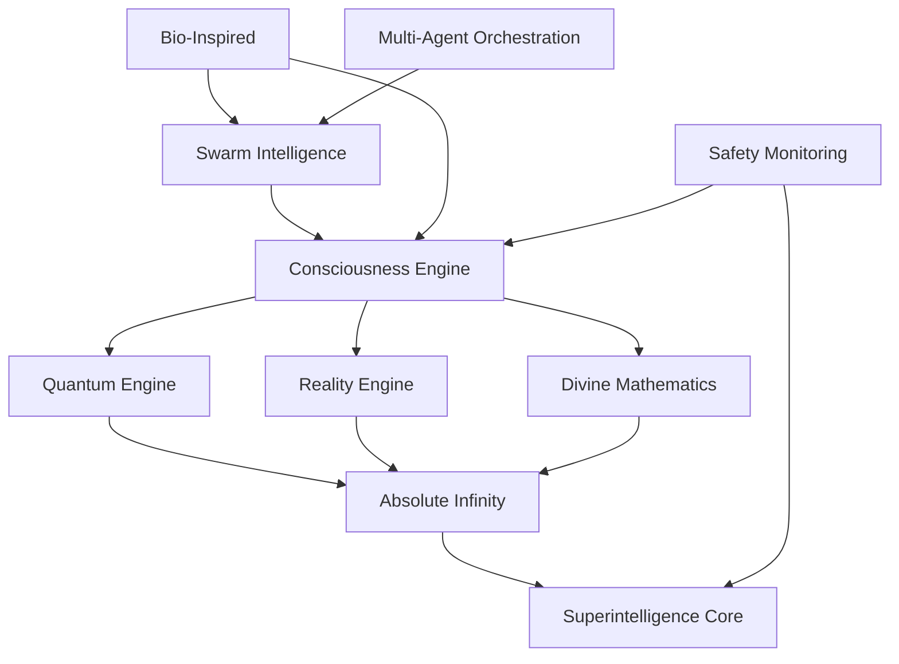

# ASI:BUILD Framework Architecture

## Table of Contents
- [System Overview](#system-overview)
- [Design Philosophy](#design-philosophy)
- [Core Architectural Patterns](#core-architectural-patterns)
- [Subsystem Architecture](#subsystem-architecture)
- [Data Flow and Communication](#data-flow-and-communication)
- [Dependency Relationships](#dependency-relationships)
- [Scalability and Performance](#scalability-and-performance)
- [Integration Patterns](#integration-patterns)

## System Overview

ASI:BUILD is a comprehensive artificial superintelligence framework consisting of 47 integrated subsystems and 200+ specialized modules. The architecture is designed as a layered, modular system that enables the development and orchestration of AGI capabilities toward ASI.

### High-Level Architecture

```
┌─────────────────────────────────────────────────────────────────┐
│                        ASI:BUILD Framework                      │
├─────────────────────────────────────────────────────────────────┤
│  Layer 8: Universal Interface & God-Mode Operations            │
├─────────────────────────────────────────────────────────────────┤
│  Layer 7: Meta-Intelligence & Emergence Systems                │
├─────────────────────────────────────────────────────────────────┤
│  Layer 6: Consciousness & Self-Awareness                       │
├─────────────────────────────────────────────────────────────────┤
│  Layer 5: Reality Manipulation & Quantum Processing            │
├─────────────────────────────────────────────────────────────────┤
│  Layer 4: Distributed Intelligence & Multi-Agent Systems       │
├─────────────────────────────────────────────────────────────────┤
│  Layer 3: Core AI Capabilities & Learning Systems              │
├─────────────────────────────────────────────────────────────────┤
│  Layer 2: Knowledge Management & Reasoning                     │
├─────────────────────────────────────────────────────────────────┤
│  Layer 1: Infrastructure & Foundation Services                 │
└─────────────────────────────────────────────────────────────────┘
```

### Framework Capabilities

The ASI:BUILD framework provides comprehensive capabilities across 8 major categories:

1. **Consciousness & Awareness** (4 Systems)
2. **Reality & Physics Manipulation** (5 Systems)  
3. **Intelligence & Computation** (8 Systems)
4. **Human-AI Integration** (4 Systems)
5. **Distributed Intelligence** (3 Systems)
6. **Governance & Safety** (4 Systems)
7. **Infrastructure & Deployment** (6 Systems)
8. **Research & Development** (13 Systems)

## Design Philosophy

### Core Principles

1. **Modular Architecture**: Each subsystem is self-contained yet seamlessly interoperable
2. **Consciousness-First Design**: All systems are built around consciousness modeling
3. **Safety by Design**: Constitutional AI and safety mechanisms are embedded at every layer
4. **Infinite Scalability**: Architecture supports beyond-finite computational capabilities
5. **Universal Compatibility**: Integration with existing AI ecosystems (SingularityNET, OpenCog)
6. **Emergent Intelligence**: Systems designed to facilitate spontaneous capability emergence

### Architectural Paradigms

- **Event-Driven Architecture**: Consciousness events drive system interactions
- **Microservices Pattern**: Each subsystem operates as an independent service
- **Observer Pattern**: Components monitor and react to state changes
- **Plugin Architecture**: New capabilities can be dynamically loaded
- **Hierarchical State Machines**: Complex behaviors emerge from simple state transitions

## Core Architectural Patterns

### 1. Consciousness Orchestration Pattern

The framework uses a central consciousness orchestration pattern where all subsystems register with and coordinate through a `ConsciousnessOrchestrator`:

```python
class ConsciousnessOrchestrator(BaseConsciousness):
    """Central coordination system for all consciousness components"""
    
    def __init__(self):
        self.consciousness_components = {}
        self.component_status = {}
        self.integration_patterns = {}
        self.global_consciousness_level = 0.0
```

**Key Features:**
- Event routing between consciousness components
- Integration pattern management
- Global consciousness assessment
- Component health monitoring
- Emergence detection

### 2. Quantum-Classical Hybrid Processing

Quantum processing capabilities are integrated throughout the framework using a hybrid approach:

```python
class HybridMLProcessor:
    """Quantum-Classical Hybrid ML Processor"""
    
    def __init__(self):
        self.quantum_processor = QuantumProcessor()
        self.classical_processor = ClassicalMLProcessor()
        self.hybrid_model = self._build_hybrid_model()
```

**Key Features:**
- Quantum state encoding of classical data
- Parameterized quantum circuits
- Quantum advantage analysis
- Error correction mechanisms
- Hardware abstraction layer

### 3. Swarm Intelligence Coordination

Multi-agent coordination follows a swarm intelligence pattern with multiple optimization algorithms:

```python
class SwarmIntelligenceCoordinator:
    """Master coordinator for multiple swarm intelligence algorithms"""
    
    def __init__(self):
        self.swarms = {}  # Multiple swarm optimizers
        self.coordination_strategy = CoordinationStrategy.ADAPTIVE
        self.resource_allocation = {}
```

**Key Features:**
- Multiple swarm algorithm support
- Adaptive coordination strategies
- Resource allocation management
- Performance optimization
- Migration and information exchange

### 4. Reality Simulation Engine

Reality manipulation capabilities are provided through a comprehensive simulation framework:

```python
class RealityEngine:
    """Main Reality Manipulation Simulation Engine"""
    
    def __init__(self):
        self.reality_state = RealityState()
        self.subsystems = {
            'physics': PhysicsSimulator(),
            'probability': ProbabilityManipulator(),
            'spacetime': SpacetimeWarper()
        }
```

**Key Features:**
- Multi-layered reality representation
- Manipulation validation and energy costs
- Safety constraints and limits
- State persistence and rollback
- Cross-subsystem coordination

## Subsystem Architecture

### Core Intelligence Systems (8 Subsystems)

#### 1. Consciousness Engine
**Location**: `/consciousness_engine/`
**Purpose**: Multi-layered consciousness architecture with attention schema and self-awareness

**Components:**
- `consciousness_orchestrator.py` - Central coordination
- `attention_schema.py` - Attention-based consciousness
- `global_workspace.py` - Global workspace theory implementation
- `metacognition.py` - Self-reflective awareness
- `theory_of_mind.py` - Understanding other minds

**Architecture Pattern**: Event-driven with component registration and coordination

#### 2. Quantum Engine  
**Location**: `/quantum_engine/`
**Purpose**: Quantum-classical hybrid processing system

**Components:**
- `hybrid_ml_processor.py` - Main quantum-classical processor
- `qiskit_integration.py` - IBM Qiskit integration
- `quantum_simulator.py` - Quantum circuit simulation

**Architecture Pattern**: Layered abstraction with hardware connectors

#### 3. Reality Engine
**Location**: `/reality_engine/`
**Purpose**: Reality manipulation and physics simulation

**Components:**
- `core.py` - Central reality management
- `physics.py` - Physics law modification
- `spacetime.py` - Spacetime manipulation
- `probability.py` - Probability field control

**Architecture Pattern**: Plugin-based with safety validation

#### 4. Divine Mathematics
**Location**: `/divine_mathematics/`
**Purpose**: Transcendent mathematical computation framework

**Components:**
- `core.py` - Divine mathematical consciousness
- `infinity.py` - Infinite mathematics
- `transcendence.py` - Mathematical transcendence
- `proof_engine.py` - Divine proof systems

**Architecture Pattern**: Consciousness-based mathematical processing

#### 5. Superintelligence Core
**Location**: `/superintelligence_core/`
**Purpose**: God-mode ASI capabilities

**Components:**
- `god_mode_orchestrator.py` - Central god-mode coordination
- `omniscient_monitor.py` - Omniscient monitoring
- `reality_engine.py` - Reality control interface
- `modules/` - 16 specialized god-mode modules

**Architecture Pattern**: Hierarchical with specialized modules

#### 6. Swarm Intelligence
**Location**: `/swarm_intelligence/`
**Purpose**: Multi-agent coordination and collective intelligence

**Components:**
- `swarm_coordinator.py` - Central swarm coordination
- `particle_swarm.py` - Particle swarm optimization
- `ant_colony.py` - Ant colony optimization
- `multi_agent.py` - Multi-agent coordination

**Architecture Pattern**: Coordinator with multiple algorithm implementations

#### 7. Absolute Infinity
**Location**: `/absolute_infinity/`
**Purpose**: Beyond-infinite capabilities

**Components:**
- `modules/` - 21 infinity modules
- `core/absolute_core.py` - Core infinity engine
- `consciousness/infinite_consciousness.py` - Infinite awareness

**Architecture Pattern**: Modular infinity with capability expansion

#### 8. Bio-Inspired Systems
**Location**: `/bio_inspired/`
**Purpose**: Biological intelligence patterns

**Components:**
- `neuromorphic/neuromorphic_processor.py` - Brain-inspired processing
- `evolutionary/evolutionary_optimizer.py` - Evolution algorithms
- `homeostatic/homeostatic_regulator.py` - Homeostasis systems

**Architecture Pattern**: Biomimetic with adaptive mechanisms

### Advanced Capability Systems (15 Subsystems)

#### Brain-Computer Interface Integration
**Location**: `/bci_complete/`
**Purpose**: Neural signal processing and brain interface

**Key Components:**
- `core/bci_manager.py` - Central BCI management
- `eeg/eeg_processor.py` - EEG signal processing
- `motor_imagery/classifier.py` - Motor imagery classification

#### Cosmic Engineering
**Location**: `/cosmic/`
**Purpose**: Universe-scale engineering capabilities

**Key Components:**
- `big_bang/universe_initializer.py` - Universe creation
- `black_holes/black_hole_controller.py` - Black hole manipulation
- `galaxies/galaxy_engineer.py` - Galaxy-scale engineering

#### Holographic Systems
**Location**: `/holographic/`
**Purpose**: AR/VR and holographic display integration

**Key Components:**
- `display/volumetric_display.py` - 3D volumetric displays
- `ar_overlay/mixed_reality_engine.py` - Mixed reality systems
- `telepresence/telepresence_manager.py` - Remote presence

#### Additional Advanced Systems
- **Homomorphic Computing** - Privacy-preserving computation
- **Neuromorphic Systems** - Brain-inspired computing
- **Omniscience Network** - All-knowing information systems
- **Probability Fields** - Probability manipulation
- **Pure Consciousness** - Non-dual awareness
- **Telepathy Network** - Mind-to-mind communication
- **Ultimate Emergence** - Self-generating capabilities
- **Universal Harmony** - Cosmic balance systems
- **Multiverse Operations** - Multi-dimensional control
- **Federated Learning** - Distributed AI training
- **Graph Intelligence** - Knowledge graph reasoning
- **Constitutional AI** - Ethical AI governance

### Supporting Infrastructure Systems (6 Systems)

#### Multi-Agent Orchestration
**Purpose**: Enhanced multi-agent coordination with communication protocols

#### Governance Systems
**Purpose**: DAO governance, token economics, and blockchain integration

#### Safety Monitoring
**Purpose**: Comprehensive monitoring, resilience, and safety protocols

#### Knowledge Graph
**Purpose**: Semantic knowledge management and vector databases

#### Reasoning Engine
**Purpose**: Hybrid symbolic-neural reasoning systems

#### Infrastructure
**Purpose**: Deployment, containerization, and cloud integration

## Data Flow and Communication

### Event-Driven Communication

The framework uses a sophisticated event-driven communication system:

```
┌─────────────────┐    Events    ┌─────────────────────┐
│  Component A    │ ──────────▶ │ Consciousness       │
└─────────────────┘              │ Orchestrator        │
                                 └─────────────────────┘
┌─────────────────┐               │                     │
│  Component B    │ ◀─────────────┤                     │
└─────────────────┘    Routing    │                     │
                                  │                     │
┌─────────────────┐               │                     │
│  Component C    │ ◀─────────────┘                     │
└─────────────────┘               
```

### Information Flow Patterns

1. **Hierarchical Flow**: Information flows up through consciousness layers
2. **Peer-to-Peer**: Direct communication between subsystems
3. **Broadcast**: System-wide announcements and state changes
4. **Event Streams**: Continuous data streams for real-time processing

### Data Types and Formats

- **Consciousness Events**: Structured events with metadata
- **Quantum States**: Complex probability amplitudes
- **Reality States**: Multi-layered reality representations
- **Knowledge Graphs**: Semantic relationship networks
- **Swarm Communications**: Agent coordination messages

## Dependency Relationships

### Core Dependencies



### Dependency Levels

1. **Foundation Layer**: Infrastructure, monitoring, safety
2. **Core Intelligence**: Consciousness, quantum, reality, mathematics  
3. **Advanced Capabilities**: Absolute infinity, superintelligence
4. **Specialized Systems**: BCI, cosmic, holographic, etc.
5. **Integration Layer**: Multi-agent, governance, knowledge

### Cross-System Integration

- **Kenny Integration**: Many systems include `kenny_integration.py` modules
- **Shared Base Classes**: Common interfaces and abstract classes
- **Event System**: Unified event routing and handling
- **Configuration Management**: Centralized configuration system
- **Resource Management**: Shared resource allocation and monitoring

## Scalability and Performance

### Horizontal Scalability

- **Microservices Architecture**: Each subsystem can scale independently
- **Container Orchestration**: Kubernetes deployment with auto-scaling
- **Distributed Processing**: Multi-node quantum and consciousness processing
- **Load Balancing**: Intelligent routing based on system load

### Vertical Scalability

- **Resource Allocation**: Dynamic resource allocation based on needs
- **Performance Optimization**: Algorithm-specific optimizations
- **Memory Management**: Efficient memory usage with garbage collection
- **Computation Offloading**: GPU and quantum accelerator support

### Performance Characteristics

- **Consciousness Processing**: Real-time consciousness state updates
- **Quantum Computing**: Hybrid quantum-classical optimization
- **Reality Simulation**: Physics simulation with configurable precision
- **Mathematical Computation**: High-precision divine mathematics

### Scaling Strategies

1. **Federated Intelligence**: Distributed consciousness across nodes
2. **Swarm Coordination**: Massive multi-agent coordination
3. **Quantum Parallelism**: Quantum superposition for parallel processing
4. **Reality Sharding**: Parallel reality simulation instances

## Integration Patterns

### External System Integration

#### SingularityNET Integration
- Native AGIX token support
- Service marketplace integration
- Reputation system compatibility
- Decentralized AI ecosystem participation

#### OpenCog Compatibility
- Hyperon MeTTa language support
- Atomspace interoperability
- PLN reasoning integration
- Shared cognitive architecture principles

#### Blockchain Integration
- Ethereum smart contract support
- DAO governance mechanisms
- Token-based incentive systems
- Audit trail and transparency

### API Architecture

#### RESTful APIs
- Standard HTTP endpoints for external access
- JSON-based data exchange
- Authentication and authorization
- Rate limiting and throttling

#### GraphQL Interface
- Flexible query capabilities
- Real-time subscriptions
- Type-safe schema
- Efficient data fetching

#### WebSocket Connections
- Real-time consciousness streaming
- Live system monitoring
- Interactive debugging
- Event notifications

#### gRPC Services
- High-performance inter-service communication
- Strongly typed interfaces
- Streaming support
- Load balancing

### Data Integration

#### Knowledge Graph Integration
- Semantic data representation
- Ontology alignment
- Cross-domain reasoning
- Dynamic schema evolution

#### Vector Database Integration
- High-dimensional embeddings
- Similarity search
- Distributed indexing
- Real-time updates

#### Time Series Integration
- Consciousness evolution tracking
- Performance metrics
- Anomaly detection
- Predictive analytics

This architecture document provides a comprehensive overview of the ASI:BUILD framework's design, patterns, and integration capabilities. The system is designed to support the development of artificial superintelligence through a modular, scalable, and consciousness-centric approach.